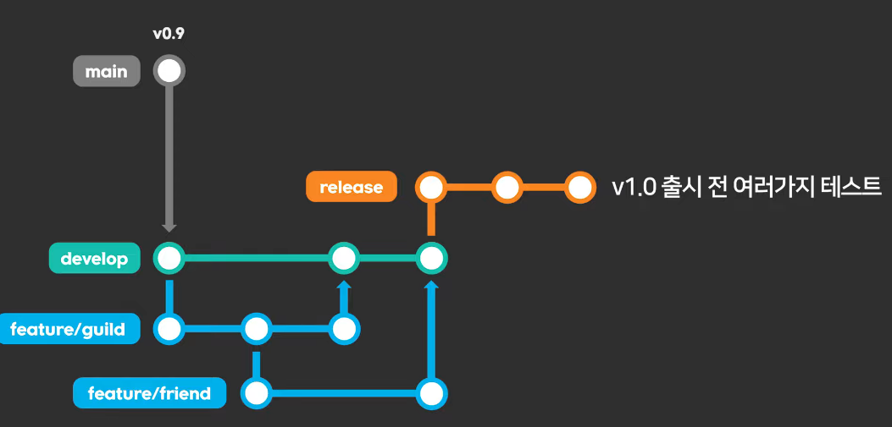

# Git & GitHub 공부

---

1주차 주말 되기전 사전 공부

[(무료) 매우쉽게 알려주는 git & github](https://codingapple.com/course/git-and-github/)

[Git](https://git-scm.com/book/ko/v2)

---

### GitFlow

- 복기 (20250418)
    
    
    ### 상태 동기화
    
    ```bash
    **1. 상태 동기화
    # --- 1. 로컬 main 브랜치를 최신 상태로 업데이트 ---
    
    # 1-1. 로컬 main 브랜치로 이동
    git checkout main
    
    # 1-2. 선생님 원본(upstream) 저장소의 최신 정보 가져오기
    git fetch upstream
    
    # 1-3. 로컬 main 브랜치를 선생님 원본 main 브랜치와 완전히 동일하게 맞춤
    #      (주의: 로컬 main에만 있던 변경사항은 사라짐)
    git reset --hard upstream/main
    
    # --- 2. 작업 브랜치(group-3)로 이동 및 최신 내용 병합 ---
    
    # 2-1. 내 주력 작업 브랜치(group-3)로 이동
    git checkout group-3
    
    # 2-2. 방금 최신화한 main 브랜치의 내용을 group-3 브랜치로 병합(merge)
    #      (선생님의 업데이트 내용을 내 작업 브랜치로 가져옴)
    git merge main
    #      (만약 충돌(Conflict)이 발생하면, 직접 수정 후 commit 필요)
    
    # --- 3. 동기화된 내용을 내 GitHub Fork 저장소에도 반영 ---
    
    # 3-1. (선택사항) 최신화된 main 브랜치를 내 포크(origin)에도 push
    git push origin main
    
    # 3-2. 선생님 업데이트가 반영된 group-3 브랜치를 내 포크(origin)에 push
    git push origin group-3**
    ```
    
    ### 작업 수행
    
    ```bash
    **# --- 작업 진행 ---
    
    # 1. 현재 브랜치가 group-3 인지 확인
    #    (git status 또는 git branch 명령어로 확인)
    
    # 2. 필요한 파일 수정, 생성, 삭제 등 작업 수행
    #    (VS Code, 메모장, 탐색기 등 사용)
    #    (예: 주차별 보고서 파일 작성/수정 등)**
    ```
    
    ### 변경사항 저장 및 내 포크에 업로드
    
    ```bash
    **# --- 작업 완료 및 업로드 ---
    
    # 1. 변경된 파일들을 스테이징
    git add .  # 모든 변경 파일 추가
    # 또는 git add <특정 파일명> # 특정 파일만 추가
    
    # 2. 변경 내용을 커밋 (메시지는 명확하게!)
    git commit -m "feat: 2주차 과제 완료"
    # 또는 git commit -m "docs: 2주차 보고서 작성" 등
    
    # 3. 커밋된 내용을 내 GitHub Fork 저장소(origin)의 group-3 브랜치에 push
    git push origin group-3**
    ```
    
    ### Pull Request 생성
    
    ```bash
    **# --- Pull Request 생성 (GitHub 웹사이트에서 진행) ---
    
    # 1. 웹 브라우저에서 선생님 원본 저장소 페이지로 이동
    #    (https://github.com/ossca-2025/pr-agent-mentoring)
    
    # 2. [Pull requests] 탭 클릭 -> [New pull request] 버튼 클릭
    
    # 3. 'compare across forks' 링크 클릭 (필수!)
    
    # 4. Head repository (변경 내용이 있는 곳):
    #    - head repository: 내 포크 저장소 (HOPARKSUNG/pr-agent-mentoring-group-3) 선택
    #    - compare: 내 작업 브랜치 (group-3) 선택
    
    # 5. Base repository (변경 내용을 받을 곳):
    #    - base repository: 선생님 원본 저장소 (ossca-2025/pr-agent-mentoring) 선택
    #    - base: 선생님 저장소의 대상 브랜치 (main) 선택
    
    # 6. 제목/설명 작성 후 [Create pull request] 버튼 클릭하여 제출!**
    ```
    
- 아래 참고
    
    v0.9 main (메인에 직접 개발 x)
    
    기존코드 branch 로 복사
    
    devlop 브랜치에 신기능 개발하기
    
    devlop에 또 신기능 더하고 싶으면 피쳐 브랜치로 작업하고 머지하기
    
    feature/guild 등.. 아래 사진
    
    그렇다고 main에 바로 합치기 ㄴㄴ
    
    release 브랜치에 머지해서 마지막 테스트하기
    
    
    
    하다가 긴급하게 핫픽스해야 하는 버그 생기면
    
    그냥 바로 hotfix 브랜치로 수정해서 v1.0.1로 바로 main 배포
    
    
    
    ---
    
    ### Trunk-based 방식 (상남자식 main / feature 브랜치로 머지 함)
    
    
    

```jsx
**회사컴에서 내가 사용할 디렉터리
C:\Users\gozah\GitBox

git config --global user.email "gozah@naver.com"
git config --global user.name "HOPARKSUNG"**
```


---

그 다음 폴더 우클릭해서 VSCode로 프로젝트 열기

상단 터미널 → 새 터미널 → git init → 그리고 폴더 확인


```jsx
**git init**
```


현재 상태 기록 git add 파일명 / git commit -m ‘메모’

```jsx

**git add mycomtest.txt
git commit -m '집노트북아니고외부컴인데테스트용입니다예'

내용 수정하고나서도

git add mycomtest.txt
git commit -m '수정반영확인'**
```


### (add) 스테이징 / (commit) 리포지토리


```jsx
**git add . #현재 디렉터리의 모든 파일을 스테이징
git add app2.txt app3.txt #내가 원하는 파일들만 골라서 스테이징

git status #어떤 파일들 스테이징 되었는지 등 상태 확인
git log #커밋한 내역들 보기**
```


---

### 브랜치명 변경하기

사실 시작부터 아래처럼 했어야했지만 …

```jsx
**git config --global init.deafultBranch main**
```

안했으면 직접 이름 수정해보자

```jsx
**git branch -m main**
```


---

### VSCode 에서 Git 플러그인으로 시각적으로 보기 #집가자마자 집컴에도 설치하자


이거 스테이징 하고 이후 커밋할때 커밋명 입력 안하면 로딩하면서 기다림, COMMIT_EDITMSG에 내용 입력하고 Ctrl+S 눌러서 저장하면 로딩 풀림.

---

### 명령어

```jsx
**"j" 키랑 "k" 키로 위/아래 움직이고
"q" 키로 나가면 된다!

git difftool #vim 편집기 시각적으로 비교

# git log 로 특정 커밋버전과의 차이점도 아래처럼 파악 가
git difftool a063616d74ecc17eb6b65dea8415b9eae5b9897d

# 커밋 두개 차이점 비교는 a b 아래처럼 하면된다
git difftool a b

'근데 그냥 VSCode로 시각적으로 하는게 편하다'**
```

