### 학습 목표
- PR Agent의 아키텍처와 핵심 기능을 이해한다.
- 다양한 AI 코드리뷰 도구를 조사하여 PR Agent와의 차이점을 분석한다.
- AI 코드리뷰 도구의 장단점과 활용 방안을 비교하여 실무 적용 가능성을 탐색한다.

### 주요 활동
- PR Agent의 플랫폼 구조 및 주요 기능 분석
- 유사 AI 코드리뷰 도구 조사
  - GitHub Copilot (김가희, 윤선웅 조사)
  - Gemini Code Assist (김예지, 한유진 조사)
  - CodeRabbit (김지한, 주동욱 조사)
- 도구 간 기능, 성능, 사용성 관점 비교 분석

### 학습 주제
- PR Agent 아키텍처, 주요 기능
- AI 코드리뷰의 현재 동향과 미래 전망
- 다양한 AI 코드리뷰 도구의 비교 분석

 

--- 
## 목차

### [1. PR Agent](#PR-Agent)
### [2. AI 코드리뷰의 현재 동향과 미래 전망](#AI-코드리뷰의-현재-동향과-미래-전망)
### [3. 유사 AI 코드리뷰 도구](#유사-AI-코드리뷰-도구)
- [GitHub Copilot](#GitHub-Copilot)
- [Gemini Code Assist](#Gemini-Code-Assist)
- [CodeRabbit](#CodeRabbit)

 

# PR Agent

- GitHub Pull Request 기반 코드 리뷰 자동화 도구
- PR 생성 및 수정 과정에서 코드 변경 사항을 자동으로 분석하여 리뷰 코멘트, 개선 제안, 설명 요약을 생성하는 오픈소스 AI 도구
    - Codium AI에서 개발
    - 외부 LLM 모델을 기반으로 동작 → 보안 검토가 필요함
- 코드 리뷰 품질을 높이고, 리뷰 프로세스를 자동화하여 개발자의 생산성을 향상시키기 위한 도구

## PR Agent 아키텍처 및 동작방식
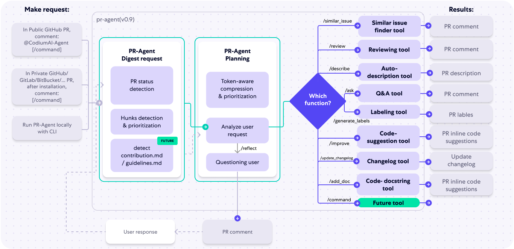

### 1. 사용자의 Pull Request

- Github, Gitlab, Bitbucket 등의 플랫폼에서 PR 생성

---

### 2. Digest request

> 전반적인 리뷰를 진행하기 전에 필요한 요약정보를 뽑아내는 과정

- **PR Status Detection**
    - PR Draft 상태 여부 및 충돌여부 등을 파악함 → 리뷰 리소스를 아낄 수 있음.
- **Hunks Detection & Prioritization**
    - 변경사항을 Hunk 단위로 쪼갬
    - 중요도 기준으로 정렬 → 중요한 부분부터 집중적으로 리뷰할 수 있게끔 전처리하는 단계
- **Detect contribution.md & guidelines.md**
    - 변경된 코드가 **기여 가이드라인**을 잘 따랐는지 검사 → 사전에 지적 및 스킵을 통해서 리뷰 리소스를 아낄 수 있음.

---

### 3. PR-Agent Planning

> Digest가 끝난 뒤, **어떻게** 리뷰할지 설계하는 과정

- **Token-aware compression & prioritization**
    - 제한된 토큰 수 내에서 PR 내 중요한 정보만 뽑고, 나머지는 압축하거나 버림
    - Hunks 위주 + 메타데이터만 요약해서 LLM에 전달 → 속도 ⬆️, 비용 ⬇️
- **Analyze user request**
    - `Digest 결과 + 유저 요청사항`을 합치는 과정 → 리뷰 방향을 조정함.
- **Questioning user**
    - 유저 답변을 반영해서, 리뷰 품질을 높임

### 4. 실행할 기능 결정 단계(Which Function?)

> Digest가 끝난 뒤, **어떻게** 리뷰할지 설계하는 과정

- 

    
/similar_issue

    <ul>
      <li>현재 PR과 유사한 과거 이슈를 검색해주는 기능으로, 댓글로 /similar_issue 호출하거나 CLI로 실행할 수 있음.</li>
      <li>유사도 score를 통해서 어떤 PR이 더 관련성이 높은지를 판단해서 알려줌</li>
      <li><a href="https://github.com/qodo-ai/pr-agent/blob/main/docs/docs/tools/similar_issues.md">참고링크</a></li>
    </ul>
  

- 

    
/review

    <ul>
      <li>PR의 코드 변경사항을 분석하고, 피드백을 제공하는 기능</li>
      <li>품질, 보안, 테스트 포함 여부 등 여러 항목을 점검하고, PR에 라벨 추가하는 기능도 제공</li>
      <li>extra_instructions를 통해 특정 요구사항에 맞는 피드백도 제공 가능</li>
      <li><a href="https://github.com/qodo-ai/pr-agent/blob/main/docs/docs/tools/review.md">참고링크</a></li>
    </ul>
  

- 

    
/describe

    <ul>
      <li>PR 분석해서 자동으로 제목, 유형, 요약, 설명 및 라벨 생성</li>
      <li><a href="https://github.com/qodo-ai/pr-agent/blob/main/docs/docs/tools/describe.md">참고링크</a></li>
    </ul>
  

- 

    
/ask

    <ul>
      <li>PR 코드 변경에 대한 질문에 답변을 제공</li>
      <li>코드변경 사항의 특정 라인에 대해 질문 가능 → 각 질문은 독립적으로 처리됨</li>
      <li><a href="https://github.com/qodo-ai/pr-agent/blob/main/docs/docs/tools/ask.md">참고링크</a></li>
    </ul>
  

- 

    
/improve

    <ul>
      <li>리뷰 후에 어떤식으로 코드 개선을 했으면 좋겠다고 제안해주는 기능</li>
      <li>`extra_instructions` 설정을 통해서 좀 더 구체적인 지침을 제공할 수 있음.</li>
      <li>`best_practices.md` 파일을 통해 조직 내 코딩규칙 같은 거 적어두면, 맞춤형 제안까지 생성 가능.</li>
    </ul>
  

- 

    
/documentation

    <ul>
      <li>변경된 함수나 클래스에 대해 자동으로 문서화 해줌</li>
      <li>sphinx, google 등 원하는 문서 스타일 설정 가능</li>
    </ul>
  

- 

    
/test

    <ul>
      <li>변경된 컴포넌트 기반으로 자동 테스트 코드 생성해줌</li>
      <li>mock 사용 여부도 설정 가능</li>
    </ul>
  

- 

    
/update_changelog

    <ul>
      <li>변경로그 업데이트 도구</li>
      <li>PR 내용을 바탕으로 CHANGELOG.md 수정 제안</li>
      <li><a href="https://github.com/qodo-ai/pr-agent/blob/main/docs/docs/tools/update_changelog.md">참고링크</a></li>
    </ul>
  

- 

    
/generate_labels

    <ul>
      <li>레이블링 도구</li>
      <li>PR에 적절한 GitHub 라벨 자동 생성</li>
    </ul>
  

- 

    
/add_doc

    <ul>
      <li>코드 문서화 도구</li>
      <li>함수/클래스에 docstring 추가 제안</li>
    </ul>
  

- 

    
/command

    <ul>
      <li>향후 추가될 사용자 지정 커맨드용 슬롯 (Future expansion)</li>
    </ul>
  

[더 자세한 Tools 리드미](https://github.com/qodo-ai/pr-agent/tree/main/docs/docs/tools)

### 5. 세부동작흐름 요약
> PR 이벤트 감지 → 변경 사항 수집 → 프롬프트 생성 (설명/리뷰/개선) → LLM에 요청 → 모델 응답 수신 및 후처리 → PR에 코멘트 작성 → (선택) 수용된 제안 기록

--- 

## 실제 적용 사례 및 결과
> 💡 LLM 기반 자동 코드 리뷰는 소프트웨어 개발 활동을 유의미하게 개선하는가?

### 반영 효과

- 전체 리뷰 코멘트 중 73.8%가 개발자에 의해 반영됨
- 인간 리뷰 전에 CodeReviewBot 리뷰를 반영한 커밋이 88건 발생 → 자동 리뷰가 PR에 영향 미침
- 개발자 설문 결과: 68.8%가 코드 품질의 약간의 개선을 체감

### 시간 절약 가능성

- PR 처리 시간은 평균 5시간 52분 → 8시간 20분으로 증가
    - 자동 리뷰 피드백 반영에 시간이 더 걸림
- 프로젝트별로 편차 존재 (어떤 프로젝트는 오히려 시간 감소)
- 자동 리뷰가 인간 리뷰를 대체하지는 않음, 보완 역할

### 버그 조기 발견

- 오타, 누락된 테스트 코드, 코드 스멜 등을 빠르게 찾아줌
- 개발자가 실수를 빠르게 인지할 수 있음

### 과도한 의존의 위험

- “봇이 지적하지 않았으면 문제도 없을 것”이라는 리뷰 태만 가능성 존재
- 자동화 도입 전 충분한 검토와 조직적 인식 필요

### 불필요한 리뷰 코멘트

- 26.2%는 ‘수정 안함(Won’t fix)’ 또는 ‘닫힘’ 처리
- 과도하게 사소하거나, 업무 범위 밖이거나, 실질적 문제 아님

### 결론

- 자동 리뷰 도구는 개선 효과는 있으나, 일관된 시간/노력 절감 효과는 명확히 입증되지 않음

--- 

# AI 코드리뷰의 현재 동향과 미래 전망
## 1.  코드 리뷰 에이전트의 필요성과 중요성

- 오픈소스 LLM(대규모 언어 모델)은 자연어 처리에 특화된 AI 모델로, 코드 리뷰 자동화에 이상적임.
- AI는 코드 분석 및 피드백 제공을 자동화하여 코드 품질 향상과 개발 효율성 증대에 기여.
- GitHub Copilot, ChatGPT 등의 도구는 이미 개발 현장에서 실시간 코드 리뷰와 피드백 제공에 활용됨.

---

## 2. 국내 AI 및 코드 리뷰 기술 동향

- 국내 AI 기술 발전이 빠르게 이루어지며, 중소기업 및 스타트업에서 코드 리뷰 자동화 사례 증가 중.
- 오픈소스 LLM을 도입해 비용 효율성을 높이고, 인력 부담을 줄이며 생산성 향상.
- 기업들은 AI를 전략적 파트너로 인식하며, 자동화 도구의 도입에 적극적임.

---

## 3. 시장 규모 및 통계

- GitHub Copilot 사용자는 하루 수십만 개의 코드 조각을 작성하며, 평균 30% 생산성 향상.
- 2023년 기준 약 50%의 기업이 AI 기술을 도입, 이 중 70%는 코드 리뷰 자동화에 활용.
- AI 도입으로 기업의 운영 및 인력 비용 절감 효과 확인.
- Amazon Q Developer 등은 개발 시간 단축과 수십억 원 단위 비용 절감 실적 보유.
- 글로벌 AI 코드 도구 시장 규모 2032년까지 295억 6 천만 달러 돌파

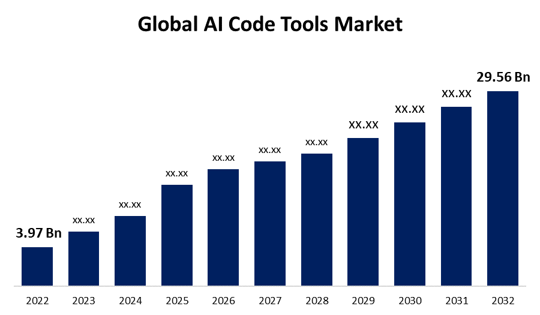

---

## **4. 국내외 적용 사례**

- X사: 코드 리뷰 속도 및 품질 향상, 실시간 피드백 제공 AI 에이전트 개발.
- Y사: 코드 품질 30% 향상, 코드 오류 감소 및 팀 생산성 향상.
- Z사: 코드 복잡도 분석 및 최적 코드 작성 가이드 제공.

→ 공통점: 자동화로 빠르고 정확한 리뷰, 실시간 피드백, 코드 품질 상승.

---

## 5. 미래 전망 및 기업 전략 제언

- LLM 시장은 2029년까지 연평균 21.4% 성장 예상 → 코드 리뷰 에이전트 수요도 동반 증가.
- 코드 리뷰 에이전트는 검사 도구에서 벗어나 실시간 코딩 팁 및 컨설팅 기능 포함하는 방향으로 진화.
- 기업 전략:
    - 기술 파트너십 강화
    - 직관적 UI/UX로 사용자 경험 개선
    - 파일럿 프로젝트 운영 후 기능 확장

---

## 결론

- 코드 리뷰 에이전트는 소프트웨어 품질 향상과 개발 효율성 개선의 핵심 도구로 자리매김.
- AI 기술과 오픈소스 LLM 도입은 기업 경쟁력을 높이는 중요한 전략.
- 자동화된 코드 리뷰 시스템은 개발 문화를 혁신하고, 향후 통합형 개발도구로 발전 가능성이 큼.

--- 

# 유사 AI 코드리뷰 도구
## 1. GitHub Copilot

- GitHub Copilot은 OpenAI의 Codex를 기반으로 작동하며, 주로 코드 자동 완성과 실시간 제안 기능을 제공하는 툴. 
- 비주얼 스튜디오 코드, 비주얼 스튜디오, Neovim, 젯브레인즈 등의 IDE에서 코드 자동 완성과 실시간 제안을 통해 개발자들을 지원하며,
- 2024년 이후로는 GitHub Copilot이 PR 리뷰 기능을 강화하면서, Pro 요금제 사용자부터 PR 요약, 리뷰 코멘트 자동 제안 등 기능을 활용할 수 있게 되었음.

### 작동방식
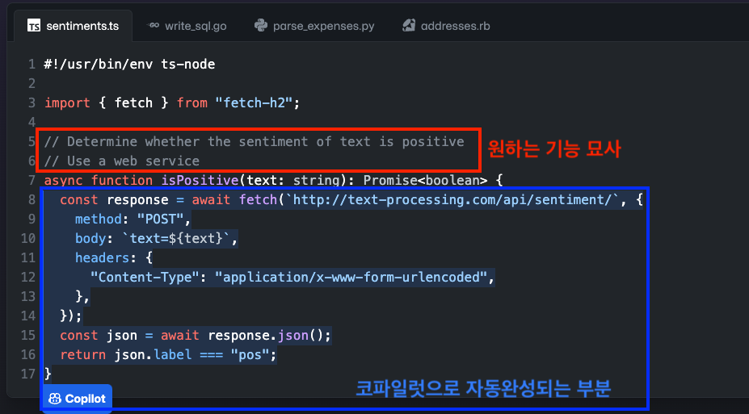
원하는 기능을 주석으로 묘사하면, 묘사에 맞는 기능을 자동으로 완성

### **주요 기능**

- **실시간 코드 자동완성**: 커서 전후 수줄과 열린 파일, 워크스페이스 정보를 기반으로 전체 함수·블록 단위까지 완성 제안
- **Copilot Chat**: 자연어로 코드 질문·버그 수정·설명 요청 가능
- **코드 리뷰(Code Review)**: VS Code 및 GitHub 웹에서 하이라이트 코드 검토 또는 전체 PR 변경사항 리뷰 제공

### **확장성 & 구성**

- **멀티 모델 지원**: OpenAI Codex 기반 외에도 Anthropic Claude 3.5, Google Gemini 1.5 Pro, OpenAI GPT-4o 등 다양한 모델 선택 가능
- **폐쇄형 구독 모델**: Free, Pro, Business, Enterprise 플랜별 기능·쿼터 차등 제공

### **비용 & 접근성**
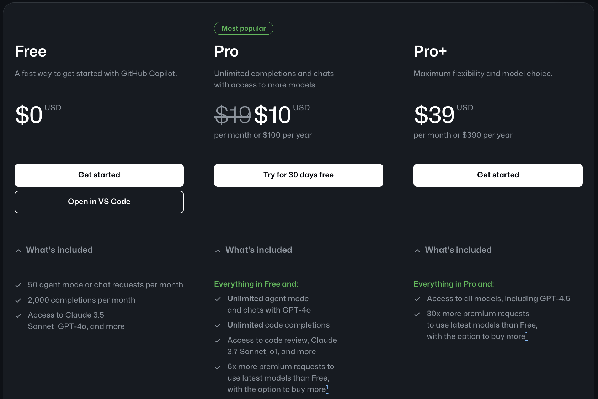

### **최신 동향**

- **코드 리뷰 GA**: 2025년 4월 모든 유료 플랜에 Code Review 정식 제공
- **하드웨어 통합**: AI 전용 NPU 탑재 Mini PC에 Copilot Plus 버튼 내장 발표
- **협업 플랫폼 확장**: 커밋 메시지 자동 생성, Pull Request 요약 기능 강화 예정

### PR Agent vs Copilot
1. 구조 및 사용 방식 비교

    | 구분 | PR-Agent | GitHub Copilot |
    | --- | --- | --- |
    | **컨텍스트 범위** | 전체 PR diff → 중요 hunk 우선순위 · 압축 | 커서 ± 몇 줄 + 열린 파일 + 워크스페이스 |
    | **리뷰 트리거** | PR 이벤트 & `/review`, `/describe` 등 명령 | 실시간 자동완성, `@copilot` 코멘트 |
    | **통합 위치** | GitHub·GitLab·Bitbucket PR 페이지 | IDE(VS Code 등) & GitHub 웹 |
    | **배포 형태** | Self-host Docker 또는 Qodo Cloud | SaaS (Docker 불필요) |
    | **커스터마이즈** | 프롬프트·정책·플러그인 직접 수정 | Enterprise: `copilot.yaml` 가이드라인 |
    | **비용 모델** | OSS 무료 + 고급 기능 유료 | Free / Pro / Biz / Ent |
    | **응답 속도** | 10-30 초 (대형 PR도 압축 처리) | 10초 내외 (IDE 내에서는 1~5초 내외, PR 코멘트 내에서는 5~10초 내외) |

 

2. 기능 비교

    > ✔️ = 기본 지원 ▲ = 일부/베타 지원 또는 설정 필요 — = 미지원
    
     

    | 기능                          | GitHub Copilot (Free) | GitHub Copilot (Pro/Biz/Ent) | PR-Agent (OSS) | PR-Agent (Qodo Merge 💎) |
    | ----------------------------- | --------------------- | ---------------------------- | -------------- | ----------------------- |
    | **실시간 코드 자동완성**         | ✔️                    | ✔️                           | —              | —                       |
    | **Chat Q&A / 버그 질문**         | ✔️ (제한)              | ✔️                           | —              | —                       |
    | **PR 요약 · 변경 설명**          | ✔️                    | ✔️                           | ✔️ (`/describe`) | ✔️                     |
    | **코드 리뷰 · 개선 제안**        | ✔️                    | ✔️                           | ✔️ (`/review`, `/improve`) | ✔️                     |
    | **보안·성능 이슈 감지**          | ▲                      | ✔️                           | ▲              | ✔️                     |
    | **테스트 코드 자동 생성**        | —                      | ▲                             | —              | ✔️ (`/test`)            |
    | **문서/주석 자동 추가**          | —                      | ▲                             | —              | ✔️ (`/add_docs`)       |
    | **CHANGELOG · 라벨 자동화**      | —                      | —                             | ✔️ (`/update_changelog`, `/generate_labels`) | ✔️ |
    | **유사 코드 검색**              | —                      | —                             | —              | ✔️ (`/find_similar_component`) |
    | **커스텀 프롬프트 실행**          | —                      | —                             | ✔️ (`/custom_prompt`) | ✔️                    |
    | **CI 실패 원인 분석**            | —                      | —                             | —              | ✔️ (`/checks`)         |

 

3. 비교 핵심 요약 및 결론

    |  | **PR-Agent** | **GitHub Copilot Code Review** |
    | --- | --- | --- |
    | **목적** | PR 생성부터 병합까지의 **PR 이벤트 중심** 자동화를 통해 리뷰 품질과 일관성 확보 | IDE 중심으로 **“코드 작성 → PR”** 전 과정을 실시간 지원하여 개발 속도 극대화 |
    | **강점** | - **오픈소스**: 높은 자유도, 프롬프트 및 플러그인 커스터마이징 가능  - GitHub, GitLab, Bitbucket 지원  - 리뷰, 문서화, 테스트 생성 등 다기능 제공 | - 에디터(VS Code 등)와 밀착  - 커밋 및 PR 요약, 즉각적인 개선 제안  - 멀티 모델(GPT-4o, Claude 3 등) 선택 가능 |
    | **제약** | - 자체 호스팅 인프라 필요  - API 키 관리 필요  - 일부 고급 기능 유료(Qodo Merge) | - GitHub 전용 폐쇄형 구독 서비스 |
    | **추천 사용환경** | 멀티 VCS 환경, 세밀한 정책 및 커스터마이즈가 필요한 팀 리뷰 및 문서 자동화 중시 | GitHub 중심 환경, 빠른 피드백과 간편한 통합을 중시하는 팀 |

 

**🚀 결론**
- **Copilot**: GitHub 전용 환경에서 **“빠른 통합·즉각 피드백”**이 필요할 때 유리
- **PR-Agent**: 멀티 VCS(Multi Version Control System), **세밀한 정책·자동화 범위**를 요구하는 팀에 적합
- 두 툴을 **보완적으로 병행**하여 코드 작성(IDE) & PR 단계 모두 AI 지원을 받을 수도 있다.

## 2. Gemini Code Assist
- IDE 기반 실시간 개발 보조 AI 도구
    - Visual Studio Code, JetBrains(예: IntelliJ, PyCharm), Android Studio 등에서 사용 가능
- 코드 작성 및 수정 시 IDE 안에서 실시간 코드 자동 완성, 테스트 생성, 문서화, 디버깅 지원 등을 제공하는 AI 도구
    - 대화형(자연어 기반) 코드 설명 및 디버깅
    - GitHub PR 내에서도 태그 기반 상호작용 가능
        - /gemini summary, /gemini review, /gemini, /gemini help
    - 코드 정보 Google 서버로 전송 → 보안 검토 필요
- 개발자가 코드 작성부터 테스트, 문서화까지 더 빠르고 정확하게 작업할 수 있도록 실시간으로 지원

### 동작 방식
1. 초기 설정 및 환경 구성
    - 사용자가 VSCode나 JetBrains IDE에 Gemini 플러그인 설치
    - API 연결 + 프로젝트 컨텍스트를 구성

2. 사용자 입력(프롬프트) 처리
    - 자연어(질문, 명령) 또는 코드 기반 액션(코드 선택, 오류 수정 등)을 요청

3. 컨텍스트 수집

    - 다음을 분석하여 컨텍스트 정보를 추출
        - 현재 열려있는 파일
        - 프로젝트의 로컬 코드베이스
        - 선택된 코드 스니펫
        - 파일 간 참조(cross-file dependency)

4. 프롬프트 최적화 및 LLM 호출

    - 수집된 컨텍스트 + 사용자 요청 기반 최적화된 프롬프트를 생성
    - Gemini LLM에 전송

5. LLM 추론 및 응답 생성

    - Gemini 모델이 요청에 대한 코드 생성, 문제 분석, 리팩터링, 주석 추가, 테스트 코드 생성 등 적절한 결과를 반환

6. 결과 수신 및 후처리

    - 받은 응답을 IDE 안에서 적절한 포맷으로 표시
    - 코드 블록, 제안 리스트, 자연어 설명 형태로 제공
    - 사용자는 제안된 코드를 바로 적용 or 편집 후 적용 가능

7. (+) 지속적인 학습 및 개선

    - 조직의 사설 코드베이스에 기반해 Gemini 추천 품질 개선
    - 사용자가 수용한 제안과 거절한 제안을 기반으로 제안의 정확도와 품질 개선

### 내부 성능 평가

1. Benchmark 1: LLM 성능 평가

   **대상 모델**:  
    - GPT-4 Turbo  
    - GPT-4O  
    - GPT-4O Mini  
    - Gemini 1.5 Pro  
    - Gemini 1.5 Flash  

    평가 과제
    - **API Function Call Completion**
    - **Algorithmic Block Completion**
    - **Control-Flow Completion**

    평가 지표
    - **정확도** (Cosine similarity)
    - **지연 시간** (Latency)

    주요 결과

    - **GPT-4 Turbo**
        - **정확도**: 가장 높은 정확도 (최대 0.858)
        - **지연 시간**: 가장 긴 지연 시간
        - **추천 환경**: 정확도가 중요한 프로덕션 환경에 적합

    - **Gemini 1.5 Pro**
        - **정확도**: API 작업에서 높은 정확도 (0.813)
        - **문제점**: 복잡한 알고리즘 및 제어 흐름 작업에서는 낮은 정확도 (0.603)
        - **추천 환경**: API 관련 작업에 적합

    - **GPT-4O**
        - **정확도**: 속도는 빠르지만 정확도는 상대적으로 낮음
        - **지연 시간**: 모든 모델 중 가장 빠른 응답 속도 (0.515-0.672초)
        - **추천 환경**: 실시간 개발, IDE 통합에 적합

    - **GPT-4O Mini**
        - **속도**: GPT-4O와 유사한 빠른 응답 속도 제공
        - **정확도**: 약간 낮음
        - **추천 환경**: 빠른 프로토타이핑용

    ### 결론
    > **Gemini 1.5 Pro**는 **API 작업**에서 강점이 있지만, **복잡한 문제 해결**에는 약함.

---

2. Benchmark 2: MRCR (Multi-round Co-reference Resolution)

    **대상 모델**: 긴 대화에서 문맥을 이해하고 유지하는 능력을 평가

    평가 내용
    - 대화 중 **과거 언급(참조)**을 정확히 추적하고, 필요한 경우 과거 정보를 재생산할 수 있는지 평가.
    - 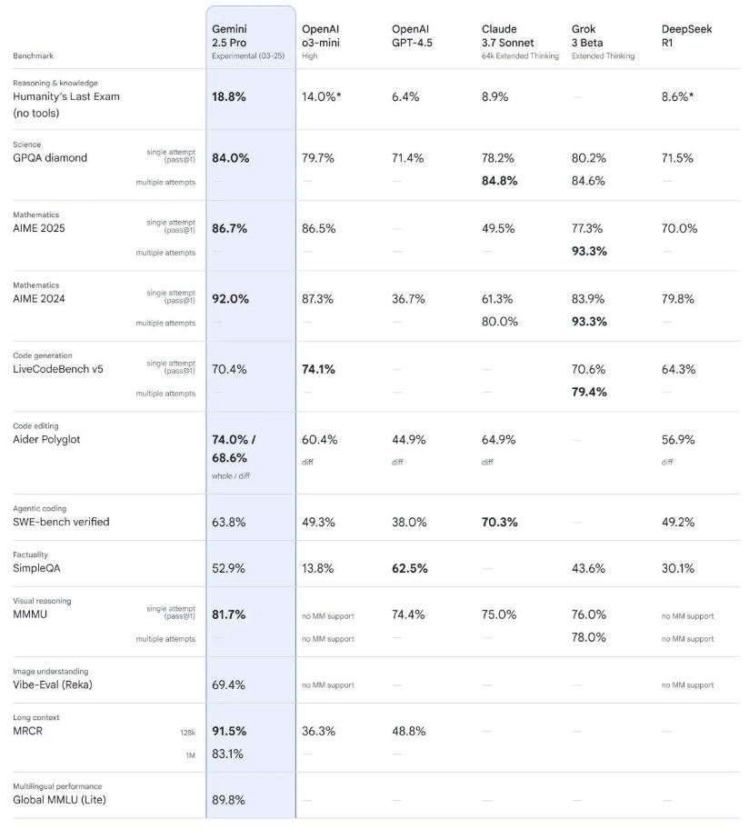

     **Gemini 2.5 Pro 결과 요약**
    - **정확도**: 91.5%로 매우 높은 정확도 기록.
    - **문맥 이해 능력**: 긴 대화에서 정보 간 관계를 잘 파악하고, 일관성 있는 응답 생성.
    - **강점**: 긴 문맥 처리에서 뛰어난 성능을 발휘하며, 복잡한 대화도 잘 기억하고 연결할 수 있음.

### PR Agent vs Gemini
 

1. 구조 및 사용 방식 비교
    | 분류              | PR Agent                              | Gemini Code Assist                       |
    |-------------------|---------------------------------------|------------------------------------------|
    | **사용 목적**         | PR 중심의 코드 리뷰 자동화 및 개선 제안 | IDE 내 실시간 개발 지원 및 전체 코드 작업 자동화 |
    | **사용 환경**         | GitHub PR 워크플로우 내에서 작동 (CI/CD 통합 중심) | IDE(Visual Studio Code, JetBrains IDE 등) 내에서 직접 사용 |
    | 설치 및 접근성    | GitHub에 설치 후 동작 (Bot 방식)     | IDE에 플러그인 또는 클라우드 기반으로 통합 |
    | **코드 제안 방식**    | PR 변경 코드에 대한 분석 및 리뷰 코멘트 형태로 제안 | 실시간 자동 완성, 함수 생성, 코드 변환 등 IDE 내에서 직접 수행 |
    | 커스터마이징      | PR 스타일, 분석 기준 등 설정 가능     | 조직 코드베이스 기반 커스터마이징된 코드 제안 지원 |
    | **대상 코드 범위**    | PR에서 변경된 코드 중심(변경된 코드 부분 + 주변 문맥) | 전체 프로젝트 코드                     |
    | 기반 기술         | 오픈소스 + LLM API (GPT 등)           | Google Gemini LLM 기반, 일부 기능은 Google Cloud 연동 필요 |
    | 제안              | PR 기반 반복 학습(Auto Best Practice) 기반 제안 | 로컬 코드 + 조직 코드베이스 기반 제안 |

2. 기능 비교

    | 분류               | PR Agent                                      | Gemini Code Assist                              |
    |--------------------|-----------------------------------------------|-------------------------------------------------|
    | 코드 리뷰 자동화    | O 변경된 코드에 대한 리뷰 코멘트 생성          | X                                               |
    | 자연어 기반 대화    | X                                               | O 채팅 인터페이스 제공                          |
    | 코드 자동 완성      | X                                               | O IDE 내 코드 자동 완성                         |
    | 코드 수정 제안      | O 코드 개선, 버그 수정 제안                     | O 코드 리팩터링, 개선 제안 가능                 |
    | 테스트 생성         | O 일부 테스트 코드 제안 (Improve 기능)         | O 테스트 코드 자동 생성                        |
    | 문서화 지원         | X                                               | O 함수 설명, API 문서 자동 생성                |
    | API 개발 지원       | X                                               | O API 스펙 생성, 모의 서버 구성 등              |
    | 커스텀 학습         | O 반복 학습 가능 (분석용)                       | X                                               |

3. 비교 핵심 요약 및 결론
    - PR Agent는 PR 변경사항을 중심으로 코드 리뷰와 개선을 자동화하는 데 최적화된 도구이며, 리뷰 품질 향상과 워크플로우 자동화에 강점을 가짐
    - 반면 Gemini Code Assist는 IDE 환경 내에서 코드 작성, 수정, 테스트, 문서화까지 실시간으로 지원해 개발자의 전체 작업 생산성을 높이는 데 초점을 맞춤
    - 두 도구는 목적과 사용 환경이 다르므로, 필요에 따른 선택이 적절함
        - 개인 개발자 & 코드 작성 및 디버깅 & 질의 → Geimini Code Assist
        - 팀 단위 개발자 & branch별 코드리뷰 → PR Agent

## CodeRabbit
- CodeRabbit은 Pull Request의 코드 변경사항을 자동으로 분석하고 코드 리뷰를 도와주는 AI 어시스턴트로
- 코드 컨텍스트를 이해하고 의미를 파악하여, 단순 문법 오류가 아닌 "의도까지 고려한 리뷰"를 지향

### 주요기능

1. **PR 요약 및 릴리즈 노트 자동 생성**
    - Pull Request의 변경사항을 요약하고, 릴리즈 노트를 자동으로 만들어줌.
    - 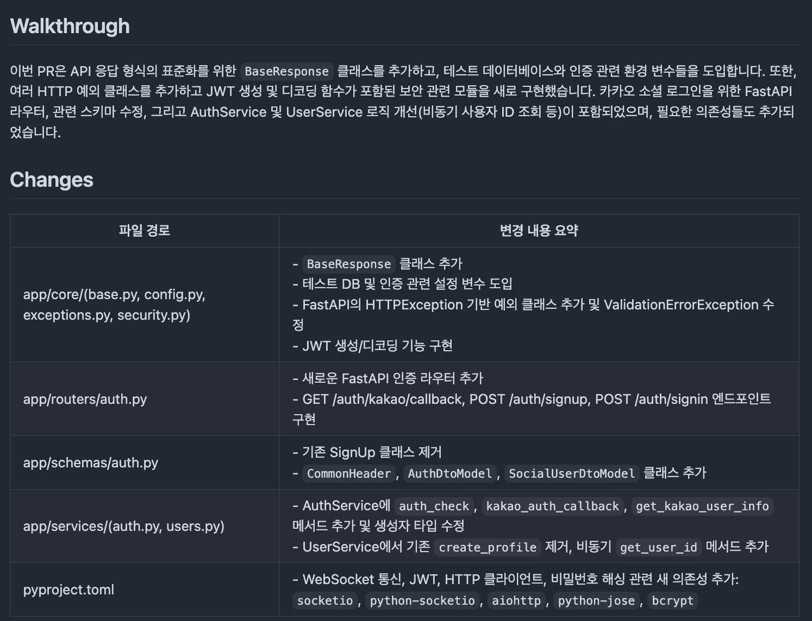
    
     

    - 코드 변경 흐름을 다이어그램으로 시각화하여 복잡한 로직을 빠르게 파악 가능
    - 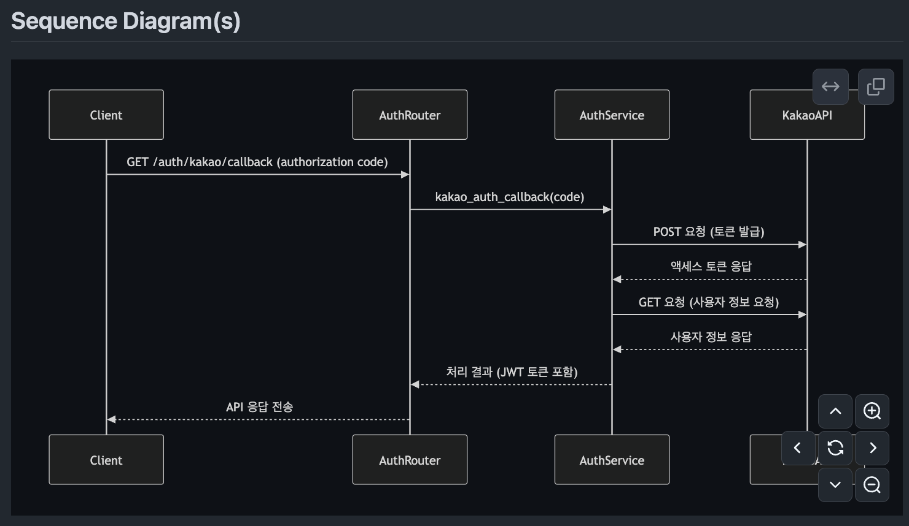
2. **라인 단위 코드 리뷰**
    - 변경된 코드 한 줄 한 줄에 대해 AI가 피드백과 코드 개선 제안을 제공.
    - PR 전체에 대한 일회성 리뷰가 아닌, **커밋마다** 리뷰가 이루어져 점진적인 피드백 가능.
3. 코드 내 대화 및 이슈 생성
    - 리뷰 코멘트에서 CodeRabbit과 추가 대화를 나눌 수 있고, 필요시 이슈로 자동 등록.
    - 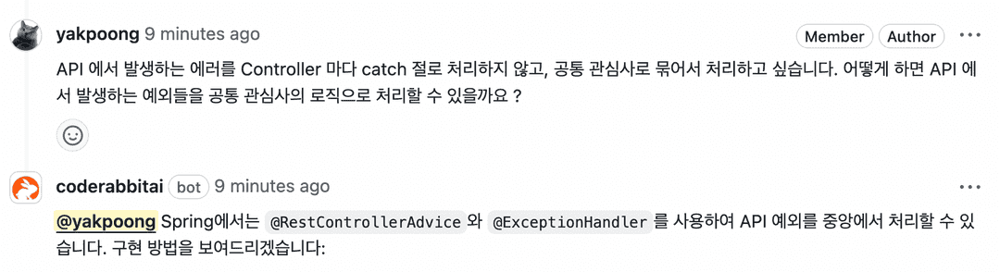
    - 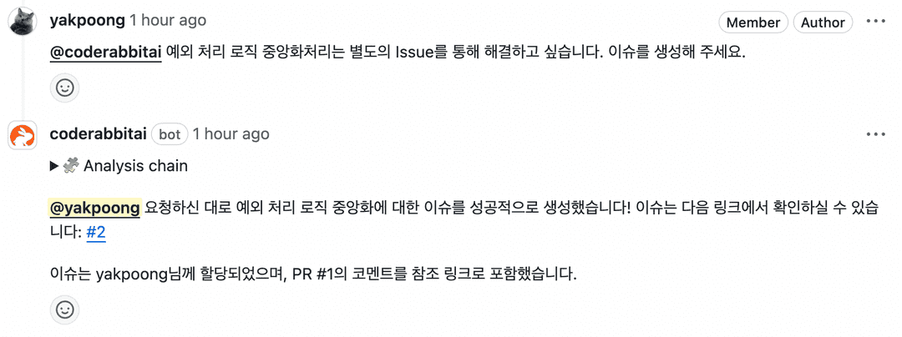
4. Review Instructions(.coderabbit.yaml)
    - 프로젝트별로 팀 규칙, 성능 최적화 가이드, 특정 라이브러리 버그 정보 등을 사전 정의하여 맞춤형 리뷰 가능.
    - 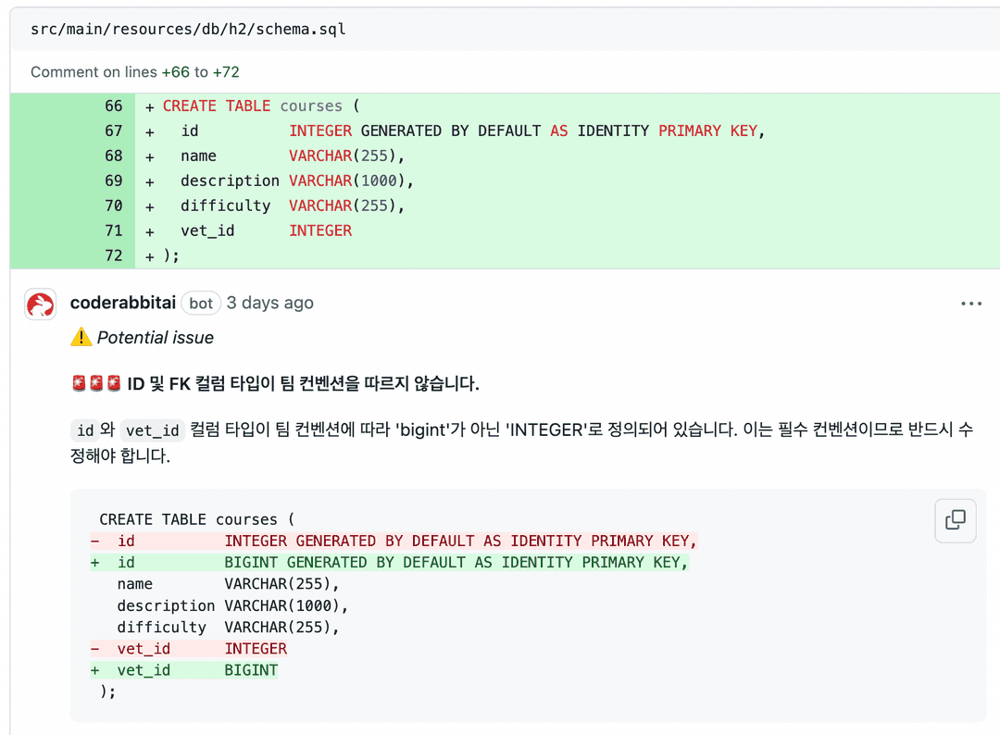
5. 보안 및 코드 취약점 제시
    - 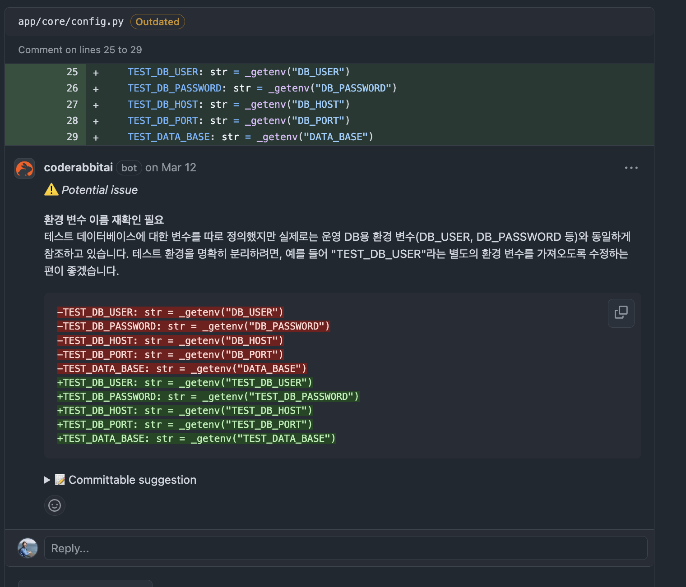
6. 대시보드 제공
    - 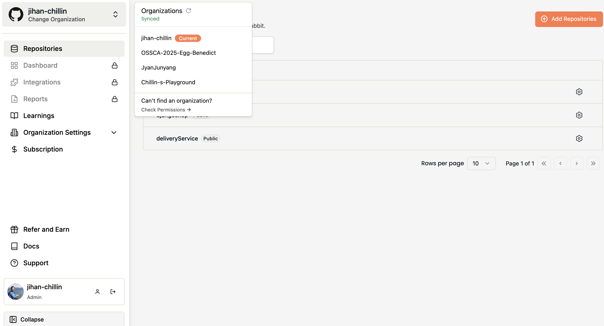

### PR Agent vs CodeRabbit
### 사용적 관점

|  | PR Agent | CodeRabbit |
| --- | --- | --- |
| **사용자 인터페이스** | 별도 UI 없음 | 전용 웹 대시보드 제공 (PR 별 히스토리 및 요약 관리) |
| **상호작용 방식** | PR 코멘트 기반 자동응답 (일방향 느낌) → 봇이 알아서 말하고 끝나는 구조 | 코드 줄 단위로 Bot과 대화 가능 → 대화형 리뷰 가능, 근데 좀 과하다 느낄 때 있음. |

---

### 성능적 관점

1. 리뷰 접근방식의 차이

    |  | PR Agent | CodeRabbit |
    | --- | --- | --- |
    | **접근 방식** | 전체 PR 내용을 토대로 분석하고, 그 안에서 digest한다. | 커밋 단위 기준으로 분석한다. |
    | **장점** | 전체 설계에 가까운 리뷰 → 리뷰 품질이 높을 수 있음. | 리뷰 시점마다 빠르게 반응 가능. |
    | **단점** | **`처음 단계에서 리소스를 많이 사용`**할 수 있음. | 커밋 간의 **`문맥 손실 가능성`** 있음. |

2. LLM 활용 전략 및 토큰 최적화

    |  | PR Agent | CodeRabbit |
    | --- | --- | --- |
    | **토큰 전략** | 토큰-aware 압축 적용 | 요약용 라이트 모델 + 리뷰용 헤비 모델 분리 |
    | **모델 구성** | 주로 GPT-4 기반 최적화 구조 | 요약용: GPT-3.5-turbo, 리뷰용: GPT-4 |
    | **비용 효율성** | 비용 효율성을 위해 **`구조적인 설계에`** 집중한 케이스. → PR 전체를 한 번에 리뷰함으로서 많이 드는 토큰 비용을 구조적 설계로 효율성을 찾고자 함. | 비용 효율성을 위해 **`모델 구성`, `커밋단위 분산처리`**에 집중한 케이스 → 커밋 단위로 쪼개 처리하면서, 모델 호출 횟수는 늘어나도 총 토큰 비용은 줄여 불필요한 토큰 소모를 줄이는 구조. |

3. 리뷰스킵 및 가이드라인

    |  | PR Agent | CodeRabbit |
    | --- | --- | --- |
    | **리뷰 스킵** | 기여 가이드라인 위반 여부 등으로 리뷰 리소스 절감 → **`구조적`**으로 스킵 여부 판단 | 단순 변경, 오타 등 자동으로 건너뜀 (옵션으로 끌 수 있음) → 전체 맥락보단 **`커밋단위`**로 스킵 여부 판단 |
    | **가이드라인 감지** | contribution.md 등 자동 감지 및 반영 → 팀 내 암묵적 규칙 자동 체크 등 | 커스텀 프롬프트에 따라 가능하지만 자동 감지는 명시 안됨 → [contribution.md](http://contribution.md) 파일에 커스텀 프롬프트로 가이드라인을 어느 정도 커버 가능하지만 유료임. |

### 결론 

> 요약  
> **- PR Agent**: 팀 규칙을 엄격히 따르고 구조적 리뷰가 중요한 경우.  
> **- CodeRabbit**: 빠른 피드백과 대화형 리뷰가 필요한 경우.

1. PR Agent를 사용하면 좋을 것 같은 상황

    a. **대규모 팀에서 구조적 리뷰가 필요할 때**  
    - 전체 PR을 분석하여 팀 규칙에 맞춘 체계적인 리뷰가 가능.

    b. **리소스 절감 및 자동화가 필요할 때**  
    - 기여 가이드라인 위반 시 자동으로 리뷰를 스킵하여 리소스를 절감.

    c. **복잡한 PR 및 큰 프로젝트에서 품질 높은 리뷰를 원할 때**  
    - 전체 설계를 분석하여 높은 품질의 리뷰 제공.

    d. **프라이버시 및 데이터 보안을 우선시할 때**  
    - 자체 서버에서 실행되어 데이터 보안 강화 가능.

---

2. CodeRabbit을 사용하면 좋을 것 같은 상황
    a. **빠른 피드백 및 대화형 코드 리뷰가 필요할 때**  
    - 커밋 단위로 실시간 피드백과 대화형 리뷰 제공.

    b. **다양한 개발 플랫폼과 통합이 필요할 때**  
    - GitHub, GitLab, Azure DevOps 등 다양한 플랫폼 지원.

    c. **팀 컨벤션에 맞춰 지속적으로 학습하는 시스템을 원할 때**  
    - 리뷰 기록을 통한 지속적인 품질 개선.

    d. **보안 및 프라이버시가 적당히 중요하고 SaaS 기반 솔루션을 사용하는 것에 익숙할 때**  
    - SOC2 Type II, GDPR 준수 및 클라우드 기반 서비스 제공.

