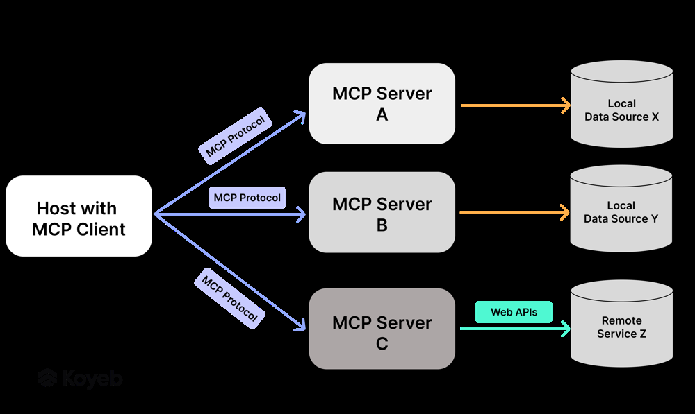

# 개인 과제 - RAG / MCP / A2A

## RAG(Retrieval-Augmented Generation)

### 개념

LLM의 한계를 보완하기 위해 외부 지식을 결합하는 개념이다.
일반적인 LLM은 학습되어 내재되어있는 지식으로만 답변하다보니,
학습 이후에 등장한 최신 정보 반영이 어렵고, 환각현상을 보이기 쉽다.
RAG는 이를 해결하고자 모델 외부에 신뢰할 수 있는 정보 소스를 두고,
질문에 맞는 관련 정보를 검색하여 응답 생성 시 참조하게 한다.
기본 구조는 질의에 대해 벡터 DB 등에서 관련 문서를 검색하고,
LLM 프롬프트에 이 문서를 추가해 답변 생성하는 형태로 이루어진다.

### 장점

응답의 사실성 향상과 최신성을 확보 할 수 있다.
모델이 최신의 신뢰할만한 사실에 접근하므로 업데이트되는 지식도 반영할 수 있다.
또한 출처도 제시할 수 있기 때문에 사용자 입장에서는 투명성과 신뢰도가 올라간다.
LLM의 환각을 줄이고, 파인튜닝 없이도 새로운 지식을 반영할 수 있어 운용비용을 줄일 수 있다.

### 단점

RAG는 정보 검색 단계의 성능에 의존하기 때문에 잘못된 문서를 가져오면 LLM도 잘못 대답할 수 있다.
유사도 검색은 편리하지만 자연어의 의미를 잘못 파악하여 비슷하지만 의도와는 다른 결과를 내줄 가능성이 있다.
RAG를 도입하면 기존 시스템보다 복잡해진다.
임베딩이나 검색 등 다양한 단계가 생기면서 확장성과 유지보수에 더욱 신경을 써야한다.
기존의 LLM보다 근본적으로 시간이 더 걸리게 된다.
임베딩을 할 때 청크 사이즈에 대한 고려가 이루어지는데 이것은 LLM이 맥락을 이해하는데에 있어 문제가 있다.
청크를 작게하면 맥락 이해가 힘들고, 청크를 크게하면 노이즈나 저장비용이 증가한다.

### RAG 아키텍쳐

출처 : https://aws.amazon.com/what-is/retrieval-augmented-generation/

#### 지식베이스를 구축하는 단계

1. 데이터를 수집한다.
2. 문서를 전처리하고 청크 단위를 설정하여 분할한다.
3. 텍스트 임베딩을 통해 정보들을 벡터로 변환한다.
4. 벡터 DB에 저장한다.

#### 질의응답이 이루어지는 단계

1. 사용자의 질문(자연어)을 벡터화한다.
2. 벡터 DB에서 유사 내용을 검색한다. (코사인 유사도 계산, kNN 알고리즘 등)
3. 찾은 문서(데이터)를 LLM 프롬프트에 포함시킨다.
4. LLM이 해당 내용으로 최종 답변을 생성한다.

### RAG 최적화에서 고려해야할 부분

1. 임베딩 모델의 성능
   - Query(목적)와 문서를 의미적으로 잘 매칭
   - 좋은 임베딩 모델은 질문과 진짜 관련 있는 문서를 잘 찾아낼 수 있게 해줌
2. 유사한 데이터를 찾을 때 적용시킬 수 있는 하이퍼파라미터값 설정
   - 탐색할 때 쓰는 세부 설정을 어떻게 조정하느냐도 성능에 큰 영향을 줌
   - ex) 검색해져 가져올 결과 개수, 가져올 최소 유사도 기준 등
   - 해당 값들을 적절하게 조정하지 않으면 과잉/과소 검색이 일어남
3. 문서 관련 청크 단위를 어떻게 구성할지
   - 청크가 너무 크면 검색정확도가 낮아지고, LLM 입력 토큰 길이를 초과할 수 있음
   - 청크가 너무 작으면 문맥이 깨져서 답변에 필요한 정보가 부족해짐

## MCP(Model Context Protocol)

### 개념
- Anthropic에서 제안한 개방형 표준 프로토콜
- 주로 LLM기반의 AI 애플리케이션이 외부 데이터 소스나 도구에 표준화된 방법으로 접근하여 컨텍스트로 활용하게 도와줌
- LLM과 관련된 도구 및 데이터 연결의 표준화

### 구조 및 아키텍쳐

출처 : https://www.koyeb.com/blog/a2a-and-mcp-start-of-the-ai-agent-protocol-wars

#### MCP 호스트(Host)
- LLM 애플리케이션
- ex) Claude Desktop
- 호스트는 LLM에게 데이터를 제공하기 위해 MCP 연결을 시작

#### MCP 클라이언트(Client)
- 호스트 내에서 동작하는 프로토콜 클라이언트로, 각 외부 서버와 1:1 연결을 유지
- 호스트 애플리케이션은 필요한 기능별로 하나씩의 MCP 클라이언트를 관리하며, 이를 통해 여러 서버와 동시 통신

#### MCP 서버(Server)
- 특정 기능이나 데이터 접근을 표준화된 방식으로 노출하는 경량 프로그램
- MCP 서버는 로컬 데이터 소스(파일시스템, DB 등)나 원격 서비스 API와 통신하여, 그 결과를 MCP 프로토콜 표준 메시지로 클라이언트에 반환

### MCP 흐름

1. LLM이 필요한 데이터를 감지
   - 사용자는 LLM에게 요청을 함
   - LLM은 이 요청을 수행하기 위해서는 외부 및 로컬 데이터에 접근이 필요하다고 판단
2. 호스트 애플리케이션이 MCP 클라이언트 통해 요청
   - 호스트 앱이 적절한 MCP 클라이언트를 사용해 서버에 요청
   - 요청은 `JSON-RPC 2.0` 형식으로 보냄
3. 서버가 실제 데이터 조회
   - MCP 서버는 요청을 받아 해당 기능을 실행
   - 실제 데이터에 접근해서 요청된 정보를 조회
4. 서버가 JSON 형태로 응답
   - 조회 결과를 JSON 응답으로 포맷팅해서 MCP 클라이언트로 전달
5. 클라이언트가 응답을 LLM 컨텍스트로 삽입
   - MCP 클라이언트는 받은 응답을 LLM에게 보내서 응답

### 장점

#### 표준화와 재사용성
MCP 서버는 `JSON-RPC` 기반 표준 인터페이스를 제공하여, 한 번 만든 서버를 여러 LLM/에이전트에서 재사용할 수 있다. (예: Jira MCP 서버 → 챗봇, 코파일럿 모두 사용)

#### 개발 생산성 향상
데이터 연결 부분을 MCP 서버로 통합 관리함으로써, 새로운 AI 애플리케이션 개발 시 중복 작업을 줄이고 속도를 높일 수 있다.

#### 종속성 감소
MCP를 이용하면 특정 LLM의 독자적인 플러그인 체계에 의존할 필요 없이, 표준 프로토콜만 준수하여 다양한 LLM을 교체하거나 혼용할 수 있다.

### 단점

#### 생태계 성숙도 부족
MCP는 아직 제안된 지 오래되지 않아 모든 LLM/플랫폼이 기본 지원하는 것은 아니다. 초기 도입단계이며 호환성 이슈가 발생할 수 있다.

#### 경쟁 표준 등장 가능성
Google A2A, OpenAI 플러그인 등과 비슷한 프로토콜이 존재하여, 앞으로 표준 주도권 경쟁이 생길 수 있다.

## A2A

### 개념
- 구글에서 제안한 개방형 표준 통신 프로토콜
- 자율 에이전트 여러 개가 서로 협력하도록 고안된 것
- 하나의 에이전트가 다른 회사에서 만든 LLM으로 구동되고, 또 다른 에이전트는 파이썬 기반 규칙 엔진이라도, A2A 프로토콜만 따르면 서로 발견하고 대화할 수 있도록 하는 것이 A2A의 목표이다.

### A2A 구성요소

#### A2A 서버 (Agent Server)
- 에이전트가 외부 요청을 받을 수 있도록 JSON-RPC 요청을 수신하는 HTTP 서버
- 유효성 검사, 작업 식별, 내부 로직 호출, 결과 반환을 담당
- 에이전트의 공개 인터페이스 역할

#### A2A 클라이언트 (Agent Client)
- 다른 에이전트에게 요청을 보낼 때 사용하는 구성요소
- 상황에 따라 에이전트는 서버와 클라이언트 역할을 모두 수행 가능

#### 에이전트 카드 (AgentCard)
- 에이전트 메타데이터 문서 (.well-known/agent.json 경로 제공)
- 이름, 설명, 서버 URL, 지원 기능, 인증 요구사항 등 명시
- 다른 에이전트가 기능 파악 및 동적 발견할 수 있도록 함

#### 작업 (Task)
- 에이전트 간 주고받는 대화 단위
- Message와 메타데이터(우선순위, timeout 등)를 포함
- Task는 서브태스크로 분기할 수 있고, 스트리밍 응답도 가능

#### 메시지 (Message)와 파트 (Part)
- Task의 입력 및 결과를 담는 컨테이너
- 하나의 Message는 여러 Part(텍스트, 파일, 구조화 데이터 등)로 구성
- 멀티모달 데이터 교환을 지원

### MCP 와 A2A 비교

#### 목적
MCP는 외부 데이터나 시스템과 연결되도록 도와주는 표준화된 프로토콜
A2A는 서로 다른 Agent(AI 프로그램)들이 서로 협력하게 하기 위한 프로토콜

#### 통신 방향
MCP는 에이전트가 일방적으로 외부 데이터를 요청하는 구조(단방향 통신)
A2A는 에이전트끼리 요청/응답을 주고 받는 대화형 통신(양방향 통신)

#### 프로토콜
MCP, A2A 모두 JSON-RPC 2.0 을 사용