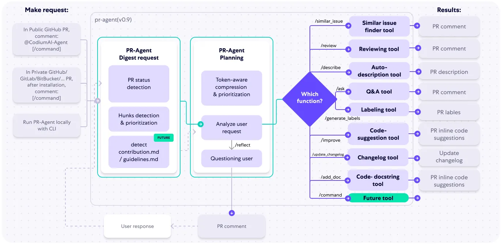
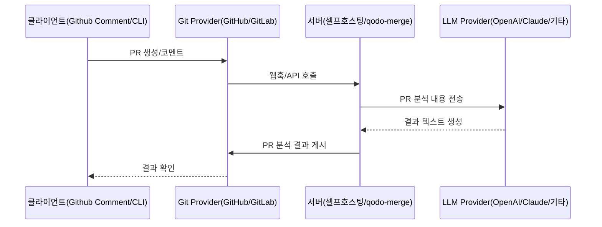
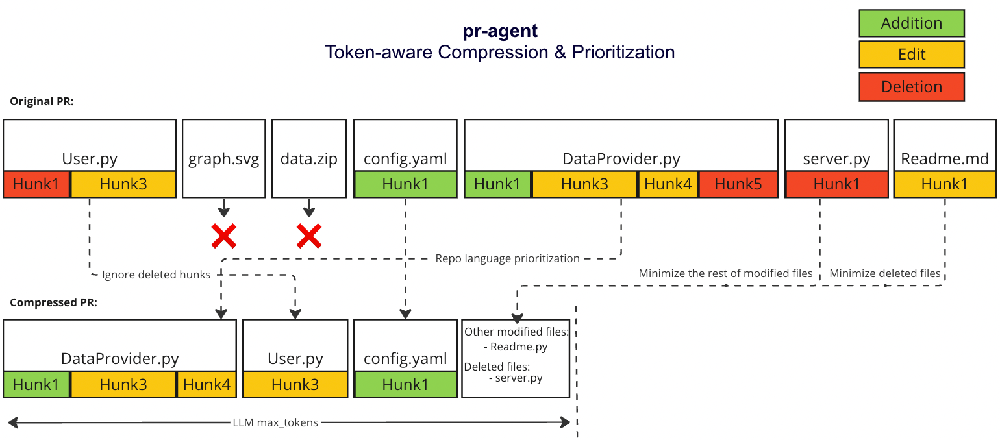
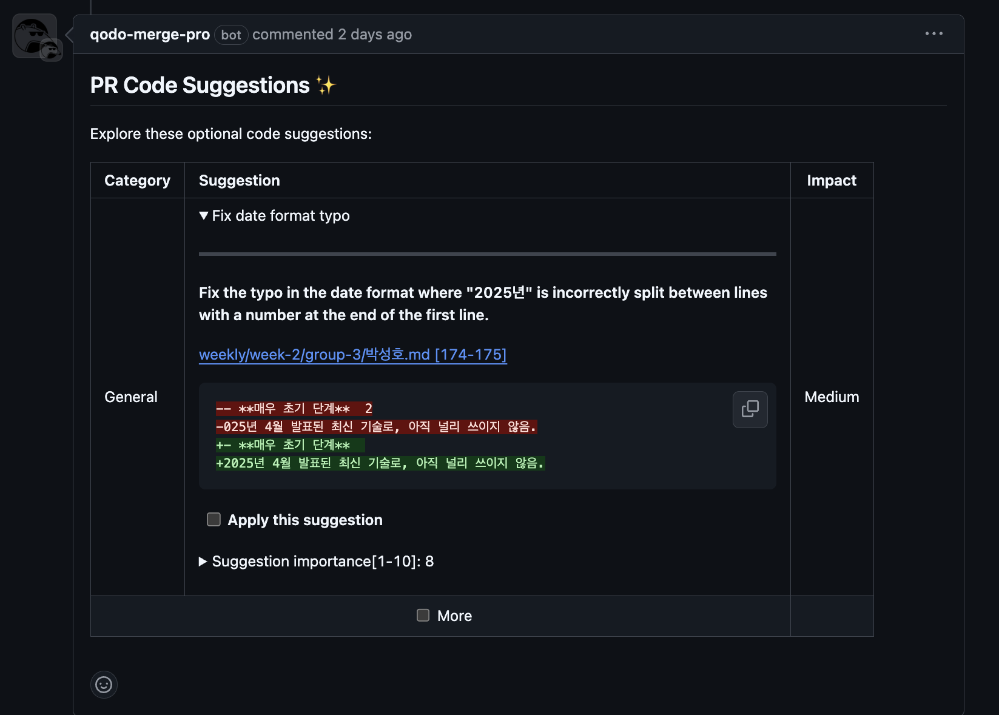
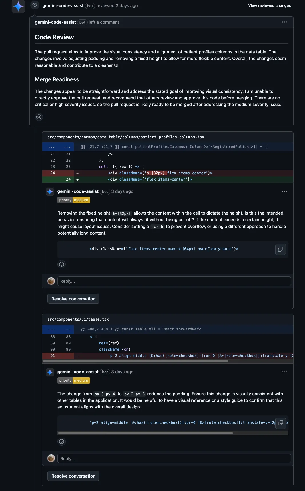
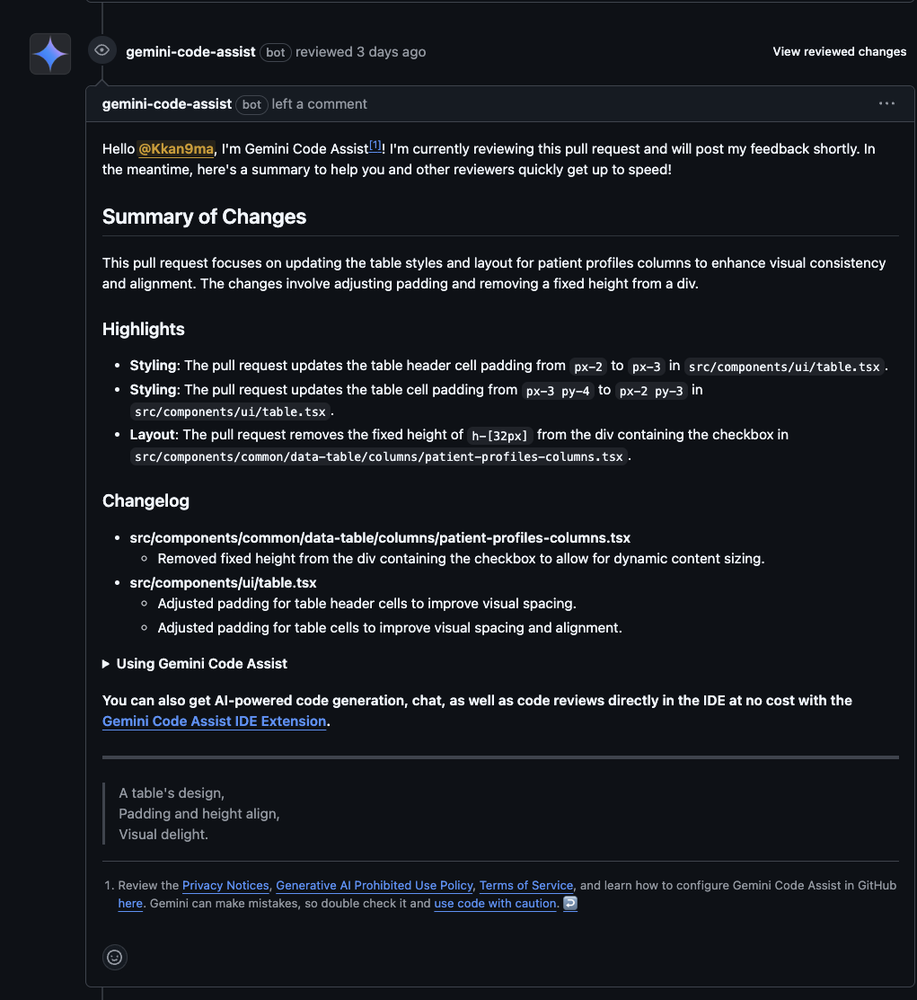
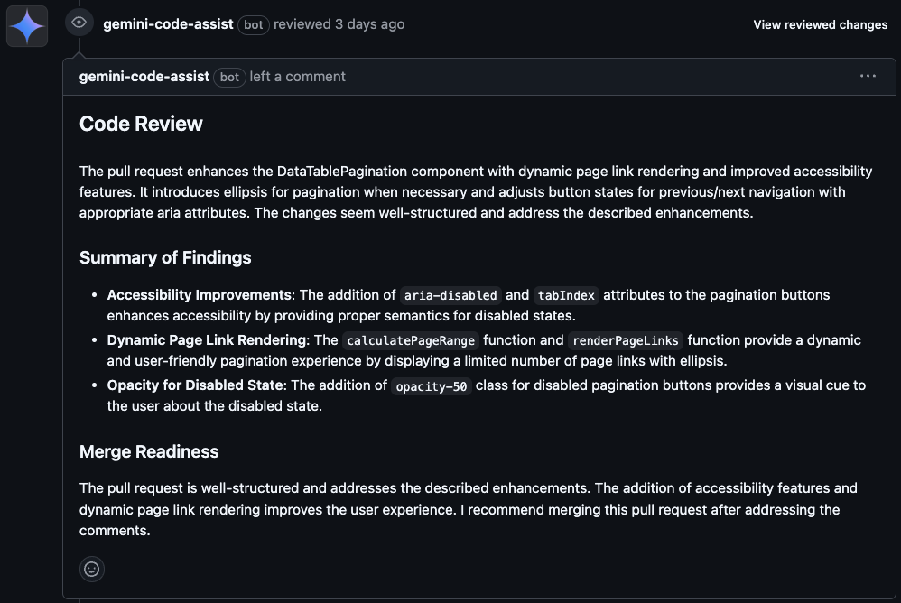
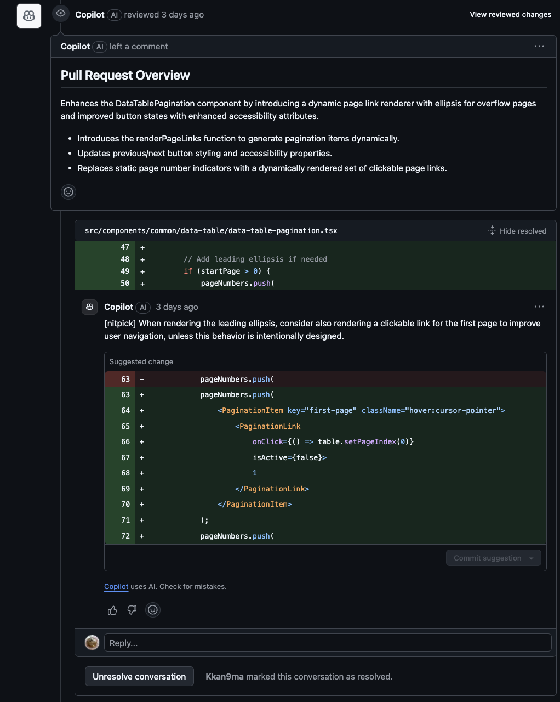
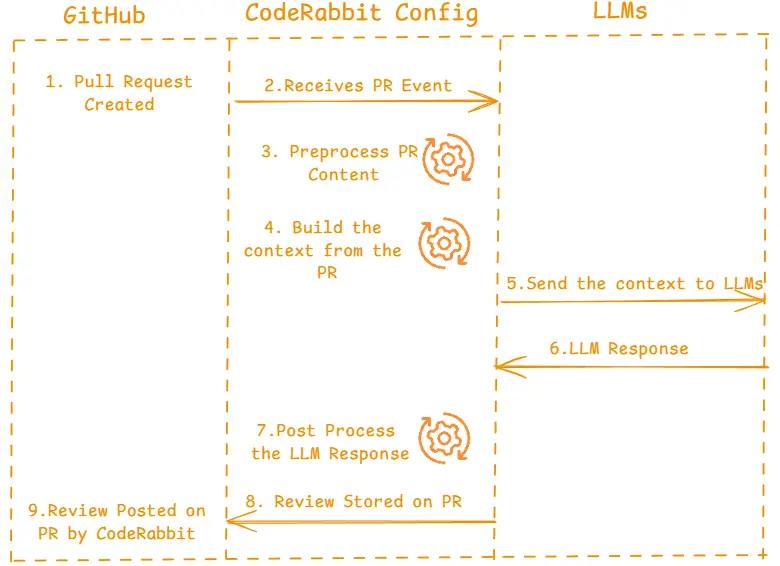

# **학습 목표**

- PR Agent의 아키텍처와 핵심 기능을 이해한다.
- 다양한 AI 코드리뷰 도구를 조사하여 PR Agent와의 차이점을 분석한다.
- AI 코드리뷰 도구의 장단점과 활용 방안을 비교하여 실무 적용 가능성을 탐색한다.

# **주요 활동**

- PR Agent의 플랫폼 구조 및 주요 기능 분석
- 유사 AI 코드리뷰 도구 조사
  - GitHub Copilot
  - Gemini Code Assist
  - CodeRabbit 등
- 도구 간 기능, 성능, 사용성 관점 비교 분석

# **학습 주제**

- PR Agent 아키텍처 및 주요 기능
- AI 코드리뷰의 현재 동향과 미래 전망
- 다양한 AI 코드리뷰 도구의 비교 분석

# PR Agent 아키텍처 및 주요 기능

## PR Agent란?

PR-Agent는 AI 피드백과 제안을 제공하여 풀 리퀘스트를 효율적으로 검토하고 처리하는 데 도움을 주는 것을 목표로 하는 오픈소스 소프트웨어 (https://github.com/qodo-ai/pr-agent)

## 아키텍처

### 요약

1. 요청 감지: 사용자가 PR 생성 또는 댓글 → PR 상태 감지, PR-Agent 서버에 요청
2. PR Agent: 요청 압축 및 분석
3. 프롬프트 생성: 분석한 정보를 기반으로 LLM에 입력할 프롬프트 생성
4. LLM에 전송 → 응답 수신 (자연어 등 다양한 형태)
5. 응답 게시

### 심화: PR Agent: 요청 압축 및 분석에 대한 자세한 내용

1. PR Agent는 요청을 압축할 때 아래 과정을 수행한다.
  * PR이 하나의 프롬프트로 처리할 만한지 체크
    - **레포 언어 우선순위화**
      - **비코드 파일 제외**: 이미지, PDF 등 바이너리 및 비코드 파일은 제외
      - **주요 언어 식별**: 레포에서 사용된 주요 프로그래밍 언어를 식별
      - **파일 정렬**: PR 파일을 가장 많이 사용된 언어 순으로 정렬
2. PR 처리
  * 작은 PR: 전체 내용을 단일 프롬프트에 포함시키고, 원 내용에 상하 문맥을 추가하여 LLM의 이해를 도움
  * 큰 PR 처리 방식
    * 핵심 정보 선별 작업: 정보량이 많아 LLM의 입력 제한 고려, 핵심 정보 선별함
      - **추가사항 우선**: 추가된 코드 변경사항을 우선적으로 포함
      - **삭제사항 정리**: 삭제된 파일은 `deleted files` 리스트로 통합하고, 삭제 전용 변경사항은 제외
    * 패치 적합화
      - **토큰화**: `tiktoken`을 사용하여 패치를 토큰화
      - **파일 정렬**: 각 언어 내에서 파일을 토큰 수 기준으로 내림차순 정렬
      - **프롬프트 구성**:
        1. 정렬된 순서대로 패치를 프롬프트에 추가
        2. 최대 토큰 길이에 도달하기 전까지 추가
        3. 남은 패치는 `other modified files`로 목록화하여 추가
        4. 여유가 있다면 `deleted files`를 추가

              

## 주요 기능
- 공통 기능: 새 PR 생성 시 자동으로 실행되도록 설정 가능

1. **PR 설명 `/describe`**
    - PR에 대한 설명(제목, 유형, 요약, 변경사항 설명 및 라벨)을 자동 생성
2. **PR 리뷰 `/review`**  
    - PR에 대한 피드백 목록을 생성하여 리뷰 과정을 돕습니다. 보안 문제, 리뷰 노력 등을 평가합니다.
3. **diff 코드 개선 `/improve`**
    - PR 코드를 개선하기 위한 의미 있는 제안을 자동으로 생성합니다.
4. **PR에 대해 질문하기 `/ask <question>`**
    - PR에 대한 질문에 답변합니다. PR 코드 변경사항을 기반으로, 텍스트 질문에 답변할 수 있습니다.
    - 특정 코드 라인에 대해 질문하거나 이미지에 대한 질문도 가능

* 설치
  - Qodo Merge**:** 가장 간편한 유료 호스팅 서비스 (앱 설치).
  - 자체 호스팅**:** 오픈소스 버전을 직접 서버에 배포 (LLM 키 관리 필요).
  - **기타:** CLI, GitHub Actions, Docker 등으로 활용 가능.

## 예시

- [박성호 멘티의 테스트 PR](https://github.com/ossca-2025/pr-agent-mentoring/pull/39)
  - 의도적으로 잘못된 내용이 적힌 PR을 업로드 → pr-agent가 제출된 pr에서 개선 방향 자동으로 제안

# AI 코드리뷰의 현재 동향과 미래 전망

## 문제 의식: 코드 리뷰는 소프트웨어 엔지니어링의 **병목** 지점

- PR 기반 협업은 분산 구조의 현대적 개발 과정에서 사실상 표준
- 코드 리뷰를 휴먼 리소스에 강하게 의존하는 경향 有
  → 변경 코드가 기존 코드베이스 내 어떤 시스템, 도메인에 영향을 주는지 파악이 어려움. (전역적 맥락 이해가 필수적)
  → 리뷰 지연(병목) → 릴리즈 지연
- 사람이 진행하다보니 리뷰자 간 역량 편차, 피로도, 몰이해 등으로 불안정

→ LLM 기반으로 PR 컨텍스트를 해석하고, 사람 수준의 리뷰, 요약, 코멘트 제안을 자동화

## 현황

### AI의 소프트웨어 개발 통합

AI는 소프트웨어 개발 프로세스 전반에 걸쳐 통합되고 있음. 특히, 코드 작성, 테스트, 리뷰 등의 단계에서 AI 도구가 활용되며, 이는 개발 효율성과 품질 향상에 기여

### 오픈소스 AI 도구의 활용 증가

보고서에 따르면, 전 세계적으로 AI를 도입한 기업 중 40% 이상이 오픈소스 AI 플랫폼과 도구를 활용. 이는 AI 기술에 대한 접근성을 높이고, 맞춤형 솔루션 개발을 촉진하여 코드리뷰 과정에서도 오픈소스 AI 도구의 활용이 증가하고 있음을 시사함 .[oss.kr](https://www.oss.kr/index.php/oss_guide/show/1a590eff-507b-4e9f-8c97-cf7c3d56c5d9?utm_source=chatgpt.com)

### 생성형 AI의 코드리뷰 지원

생성형 AI는 코드 생성뿐만 아니라 코드리뷰 과정에서도 지원 역할을 하고 있습니다. 예를 들어, OpenAI의 CriticGPT는 AI가 생성한 코드의 오류를 식별하고 수정하는 데 도움을 주어, 코드리뷰의 정확성과 효율성을 높이고 있음.

### 같이 살펴볼 점

1. **코드 품질:** 그러나 부정확한 코드 생성, 잘못된 리뷰 제안 등으로 오히려 품질을 저해할 위험도 있음
2. **개발자 생산성:** 도구의 정확도와 개발자의 숙련도에 따라 생산성 효과가 달라진다.
3. **기술부채 관리**
   - AI 도구는 기술부채를 조기에 인지하고 해소하는 데 긍정적 역할을 할 수 있으나, AI가 기존 기술부채를 재생산하거나 새로운 부채를 남길 위험도 있어, 인간 검증이 반드시 병행 필요
4. **코드 리뷰 자동화와 신뢰성**
   - 자동 리뷰 시스템은 일관성 있는 리뷰와 빠른 피드백을 제공해 신뢰를 얻고 있음.
   - 그러나 부정확한 제안은 신뢰를 떨어뜨릴 수 있으며, 설명력 있는 제안이 신뢰성 유지에 중요.
5. **코드 유지보수 지원:**
   - 일관된 스타일, 풍부한 주석, 테스트 생성 지원 등을 통해 유지보수성을 높인다.

- 결론: 효율성과 정확성을 높이는 데 큰 역할을 하고 있으나, 생성된 결과에 대한 피드백 등 새로운 문제도 함께 고려해야 함

# 다양한 AI 코드리뷰 도구의 비교 분석

## Copilot

- GPT 기반의 자연어 처리 기술을 활용해 실시간 코드 제안 및 완성을 지원함
- VS Code, JetBrains, Visual Studio 등 주요 IDE와 자연스럽게 통합되어 사용 가능함
- Pull Request(PR)나 코드 변경사항을 AI가 자동으로 검사하여 피드백 제공

### 특징

- IDE 통합 리뷰: [VS Code에서 코드 리뷰 지원](https://docs.github.com/en/copilot/using-github-copilot/code-review/using-copilot-code-review?tool=vscode)
  - 코드 선택하여 리뷰 (VS Code에서만 가능)
    
- 사용자 피드백
  - Copilot의 리뷰 코멘트에는 👍/👎 버튼이 있어 사용자가 해당 리뷰에 대한 만족도를 표시
  - 특히 “👎”를 누르면 추가로 피드백 이유를 입력하도록 유도하는데, 이를 통해 Copilot의 리뷰 품질을 개선하기 위한 데이터 수집
    

## Copilot: PR Agent와 비교

| **비교 항목**| **GitHub Copilot for PR**| **PR-Agent**                                                                              |
| ------------------------------------------------------------------------------------- | ---------------------------------------------------------------------------------------------------------------------------------------------------------------------------------------------------------------------------------------------------------------------------------------------------------------------------------------- | -------------------------------------------------------------------------------------------- |
|비교 항목 | GitHub Copilot for PR | PR-Agent|
|지원 플랫폼 | GitHub 전용 | 다양한 Git 플랫폼 지원 – GitHub, GitLab, Bitbucket, AWS CodeCommit 등 연동 가능|
|IDE 통합 | VS Code, Visual Studio, Neovim, JetBrains IDE 등 공식 확장으로 연동 가능 | 플러그인 제공 또는 CLI 도구, Docker로 사용 가능|
| AI 모델 | OpenAI GPT-4 기반 (Copilot 전용 튜닝 모델 사용). 품질 높은 최신 모델을 활용하나, 사용자는 모델을 선택하거나 제어 불가 | 다중 LLM 지원 (OpenAI GPT-4, Anthropic Claude, Llama2 등). 사용자 API 키나 자체 호스팅을 통해 모델 교체 및 업그레이드 가능|
| 사용자 커스터마이징 | 코딩 규칙 가이드라인 설정을 통한 일부 리뷰 기준 맞춤화 가능. 기타 AI 동작 방식은 GitHub이 일괄 제공/관리 | 오픈소스 기반으로 코드 수정 및 확장 가능. 조직별 포크, 명령 추가 등 고급 커스터마이징 지원|
| 설치, 사용 방법 | GitHub에 최적화. 설치 및 사용 방법이 간단하며, IDE 연동으로 개발 중 실시간 리뷰 가능 | 무료/오픈소스 제공. 다양한 플랫폼과 유연하게 통합 가능, `/describe`, `/ask` 등 여러 명령어로 세분화된 기능 제공, 유연한 활용. 모델 선택 및 자체 호스팅 등 사용자 제어권 큼, 초기 설정 및 설치가 까다로움

## Google Gemini Code Assistant

- Gemini 모델 기반, IDE와의 통합으로 코드 베이스 기반 동작 - assistant 기능 제공
- 최대 100만 토큰 컨텍스트 창으로 깊은 코드 이해 가능. Google Cloud 생태계와 깊은 통합 (Firebase 등).
- Github 통합으로 PR에도 활용 가능

| **`gemini summary`** | 변경사항 요약을 풀 요청에 게시합니다. |
| -------------------- | --------------------------------------------------- |
| **`/gemini review`** | 변경사항에 대한 코드 검토를 pull 요청에 게시합니다. |
| **`/gemini`** | 주석에서 Gemini Code Assist 수동 호출 |
| **`/gemini help`** | 사용 가능한 명령어 개요 |

### 예시: PR
| | |
|:---:|:---:|
|||
|||

## Gemini Code Assistant: PR Agent와 비교

### 공통점

| 항목                      | 설명                                                                         |
| ------------------------- | ---------------------------------------------------------------------------- |
| **AI 기반 코드 리뷰**     | 두 제품 모두 PR 또는 코드에 대해 자동으로 리뷰하거나 개선점을 제시할 수 있음 |
| **LLM 활용**              | GPT 또는 Gemini 모델을 기반으로 자연어 이해와 코드 분석 수행                 |
| **자동화 기능 제공**      | 반복적인 개발 작업 자동화 (예: 리뷰, 설명, 요약, 개선 제안 등)               |
| **사용자 입력 기반 생성** | 사용자의 자연어 요청 또는 코드 변경사항 기반으로 코드 작성 또는 피드백       |
|                           |                                                                              |

## 차이점

| 항목               | **PR-Agent**                           | **Gemini Code Assist**                      |
| ------------------ | -------------------------------------- | ------------------------------------------- |
| **초점 영역**      | GitHub/GitLab PR 자동화, 리뷰 및 설명  | IDE 통합, 실시간 코드 작성 + 리뷰 + 테스트  |
| **작동 환경**      | 서버 실행 + PR 이벤트 기반             | IDE 플러그인 + PR 이벤트                    |
| **설명 생성**      | 변경 요약, PR 설명 자동 생성           | 주석 추가, 코드 내 설명 가능                |
| **기반 모델 선택** | 여러 LLM 지원 (GPT, Claude, Ollama 등) | Gemini 전용 (Google AI)                     |
| 성능               | - 압축 전략 활용.                      | **Gemini 1.5 Pro 기반** – 1M 토큰 문맥 처리 |
| 기능               | - 개선 제안   - LLM 다중 지원   - 오픈소스 확장성 | - 실시간 코드 자동 완성   - 코드 리뷰 (자동/요청 기반)   - 테스트 코드 생성   |
  | 사용성 | 오픈소스 개발자 친화적. PR 워크플로우에 자연스럽게 통합.  | IDE 중심. **코딩+테스트+문서화**까지 실시간 지원   구글 제품에 친화적인 점 |

## Code Rabbit

### 특징
- 개발자의 PR(Pull Request)에 대해 몇 분 내로 맥락을 고려한 피드백을 제공.
  - GPT-4 기반의 PR 변경사항 요약 및 다이어그램 생성
- 코드 스타일 가이드 위반이나 오타 찾는 수준 + 복잡한 문제점이나 잠재적인 버그, 성능 개선 포인트까지 발견
  - 코드 리뷰: 버그, 최적화되지 않은 구현, 누락된 테스트 감지

### 주목할 만한 점: 맥락 이해 능력
- 변경된 코드가 시스템 전체에 어떤 영향을 미칠지, 아키텍처 관점에서는 어떤 의미가 있는지까지 분석
- but, 피드백이 때로는 과도하게 많아 노이즈가 될 수 있음

## Code Rabbit: PR Agent와 비교

|                   | **Qodo-Merge**                                     | **CodeRabbit**                         | **GitHub Copilot Code Review** |
| ----------------- | -------------------------------------------------- | -------------------------------------- | ------------------------------ |
| PR 요약           | 명령어 기반(`/describe`) 자동 생성                 | 다이어그램과 파일별 변경 테이블 포함   | 간결한 요약 중심, 적은 코멘트  |
| 명령어 인터페이스 | 15개 이상 명령어(`/review`, `/improve`, `/ask` 등) | 제한적 명령어                          | UI 기반 상호작용               |
| 시각화            | 제한적 지원                                        | PR 다이어그램 자동 생성                | GitHub 통합 시각화             |
| 테스트 생성       | 컴포넌트별 테스트 케이스 생성(`/test`)             | -                                      | -                              |
| 특화 영역         | 테스트 생성, PR 리뷰, 다양한 배포 옵션             | PR 시각화, 요약: 복잡한 PR 이해에 특화 | 코드 자동완성, 채팅            |
| 리뷰 스타일       | 상세한 피드백                                      | 상세한 피드백과 시각화                 | 간결한 요약, 중요 이슈만 지    |
|                   |                                                    |                                        |                                |
