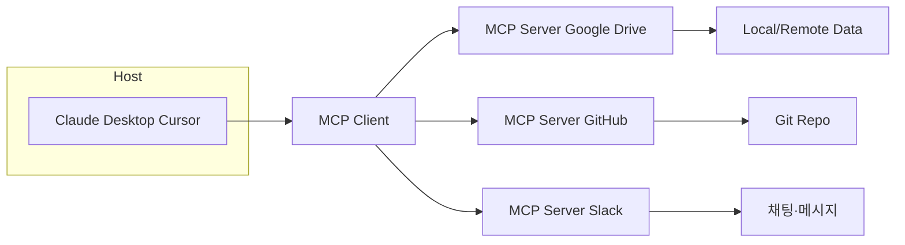
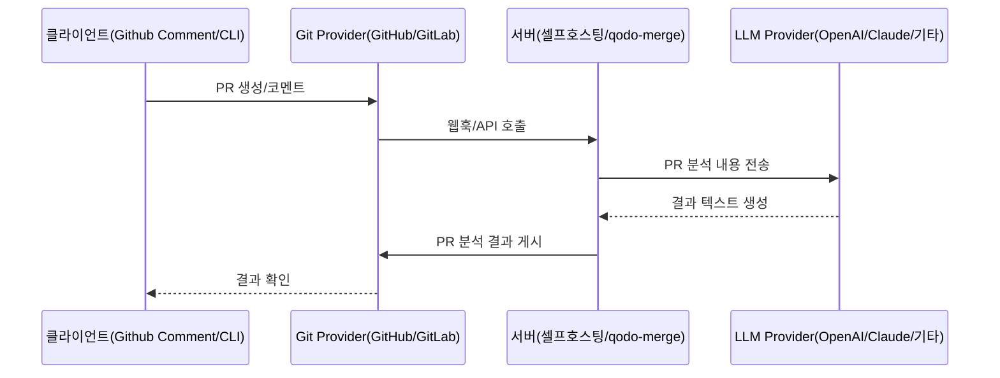

# 개인 학습

> RAG, MCP, A2A를 공부하고 정리합니다.

- MCP를 Narrative하게 서술하기로 결정

## MCP (Model Context Protocol)

AI가 나 대신 업무용 프로그램을 켜서 일해주는 상상은, MCP의 등장 이후 현실화되고 있습니다.

Agent의 생각에 문맥(Context)을 제공하는 과정은 한때 너무나도 복잡했습니다. 파일 시스템은 별도 API로, 코드 저장소는 또 다른 인터페이스로, 데이터베이스는 복잡한 설정을 통해서만 연결되었기 때문입니다. 이러한 연결 과정은 마치 매번 새로운 '커넥터'를 납땜하는 것과 같은 번거로움을 안겨주었습니다.

<image src="images/kangmoonseo-image-1.jpg" alt="MCP 도입 전 복잡한 에이전트 구조" style="width:60%">

이렇게, 분절된 구조는 확장성과 유지보수를 심각하게 방해하는 장애물이었습니다. 이런 문제점을 해결하기 위해 등장한 것이 바로 **모델 컨텍스트 프로토콜(MCP)** 입니다.

MCP는 AI 에이전트가 파일, 데이터베이스, API, 코드 리포지터리 등 모든 외부 컨텍스트를 하나의 표준 인터페이스로 다룰 수 있게 해주는 혁신적인 규격입니다. Anthropic은 MCP를 새로이 정의하면서, MCP를 **Agent를 위한 USB-C**라고 표현했습니다.

Anthropic은 왜 이런 표현을 사용했을까요?

---

## USB-C for Agent?

USB-C 하나로 충전, 데이터 전송, 영상 출력까지 모두 해결할 수 있듯이, MCP는 AI가 주변의 모든 리소스와 **Plug & Play** 방식으로 쉽게 연결될 수 있게 해줍니다.

그렇다면, USB-C는 어떤 장점이 있을까요? USB-C는 이전 세대 커넥터들과 달리 어느 방향으로든 꽂을 수 있는 편리함과 높은 전력 전송 능력으로 다양한 기기를 하나의 케이블로 통합했습니다. 이러한 혁신적 통합은 사용자 경험을 크게 향상시켰고, 바로 이 철학이 MCP에도 그대로 적용되었습니다.

<image src="images/kangmoonseo-image-2.jpg" alt="MCP 도입 후 단일 인터페이스 구조" style="width:60%">

MCP가 가져다주는 장점들은 다음과 같습니다:

- **단일 포트**는 매번 다른 커넥터를 개발할 필요성을 완전히 제거해줍니다.
- **양방향(Read/Write) 통신**은 AI가 데이터를 자유롭게 가져오고, 그 결과물을 다시 저장하거나 업데이트할 수 있게 해줍니다.
- **뛰어난 호환성**은 새로운 도구가 추가되더라도 MCP 규격만 준수한다면 즉시 연동이 가능하게 만들어줍니다.

이제 에이전트를 확장하기 위해 복잡한 소켓을 들여다볼 필요는 완전히 사라졌습니다. Agent와 Context 모두 MCP라는 하나의 인터페이스만 기억하면 되기 때문입니다.

## MCP 아키텍처

MCP는 효율적인 **클라이언트–서버 구조**로 정교하게 설계되었습니다.

이 구조의 각 요소들은 다음과 같습니다:

1. **MCP Host**는 여러 클라이언트 인스턴스를 위한 Container 역할을 하며, 생명주기와 보안 정책(권한, 사용자 인증, 동의 요구사항 시행 등)을 관리합니다. 예를 들어 Claude Desktop이나 Cursor와 같은 AI 애플리케이션이 호스트 역할을 할 수 있습니다.

2. **MCP Client**는 호스트 내부에서 실행되며 특정 MCP 서버와 1:1 세션을 상태 유지 연결(stateful connection)을 통해 설정합니다. 클라이언트는 기능 협상을 처리하고 자신과 서버 간의 메시지를 조율합니다.

3. **MCP Server**는 각종 외부 서비스(Google Drive, GitHub, Slack 등)를 MCP 규격으로 노출하여 모든 MCP 클라이언트가 표준화된 방식으로 사용할 수 있게 합니다.

이러한 아키텍처 덕분에 호스트는 MCP Client를 통해 다양한 MCP Server와 통신할 수 있는 유연성을 갖게 됩니다.

## MCP Client

**MCP Client**는 LLM 애플리케이션과 MCP Server 사이의 다리 역할을 합니다.

- **통신 관리**: 서버와의 1:1 연결을 유지하며 메시지 교환을 처리합니다
- **기능 발견**: 서버가 제공하는 도구, 리소스, 프롬프트 등의 기능을 발견합니다
- **데이터 요청 및 수신**: 서버로부터 데이터를 요청하고 받습니다
- **도구 실행**: LLM을 대신하여 도구를 실행합니다
- **오류 처리**: 연결 및 오류 처리를 관리합니다

대표적인 MCP Client는 아래와 같습니다.

1. **Cursor**  
   코드 에디터 내에서 MCP를 활용해 AI 기반 코드 어시스턴트를 강화하여 복잡한 작업을 자동화합니다.
2. **Claude Desktop**  
   MCP 클라이언트를 통해 외부 도구 및 데이터 소스와 통합할 수 있습니다.

## MCP Server

**MCP Server**는 외부 서비스 또는 로컬 리소스를 MCP 표준으로 래핑(wrapping)해 AI에게 기능을 제공합니다.

- **도구 제공**: 실행 가능한 함수(API 호출, 계산, 시스템 작업 등)를 노출합니다.
- **리소스 제공**: 파일, 데이터베이스 레코드, 실시간 시스템 데이터와 같은 데이터 소스를 노출합니다.
- **프롬프트 제공**: LLM 상호작용을 위한 사전 정의된 템플릿을 제공합니다.

대표적인 MCP Server는 아래와 같습니다.

1. **Google Drive MCP Server**
   - 드라이브 파일 검색·읽기·쓰기
2. **GitHub MCP Server**
   - 저장소 클론, 이슈·PR 조회 및 생성
3. **Slack MCP Server**
   - 채널 메시지 검색·전송, 파일 첨부

---

이제 AI 에이전트는 MCP Server만 호출하면, 각기 다른 API 문서를 뒤질 필요 없이 통일된 방식으로 작업을 수행합니다.

# 조별 과제

> PR-Agent의 아키텍처와 주요 기능을 조사하고 경쟁 제품과 비교합니다. AI 코드리뷰의 동향과 전망을 파악합니다.

## I. PR-Agent 아키텍처

### 통신 흐름

1. 사용자가 PR에 댓글을 달면 Git Provider가 webhook을 통해 PR-Agent 서버에 알립니다.
2. PR-Agent는 PR 정보를 가져와 분석한 후 LLM에 전송합니다.
3. LLM의 응답을 받아 댓글을 가공합니다.
4. Git 제공자에 PR에 댓글로 게시합니다.

흐름을 정리하면 다음과 같습니다.

### 서버: 셀프 호스팅

- 사용자가 직접 서버를 설치하고 관리하는 방식
- 자체 OpenAI API 키 또는 다른 LLM 제공업체 키 사용
- 호스팅 서버를 Docker 이미지로 제공
- 코드 데이터는 Qodo 서버로 전송되지 않고 사용자와 LLM 제공업체 간에만 공유됨

### 서버: qodo-merge

- `Qodo Inc.`에서 호스팅하는 PR-Agent의 관리형 유료 버전
- 설치, 호스팅, 모델, 정기 업데이트 등 모든 것을 `Qodo`에서 관리
- 개인정보 보호 정책을 사용한다고 주장함 (1. 데이터 저장 없음, 2. 모델 훈련에 사용하지 않음)
- GitHub Enterprise Server, GitLab, BitBucket 등 셀프호스팅 Git 서버 지원
- 셀프 호스팅과 동일하게 다양한 LLM 제공업체 선택 가능

### 클라이언트: 웹 플랫폼에서의 comment

- PR 웹페이지에 직접 명령어를 작성하여 도구 호출
  - e.g. `/review`, `/describe`
- PR이 열리거나 코드가 푸시될 때 자동으로 실행되는 도구 구성 가능
- 대화형 체크박스를 구성해 추가 기능을 트리거하는 구조

### 클라이언트: cli

- 로컬 저장소에서 cli 인터페이스를 통해 도구 실행
  - e.g. `python -m pr_agent.cli --pr_url=<pr_url> review`
- 매개변수를 구성해 웹 플랫폼 comment와 동일한 기능 호출
- 결과를 로컬로 출력하거나, 또는 PR 댓글로 게시할 수 있음

## II. PR-Agent의 주요 기능

### 1. PR 설명 `/describe`

- 기능: PR 코드 변경사항을 스캔하고 PR에 대한 설명(제목, 유형, 요약, 변경사항 설명 및 라벨)을 자동으로 생성합니다.
- 사용 방법: PR에 `/describe` 명령어를 댓글로 작성하거나, 새 PR이 열릴 때 자동으로 실행되도록 설정할 수 있습니다.

### 2. PR 리뷰 `/review`

- 기능: PR 코드 변경사항을 스캔하고 PR에 대한 피드백 목록을 생성하여 리뷰 과정을 돕습니다. 보안 문제, 리뷰 노력 등을 평가합니다.
- 사용 방법: PR에 `/review` 명령어를 댓글로 작성하거나, 새 PR이 열릴 때 자동으로 실행되도록 설정할 수 있습니다.

### 3. diff 코드 개선 `/improve`

- 기능: PR 코드 변경사항을 스캔하고 PR 코드를 개선하기 위한 의미 있는 제안을 자동으로 생성합니다.
- 사용 방법: PR에 `/improve` 명령어를 댓글로 작성하거나, 새 PR이 열릴 때 자동으로 실행되도록 설정할 수 있습니다.

### 4. PR에 대해 질문하기 `/ask <question>`

- 기능: PR에 대한 질문에 답변합니다. PR 코드 변경사항을 기반으로, 텍스트 질문에 답변할 수 있습니다.
- 사용 방법: PR에 `/ask <question>` 형식으로 댓글을 작성하여 사용합니다. 특정 코드 라인에 대해 질문하거나 이미지에 대한 질문도 가능하다고 합니다.

## III. CodeRabbit 리뷰

### 1. 기능

- PR 요약: GPT-4 기반의 PR 변경사항 요약 및 다이어그램 생성
- 코드 리뷰: 버그, 최적화되지 않은 구현, 누락된 테스트 감지
- 시각화 도구: PR을 다이어그램과 파일별 변경 개요 테이블로 시각화

### 2. 성능

- 리뷰어의 시간을 절약하고 PR 이해도를 높임
- 복잡한 PR에서 특히 유용한 요약 및 다이어그램 제공
- 피드백이 때로는 과도하게 많아 노이즈가 될 수 있음

### 3. 사용성

- GitHub 앱으로 원클릭 설치 가능
- 오픈소스 프로젝트 무료 정책이기 때문에, 오픈소스 유지관리자에게 특히 유용

## IV. PR-Agent vs CodeRabbit

### 공통점

- LLM 기반 분석: 모두 AI 기반 코드 리뷰 및 분석 제공
- GitHub 통합: PR 설명 생성 및 리뷰 자동화 지원
- 코드 품질 개선: 잠재적 문제 식별 및 개선 제안
- 2025년 기준 가격: 모두 월 $10-20 사이의 개발자당 요금 체계, 이미지 형태의 On-Prem 엔터프라이즈 구축 지원

### 눈에 띄는 차별점

- Qodo-Merge: 명령어 기반 인터페이스와 테스트 생성에 강점, 다양한 배포 옵션으로 보안 중시 기업에 적합
- CodeRabbit: PR 시각화와 요약 기능이 뛰어나며, 복잡한 PR 이해에 특화

### 기능에서의 차이점

> 차이점을 잘 보여주기에는 GitHub Copilot도 넣는 게 좋아보여 추가 조사했습니다.

|                   | Qodo-Merge                                         | CodeRabbit                           | GitHub Copilot Code Review    |
| ----------------- | -------------------------------------------------- | ------------------------------------ | ----------------------------- |
| PR 요약           | 명령어 기반(`/describe`) 자동 생성                 | 다이어그램과 파일별 변경 테이블 포함 | 간결한 요약 중심, 적은 코멘트 |
| 명령어 인터페이스 | 15개 이상 명령어(`/review`, `/improve`, `/ask` 등) | 제한적 명령어                        | UI 기반 상호작용              |
| 시각화            | 제한적 지원                                        | PR 다이어그램 자동 생성              | GitHub 통합 시각화            |
| 테스트 생성       | 컴포넌트별 테스트 케이스 생성(`/test`)             | -                                    | -                             |
| 특화 영역         | 테스트 생성, PR 리뷰                               | PR 시각화, 요약                      | 코드 자동완성, 채팅           |
| 리뷰 스타일       | 상세한 피드백                                      | 상세한 피드백과 시각화               | 간결한 요약, 중요 이슈만 지적 |

### 정책에서의 차이점

|                 | Qodo-Merge                                       | CodeRabbit                          | GitHub Copilot                                           |
| --------------- | ------------------------------------------------ | ----------------------------------- | -------------------------------------------------------- |
| 셀프호스팅 지원 | 완전 지원 (온프레미스, 에어갭, VPC)              | AWS MarketPlace 컨테이너 배포       | 미지원                                                   |
| 호스팅 옵션     | SaaS, 무료 버전 호스팅, 엔터프라이즈 셀프호스팅  | SaaS, 엔터프라이즈 셀프호스팅       | SaaS                                                     |
| 셀프호스팅 비용 | $45/User per month, 0명부터                      | $30/User per month, 500명부터       | -                                                        |
| 무료 플랜(기본) | Developer 티어(250 메시지)                       | Free 티어(PR 요약만)                | 개인 개발자용 기본 기능                                  |
| 무료 플랜(특별) | 오픈소스 프로젝트 지원                           | 오픈소스 프로젝트에 Pro 플랜 무료   | 학생 및 교육자 무료                                      |
| 가격 정책       | Developer($0), Teams($15/월), Enterprise($45/월) | Free($0), Lite($12/월), Pro($24/월) | Individual($10/월), Business($19/월), Enterprise($39/월) |
| 오픈소스 코어   | PR-Agent 코어 공개                               | 프로젝트 초안만 공개                | 미공개                                                   |
