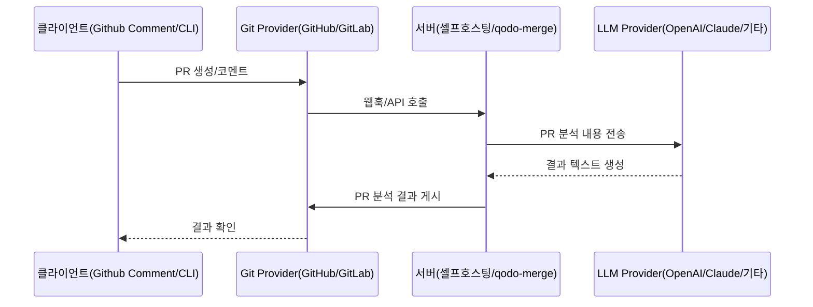

# 조별 과제

> PR-Agent의 아키텍처와 주요 기능을 조사하고 경쟁 제품과 비교합니다. AI 코드리뷰의 동향과 전망을 파악합니다.

## I. PR-Agent 아키텍처

### 통신 흐름

1. 사용자가 PR에 댓글을 달면 Git Provider가 webhook을 통해 PR-Agent 서버에 알립니다.
2. PR-Agent는 PR 정보를 가져와 분석한 후 LLM에 전송합니다.
3. LLM의 응답을 받아 댓글을 가공합니다.
4. Git 제공자에 PR에 댓글로 게시합니다.

흐름을 정리하면 다음과 같습니다.

### 서버: 셀프 호스팅

- 사용자가 직접 서버를 설치하고 관리하는 방식
- 자체 OpenAI API 키 또는 다른 LLM 제공업체 키 사용
- 호스팅 서버를 Docker 이미지로 제공
- 코드 데이터는 Qodo 서버로 전송되지 않고 사용자와 LLM 제공업체 간에만 공유됨

### 서버: qodo-merge

- `Qodo Inc.`에서 호스팅하는 PR-Agent의 관리형 유료 버전
- 설치, 호스팅, 모델, 정기 업데이트 등 모든 것을 `Qodo`에서 관리
- 개인정보 보호 정책을 사용한다고 주장함 (1. 데이터 저장 없음, 2. 모델 훈련에 사용하지 않음)
- GitHub Enterprise Server, GitLab, BitBucket 등 셀프호스팅 Git 서버 지원
- 셀프 호스팅과 동일하게 다양한 LLM 제공업체 선택 가능

### 클라이언트: 웹 플랫폼에서의 comment

- PR 웹페이지에 직접 명령어를 작성하여 도구 호출
  - e.g. `/review`, `/describe`
- PR이 열리거나 코드가 푸시될 때 자동으로 실행되는 도구 구성 가능
- 대화형 체크박스를 구성해 추가 기능을 트리거하는 구조

### 클라이언트: cli

- 로컬 저장소에서 cli 인터페이스를 통해 도구 실행
  - e.g. `python -m pr_agent.cli --pr_url=<pr_url> review`
- 매개변수를 구성해 웹 플랫폼 comment와 동일한 기능 호출
- 결과를 로컬로 출력하거나, 또는 PR 댓글로 게시할 수 있음

## II. PR-Agent의 주요 기능

### 1. PR 설명 `/describe`

- 기능: PR 코드 변경사항을 스캔하고 PR에 대한 설명(제목, 유형, 요약, 변경사항 설명 및 라벨)을 자동으로 생성합니다.
- 사용 방법: PR에 `/describe` 명령어를 댓글로 작성하거나, 새 PR이 열릴 때 자동으로 실행되도록 설정할 수 있습니다.

### 2. PR 리뷰 `/review`

- 기능: PR 코드 변경사항을 스캔하고 PR에 대한 피드백 목록을 생성하여 리뷰 과정을 돕습니다. 보안 문제, 리뷰 노력 등을 평가합니다.
- 사용 방법: PR에 `/review` 명령어를 댓글로 작성하거나, 새 PR이 열릴 때 자동으로 실행되도록 설정할 수 있습니다.

### 3. diff 코드 개선 `/improve`

- 기능: PR 코드 변경사항을 스캔하고 PR 코드를 개선하기 위한 의미 있는 제안을 자동으로 생성합니다.
- 사용 방법: PR에 `/improve` 명령어를 댓글로 작성하거나, 새 PR이 열릴 때 자동으로 실행되도록 설정할 수 있습니다.

### 4. PR에 대해 질문하기 `/ask <question>`

- 기능: PR에 대한 질문에 답변합니다. PR 코드 변경사항을 기반으로, 텍스트 질문에 답변할 수 있습니다.
- 사용 방법: PR에 `/ask <question>` 형식으로 댓글을 작성하여 사용합니다. 특정 코드 라인에 대해 질문하거나 이미지에 대한 질문도 가능하다고 합니다.

## CodeRabbit 리뷰

- 기능:
- 성능:
- 사용성:

### 공통점

### 차이점

# 개인 학습

> RAG, MCP, A2A를 공부하고 정리합니다.

## MCP란?

-

## MCP 아키텍처

-

## MCP Client

-

## MCP Server

-
