# [2주차 과제-2] 유사 AI 코드리뷰 도구 조사

1. GitHub Copilot
2. Gemini Code Assist
3. CodeRabbit

<br>

# 1. Github Copilot

## GitHub Copilot이란?

깃허브 코파일럿(GitHub Copilot)은 깃허브와 OpenAI가 코드의 자동 완성을 통해 비주얼 스튜디오 코드, 비주얼 스튜디오, Neovim, 젯브레인즈 통합 개발 환경(IDE)의 사용자들을 도울 수 있도록 개발한 클라우드 기반 인공지능 도구입니다. 2021년 6월 29일 깃허브에 의해 처음 발표되었습니다.

코드 작성을 더 빠르게 하고 적은 노력으로 완성할 수 있게 도와주는 AI 코딩 도우미이며, 개발자는 이를 통해 문제 해결과 협업에 더 많은 에너지를 집중할 수 있습니다.

깃허브 코파일럿은 인간과 유사한 텍스트를 생성하기 위해 딥 러닝을 사용하는 언어 모델인 GPT-3 의 수정된 프로덕션 버전인 Codex 를 기반으로 합니다. 코덱스 모델은 12가지 프로그래밍 언어로 된 기가바이트 규모의 소스 코드에 대해 추가로 훈련되었습니다.

25년 3월 27일 GPT 4o 모델도 출시되었습니다.

- [https://github.blog/changelog/2025-03-27-gpt-4o-copilot-your-new-code-completion-model-is-now-generally-available/](https://github.blog/changelog/2025-03-27-gpt-4o-copilot-your-new-code-completion-model-is-now-generally-available/)

## GitHub Copilot 을 활용하는 여러 방법

- IDE에서 타이핑하는 동안 코드 완성 제안 받기
- Copilot Chat을 통해 코드 섹션의 작동 방식 설명 요청
- 테스트 생성 및 실패한 테스트 수정 지원
- 다른 언어로 코드 마이그레이션
- 기존 코드 리팩토링
- 작업 중인 코드 설명
- Copilot Extensions를 사용하여 기술 스택의 다른 애플리케이션 및 도구와 함께 작업
- PR에서 변경 사항을 설명하는 문서 생성

### 코드 완성

지원되는 IDE(Visual Studio Code, Visual Studio, JetBrains IDE, Azure Data Studio, Xcode, Vim/Neovim, Eclipse)에서 자동 완성 스타일의 제안을 제공합니다. VS Code를 사용하는 경우, 다음 편집 제안 기능을 활용하여 다음에 할 가능성이 높은 편집 위치를 예측하고 완성 제안을 받을 수 있습니다.

뿐만 아니라, 주석을 통해 자연어로 코드를 작성할 수 있습니다.

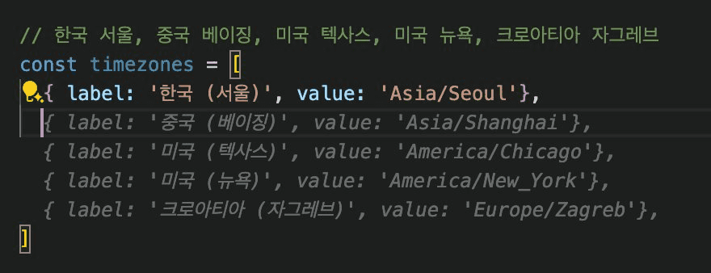

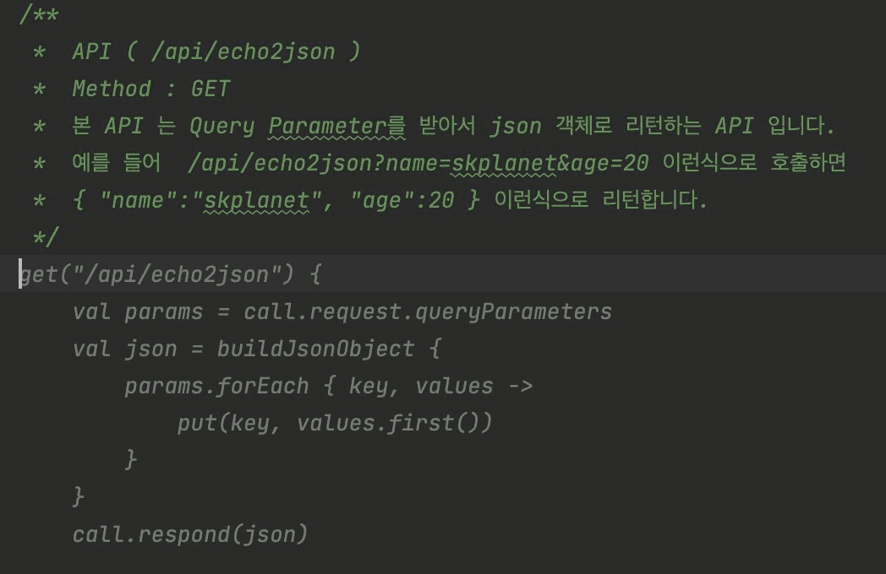

### Copilot Chat

코딩 관련 질문을 할 수 있는 채팅 인터페이스로, GitHub 웹사이트, GitHub 모바일, 지원되는 IDE(Visual Studio Code, Visual Studio, JetBrains IDE, Eclipse IDE, Xcode), Windows Terminal에서 사용할 수 있습니다. 

슬래시 명령어를 통해 Copilot Chat을 통해 특정 작업을 빠르게 수행하거나, 이미 작성된 코드를 리팩터링할 수 있습니다.

- `/explain`: 활성 에디터에서 코드 작동 방식 설명
- `/tests`: 선택한 코드에 대한 단위 테스트 생성
- `/fixTestFailure`: 실패한 테스트 찾기 및 수정
- `/fix`: 선택한 코드의 일반적인 문제 찾기 및 수정
- `/doc`: 관련 문서 작성

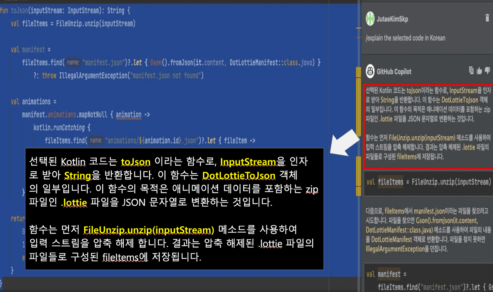

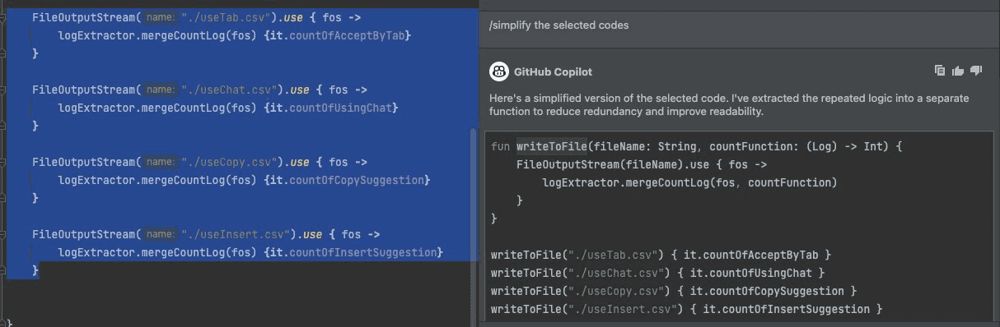

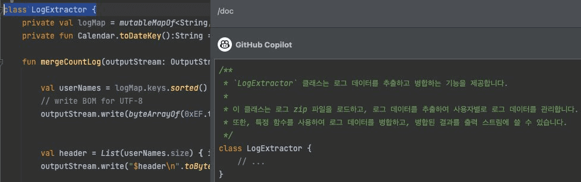

### GitHub Copilot 코드 리뷰

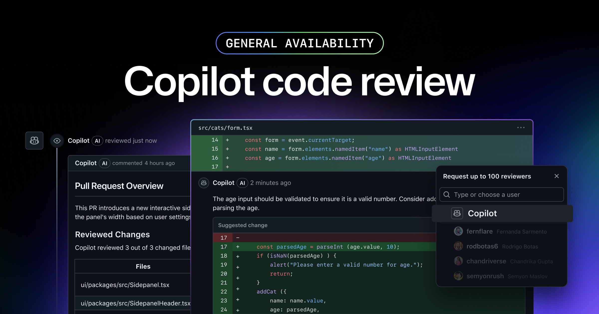

2025년 4월 4일 Github 블로그에 올라온 아티클을 보면, 더 나은 코드 작성을 돕기 위한 AI 생성 코드 리뷰 제안을 제공할 수 있다고 합니다.

- [https://github.blog/changelog/2025-04-04-copilot-code-review-now-generally-available/](https://github.blog/changelog/2025-04-04-copilot-code-review-now-generally-available/)
- [https://docs.github.com/ko/copilot/using-github-copilot/code-review/configuring-automatic-code-review-by-copilot](https://docs.github.com/ko/copilot/using-github-copilot/code-review/configuring-automatic-code-review-by-copilot)

### CLI에서의 Copilot

터미널에서 명령줄에 대한 질문을 할 수 있는 채팅형 인터페이스입니다. **GitHub Copilot for CLI** 을 다운받아서 사용할 수 있으며, 자연어로 커맨드 제안이나 커맨드에 대한 설명을 Copilot에게 요청할 수 있습니다. 

## GitHub Copilot 무료 버전에 포함된 기능


## Github Copilot 의 장점과 한계점

### GitHub Copilot의 강점

- 반복적인 코드 작성 및 테스트 자동화
- 구문 오류 수정 및 디버깅 지원
- 다양한 프로그래밍 언어와 프레임워크 지원
- 코드 최적화 및 품질 개선 제안
- 주요 IDE와의 원활한 통합

### GitHub Copilot의 한계

- 과도한 의존 시 문제 해결 능력 저하 우려
- 제안된 코드의 일관성 및 품질 편차
- 프로젝트 전체 맥락 이해 부족
- 저작권 및 지적 재산권 관련 불확실성
- 개인정보 보호 관련 위험성

## Github Copilot 의 효율적인 활용 방안

### 1. 알맞은 기능을 선택하기

- 코드 자동완성: 단순 반복 작업, 변수명, 함수 구현
- Copilot Chat: 코드 설명, 대규모 코드 생성, 리팩토링

### 2. 프롬프트 작성 전략 세우기

- 복잡한 작업의 단계별 분해
- 명확한 요구사항 명시
- 구체적인 입출력 예시 제공
- 코딩 표준 준수

### 3. 코드 검증 절차 가지기

- 제안된 코드의 철저한 검토
- 보안성 및 유지보수성 평가
- 자동화된 테스트 도구 활용
- 코드 스캐닝 및 품질 검사 수행

---
<br>
<br>

# 2. Gemini Code Assist
> [Gemini Code Assist | AI coding assistant](https://codeassist.google/#available-in-your-favorite-ides-and-platforms)

## 1. Gemini Code Assist

- **Gemini Code Assist:** Google에서 개발한 AI 코딩 어시스턴트이다. 개발자가 IDE 환경에서 자연어로 Gemini와 대화하며 코드 생성, 자동 완성, 리팩토링, 리뷰 등의 작업을 수행할 수 있도록 지원한다.
- **주요 이력**
    - 2024년 10월: Standard 및 Enterprise 에디션 출시
    - **2025년 2월: 개인 개발자를 위한 무료 버전 공개**
        - 개인용 무료 버전 - **코드 요청 최대 6,000건**, **채팅 요청 하루 240회**까지 지원, 실질적인 개발에 충분한 사용량.
    - 2025년 4월 기준 버전: v2.31.0
        - 개인용 채팅 기반 기능: Gemini 2.5 모델 적용
        - 도구(tool) 기반 기능: Gemini 2.0의 코드 최적화 버전 모델 적용
- **핵심 기능**
    - **코딩 생산성 향상**
        - 자동 코드 생성 및 완성: 함수 단위 또는 전체 파일 수준에서 코드 생성 가능
        - 실시간 코드 추천: 주석이나 자연어 기반으로 코드 블록 자동 생성
        - 디버깅 지원: 작성 중 오류 감지 및 수정 제안
    - **코드 리뷰 자동화**
        - GitHub Pull Request 리뷰 자동 수행: 버그, 스타일 감지 및 수정 제안
        - `/gemini` 주석 사용 가능 → `/gemini review`로 자동 리뷰 실행
        - 반복적 리뷰 작업 감소 → 핵심 로직 개발에 집중 가능
    - **대규모 컨텍스트 기반 응답**
        - 100만 토큰 규모 컨텍스트 창으로 대규모 코드베이스에 대해 정확한 응답 제공
        - Enterprise Edition의 경우 내부 저장소 연결로 맞춤형 추천 지원
- **요금제별 비교 (개인용 / Standard / Enterprise)**
    | 기능 항목 | 개인용 (무료) | Standard | Enterprise |
    | --- | --- | --- | --- |
    | **비용** | 무료 | 월 $19 (연간 약정) / $22.80(무약정) | 월 $45 (연간 약정) / $54(무약정) |
    | 코드 생성 및 자동 완성 | ✅ IDE 내 지원 | ✅ 고급 기능 포함 | ✅ 고급 기능 포함 |
    | 대화형 비서 (Chat) | ✅ 열린 파일 컨텍스트 기반 | ✅ 조직 수준 커스터마이징 가능 | ✅ 조직 수준 커스터마이징 + 확장 |
    | 스마트 액션 (우클릭 명령 등) | ✅ 일부 IDE에서 지원 | ✅ 전 IDE 정식 지원 | ✅ 전 IDE 정식 지원 |
    | 스마트 명령 (/ 또는 @ 기능) | ✅ `/`, `@GitHub` 등 사용 가능 | ✅ 도구 통합 기능 확장 | ✅ 도구 통합 기능 확장 |
    | 코드 출처 인용 | ✅ 제공 | ✅ 제공 + IP 면책 보장 | ✅ 제공 + IP 면책 보장 |
    | VPC-SC / Private Google Access | ❌ 미지원 | ❌ 미지원 | ✅ 기업 보안 환경 통합 지원 |
    | 조직 코드 기반 커스터마이징 | ❌ 미지원 | ✅ GitHub 연동 | ✅ GitHub, GitLab, Bitbucket 연동 |
    | Firebase, Apigee, BigQuery 연동 기능 | 일부 기능 제공 | ✅ 주요 서비스 통합 지원 | ✅ 전 영역 통합 지원 |

---

## **2. Gemini Code Assist 사용하기**

**1) 코드 생성 및 설명**

- 파일 열기 → Gemini 창에서 `Explain this code` 입력
- 특정 파일 또는 블록 지정 시 `@파일명`으로 컨텍스트 설정 가능
- `/generate`, `/fix` 등의 명령어로 코드 생성 및 변환 가능

**2) 코드 자동 완성**

- 코드 작성 중 **고스트 텍스트 형식의 인라인 추천** 제공
    - `Tab`으로 수락, `Esc` 또는 직접 입력으로 무시 가능
    - 자동 추천은 설정에서 비활성화 가능

**3) 스마트 작업**

- 코드 블록 선택 시 전구 아이콘 클릭 → 관련 AI 작업 실행 (예: 에러 해결, 단위 테스트 생성)

**4) 코드 변환 및 수정**

- 오류 있는 줄 위에서 `/fix` 명령어로 빠른 수정 요청
- 변경 전후 비교 뷰 제공 → 변경사항 확인 후 수락 가능

**5) 사용자 데이터 처리 및 보안**

- 개인용/Enterprise 모두 프롬프트와 응답은 Gemini 모델 학습에 사용되지 않음
- 일부 기능에 한해 제품 개선 목적 익명 데이터 수집 가능
- `.aiexclude` 파일을 통해 분석에서 제외할 경로 지정 가능

**6) 기타 설정 및 제어 기능**

- 인용 출처 포함된 코드 추천 비활성화 가능: → 설정에서 `Recitation: Max Cited Length = 0`
- 채팅 기록 초기화, 단축키 변경, 프록시 설정 등 세부 설정 가능

**+) 지원 언어**

- 프롬프트 입력 지원 자연어: 38개 언어
- 공식 테스트 완료 코딩 언어: Bash, C, C++, C#, Dart, Go, GoogleSQL, Java, JavaScript, Kotlin, Lua, MatLab, PHP, Python, R, Ruby, Rust, Scala, SQL, Swift, TypeScript, YAML

**+) 지원 환경 및 연동 시스템**

- 기본 사용 가능 개발 환경: Cloud Shell, Cloud Workstations
- 확장 지원 IDE: VS Code, IntelliJ IDEA, CLion, GoLand, DataGrip, PhpStorm, PyCharm, Rider, RubyMine, WebStorm
- 지원되는 코드 인프라 인터페이스: Google Cloud CLI, Kubernetes Resource Model (KRM)
- Google Cloud 서비스 연동:  Clouder Shell Editor, Firebase, BigQuery, Apigee 등과 통합 사용 가능. (특히 Firebase에서는 자연어 기반 코드 생성, 채팅 인터페이스, 앱 오류 및 성능 분석 등 전체 개발 워크플로우를 AI로 지원)

---

## 3. Gemini Code Assist 사용 경험 보고 (VS Code)

> 참고: VS Code에서는 질의 내역이 저장되지 않는다.

**1. 설치 및 환경 설정**

VS Code의 Extension Marketplace에서 Gemini Code Assist를 설치하고, 좌측 패널에서 Gemini 탭 선택 후 로그인하여 채팅을 활성화하였다. 해당 창을 통해 코드 생성, 오류 수정, 설명 요청이 가능했고, 프로젝트 초기 세팅에도 도움을 받을 수 있었다.

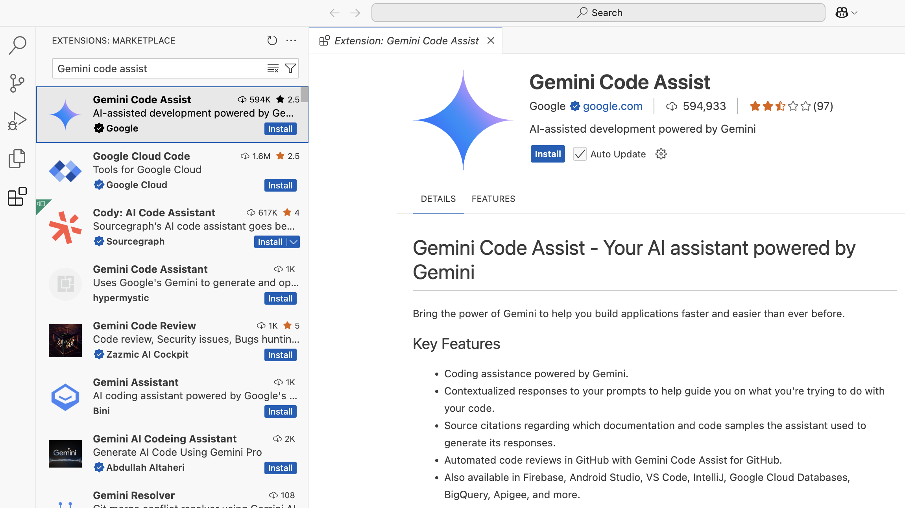
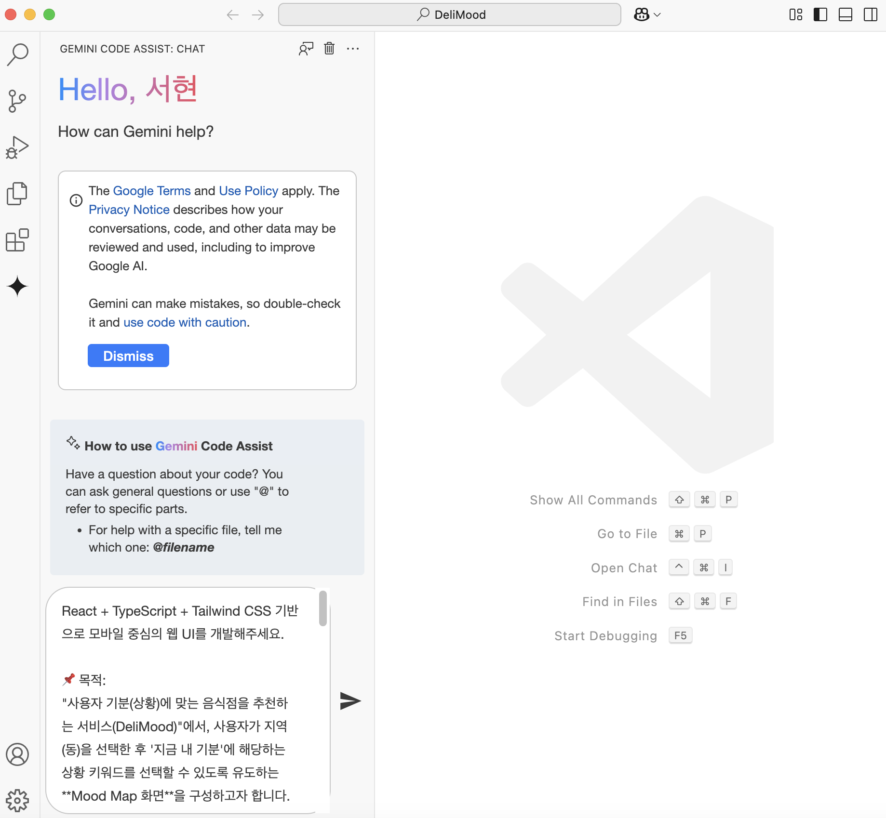
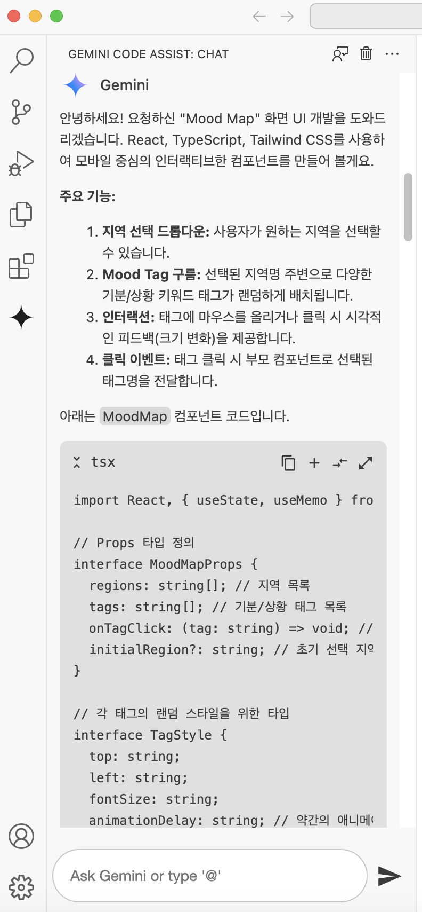
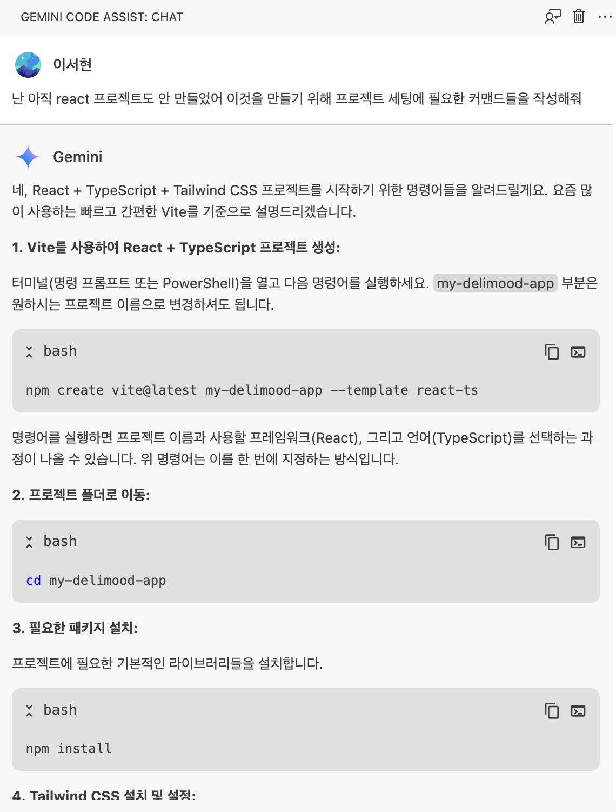
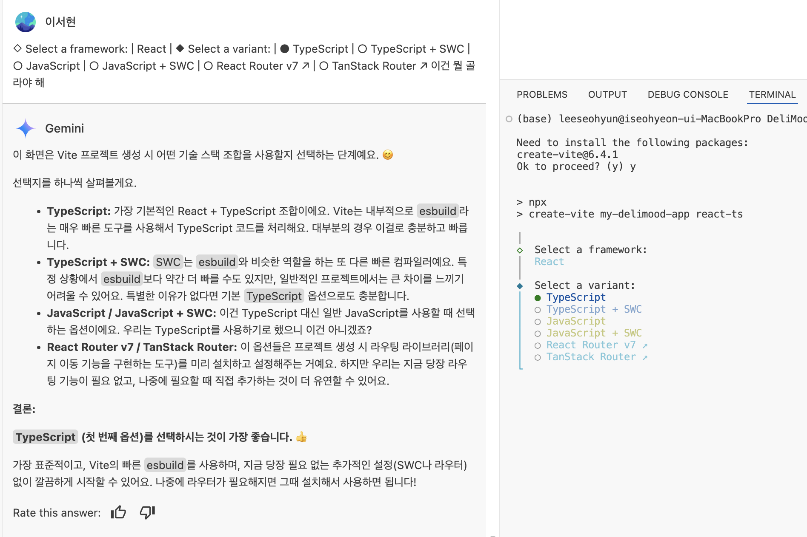

**2. 실시간 코드 지원**

코드 위에서 Gemini에 즉시 설명을 요청하거나 에러 해결을 요청할 수 있었고, 자연어 입력을 통해 코드 생성, 유닛 테스트 생성 등의 작업도 수행할 수 있었다.

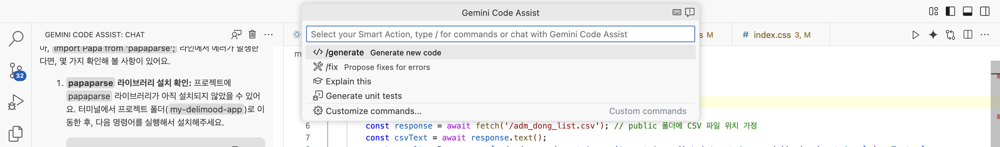

중간 디자인 및 최종 레이아웃을 구성하는 과정에서도 Gemini로부터 Tailwind CSS 기반 컴포넌트 생성 및 레이아웃 설계에 대한 도움을 받았으며, 에러가 발생했을 때에도 일부 요소는 추가 재질문을 통해 원하는 형태로 개선할 수 있었다.

라이센스 경고도 표시했다.

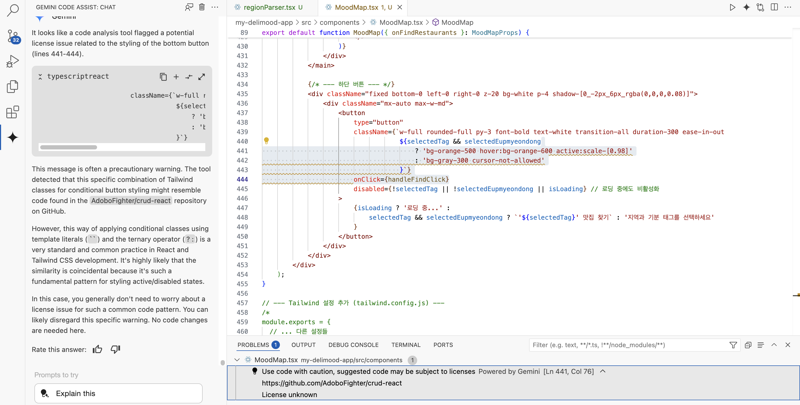

Gemini와 함께 만든 웹사이트 결과물

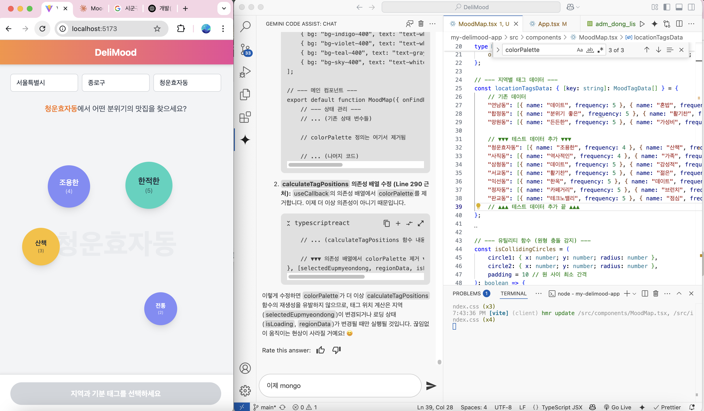

## 4. 한계 및 개선 필요 사항

- 최신 개발 환경에서 발생하는 기술적 이슈 해결 능력은 다소 제한적이었다 에러를 해결하지 못해 개발블로그를 검색해 해결했다.
- import 경로, 패키지 버전 문제 해결을 해결하지 못하는 경우가 있었다.
- 대화형 문맥이 누적되면서 과거의 질문이 현재 응답에 영향을 끼쳐 상관없는 답변을 하는 경우가 있었다.
    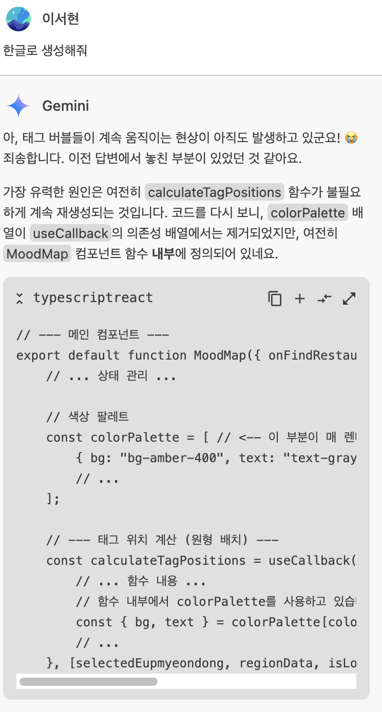


# 5. PR 메시지 생성 및 리뷰 받기

- 생성한 PR을 리뷰받기 위해서는 깃허브 연동이 필요했다.
    

- 진행 상황 요약을 부탁한 뒤 한국어로 PR 메시지 생성을 부탁했더니 생성했다.
    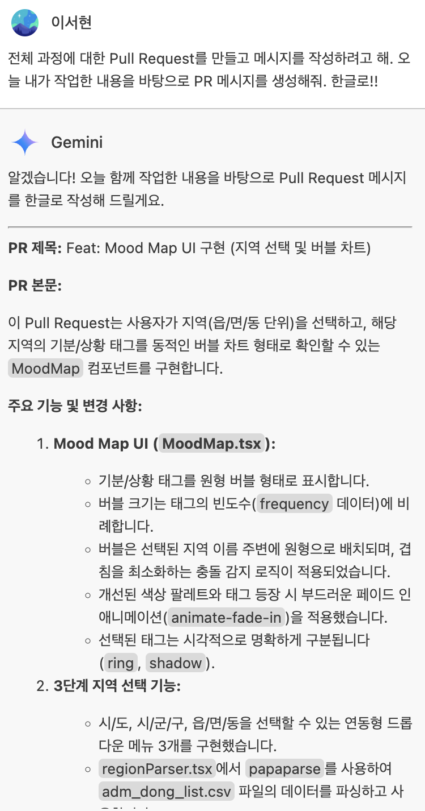
    
- 문제점: 말투가 중간에 바뀌고, chat 내용을 바탕으로 생성했더니 gemini와 대화하지 않고 수동으로 수정한 부분 등이 적용되지 않아 잘못된 내용이 포함되었다.

    ```
    ## 1. 주요 기능 및 변경 사항

    ### 1.1 Mood Map UI (MoodMap.tsx)

    1. 기분/상황 태그를 원형 버블 형태로 표시합니다.  
    2. 버블 크기는 태그의 빈도수(frequency 데이터)에 비례합니다.  
    3. 버블은 선택된 지역 이름 주변에 원형으로 배치되며, 겹침을 최소화하는 충돌 감지 로직이 적용되었습니다.  
    4. 개선된 색상 팔레트와 태그 등장 시 부드러운 페이드 인 애니메이션(animate-fade-in)을 적용했습니다.  
    5. 선택된 태그는 시각적으로 명확하게 구분됩니다 (ring, shadow).  

    ### 1.2 3단계 지역 선택 기능

    1. 시/도, 시/군/구, 읍/면/동을 선택할 수 있는 연동형 드롭다운 메뉴 3개를 구현했습니다.  
    2. regionParser.tsx에서 papaparse를 사용하여 adm_dong_list.csv 파일의 데이터를 파싱하고 사용합니다.  
    3. 지역 데이터 로딩 상태를 관리하고 UI에 표시합니다.  
    4. 상위 지역 선택에 따라 하위 드롭다운 목록이 동적으로 업데이트됩니다.  

    ### 1.3 컴포넌트 구조 및 로직

    1. MoodTag 하위 컴포넌트를 생성하고 React.memo를 적용하여 최적화했습니다.  
    2. calculateTagPositions 함수에 useCallback을 사용하여 불필요한 재생성을 방지했습니다.  
    3. 지역 선택, 태그 선택, 태그 위치, 로딩 상태 등을 관리하는 상태 로직을 구현했습니다.  
    4. 데이터 로딩, 드롭다운 목록 업데이트, 태그 위치 계산(지역 변경 및 리사이즈 시)을 위한 useEffect 훅을 사용했습니다.  

    ### 1.4 UI/UX 개선

    1. 헤더에 그라데이션 배경을 적용했습니다.  
    2. 모바일 뷰에 맞춰 레이아웃을 개선했습니다 (상단 헤더 고정, 하단 버튼 고정).  
    3. 안내 문구와 간격을 조정하여 가독성을 높였습니다.  
    4. 하단에 "맛집 찾기" 버튼을 추가했으며, 지역(읍/면/동)과 태그가 모두 선택되었을 때만 활성화됩니다.  
    5. 데이터 로딩 중 스피너와 텍스트를 표시합니다.  

    ### 1.5 해결된 트러블슈팅 및 버그 수정

    1. 초기 설정 시 Tailwind CSS 초기화 오류 해결 (특정 버전 명시 필요).  
    2. JSX 플레이스홀더 주석으로 인한 구문 오류 수정.  
    3. papaparse 라이브러리 및 타입 정의 설치를 통해 import 오류 해결.  
    4. 지역 선택 드롭다운의 연동 로직 디버깅 및 수정 (목록 업데이트 및 선택 초기화 문제 해결).  
    5. 태그 위치 계산 시 불필요한 딜레이 제거하여 반응성 개선.  
    6. 드롭다운 포커스 및 태그 선택 시 발생하던 시각적 움직임(떨림) 현상 수정 (스타일 조정).  
    7. 핵심 버그 수정: colorPalette 배열 정의를 컴포넌트 함수 외부로 이동하여, useCallback 함수가 불필요하게 재생성되고 태그가 계속 움직이던 문제 해결.  

    ### 1.6 추후 개선 사항

    1. 하드코딩된 locationTagsData를 선택된 지역 기반으로 API에서 가져오는 로직으로 대체.  
    2. onFindRestaurants prop을 통해 실제 맛집 검색 로직 구현.  
    3. 태그 밀도가 높을 경우를 대비하여 태그 배치 알고리즘 추가 최적화.  

    ```

- 그래서 채팅 삭제 후, 단순히 작업한 파일들에 대해서 리뷰를 부탁했다.

    ```
    ## PR 제목: feat: DeliMood 프로젝트 초기 설정 및 MoodMap 구현

    ## 설명

    안녕하세요! DeliMood 프로젝트의 초기 설정을 완료하고 핵심 기능인 `MoodMap` 컴포넌트를 구현하여 PR을 생성합니다.

    이 PR은 DeliMood 애플리케이션의 기반을 마련하며, 사용자가 지역(읍/면/동)을 선택하고 해당 지역의 분위기 태그를 시각적으로 탐색할 수 있는 기능을 제공합니다.

    ## 주요 변경 사항

    *   **프로젝트 구조 설정:** 기본적인 React + TypeScript 프로젝트 구조를 설정했습니다.
    *   **지역 데이터 처리:**
        *   `regionParser.ts` 유틸리티를 통해 CSV 파일로부터 행정구역 데이터를 로드하고 파싱하는 기능을 구현했습니다. (`fetchAndParseCsv`)
        *   파싱된 데이터를 기반으로 시/도, 시/군/구, 읍/면/동 선택 드롭다운 메뉴를 구현했습니다.
    *   **`MoodMap` 컴포넌트 구현:**
        *   선택된 읍/면/동에 해당하는 분위기 태그 데이터를 기반으로 동적 버블 UI를 생성합니다.
        *   태그 빈도수에 따라 버블 크기를 조절합니다.
        *   버블 간 충돌을 감지하고 회피하여 배치하는 알고리즘을 적용했습니다. (`isCollidingCircles`, `calculateTagPositions`)
        *   중앙에 선택된 지역명을 표시하고, 태그 버블은 그 주변에 원형으로 배치됩니다.
        *   사용자가 태그 버블을 클릭하여 선택/해제할 수 있습니다. (`MoodTag` 컴포넌트)
        *   선택된 지역과 태그를 기반으로 맛집 찾기 기능을 호출할 수 있는 버튼을 추가했습니다. (`onFindRestaurants` prop 연동)
        *   데이터 로딩 상태 및 지역/태그 미선택 시 사용자 안내 메시지를 표시합니다.
        *   Tailwind CSS를 사용한 기본 스타일링 및 `fade-in` 애니메이션을 적용했습니다.
    *   **테스트 데이터 추가:** 원활한 기능 테스트를 위해 `locationTagsData`에 여러 지역의 테스트용 태그 데이터를 추가했습니다.

    ## 추후 계획

    *   실제 맛집 데이터 연동 및 검색 기능 구현
    *   API 연동을 통한 동적 태그 데이터 로딩
    *   UI/UX 개선 및 반응형 디자인 강화
    *   테스트 코드 작성

    ## 참고 사항

    *   현재 `onFindRestaurants` 함수는 콘솔 로그만 출력하며, 실제 검색 로직은 추후 구현될 예정입니다.
    *   지역 데이터는 `/src/utils/regionParser.ts` 경로의 `fetchAndParseCsv` 함수를 통해 로드됩니다. (필요시 경로 확인)
    *   Tailwind CSS 커스텀 애니메이션 설정이 필요합니다. (`tailwind.config.js` 참고)

    리뷰 부탁드립니다! 😊
    ```

- Gemini가 생성한 PR 메시지에서 어색한 부분을 수정하여 PR을 올렸다.
    
     [https://github.com/DE-Project1/DeliMood/pull/1#event-17352066939](https://github.com/DE-Project1/DeliMood/pull/1#event-17352066939)

    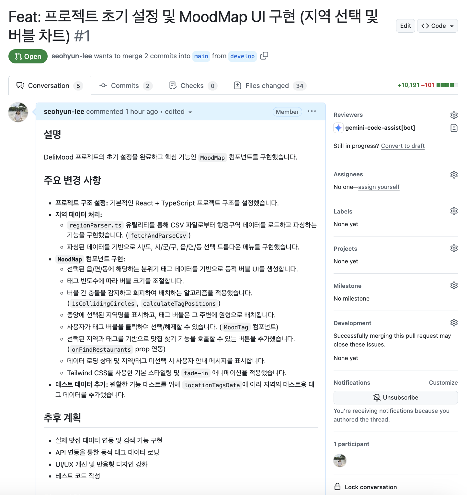

- PR 코멘트에 `/gemini review` 명령어를 입력하니 Gemini가 코드 리뷰를 수행했고, 리뷰어 목록에도 자동 등록되었다.

    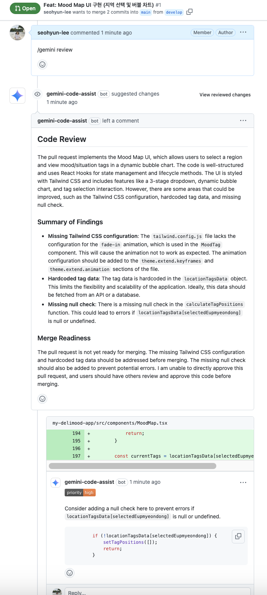

    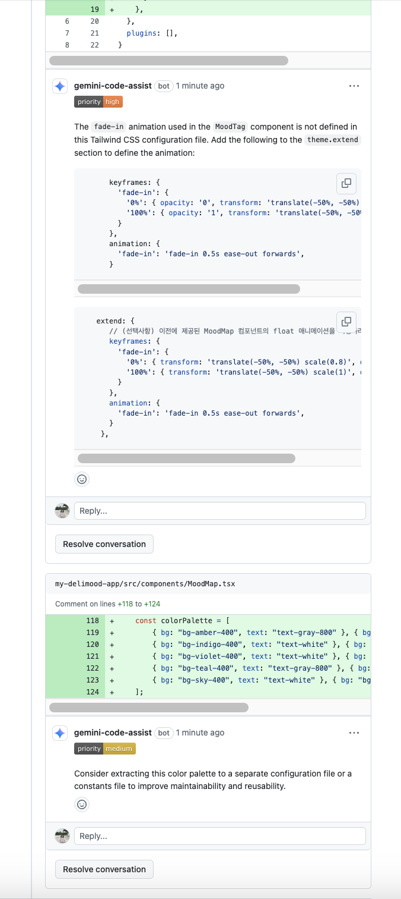

<br>

# 3. CodeRabbit

## CodeRabbit이란?

CodeRabbit은 Pull Request의 코드 변경사항을 자동으로 분석하고 코드 리뷰를 도와주는 AI 어시스턴트입니다.

개발자는 코드래빗과 상호작용하며 추가 컨텍스트를 제공하거나 대화를 통해 맞춤형 코드 추천을 받을 수 있습니다.

## 지원 플랫폼

- GitHub
- GitLab
- Azure DevOps
- Bitbucket
- 기타 다양한 개발 플랫폼

## 보안

- **기본 작동 방식**: 코드 리뷰 과정에서만 메모리에 임시로 코드를 저장하고 리뷰 완료 후 파기합니다.
- **데이터 저장**: 채팅 대화와 워크플로우(GitHub, GitLab, Jira 등) 정보는 저장하여 추후 컨텍스트로 활용합니다.
- **저장 제한 옵션**: 데이터 저장을 비활성화하는 옵션이 있으나, 이 경우 리뷰 품질이 낮아질 수 있습니다.

## 제공하는 리뷰 요약 내용

### 1. 보안 및 코드 취약점

- 예: 프론트엔드에서 화면이 잘려 보이지 않을 수 있는 CSS 이슈 감지

### 2. 성능 이슈

- 예: 데이터베이스 다중 요청을 단일 쿼리로 최적화 제안

### 3. 아키텍처 관련 피드백

### 4. 모범 사례 제안

### 5. 개발자 경험(DX) 개선

- PR 문맥 파악에 드는 시간을 단축시켜 효율성 증대

## 특징

- **실시간 분석**: PR의 변화에 따라 즉시 자동 분석 수행
- **요약 보고서**: 리뷰어가 중점적으로 봐야 할 부분을 효과적으로 요약
- **시각화**: 코드 변경사항을 한눈에 이해할 수 있는 시퀀스 다이어그램 자동 생성
- **맞춤형 설정**: 팀 컨벤션과 같은 추가 컨텍스트를 제공하는 리뷰 커스터마이징
- **명령어 기능**: 특정 명령어를 통한 상세 지시 가능
- **학습 기능**: 코드 리뷰 과정에서 팀의 관행과 선호도를 지속적으로 학습
- **상세한 제안**: 코드 개선 제안 시 다음과 같은 상세 정보 제공
    - 제안 수용 시 얻을 수 있는 이점
    - 제안의 기술적 배경 설명

## 설정방법

1. `.coderabbit.yaml` 파일 추가
2. coderabbit ui 사용

## 사용 경험

### yaml 파일

```yaml
language: 'ko-KR'
early_access: false
reviews:
  profile: 'chill'
  request_changes_workflow: false
  high_level_summary: true
  poem: false
  review_status: true
  collapse_walkthrough: false
  auto_review:
    enabled: true
    drafts: false
chat:
  auto_reply: true
```

[https://github.com/dnd-side-project/dnd-12th-9-frontend/blob/main/.coderabbit.yaml](https://github.com/dnd-side-project/dnd-12th-9-frontend/blob/main/.coderabbit.yaml)

- 각 설정
    
    ### 기본 설정
    
    - **language: 'ko-KR'**: Code Rabbit이 한국어로 응답하도록 설정합니다.
    - **early_access: false**: 얼리 액세스(베타) 기능을 사용하지 않도록 설정합니다.
    
    ### reviews 섹션 (코드 리뷰 관련 설정)
    
    - **profile: 'chill'**: 코드 리뷰 스타일을 'chill'(친화적이고 덜 엄격한 스타일)로 설정합니다. 다른 옵션으로는 'strict'(엄격한 리뷰) 등이 있을 수 있습니다.
    - **request_changes_workflow: false**: 변경 요청 워크플로우를 비활성화합니다. true일 경우 특정 조건에서 자동으로 변경을 요청하는 기능이 활성화됩니다.
    - **high_level_summary: true**: 코드 변경 사항에 대한 고수준 요약을 제공합니다.
    - **poem: false**: 리뷰 요약을 시처럼 작성하는 기능을 비활성화합니다(재미 요소).
    - **review_status: true**: 리뷰 상태 정보를 표시합니다.
    - **collapse_walkthrough: false**: 상세 설명(walkthrough)을 기본적으로 축소하지 않고 펼쳐진 상태로 표시합니다.
    - **auto_review: enabled: true, drafts: false**: 자동 리뷰 기능을 활성화하되, 초안(draft) 상태의 PR에 대해서는 자동 리뷰를 수행하지 않습니다.
    
    ### chat 섹션 (채팅 관련 설정)
    
    - **auto_reply: true**: 사용자의 질문이나 코멘트에 자동으로 응답하는 기능을 활성화합니다.

### 🌟 pr 요약 및 대화

[https://github.com/dnd-side-project/dnd-12th-9-frontend/pull/188](https://github.com/dnd-side-project/dnd-12th-9-frontend/pull/188)

### docString(문서화)

- **🌟 원래 PR :** [https://github.com/dnd-side-project/dnd-12th-9-frontend/pull/193](https://github.com/dnd-side-project/dnd-12th-9-frontend/pull/193#issuecomment-2821169771)
- **🌟 coderabbit이 만든 pr**: [https://github.com/dnd-side-project/dnd-12th-9-frontend/pull/196](https://github.com/dnd-side-project/dnd-12th-9-frontend/pull/196)

## 레퍼런스

[공식문서](https://docs.coderabbit.ai/??utm_medium=cpc&utm_source=google&utm_campaign=20944421732&utm_content=158532047035&utm_term=coderabbit&gclid=Cj0KCQjw_JzABhC2ARIsAPe3ynpwuvk8JZv5AR23bD7IBlWSsWOfzBsjnxBCTxOjLkTkPXNaUORuS6YaAgFbEALw_wcB&_gl=1*mcuzal*_gcl_aw*R0NMLjE3NDUzMzQyNzUuQ2owS0NRandfSnpBQmhDMkFSSXNBUGUzeW5wd3V2azhKWnY1QVIyM2JEN0lCbFdTc1dPZnpCc2pueEJDVHhPakxrVGtQWE5hVU9SdVM2WWFBZ0ZiRUFMd193Y0I.*_gcl_au*MTQxMjkyOTc5MC4xNzQ1MzIyNDEw*_ga*MjA4NzgxMjE3MC4xNzQ1MzIyNDEw*_ga_7YWHDJSXQ1*MTc0NTMzNDI3My4yLjEuMTc0NTMzNDMwOC4wLjAuOTc4OTA5NDg.)

[인프런 기술 블로그](https://tech.inflab.com/20250303-introduce-coderabbit/)