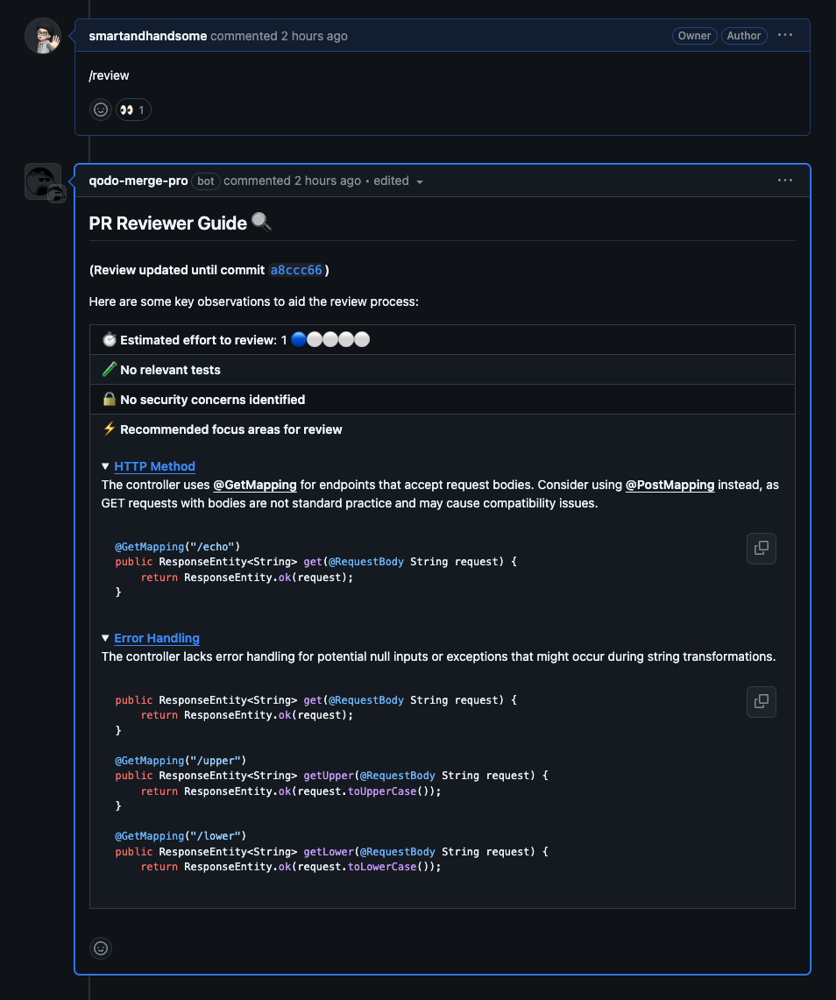
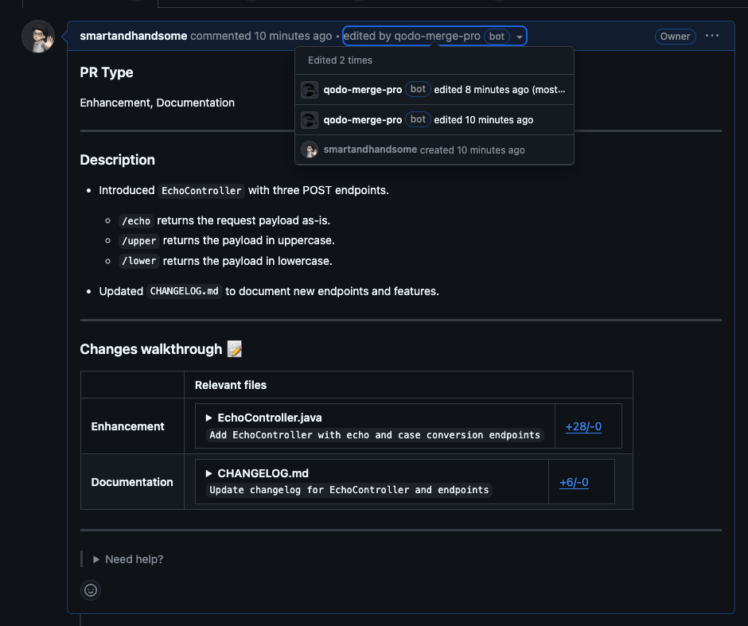
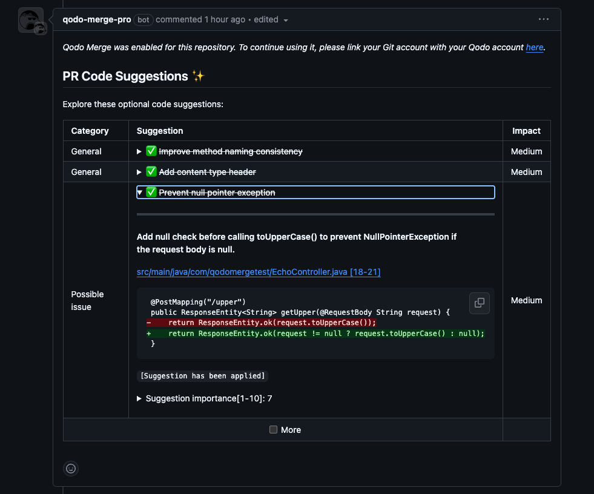
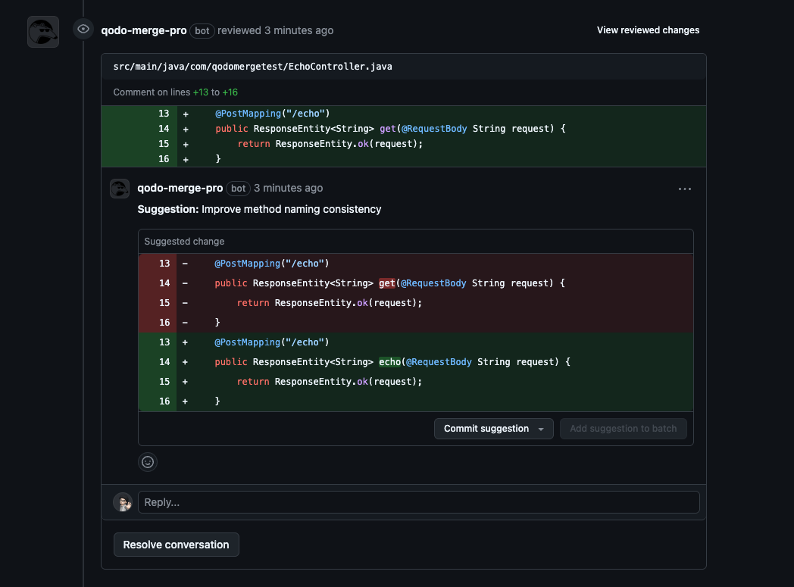
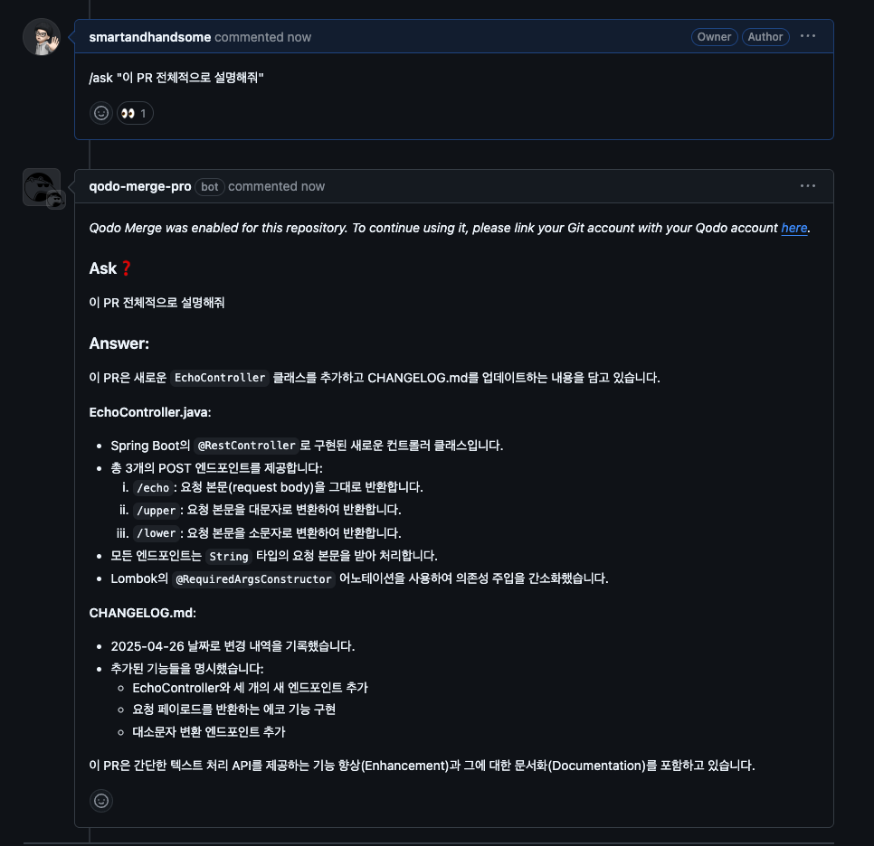
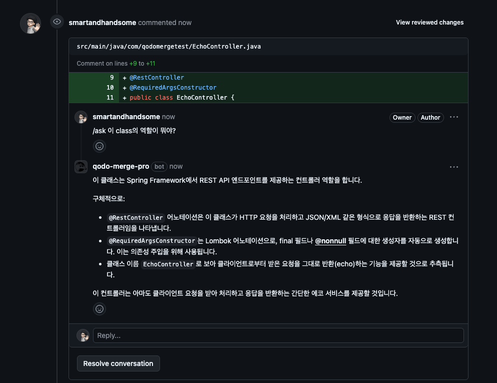
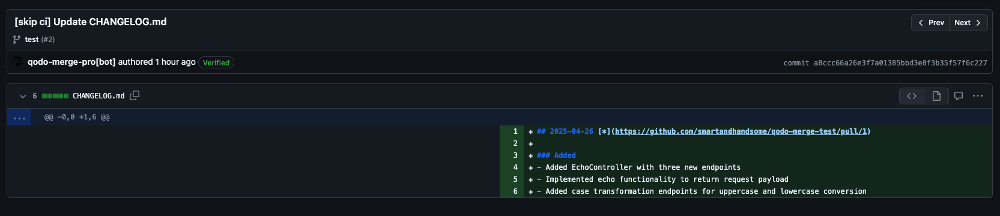

# [2주차 과제-1] 오픈소스 PR Agent

## **1. PR Agent란?**

- **Qodo** 회사에서 오픈소스로 제공하는 코드 리뷰 관련하여 다양한 기능이 있는 도구이며 오픈소스로 개발된 **풀 리퀘스트(Pull Request, PR) 자동화 도구**이다.
- 오픈소스 PR-Agent에는 없는 기능을 제공하는 **Qodo Merge(유료)**라는 어플리케이션을 다양한 형태로 지원한다. (README에 Qodo Merge만 제공하는 기능은 💎 )
    - 본 마크다운 문서에서는 💎 내용은 제외하고, 기본 내용에 대해 다룬다
- GitHub, GitLab, Bitbucket, Azure DevOps 등 다양한 Git 플랫폼과 연동하여 **PR 작성, 요약, 리뷰, 개선 제안** 등의 작업을 자동화하는 역할을 한다.
- PR Agent를 활용하면 개발자는 코드 변경사항을 보다 빠르고 정확하게 관리할 수 있으며, 리뷰어는 수작업 부담을 줄이고 코드 품질을 향상시킬 수 있다.

## **2. Tools 소개**

| **도구** | **설명** |
| --- | --- |
| **PR Description
(`/describe`)** | - PR 설명을 자동으로 생성
- 제목(title), 타입(type), 요약(summary), 코드 워크스루(code walkthrough), 라벨(labels)까지 작성 |
| **PR Review
(`/review`)** | - PR에 대한 피드백을 제공
- 코드 이슈, 보안 취약점, 리뷰 난이도 등을 조정 가능한 옵션과 함께 분석 |
| **Code Suggestions
(`/improve`)** | - PR의 코드 품질을 향상시킬 수 있도록 개선 제안(suggestions)을 자동으로 제공 |
| **Question Answering
(`/ask ...`)** | - PR이나 특정 코드 라인에 대해 자유 텍스트 형태로 질문을 하면 답변 제공 (`/ask "이 함수는 무슨 역할인가요?"` 처럼) |
| **Update Changelog
(`/update_changelog`)** | - PR 변경 사항을 기반으로 `CHANGELOG.md` 파일을 자동으로 업데이트 → 버전 관리에 유용 |

아래는 Github App을 이용한 실행 예시와 함께 오픈소스 PR-Agent가 제공하는 기능을 정리해보았다.

### `/review`

- PR(풀 리퀘스트) 코드 변경에 대해 AI가 자동으로 리뷰 피드백을 제공한다.
- 버그, 이슈, 보안 우려, 스타일 문제, 리뷰 난이도(라벨 추가), 개선점 등 다양한 관점에서 분석한다.
- 리뷰와 관련된 모든 기능을 실행한다. describe, improve 를 모두 포함한다.
    - 사용 예시
    
    
    
    **[주요 리뷰 항목]**
    
    | **항목** | **내용** |
    | --- | --- |
    | **리뷰 난이도(Estimated effort)** | 난이도 1/5 (리뷰하기 쉬운 편) |
    | **관련 테스트** | 없음 (`No relevant tests`) |
    | **보안 문제** | 없음 (`No security concerns identified`) |
    | **리뷰 집중 포인트(Recommended focus areas)** | 있음. 두 가지 주요 포인트가 제시됨
    -HTTP 메소드 문제
    -에러 핸들링 부족 |

### `/describe` → 자동 생성

- PR의 변경사항을 분석해 자동으로 PR (제목, 타입, 요약, 코드 워크스루, 라벨 등)을 작성해준다.
    - 사용 예시
        
        아래 이미지에서 하단은 `/review` 상단은 `/describe` 가 수정한 내역
        
        
        
        | **항목** | **내용** |
        | --- | --- |
        | **PR Type** | Enhancement (기능 개선), Documentation (문서화) |
        | **Description** (요약) | - `EchoController` 클래스를 새로 도입함- 세 가지 POST 엔드포인트 추가:  - `/echo`: 요청 받은 데이터를 그대로 반환  - `/upper`: 요청 데이터를 대문자로 변환해 반환  - `/lower`: 요청 데이터를 소문자로 변환해 반환- `CHANGELOG.md` 파일 업데이트 (새 엔드포인트와 기능 문서화) |
        | **Changes Walkthrough** (변경 사항 요약) | - `EchoController.java`: echo 및 대소문자 변환 엔드포인트 추가 (28줄 추가)- `CHANGELOG.md`: 관련 변경사항 문서화 (6줄 추가) |
        - `/describe` → PR에 대한 **개요(요약 설명)** 를 자동으로 정리
        - 어떤 기능을 추가했는지, 어떤 파일이 변경됐는지 표 형식으로 깔끔하게 보여줌
        
        → 리뷰어나 팀원들이 PR 내용을 빠르게 파악할 수 있음
        

### `/improve` → 자동 생성

- 현재 코드를 분석해서 코드 개선 제안을 생성해준다.
    - 사용 예시
        - 토글을 열면 ”**Apply this suggestion”**라는 문구와 ****체크박스가 있고 체크박스를 누르면 제안한 코드를 PR에 반영해준다.
        - 아래는 체크박스를 이미 누른 상태로 “Suggestion has been applied” 라는 문구가 보인다.
        
        > **체크박스(Check box)로 적용 가능**
        > - 개선 항목마다 "Apply this suggest" 체크박스 존재
        > - 체크하면 그 제안이 PR에 **자동으로 적용**
        > - 이미 체크한 경우, "Suggestion has been applied"라는 문구가 표시됨(아래와 같음)
        
        
        
        
        
        > 하단의 Commit suggestion 버튼을 눌러 적용할 수 있음
        

### `/ask {param}`

- 전체 PR 에 대해서 질문을 하면 답변을 생성해준다.
    - 사용 예시
        
        
        
- 코드의 특정 Line에 대해서 질문을 하면 답변을 생성해줍니다.
    - 사용 예시
        
        
        

### `/update_changelog`

- PR 변경사항을 바탕으로 CHANGELOG.md 파일을 자동으로 수정해줍니다.
    - 사용 예시
        
        
        

**위 예시는 아래 PR에서 확인 가능 [박상민 멘티의 깃허브 자료]**

[Test by smartandhandsome · Pull Request #3 · smartandhandsome/qodo-merge-test](https://github.com/smartandhandsome/qodo-merge-test/pull/3)

## **3. [Core Abilities](https://qodo-merge-docs.qodo.ai/core-abilities/) 정리**
💎 (제외)

### [1] Code validation

- `/improve` 에서 제안된 코드를 적용하면 바로 PR에 적용되기 때문에 IDE을 실행하는 수고를 덜어줄 수 있지만, 이 코드가 완벽한지 장담할 수는 없다는 문제점이 존재한다.
- 그렇기 때문에 PR-Agent는 이 제안된 코드를 이중 검증 시스템을 구현하였다.
    1. **Localization**
        
        모델이 제안한 라인 번호와 주변 코드가 실제 저장소 코드와 일치하는지 확인한다. 이것은 모델이 변경될 코드의 컨텍스트와 위치를 정확히 식별했음을 의미하는 것이다.
        
    2. **Compilation**
        
        정적 코드 분석을 사용하여 제안 적용 후 수정된 파일이 여전히 유효한지 확인한다. 즉 tree-sitter 구문 처리가 오류를 발생시키지 않을 것임을 검증하는 것이다.
        

⭐️ 에러 방지를 위한 두 가지 검증 방법들이 있음에도 불구하고 **완벽하게 동작하지 않을 수 있기 때문에 사람의 체크가 반드시 필요**하다.

---

### [2] Compression strategy

1. 작은 PR
    
    시스템 및 사용자 프롬프트를 포함해서 하나의 프롬프트에 모두 들어갈 수 있는 경우
    
2. 큰 PR
    
    시스템 및 사용자 프롬프트를 포함해서 하나의 프롬프트에 모두 들어가지 않을 만큼 큰 경우
    

**공통 전략**

1. 바이너리 파일 및 코드가 아닌 파일은 제외한다.
2. Repository에서 빈도가 높게 사용된 언어를 기준으로 PR 파일을 정렬한다.
    
    ex) `[[file.py, file2.py],[file3.js, file4.jsx],[readme.md]]`
    

**작은 PR**

- 수정된 부분의 주변 3줄 정도까지 확장한다.
    
    > 아마도 프롬프트가 남아서 model에 Context를 좀 더 많이 집어 넣기 위함인 걸로 예상한다.
    > 

**큰 PR**

- PR이 크다면, 많은 정보를 모델에 넣을 수 있다.
- 다만 여기서 비교적 더 관련성이 높은 정보를 포함하기 위해서 아래와 같은 방법을 사용한다.
    
    
    
    - 삭제된 파일을 하나의 삭제된 파일 리스트**`deleted files`**로 통합
    - 파일 patch는 여러 개의 hunk(덩어리)로 구성되는데 이 중 삭제만 포함된 hunk 모두 제거
        
        > **코드 삭제는 왜 제거할까?** 삭제보단 추가, 수정이 좀 더 PR에 의미있는 변화(관련이 크다)라고 판단한 것으로 예상
        > 
    - [tiktoken](https://github.com/openai/tiktokenhunk)(토크나이저: 텍스트를 어떠한 기준으로 쪼개는 것)을 사용하여 위에 작업으로 전처리된 패치 토큰화 진행
    - 각 언어 내에서 파일을 파일별 토큰 수 기준 내림차순 정렬
        
        **[[file2.py, file.py],[file4.jsx, file3.js],[readme.md]]**
        
        > **왜 이런 순서로 정렬할까?** 토큰 수가 많다는 건 수정된 패치가 많다는 의미인 거 같은데, 수정된 패치가 많다면 해당 PR에서 관련성이 높다고 판단하는 것일 수도 있겠다고 예상
        > 
    - 정렬된 파일 순서로 패치를 순회하며 프롬프트가 최대 토큰 길이의 일정 버퍼에 도달할 때까지 계속 패치 추가
    - 아직 남은 패치가 있다면, 남은 패치들을 **`other modified files`**라는 리스트로 프롬프트에 추가하고, 프롬프트가 최대 토큰 길이에 도달하면 나머지 패치는 건너뜀(hard stop).
        
        > 관련성이 적은 부분은 어쩔 수 없이 버려야 함.
        > 
    - 만약 최대 토큰 길이에 도달하지 않았다면, **`deleted files`**를 프롬프트에 추가하고, 최대 토큰 길이에 도달하면 나머지 패치는 건너뜀 (hard stop).

⇒ 역시 사람이나 AI나 작은 단위의 PR을 잘 분석하는 건 마찬가지인 것 같다.

---

### [3] Dynamic context

PR-Agent는 PR에서 코드 변경 사항을 AI가 더 잘 분석할 수 있도록 **비대칭적(asymmetric)이고 동적인(dynamic) 컨텍스트 전략**을 사용한다

변경 전 코드에 더 많은 컨텍스트를 제공하고, 코드 구조(예: 함수나 클래스 등)에 따라 이 컨텍스트의 범위를 동적으로 조정한다.

이 방식은 충분한 맥락을 제공해 분석 정확도를 높이면서도, 불필요한 정보 과다로 인한 AI 성능 저하나 토큰 한도 초과를 방지할 수 있다.

**Introduction**

PR의 코드 변경 사항은 일반적으로 unified diff 포맷으로 가져온다.

이 포맷은 각 변경된 부분에서 위아래로 3줄의 context를 보여주고, 추가된 줄은 '+'로, 삭제된 줄은 '-'로 표시한다.

```jsx
@@ -12,5 +12,5 @@ def func1():
 code line that already existed in the file...
 code line that already existed in the file...
 code line that already existed in the file....
-code line that was removed in the PR
+new code line added in the PR
 code line that already existed in the file...
 code line that already existed in the file...
 code line that already existed in the file...

@@ -26,2 +26,4 @@ def func2():
...
```

이 unified diff 포맷은 AI 모델이 전체 코드 변경의 맥락을 정확히 이해하기 어렵게 만들 수 있다.

또한 '+', '-', ' ' 기호로 변경, 삭제, 동일 라인을 표시하는 방식은 AI 모델이 학습한 일반적인 코드 포맷과 다르기 때문에 해석이 까다로울 수 있다.

**→ 컨텍스트 범위를 어디까지 포함할 것인가?**

컨텍스트 윈도우(참조 범위)를 넓히는 것은 기술적으로 가능하지만, 무조건 넓히는 것만이 좋은 것은 아니다. 근본적인 trade-off가 존재한다.

**장점**

- 더 넓은 컨텍스트는 모델이 코드 변경의 의미와 위치를 더 잘 이해할 수 있게 해주며, 더 정확한 분석과 제안을 가능하게 한다. 맥락이 부족하면 모델이 변경 사항을 제대로 파악하지 못해 관련성 없는 피드백을 줄 수 있다.

**단점**

- 과도한 컨텍스트는 AI 모델에 불필요한 정보를 넘겨주어 실제 중요한 변경에 집중하기 어렵게 만든다.
- PR 만 포함했을 때도 이미 정보가 너무 많을 수 있는데, 추가적인 컨텍스트를 감당하기 어려울 수 있다.
- 컨텍스트가 늘어나면 토큰 수도 늘어나서 처리 시간과 비용이 증가하고, 한 번에 전체 PR을 처리하지 못할 수도 있다.

즉, 어떻게 적절한 Context를 추가할 수 있을지 고민해봐야 한다.

**비대칭적(asymmetric)이고 동적인(dynamic) 컨텍스트**

PR-Agent는 비대칭적이고 동적인 컨텍스트 전략을 적용한다. 즉, 각 코드 변경에 대해 더 관련성 높은 맥락 정보를 모델에 제공한다.

**① 비대칭(Asymmetric)**

코드 변경을 이해할 때, 변경 전의 코드(이전 맥락)가 변경 후보다 더 중요하다는 점에 착안한다. 그래서 PR-Agent는 변경 전후의 컨텍스트 윈도우를 분리하여, 변경 전에는 더 많은 맥락을, 변경 후에는 상대적으로 적은 맥락을 제공한다.

> PR 이라는 것은 개인적으로 “기존에 무엇을 어떻게 바꿨냐” 가 중요한 거 같다. 변경 전 코드를 보면 잘못된 부분, 개선이 필요한 부분을 알 수 있다고 생각한다.
반면 변경 후 코드는 단순히 결과물이기 때문에 결과물을 더 많이 본다고 어떤 부분을 개선했는지 파악하긴 쉽지 않을 것 같다.
> 

이렇게 각 방향의 컨텍스트를 독립적으로 조정함으로써, 각 변경 사항에 더 맞춤화된 정보를 모델에 전달할 수 있다.

**② 동적(Dynamic)**

최적의 컨텍스트는 단순히 고정된 줄 수가 아니라, 변경이 속한 코드 컴포넌트(예: 함수, 클래스 등) 전체일 때가 많다. PR-Agent는 코드 구조를 분석해, 변경이 속한 함수나 클래스 전체를 맥락으로 포함시키는 등 동적으로 컨텍스트 범위를 조정한다.

모델이 과도한 맥락으로 압도되지 않도록, 컴포넌트 탐색 시 최대 줄 수 제한을 둔다.

**configuration option**

```jsx
patch_extension_skip_types =[".md",".txt"]  # Skip files with these extensions when trying to extend the context
allow_dynamic_context=true                  # Allow dynamic context extension
max_extra_lines_before_dynamic_context = 8  # will try to include up to X extra lines before the hunk in the patch, until we reach an enclosing function or class
patch_extra_lines_before = 3                # Number of extra lines (+3 default ones) to include before each hunk in the patch
patch_extra_lines_after = 1                 # Number of extra lines (+3 default ones) to include after each hunk in the patch
```

---

### [4] Local and global metadata

→ Qodo Merge 메타데이터 주입 & 다단계 분석 방식

>  Qodo Merge가 PR을 분석할 때, 어떤 데이터를 수집하고 그 수집한 데이터를 어떻게 가공해서 사용자한테 리뷰, 개선 제안 같은 결과로 보여주는지 보여주는 내용

**[1단계] PR 데이터 수집**

- PR 제목, 설명, 브랜치 이름, 커밋 기록, 수정된 파일들 전체 내용을 가져온다.
    
    → PR의 **전체 맥락**을 완벽하게 파악한다.
    

**[2단계] /describe 명령어 실행**

- PR 내용을 분석해서 다음 3가지를 만든다:
    - **PR 타입** (버그 수정, 기능 추가 등)
    - **PR 요약 설명** (불릿 포인트 정리)
    - **변경 파일별 워크스루** (파일마다 요약+세부 변경사항)
- 이 결과는 그냥 끝나는 게 아니라,
    
    ➔ 이후 `/review`, `/improve` 명령어에서도 **"참고 자료"** 로 재활용된다.
    

**[3단계] PR 전체 파일 활용**

- 수정된 파일 전체를 분석해
- PR의 컨텍스트를 확장하고, 더 풍부한 이해를 만든다.
    
    → 이걸 Dynamic Context라고 부른다.
    

**[4단계] 다단계 누적 분석 구조**

- hunk(작은 변경 블록) 단위 분석
- 파일 단위 분석
- PR 단위 분석
- 조직 단위 분석

= 작은 변경부터 큰 조직 단위까지 연결해서 훨씬 정교한 결과 생성이 가능해진다.

⇒  Qodo Merge는 PR의 모든 데이터와 설정을 수집해서, **describe → review → improve** 흐름으로 점점 더 깊은 분석을 쌓아감. 또한 추가 호출 없이 빠르고 정확한 리뷰와 코드 제안을 만듦.

---

### [5] Self-reflection

> AI가 처음에 만든 코드 제안을 자기 스스로 다시 점검하고, 좋은 제안은 살리고, 나쁜 제안은 버리는 과정

| **단계** | **설명** |
| --- | --- |
| 1단계 | AI가 PR을 분석해서 코드 개선 제안을 만든다. |
| 2단계 | 만든 제안을 한꺼번에 다시 AI에게 보여준다. |
| 3단계 | AI가 각 제안에 대해 0~10점 점수를 매기고, 이유를 설명한다. |
| 4단계 | 점수를 기반으로 제안을 다시 정렬하고, 점수 낮은 건 버린다. |
| (선택) | 사용자가 설정한 점수 기준(threshold)보다 낮으면 추가로 필터링한다. |
