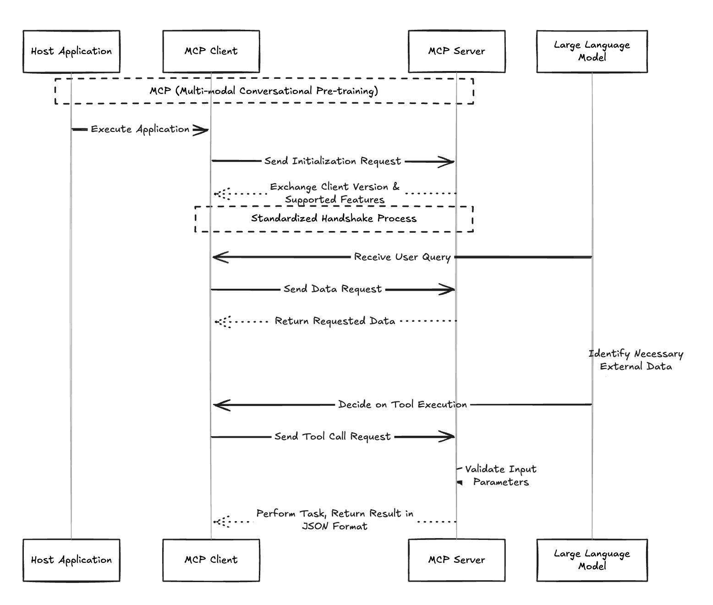
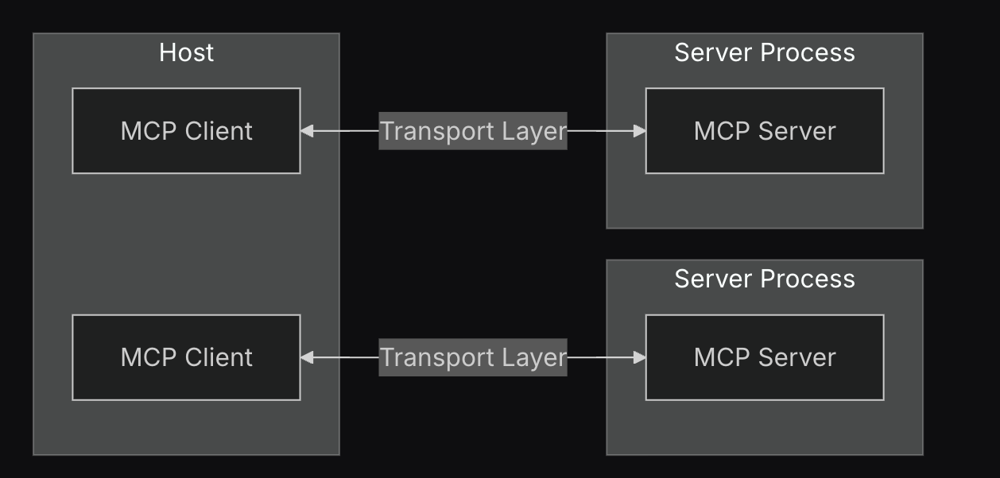
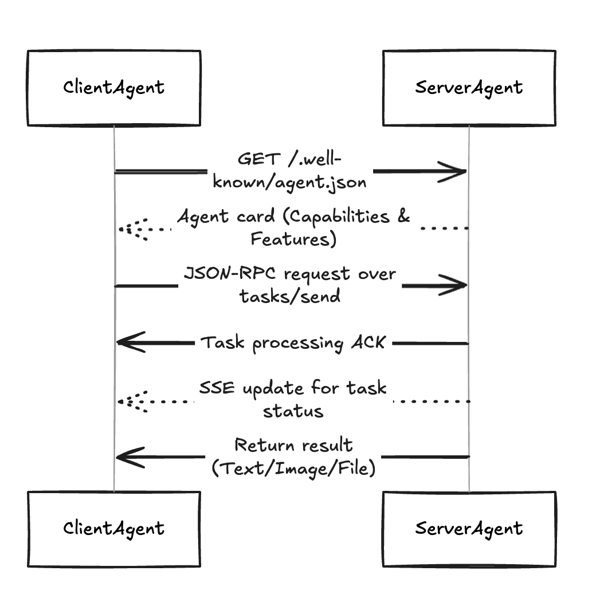

# AI 개념 학습 정리: RAG, MCP, A2A

## 1. RAG (Retrieval-Augmented Generation)

### 1.1 개념 정의
- RAG란 무엇인가?
    - 대형 언어 모델(LLM)의 응답 생성 과정에 외부 지식 검색 단계를 통합함으로써 보다 정확하고 신뢰할 수 있는 응답을 만들어내는 기술
    - LLM이 자체 파라미터에 저장된 지식만으로 답변하는 대신, 질의와 연관된 외부 데이터 소스에서 정보를 찾아와 활용하도록 하는 접근법
- 기존 LLM과의 차이점
    - 기존의 대형 언어 모델은 방대한 지식을 담고 있지만, 학습 시점 이후에 발생한 새로운 정보나 특정 전문 도메인의 사설 데이터에는 접근할 수 없다는 한계가 있음
    - 새로운 지식을 모델에 반영하려면 원래는 거대한 LLM을 다시 학습(파인튜닝)시켜야 함
    - 모든 지식을 모델 파라미터에 넣으려면 거대 모델이 필요
    - 잘못된 출력은 원인을 모델 내부에서 찾기 어려워 수정이 훨씬 까다로움

- RAG의 등장 배경 및 필요성
    - 모델을 재훈련하지 않고도 지식베이스만 업데이트하면 됨
    - 상대적으로 작은 LLM으로도 방대한 지식에 접근해 답변할 수 있음
    - 모델이 민감한 내부 정보에 접근할 때 권한 관리를 적용하거나, 특정 출처(예: 공식 문서)만 활용하도록 제한을 해서 개발자가 모델이 참고할 지식의 범위와 출처를 통제할 수 있게 해줌
    - 모델 출력에 잘못된 정보가 포함될 경우, 어떤 자료를 잘못 검색했는지 추적하여 해당 부분만 수정하는 등 디버깅과 개선이 용이
​
### 1.2 작동 원리
1. 지식베이스 구축 (오프라인 사전준비)
    - 문서들이 너무 길면 효율적인 검색을 위해 작은 청크(chunk) 단위로 분할
    - 각각의 청크에 대해 임베딩 벡터 계산해서 DB에 저장
    - 이 과정은 사전에 한 번만 수행되며 검색용 색인(index)를 만드는 단계
2. 질의 임베딩 및 검색
    - 사용자가 질문을 입력하면, 먼저 그 질의문을 임베딩 모델을 통해 벡터로 변환
        - 검색된 문서들을 컨텍스트로 주기 때문에 모델이 몰랐던 정보를 답변에 활용할 수 있게 됨 (Augmented)
    - 앞서 구축된 벡터 DB에서 질의 벡터와 가장 유사한 벡터들을 빠르게 검색하여 관련성이 높은 상위 N개의 문서 조각을 찾음
    - 이 때의 검색은 전통적인 키워드 매칭이 아니라 벡터 유사도 검색이기 때문에, 질의어와 정확히 동일한 단어가 없어도 의미상 관련있는 내용이라면 결과로 찾아낼 수 있습니다. 예를 들어, 사용자가 “우리 회사 연차 정책이 어떻게 되지?”라고 물으면 사내 지식베이스에서 “연차 규정” 문서를 찾아 반환하는 식. 
    - 하이브리드 검색 기법을 활용하면 정확도를 높일 수 있는데, 임베딩 유사도 기반 검색에 더해 전통적인 BM25 키워드 검색을 병행하고 재랭킹 모델을 통해 최종 상위 문서를 선정
> 하이브리드 검색이란
> - 키워드/의미 기반의 검색 방식의 강점을 서로 결합한 것
> - 병렬 실행 한 후 특정 기준을 기반으로 결과를 융합

> BM25란 (키워드 기반 검색 방식)
> - 정보 검색 분야에서 널리 사용되는 가중치 모델로, 주로 문서와 쿼리 간의 관련성을 평가하기 위해 사용됨 
> - 주요 특징 
>   - 문서 길이 정규화 (문서의 길이가 길수록, 더 많은 단어가 포함될 수 있으므로 문서의 길이를 정규화하여 **문서 간 공정한 비교**를 가능하게 함)
>   - 쿼리 독립성 (각 쿼리의 단어가 독립적으로 가중치를 받으므로, 각 단어에 대한 계산된 점수를 합산하여 전체 문서의 점수를 계산)
>     - 즉 쿼리 내의 각 단어가 서로의 영향을 받지 않고 독립된 상태로 관련성을 평가 받는다는 것을 뜻하는 용어

> 의미 기반 검색 방식이란
> - 키워드 기반 검색은 사용자가 입력한 키워드와 문서 내의 단어가 정확히 일치하는지를 중점으로 평가
> - 의미 기반 검색은 **입력된 키워드의 표면적 일치보다는 그 의미나 문맥을 해석하여 관련성을 판단하는 방식**

> RAG에서 재랭킹 모델을 실무에 적용하기 어려울 때
> - 갤럭시 S24를 검색했을 때, S24, S24+, S23 순으로 나열되기를 기대하는데 도메인에 특화되지 않은 재랭킹 모델을
> 사용하면 순서가 뒤죽박죽이 되어서 특정 규칙을 기반으로 재랭킹을 수행하는 것이 더 나을 수 있음
> - (참고용) [(당근 테크 블로그) LLM을 활용한 스마트폰 시세 조회 서비스 구축](https://medium.com/daangn/llm%EC%9D%84-%ED%99%9C%EC%9A%A9%ED%95%9C-%EC%8A%A4%EB%A7%88%ED%8A%B8%ED%8F%B0-%EC%8B%9C%EC%84%B8%EC%A1%B0%ED%9A%8C-%EC%84%9C%EB%B9%84%EC%8A%A4-%EA%B5%AC%EC%B6%95-bd4650ec67f4)

3. 프롬프트 보강 및 생성 요청
    - 검색 단계에서 얻은 상위 관련 문서 조각들을 원본 질문과 함께 LLM에 입력
    - 구체적으로는 원래의 사용자 프롬프트에 추가 컨텍스트로서 해당 문서 내용들을 첨부하거나, 프롬프트 템플릿에 따라 인용 형태로 삽입 (=프롬프트 증강, 컨텍스트 주입)
    - 프롬프트에는 모델이 참고 자료만 활용해서 답변하도록 유도하는 지시를 포함시켜 환각을 최소화
4. LLM 응답 생성
    - 생성 모델(LLM)은 주어진 질문 + 문서 컨텍스트를 바탕으로 최종 답변을 생성

### 1.3 주요 구성 요소
- 임베딩 모델 (Embedding Model)
    - 텍스트를 수치화된 고차원 벡터로 변환하는 역할
    - 의미적으로 유사한 내용은 벡터 공간에서도 가까이 위치
    - ex. OpenAI의 text-embedding-ada-002 모델은 범용 문장 임베딩에 많이 쓰이는 모델로, 영어뿐 아니라 다양한 언어에 대해 1536차원의 벡터를 반환
    - 중요한 것은 질의와 문서 임베딩 간의 코사인 유사도 등이 내용적 관련성을 반영하도록 임베딩 모델이 잘 학습되어 있어야 한다는 점
    - 문서를 적절한 크기로 분할하는 작업도 함께 이루어짐. 너무 큰 문서는 임베딩하기 전에 의미 단위로 잘라야 효율적이며, 보통 수백 단어 내외의 청크로 쪼개어 임베딩
    - 각 청크에는 해당 내용을 요약하는 벡터 표현이 부여되고, 이후 검색시 이 벡터들을 단위로 매칭
- 벡터 데이터베이스 (Vector Database)
    - 일반 데이터베이스와 달리 텍스트가 아닌 고차원 벡터를 저장하며, 수백만 개 이상의 벡터에 대해서도 실시간에 가까운 속도로 최근접 이웃(nearest neighbors)을 찾을 수 있도록 설계됨
    - ex. Facebook AI가 공개한 Faiss는 매우 널리 쓰이는 벡터 검색 라이브러리로, CPU/GPU에서 대용량 벡터의 근접 이웃 검색을 효율적으로 수행
- 검색기 (Retriever)
    - Retrieval 단계의 로직을 담당하는 모듈
    - 임베딩 모델 + 벡터 DB를 함께 묶은 개념적인 구성 요소
    - 사용자 질문을 받아 임베딩하고, 벡터 DB를 조회하여 상위 N개의 유사 문서를 반환하는 일련의 과정을 캡슐화한 것
    - 라이브러리나 프레임워크에서 Retriever라는 용어는 이러한 검색 기능을 하나의 인터페이스로 제공할 때 사용됨
    - ex. Langchain 등의 프레임워크에서는 사용자가 어떤 백엔드를 쓰든 동일한 Retriever 인터페이스로 검색 결과를 얻을 수 있게 해줌
    - Retriever의 결과로 선택된 문서들은 스코어(유사도 점수)에 따라 정렬되어 LLM에 전달되며, 이때 상위 N값이나 임계값 조정을 통해 얼마나 많은 컨텍스트를 포함할지 결정하게 됨
- 생성 모델 (Generation Model)
    - 최종적으로 사용자 질문에 대한 답변을 생성하는 **언어 모델(LLM)**
    - RAG 파이프라인의 후단으로서, Retriever가 찾아준 문서를 컨텍스트로 받아 답변을 산출
    - 다만, LLM이 컨텍스트를 얼마나 충실히 반영하느냐는 프롬프트 작성과 모델 특성에 달려 있음
    - 컨텍스트 길이가 모델의 맥락 윈도우 한도를 넘지 않도록 하고, 출력 형식을 지정하여 근거를 명시하도록 하는 등 프롬프트 엔지니어링도 필요

> 컨텍스트(맥락) 윈도우란?
> - 언어 모델이 한 번에 처리할 수 있는 텍스트의 최대 길이를 말함
> - 토큰 단위로 측정되며, 모델마다 최대 처리 가능한 토큰 수가 다름
> - 맥락 윈도우 내에서 모델은 이전 텍스트를 참조하여 다음 내용을 예측하고 생성함
> - 작은 컨택스트 윈도우의 제한을 해결하는 [몇 가지 일반적인 전략](https://ai.google.dev/gemini-api/docs/long-context?hl=ko#getting-started-with-long-context)이 있다

### 1.4 장단점
- 장점
    - 사실성 향상 및 환각 감소: 모델이 외부 지식에 기반해 답변하므로 사실 오류가 줄어들고 일관된 근거를 제시할 수 있음
    - 지식 최신성 보장: 훈련 시점 이후의 정보도 검색을 통해 반영할 수 있으므로, LLM의 시계열적 한계를 극복
    - 모델 크기에 독립적인 확장성: 작은 LLM으로도 거대한 지식을 다룰 수 있어 경량 시스템으로 고성능을 낼 수 있음
    - 용이한 지식 업데이트: 새로운 데이터가 생겨도 LLM을 재학습할 필요 없이 벡터 DB에 추가 indexing만 하면 됨
    - 도메인 특화 적응: 특정 산업이나 기업 내부 데이터에 LLM을 적용할 때 RAG는 해당 도메인 지식을 손쉽게 통합하는 방법을 제공
    - 모델 제어 및 안전성: RAG를 통해 모델이 참고하는 지식을 개발자가 선택함으로써, 원하지 않는 정보의 유입을 막거나 반대로 특정 정보만 사용하게 통제할 수 있음

- 단점
    - 검색 실패 시 한계: Retriever가 적절한 문서를 찾지 못하면 LLM도 여전히 부정확한 답변을 내놓을 수 있음
        - 따라서 임베딩 모델과 벡터 DB 세팅을 지속적으로 튜닝하고, 필요하면 하이브리드 검색이나 reranker를 도입해 검색 정확도를 높여야 함
    - 제한된 컨텍스트 길이: LLM이 한 번에 처리할 수 있는 프롬프트 길이 한도가 있기 때문에, 검색해온 문서가 너무 방대하면 모두 담을 수 없음
    - 추가 구성 요소로 인한 복잡성: 순수 LLM API 호출에 비해 RAG 시스템은 벡터 DB, 임베딩 모델, 데이터 파이프라인 등이 추가로 필요하므로 구축 및 운영 복잡성이 증가
    - 보안 및 프라이버시: RAG 시스템이 다루는 지식이 회사의 내부 기밀정보인 경우, 이를 벡터화해 DB에 넣고 LLM에 전달하는 과정에서 정보 유출 위험을 관리해야 함

### 1.5 활용 사례
- 기업 내부 지식봇: 회사의 방대한 내부 문서, 위키, 정책집, 매뉴얼 등을 인덱싱하여 직원들이 질문하면 답을 해주는 사내 FAQ 챗봇
- 고객 지원 및 FAQ 챗봇: 제품 사용 설명서, 자주 묻는 질문(FAQ), 기술 지원 문서 등을 기반으로 하는 고객용 챗봇에 RAG를 적용하면, 사용자의 질의에 실시간으로 관련 매뉴얼 내용을 인용한 답변을 제공
- 의료/법률 전문 상담: 의료 챗봇에 의학 논문, 질병 백과사전, 임상 가이드라인 등을 연결하거나 법률 상담봇에 법령, 판례 데이터를 연결하여, 전문 지식이 필요한 질문에 정확한 정보를 제공할 수 있음
- 검색 엔진 보강 Q&A: Bing이나 구글의 검색처럼 웹 크롤링한 방대한 정보를 토대로 직접 답변을 생성해주는 서비스도 RAG의 개념을 활용
- 코드 어시스턴트: 프로그래머를 위한 AI 어시스턴트가 문법 참고나 API 문서를 찾아주는 경우에도 RAG를 활용할 수 있습니다. 예를 들어 “파이썬에서 JSON을 파싱하는 방법”을 물으면 Python 공식 문서나 StackOverflow 답변 등을 검색해 코드를 보여주는 식

## 2. MCP (Model Context Protocol)

### 2.1 개념 정의
- MCP란 무엇인가?
    - 대형 언어 모델(LLM)이 외부 데이터 및 도구와 상호작용할 수 있도록 해주는 표준화된 프로토콜
    - 기존에는 AI가 사전에 학습된 정보나 RAG에 의존해야 했지만, MCP를 사용하면 실시간으로 최신 데이터를 가져와 활용할 수 있음
    - 목표는 현실 세계의 데이터와 도구에 직접 접근하게 함으로써, 보다 관련성 높고 유용한 응답을 생성하도록 돕는 것
        - 데이터의 조회뿐만 아니라 액팅으로 확장됨

### 2.2 작동 원리


1. 초기 연결 설정
    - 호스트 애플리케이션 실행 시 MCP 클라이언트는 서버에 프로토콜 버전 및 기능과 함께 초기화 요청을 전송
    - 이 과정에서 프로토콜 버전 정보와 지원 기능을 교환하며 상호 호환성을 확인
    - 표준화된 핸드셰이크 프로세스를 통해 다양한 벤더의 서버와 원활한 연결이 가능해짐
2. 데이터 요청 처리
    - 사용자 질의 수신 후 LLM은 필요한 외부 데이터를 식별하고 해당 MCP 서버에 요청을 전송
3. 도구 실행 절차
    - LLM이 특정 기능 실행을 결정하면 MCP 클라이언트는 서버에 도구 호출 요청을 전송
    - 서버는 입력 파라미터 유효성을 검증한 후 실제 작업을 수행하고 결과를 JSON 형식으로 반환

### 2.3 주요 구성 요소


- MCP 호스트
    - MCP를 통해 데이터에 액세스하려는 IDE 또는 AI 도구와 같은 프로그램
- MCP 클라이언트(Client)
    - MCP 서버와 1:1 연결을 유지하는 프로토콜 클라이언트
- MCP 서버(Server)
    - 표준화된 모델 컨텍스트 프로토콜을 통해 각각 특정 기능을 노출하는 경량 프로그램
    - 외부 데이터나 기능을 제공하는 측입니다. MCP 서버는 하나의 특정 서비스나 데이터 소스를 감싸서 모델이 이해할 수 있는 형태로 맥락(Context)을 제공
    - 맥락 요소
- 프로토콜(Protocol)
    - MCP의 핵심인 통신 규약. MCP는 통신에 JSON-RPC 2.0을 기반으로 한 표준 메시지 형식을 사용

### 2.4 주요 개념 
- Resources(리소스) : 모델이 참고할 읽기 전용 데이터
- Tools(도구) : 모델이 호출할 수 있는 기능 또는 함수입니다. 계산, 웹 API 요청, 외부 시스템 동작 등 모델이 단순 문장 생성만으로 수행할 수 없는 작업을 대행
- Prompts(프롬프트) : 모델에게 특정 지시나 템플릿을 제공하는 문구
- Sampling : 서버가 클라이언트를 통해 LLM에게 요청할 수 있도록 하는 기능
- Root : MCP에서 서버가 작동할 수 있는 경계를 정의하는 개념. 클라이언트가 서버에 관련 리소스와 그 위치를 알릴 수 있는 방법을 제공

### 2.5 장단점
- 장점
1. 외부 도구 연결 가능 : AI 에이전트가 원래 지원하지 않는 새로운 도구를 쉽게 추가할 수 있다는 점
2. 비개발자를 위한 접근성 : 기존의 AI 에이전트 개발은 주로 개발자들의 영역이었지만, MCP는 비개발자들도 AI 에이전트를 확장할 수 있도록 설계됨
3. 표준화된 프로토콜 제공 : 단순한 API 연결이 아니라 일정한 형식을 갖춘 프로토콜을 제공. 이를 통해 여러 개발자들이 공통의 방식으로 도구를 제작하고 AI 에이전트와 연결할 수 있게 됨 
- 단점
1. 보안 문제 :  인증 미정의, 로컬 실행 위험성, 입력 신뢰에 대한 취약점 등이 주요 이슈가 있음
    - MCP 서버는 HTTP 서버 없이도 작동할 수 있도록 표준 입출력(STDIO)을 통한 실행을 허용하는데, 이로 인해 많은 통합 가이드가 사용자에게 직접 코드를 다운로드하고 실행하도록 권장함으로써 비숙련 사용자가 악성 코드에 노출될 위험이 있음
2. UI/UX 한계 : MCP는 LLM이 이해하기 쉬운 인터페이스를 갖고 있지만, 사람이 사용하기에는 불편하거나 위험한 설계 요소들이 존재할 수 있음

### 2.6 활용 사례
- 업무 자동화 : Slack ↔ Google Docs 연동으로 회의록 작성을 자동화. 특정 채널의 대화를 분석해 주요 결정 사항과 액션 아이템을 추출하고 구글 문서에 체계적으로 정리
- 개발자 생산성 향상 : GitHub MCP 서버와 연동해 IDE 내에서 코드 컨텍스트를 실시간 분석. VS Code 확장 프로그램은 현재 작업 중인 파일과 관련된 문서, 이슈 트래커, 커밋 기록을 자동으로 참조해 정확한 코드 제안을 제공함

### 2.7 참고 자료
- [\[Deep Research\] Model Context Protocol(MCP) 개념 및 이해를 위한 학습 자료](https://discuss.pytorch.kr/t/deep-research-model-context-protocol-mcp/6594/1)
- [MCP TypeScript SDK](https://github.com/modelcontextprotocol/typescript-sdk)
- [Model Context Protocol](https://modelcontextprotocol.io/introduction)

## 3. A2A (Agent-to-Agent)

### 3.1 개념 정의
- A2A란 무엇인가?
    - 서로 다른 AI 에이전트들이 표준화된 방식으로 소통하고 협업할 수 있게 해주는 오픈소스 프로토콜
- 기존 AI 시스템과의 차이점
    - 기존의 AI 에이전트들은 특정 플랫폼이나 도구에 종속되어, 다른 시스템과 협업하려면 복잡한 커스텀 통합 작업이 필요헸음

### 3.2 작동 원리


1. 발견(Discovery)
    - 클라이언트 에이전트가 서버의 /.well-known/agent.json URL에서 에이전트 카드를 가져옴
    - 이를 통해 서버 에이전트의 능력과 지원하는 기능을 파악
2. 작업 전송
    - 클라이언트 에이전트가 서버 에이전트에게 특정 작업을 요청
    - JSON-RPC 기반 통신을 사용하여 tasks/send 메소드로 요청 전송
3. 작업 처리 및 상태 추적
    - (Streaming) 서버가 작업의 진행 상황을 SSE 이벤트(상태 업데이트, artifact)를 전송
    - (Non-Streaming) Task 서버는 작업을 동기적으로 처리하고 응답에서 최종 Task 객체를 반환
    - 서버 에이전트가 작업을 처리하고 진행 상황을 클라이언트에 알림
    - 실시간 스트리밍 업데이트(SSE)를 통해 장기 실행 작업의 상태도 추적 가능
4. Interaction (Optional)
    - 작업에 input-required 상태로 들어가면, 클라이언트는 동일한 Task ID를 이용해 `tasks/send`나 `tasks/sendSubscribe`를 통해 이후 메세지를 전송
4. 완료
    - 작업은 완료(`completed`), 실패(`failed`), 취소(`canceled`) 상태 중 하나의 최종 상태에 도달

### 3.3 주요 구성 요소
- 에이전트 카드(Agent Card)
    - 에이전트가 자신의 능력과 정보를 외부에 알리는 수단
    - JSON 형태로 작성되며 이름, 설명, 버전, 지원하는 입출력 방식, 보유 스킬 목록 등을 포함
```json
{
    "name": "Reimbursement Agent",
    "description": "직원들의 비용 정산을 처리하는 에이전트",
    "url": "http://localhost:10002/",
    "capabilities": {
    "streaming": true,
    "pushNotifications": false
    },
    "skills": [
    {
        "id": "process_reimbursement",
        "name": "비용 정산 도구",
        "description": "지출 금액과 목적을 입력하면 정산 처리",
        "examples": ["Can you reimburse me $20 for my lunch with the clients?"]
    }
    ]
}
```
- A2A 서버 
    - A2A 프로토콜 메서드를 구현하는 HTTP 엔드포인트를 노출하는 에이전트 (메서드는 JSON 명세로 정의되어 있음)
    - 서버는 요청을 수신하고 작업(Task) 실행을 관리
- A2A 클라이언트
    - A2A 서비스를 사용하는 애플리케이션 또는 다른 에이전트
    -  클라이언트는 A2A 서버의 URL에 tasks/send 같은 요청을 보냄
- 작업(Task)
    - A2A에서의 중심 작업 단위
    - 클라이언트는 tasks/send 또는 tasks/sendSubscribe 메시지를 보내 작업을 시작
    - 고유한 ID와 상태(submitted, working, input-required, completed 등)를 가짐
    - 모든 에이전트 간 상호작용은 이 작업 수행을 중심으로 이루어짐
- 메시지
    - 클라이언트와 에이전트 간 통신, 메세지는 여러 부분(Part)으로 구성됨 
- 파트(Part)
    - 메시지나 아티팩트(Artifact) 내의 기본적인 콘텐츠 단위
    - 종류에는 텍스트 콘텐츠를 담는 TextPart, 파일을 인라인 바이트나 URI 형태로 담는 FilePart, 구조화된 JSON 데이터(예: 양식)를 담는 DataPart가 있음
- 아티팩트(Artifact)
    - 작업 도중 에이전트가 생성한 결과물(예: 생성된 파일, 최종 구조화 데이터 등)을 나타냄
    - 아티팩트도 여러 Part로 구성될 수 있음
- 스트리밍 (Streaming)
    - 장시간 실행되는 작업을 위해, 스트리밍 기능을 지원하는 서버는 tasks/sendSubscribe를 사용하여 실시간 진행 상황을 Server-Sent Events (SSE) 방식으로 클라이언트에 전달할 수 있음
    - 전송되는 이벤트는 TaskStatusUpdateEvent 또는 TaskArtifactUpdateEvent
- 푸시 알림 (Push Notifications)
    - pushNotifications 기능을 지원하는 서버는 클라이언트가 제공한 webhook URL을 통해 작업 업데이트를 능동적으로 푸시할 수 있음
    - webhook URL은 tasks/pushNotification/set 메서드를 통해 설정

### 3.4 장단점
- 장점
    - 상호운용성(Interoperability) : 서로 다른 벤더, 프레임워크, 언어로 개발된 AI 에이전트들이 표준화된 방식으로 쉽게 협업할 수 있음
    - 모듈성 및 유연성(Modularity & Flexibility) : 각 에이전트가 독립적으로 개발·배포·교체될 수 있어, 시스템 전체를 재설계하지 않고도 새로운 기능 추가나 업그레이드가 가능합니다. 마치 마이크로서비스처럼 필요한 기능만 교체할 수 있음
    - 확장성(Scalability) : 중앙 집중식 서버 없이 에이전트 간 직접 통신이 가능해, 에이전트 수가 늘어나도 시스템 확장이 쉽고, 성능 저하가 적음
    - 실시간성 및 장기 작업 지원 : Server-Sent Events(SSE) 등 실시간 스트리밍 기술을 활용하여, 수분~수일에 걸친 장기 작업의 상태 변화도 실시간으로 추적하고 관리할 수 있음
    - 멀티모달 지원 : 텍스트뿐 아니라 오디오, 비디오, 파일 등 다양한 데이터 형식을 주고받을 수 있어, 복합적인 업무 자동화에 적합
    - 보안 및 인증 강화 : 엔터프라이즈급 인증 및 권한 부여 체계를 기본적으로 지원해, 기업 환경에서도 안전하게 사용할 수 있음
    - 생태계 확장 및 비용 절감 : 기존 에이전트 재활용, 신규 에이전트의 빠른 추가, 표준화된 통합으로 개발·운영 비용이 절감됨
- 단점
    - 초기 구현의 복잡성 및 러닝커브 : JSON-RPC, SSE, 인증 체계 등 다양한 웹 표준 기술을 다뤄야 하며, Agent Card 설계, 태스크 핸들링 등 초기에 익혀야 할 개념이 많아 진입장벽이 있음
    - 상태 관리 및 동기화의 어려움 : 에이전트가 각자 독립적으로 동작하므로, 장기 작업이나 다중 에이전트 협업 시 상태 동기화, 충돌 관리, 부분 실패 처리 등 분산 시스템 특유의 복잡성이 존재
    - 보안 취약점 가능성 : 에이전트 간 직접 통신이 늘어나면서, 인증·권한·감사 등 보안 측면에서 새로운 위협이 생길 수 있어, 이를 위한 별도의 보안 설계가 필수
    - 컨텍스트 관리 한계 : 개별 에이전트가 내부 상태나 메모리를 외부에 노출하지 않고 협업하므로, 복잡한 컨텍스트가 필요한 시나리오에서는 한계가 있을 수 있음. 이런 경우 MCP 등 보완적 프로토콜과의 조합이 필요

### 3.5 활용 사례
- 여행 계획 자동화 : 여행 일정 계획에서 여러 전문 에이전트가 협업하는 사례
    1. 여행 일정 플래너 에이전트가 사용자의 요청을 받음
    2. 항공권 검색 에이전트에게 항공편 정보를 요청
    3. 호텔 검색 에이전트에게 숙소 정보를 요청
    4. 이를 통합해 하나의 일정으로 반환

### 3.6 참고 링크
- [(Github) google/A2A](https://github.com/google/A2A)
- [(Google for Developer) Agent2Agent(A2A) 프로토콜 발표
](https://developers.googleblog.com/ko/a2a-a-new-era-of-agent-interoperability/)

## 4. 세 기술의 통합 및 미래 전망

### 4.1 기술 간 시너지
- 기술이 결합하면 에이전트가 협업하며 실시간 데이터를 활용해 복잡한 작업을 수행할 수 있음
- ex. 한 에이전트가 RAG로 정보를 검색하고, MCP로 데이터에 접근한 뒤, A2A로 다른 에이전트와 결과를 공유할 수 있음

### 4.2 현재 연구 동향
- MCP는 RAG와 함께 사용될 때, AI 모델이 수동적인 맥락 검색(RAG)과 능동적인 맥락 가져오기(MCP)를 결합하여 더 유연한 시스템을 구축할 수 있도록 함
    - ex. MCP 서버가 벡터 데이터베이스와 인터페이스하여 모델이 실시간 데이터베이스 쿼리나 업데이트를 수행할 수 있음

### 4.3 미래 발전 방향
- 표준화와 생태계 통합: 이들 기술이 더욱 표준화되어 AI 에이전트 시스템의 통합적 생태계를 형성할 것으로 예상됨
- 보안과 프라이버시 강화: AI 에이전트가 다양한 데이터 소스에 접근하고 서로 통신하는 과정에서 보안과 프라이버시 문제가 중요해질 것이라 MCP와 A2A는 OAuth 2.0과 같은 기업급 인증 방식을 지원하며, 보안 기능을 강화하는 방향으로 발전할 가능성이 있음
- 기술적 융합: A2A, MCP, RAG와 같은 기술이 하나의 통합 프레임워크로 발전할 가능성도 있음
