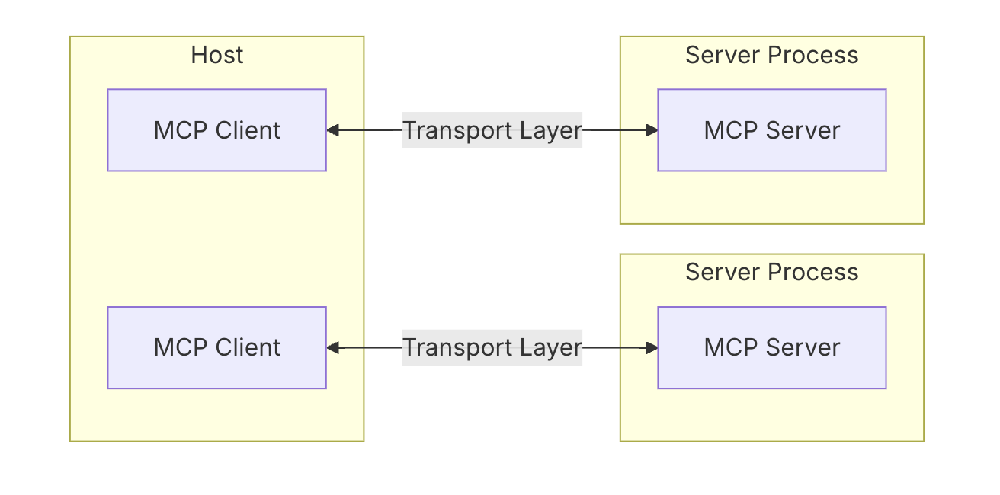

## RAG(Retrival-Augmented Generation, 검색 증강)

> LLM 모델의 지식을 증강 → 각종 문서를 연결해 답변 능력 향상

#### 생성형 AI의 문제점

- 최근 지식이나 구체적인 전문 지식이 없음
- hallucination - 모델이 근거없이 그럴듯한 답변을 지어냄
  ⇒ 필요한 정보를 신뢰할 수 있는 소스로부터 찾아와서 모델에 반영할 필요!

#### 문제 해결⇒ RAG (검색, 증강, 생성) - 답변을 확실한 출처로 답할 수 있게 됨

- 질문과 관련된 외부 데이터 소스에서 정보를 찾아와서 활용 가능!
  - 대용량 언어 모델을 오픈북처럼 활용
  - LLM이 질문마다 필요한 참고 자료를 찾아보고 그 정보를 근거로 답을 생성
- RAG를 활용하여 질문 프롬프트를 보강 → 더 정확한 응답
  - prompt + 참고자료(ocontext) + 사용자의 질문
  - 검색된 문서를 프롬프트에 추가된 컨텍스트로 활용하여 보다 근거가 명확한 응답
  - 장점
    - 지식 범위 확장, 최신 정보까지 활용 가능!

### 작동 원리

#### 1. 지식베이스 구축

- LLM이 참고할 데이터들을 준비
- 작은 chunk 단위로 분할하고, 이에 대해 임베딩 벡터를 계산하여 벡터 DB에 저장

#### 2. 질의 임베딩 및 검색

- 사용자의 질문의 임베딩하여 벡터로 변환
- 해당 질의 벡터와 가장 유사한 벡터들을 검색하여, 유사성이 높은 상위 N개의 문서를 찾음

#### 3. 프롬프트 보강 및 생성 요청

- 위에서 얻은 관련된 문서들의 조각들을 원본 사용자의 질문과 함께 프롬프트에 입력! = 컨텍스트 주입

#### 4. LLM 응답 생성

- 주어진 사용자의 질문 + 관련된 문서 컨텍스트를 바탕으로 최종 답변 생성!
- 보다 더 풍부한 답변 제공 가능 (출처에 대해 인용 표시나, 근거가 함께 제공되어 답변 신뢰도를 높임)

### 구성 요소

#### 임베딩 모델

> 텍스트를 고차원 벡터로 변환하는 모델

- 의미적으로 유사하면 가까운 벡터 공간에 위치하게 됨!
- 유사도 벡터 계산을 통해 관련성 있는 문서를 찾음.
- 문서를 적절한 크기로 분할하는 작업
  - 보통 수백 단어 내외의 chunk로 쪼개어 임베딩

#### Vector DB

- 임베딩한 문서 조각들을 저장하고, 질의 벡터와 유사도 검색을 고속 수행하는 전용 데이터 베이스
- 고차원 벡터를 저장 - 수백만 개의 벡터에 대해서도 실시간에 가깝게 유사한 벡터를 찾을 수 있게 설계됨

#### 검색기 (Retriever)

- 사용자의 질문을 임베딩하고, 벡터 DB를 조회하여 상위 N개의 유사 문서를 반환

#### 생성기 (LLM, Generator)

- 최종적으로 사용자 질문에 답변을 생성하는 언어 모델
- API를 사용하거나 자체 오픈 소스 LLM 활용 가능
- OpenAI GPT-3.5/4는 뛰어난 능력을 보여주지만 API 비용과 데이터 유출 위험(클라우드 서비스)이 있고, 오픈소스 LLM은 자체 서버에 구축해 프라이버시를 지킬 수 있지만 모델 크기에 따라 성능이 제한

### 한계

- 문장 유사도 기반 검색의 한계

  - LLM이 문서 전체의 맥락과 의미론적 이해가 필요한 태스크에서는 부정확한 답변 생성 가능

- 벡터 DB 또한 외부의 지식 베이스이기에 주기적으로 업데이트되어야 함
  - 최신 정보 반영 못하는 경우 여전히 부정확한 답변 생성 가능

 

## MCP(Model Context Protocol)

참고) https://discuss.pytorch.kr/t/deep-research-model-context-protocol-mcp/6594

> AI 모델과 외부 데이터 소스 또는 도구를 연결해주는 개방형 표준 프로토콜

- 표준 인터페이스를 제공하여, AI모델과 쉽게 다른 시스템에 연결 가능!
- AI 모델이 외부 지식/데이터(컨텍스트)를 얻고,
- 표준 프로토콜을 통해 다양한 도구를 안전하게 사용하게끔 해준다!

### MCP Host

> 사용자와 직접 상호작용하는 애플리케이션 - 예) Claude Desktop, IDE의 AI 어시스턴트

- 호스트는 사용자에게 받은 명령/질문을 모델에 전달, 모델의 응답을 사용자에게 전달
- 내부에 MCP Client를 구동하여 MCP 서버들과 연결 유지

### MCP Client

> 호스트 애플리케이션 내부에서 동작하며, 하나의 MCP 서버와 1:1 연결을 담당하는 컴포넌트

- 여러 데이터를 쓰기 위해 여러 서버 연결 - 각 서버마다 전담 클라이언트가 필요
- 서버로 요청을 보내고, 응답을 받아서 모델(호스트 측)에 전달하는 역할

### MCP Server

- 외부 데이터나 기능 제공
- 하나의 특정 서비스나 데이터 소스를 감싸서 모델이 이해할 수 있는 형태로 맥락(Context)을 제공
- 예) 날씨 MCP 서버 - 날씨 정보 제공 기능을 표준화된 인터페이스로 정의하여 MCP 클라이언트 요청에 응답

### 3가지 Context 요소

- Tools
  - 모델이 호출할 수 있는 기능 또는 함수
  - 서버에서 실행되는 함수, 모델이 스스로 판단해 언제 어떤 툴을 쓸지 결정하여 외부 시스템 호출
  - 예) 날씨 서버의 "현재날씨 조회", Slack 서버의 "메시지 보내기" 등
- Resources
  - 모델이 참고할 읽기 전용 데이터
  - 서버가 AI에 더 많은 컨텍스트를 제공하기 위해 노출하는 파일, 데이터베이스, 혹은 API 응답 등
- Prompt
  - 모델에게 특정 지시나 템플릿을 제공하는 문구
  - 미리 작성된 시스템/사용자 메시지
  - 예) 자주 쓰이는 요청- “다음 메시지를 요약하라”와 같은 템플릿을 프롬프트로 등록할 수 있음

 

## A2A(Agent2Agent)

> AI 에이전트가 서로 통신하고 협업할 수 있도록 하는 개방형 프로토콜

- 에이전트에 유용한 도구와 컨텍스트를 제공하는 MCP를 보완하는 개방형 프로토콜
- 클라이언트 에이전트와 리모트 에이전트 간의 커뮤니케이션

### Client Agent

> 요청이나 작업을 시작하는 에이전트
> 먼저 주어진 작업에 가장 적합한 에이전트를 파악하기 위해 기능 탐색 수행

### Remote Agent

> 요청을 수신하고 이를 수행하는 에이전트

- 에이전트들은 JSON 형식의 에이전트 카드를 활용해 자신의 능력을 광고
  - 에이전트의 이름, 설명, 지원하는 기능, 엔드포인트 URL, 인증 요구사항 등이 포함됨
- 이를 통해 클라이언트 에이전트는 특정 작업을 수행할 수 있는 최적의 원격 에이전트를 식별하여, A2A를 활용하여 해당 에이전트와 통신

### 핵심 기능

- Capability Discovery
  - agent card -> 클라이언트 에이전트는 특정 작업을 수행할 수 있는 최적의 원격 에이전트를 식별할 수 있음
- 작업 관리(Task Management)
  - 클라이언트와 원격 에이전트 간의 통신은 작업 완료를 중심으로 이루어진다.
  - task는 프로토콜에 의해 정의된 객체로, 고유한 ID를 가지며, submitted, working, input-required, completed, failed, canceled 등의 상태를 가짐
- 협업
  - 에이전트들은 서로 메시지를 보내어 컨텍스트, 응답, 산출물, 사용자 지침 등을 전달할 수 있다.
- User Experience Negotiation
  - 각 메시지는 “parts”를 포함하며, 이는 텍스트, 이미지, 오디오 등 다양한 형태의 콘텐츠 조각
  - 각 part는 지정된 콘텐츠 유형을 가지며, 클라이언트와 원격 에이전트는 필요한 형식을 협상하고 사용자의 UI 기능(예: iframes, 비디오, 웹 폼 등)을 명시적으로 포함시킬 수 있음.
