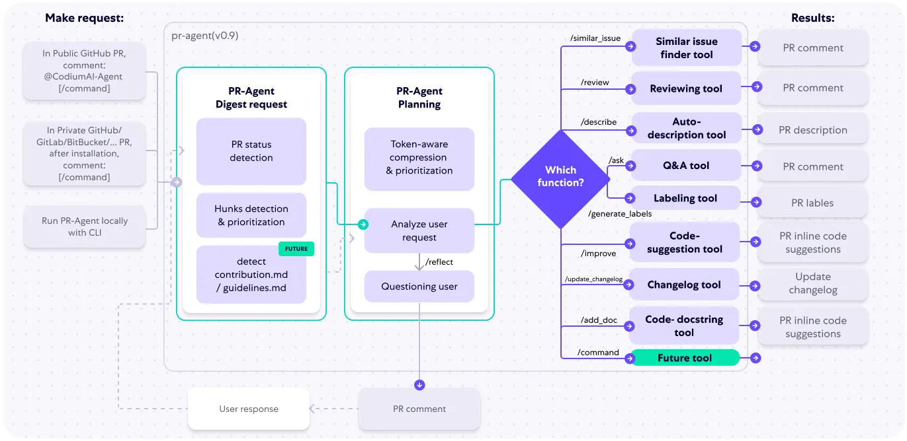
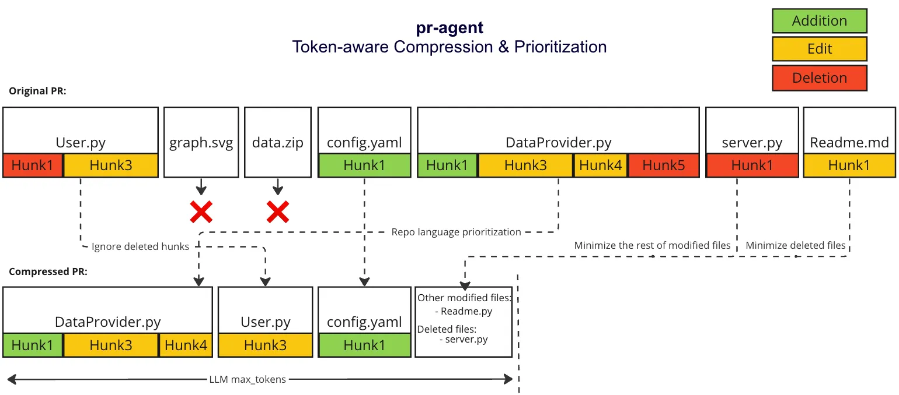
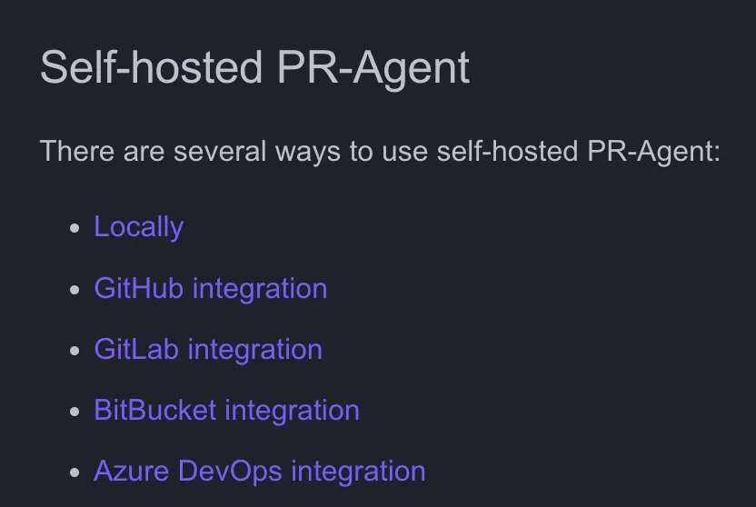
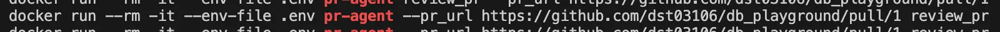
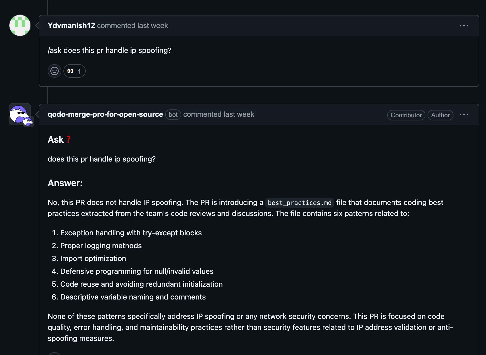
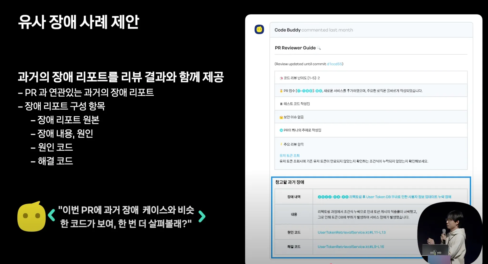

## PR Agent란?

**PR‑Agent**는 Pull Request(PR)를 효과적으로 리뷰하고 보다 쉽게 관리하는 데 도움을 주는 AI 기반 코드 리뷰 어시스턴트입니다.

주요 특징으로는,

- GitHub, GitLab, Bitbucket 등과 연동 가능
- 다양한 LLM 모델 지원 (GPT, Claude, DeepSeek 등)
- 오픈소스로 self-hosting 가능
- CLI, GitHub App, GitHub Action, Docker 연동 지원

---

## 아키텍처



> PR 생성 or 명령어 호출 → PR 내용 분석 및 압축 → 사용자 요청 이해 → 적절한 도구 선택 → 결과 생성 및 응답

### 1) Request 단계

- 공개 레포 PR에서 호출
- 비공개 레포 PR에서 설치 후 /command(명령어) 호출
- CLI를 통한 로컬 실행

### 2) PR-Agent Digest (사전 처리)

> PR 상태와 변경 내용을 분석하는 초기 단계

PR의 **변경된 코드(Hunks)를 감지하고 중요도에 따라 우선순위 지정**

### 3) PR-Agent Planning 단계 (계획 수립)

> 토큰 한계를 고려하여 압축(Token-aware compression)을 수행

**사용자의 Request을 분석 및 필요 시 추가 질문**(`/reflect`)을 통해 보완

### 4) Function Selection & Response

- 명령어에 따라 적절한 도구 선택하여 결과 생성

---

### Compression Strategy란?

> PR 변경 내용을 LLM에게 전달할 때
> 중요한 정보만 뽑아내서 토큰 한도 내에 최적화해 넣는 전략

- 작은 PR은 전체를 한 번에 프롬프트에 담을 수 있으나
- 큰 PR은 압축과 필터링을 통해 우선순위 기반으로 중요한 코드만 전달

### 어떤 기준으로 최적화할까?

#### 기본 원칙

- 레포지토리 언어 우선순위 적용
- 바이너리 파일, 이미지, PDF 등은 제외하고, 주로 사용되는 언어 파일을 기준으로 내림차순 정렬
- 예) `[[file.py, file2.py], [file3.js, file4.jsx], [readme.md]]`
- 코드 추가(Addition) 변경이 우선
  - 삭제(Deletion)만 있는 파일은 deleted files로 따로 관리
  - 삭제만 포함된 hunk(변경 블록)은 제거

### PR 변경사항을 프롬프트에 넣는 과정



아래의 순서로 프롬프트에 추가한다.

1. 같은 언어의 파일끼리 묶고,
   그 안에서 변경량이 많은 파일부터 내림차순 정렬한다.
2. 이 순서대로 하나씩 LLM에게 보낸다.
3. LLM이 처리할 수 있는 토큰 최대치에서 조금 적은 시점(Buffer zone)까지 하나씩 패치를 프롬프트에 추가
4. 추가 못한 파일들은 other modified files 목록으로 요약하여 추가합니다.
   - 토큰 한도에 도달하면 바로 멈추고, 이후 패치는 skip
5. 아직 토큰 여유가 남으면,
   삭제된 파일 목록(deleted files)을 추가
   - 이 역시 토큰 한도까지 추가, 최대 토큰 한도 초과 시 바로 stop하고 그 이후 skip

<br>

### 주요 기능

| 명령어                       | 기능                             | 비고                        |
| ---------------------------- | -------------------------------- | --------------------------- |
| `/describe`                  | PR 요약, 제목, 타입, 레이블 생성 | 자동 PR 설명                |
| `/review`                    | 코드 리뷰 (이슈, 보안, 스타일)   | 피드백 핵심                 |
| `/improve`                   | 코드 개선 제안                   | 클릭 적용 가능 (Qodo Merge) |
| `/ask ...`                   | 자유 질문 응답                   | 사용법, 변경 이유 등        |
| `/update_changelog`          | CHANGELOG 자동 업데이트          | 배포 준비에 필수            |
| `/add_docs` 💎               | 변경된 함수/클래스 주석 생성     | 문서화 자동화               |
| `/help_docs` 💎              | 저장소 문서 기반 질문 응답       | Doc 기반 AI FAQ             |
| `/generate_labels` 💎        | 사용자 정의 기준 라벨 생성       | 팀 레이블 자동화            |
| `/analyze` 💎                | 변경된 컴포넌트 분석             | 코드 탐색 구조              |
| `/test` 💎                   | 테스트 생성 scaffold             | PR 기반 유닛 테스트         |
| `/custom_prompt` 💎          | 사용자 정의 프롬프트 기반 개선   | 팀별 룰 적용                |
| `/checks ci_job` 💎          | CI 실패 원인 분석                | 테스트 오류 분석            |
| `/find_similar_component` 💎 | 비슷한 코드 컴포넌트 검색        | 조직 + 오픈소스 대상        |
| `/implement` 💎              | 리뷰 제안 기반 구현 코드 생성    | 자동 리팩터링 느낌          |

### 사용 방법



- Docker 컨테이너 실행
  

- 로컬 저장소에 직접 설치
  

- Github Action 통합
  

### `.pr_agent.toml` 파일을 통해 설정 커스텀 가능

https://qodo-merge-docs.qodo.ai/tools/describe/#manual-triggering

```
[github_app]
pr_commands = [
    "/describe",  # PR 생성 시 자동 실행할 명령어
    "/review",
    "/improve",
    ...
]

[pr_description]
publish_labels = true  # describe 결과로 자동 생성된 label들을 PR에 붙일지 여부
```

#### Improve 기능: 자동 승인 설정

- PR 자동 승인 설정 가능 - 보안을 위해서 기본적으로 default false
- 조건 충족시 자동 승인 설정

  - 리뷰 난이도 점수가 X점 이하인 경우만 승인

    ```toml
    [config]
    enable_auto_approval = true
    auto_approve_for_low_review_effort = 2
    ```

  - 코드 제안이 없는 경우 자동 승인 가능

<br>

## 결론

### 장점

1. 리뷰 효율성 향상

   - 반복적이고 형식적인 리뷰를 자동화하여, 개발자는 핵심 로직에 집중 가능.
   - 빠른 피드백 제공으로 PR 병목 현상 최소화.

2. 코드 품질 일관성 있게 표준화

   - 스타일, 보안, 베스트 프랙티스 위반 등을 일관된 기준으로 검토.
   - 리뷰어마다 달라질 수 있는 품질 편차를 줄여줌.

3. 개발 속도 향상

   - 리뷰 대기 시간 감소 → 빠른 머지 → 배포 주기 단축.

4. 문서화 & 테스트 자동화

   - 주석, CHANGELOG, 테스트 코드 생성을 자동으로 지원
   - 개발 이후의 유지보수 비용 젉마

### 단점

1. 심층적 코드 이해 부족

   - AI는 코드의 비즈니스 로직 맥락이나 팀 내부 규칙까지 완벽히 이해하진 못함.
   - 여전히 복잡한 리뷰는 사람의 판단이 필요.

2. LLM 호출 비용

   - 대규모 프로젝트나 빈번한 호출 시, API 호출 비용 발생.
   - Self-hosting 시에도 인프라 자원 소모 고려 필요

3. 보안 이슈

   - 클라우드 기반 LLM 사용 시, 코드 데이터 전송에 대한 기업 보안 정책 충돌 가능성.

### AI 코드 리뷰의 전망

#### 실제 사용 사례




- **AI 선 리뷰 + 인간 최종 검토** 체계 확산
- **사내 LLM 도입**으로 비용/보안 최적화
- **자동 수정** 기능과의 결합

| 범주   | 현재                      | 미래                                |
| :----- | :------------------------ | :---------------------------------- |
| 역할   | 보조자                    | 동료 수준 파트너                    |
| 기능   | 스타일/요약               | 설계 및 기능적 피드백               |
| 통합   | GitHub, VSCode            | CI/CD, 릴리즈, Jira 등 전체 툴 체계 |
| 정밀도 | 코드 라인 단위            | 사용자 맥락 + 과거 코드 기반 분석   |
| 학습   | 규칙 기반 + 프롬프트 반응 | 반응 기반 자기 개선형 모델          |

<br>

### 누가 PR-Agent를 사용하면 좋을까?

- 성장하는 팀: 코드 품질 유지
- 원격 협업 팀: 생산성 유지
- 주니어 팀: 리뷰 가이드 제공
- 보안을 중시하는 조직: 취약점 조기 발견 가능
- 테크 리더 시간 확보가 필요한 경우

---

##### 참고 링크

- [Qodo Merge 공식 문서](https://qodo-merge-docs.qodo.ai/#example-results)
- [PR-Agent GitHub](https://github.com/qodo-ai/pr-agent)
- [Compression 전략 설명](https://qodo-merge-docs.qodo.ai/core-abilities/compression_strategy/#overview-pr-compression-strategy)
- [Is QoDo.ai Really Worth It for Code Review in 2025?](https://medium.com/javarevisited/is-qodo-ai-really-worth-it-for-code-review-in-2025-b9feeff74298)
