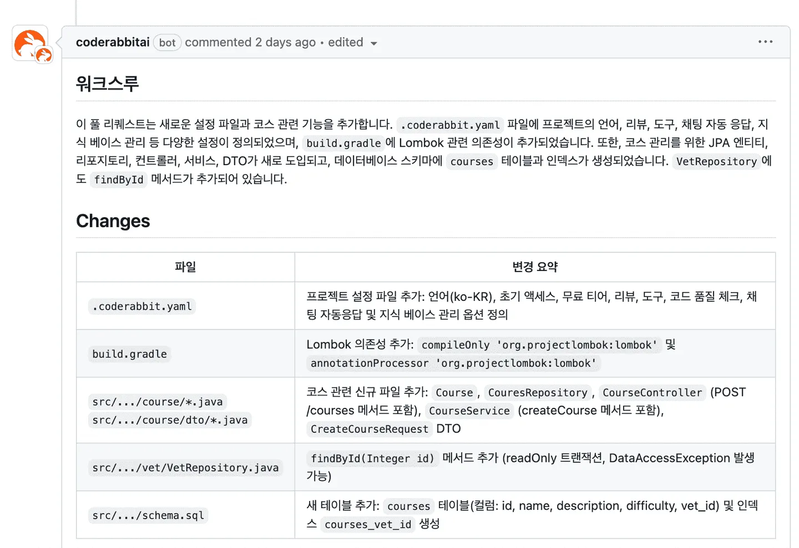
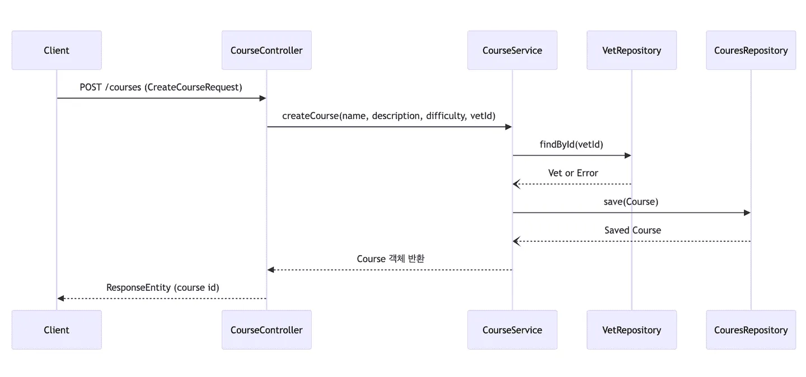
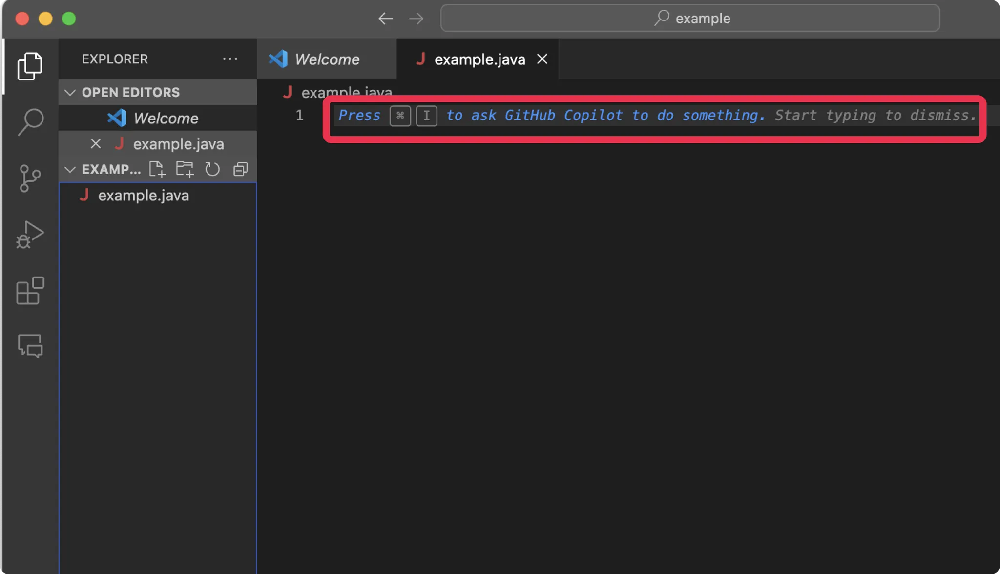
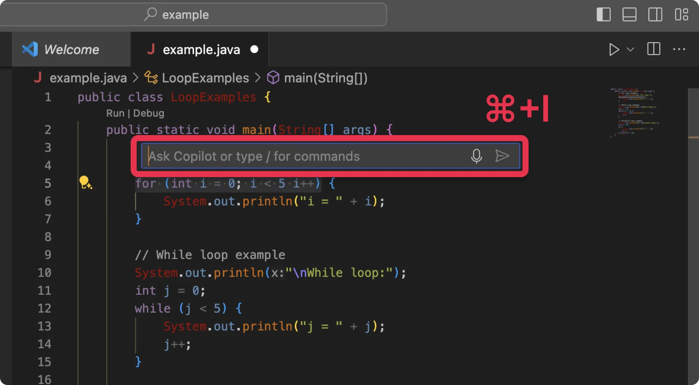
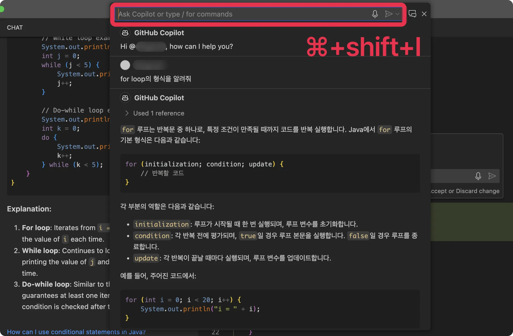
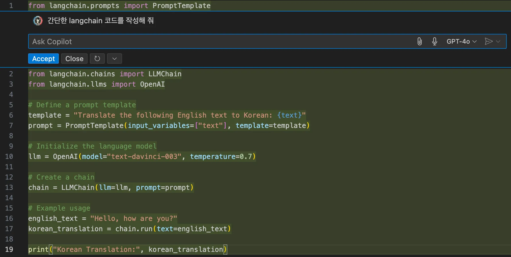
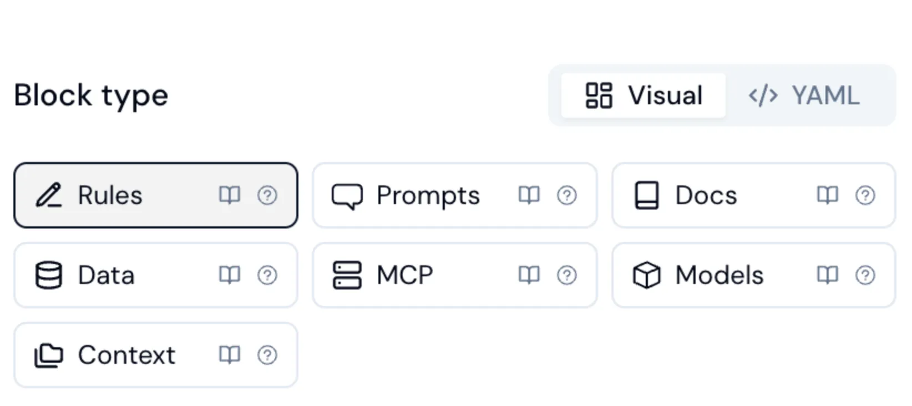
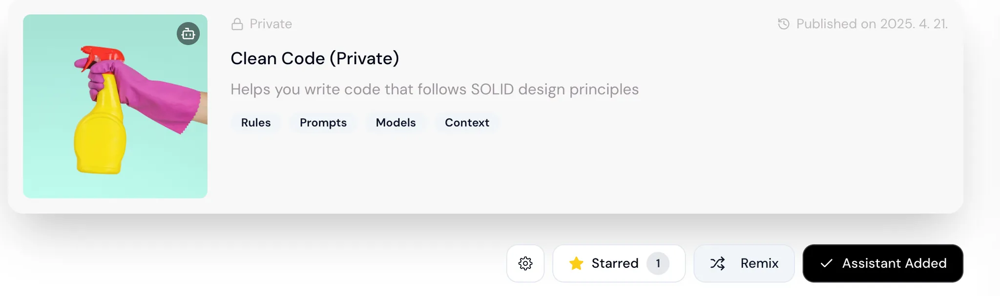
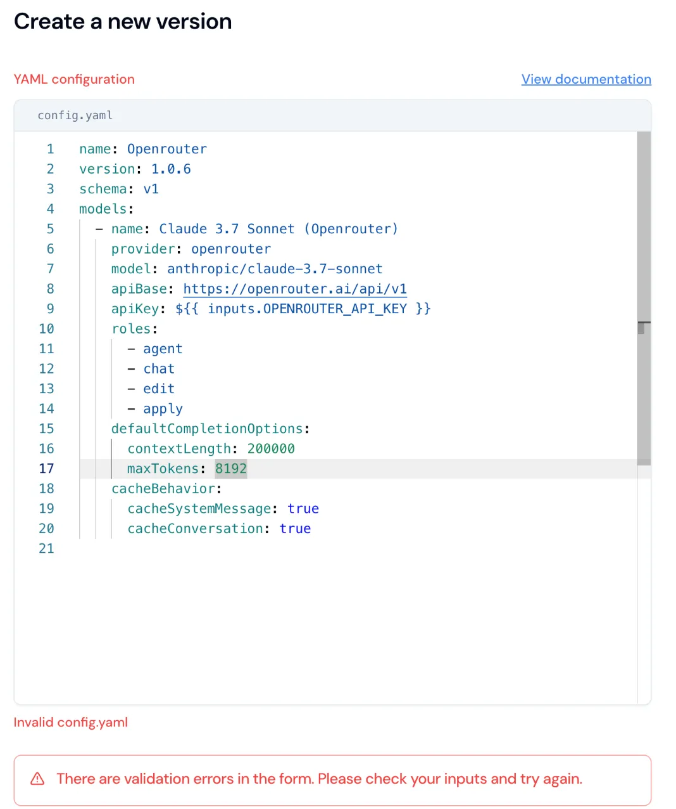

# 유사 AI 툴 조사

## Gemini

> by 이재민

### 기능

- Google의 대형 언어 모델(LaMDA, PaLM, Gemini)을 기반으로 하는 AI 검색 엔진 서비스
- 2023년 3월 미국/영국 영어 버전 베타 시작, 2023년 7월부터 46개 언어 지원

### 성능 및 특징

1. 하이브리드 추론 (Hybrid Reasoning)  
   Gemini 2.5는 단순 질의응답부터 복잡한 분석까지, 필요에 따라 추론 깊이를 조절할 수 있는 유연한 연산 방식을 탑재

2. 100만 토큰 컨텍스트 지원  
   Gemini 2.5 Flash는 최대 1,000,000 토큰 context window를 지원한다. (스트리밍 입력 기반)
   즉, 논문 수십 편도 충분히 학습이 가능하다.

3. 완전한 멀티모달 (텍스트, 이미지, 오디오, 영상까지)  
   Gemini 2.5 Flash는 텍스트 입력은 물론, 이미지, 오디오, 영상 처리 모두 가능하다.
   즉, 멀티모달 reasoning이 가능한 구조로 설계되어있다.

4. 엄청난 비용 효율성  
   우리가 많이 사용하는 ChatGPT와 비교해봤을 때 7배 정도 엄청난 비용의 효율성을 느낄 수 있다.

5. 최대 출력 토큰 수 증가 (→ 65,536 토큰)  
   기존 대부분의 LLM은 출력 한도가 8K~32K 토큰 수준에서 제한되었지만,
   Gemini 2.5 Flash는 최대 65,536 토큰까지 한 번에 생성 가능하다.

이는 책 한 권 분량(약 300~400 페이지에 해당하는 토큰 수)을  
끊김 없이 한 번에 출력할 수 있는 수준으로, 장문 요약, 보고서 생성, 코드 베이스 출력 등에 매우 유리하다는 장점

### 사용성

1. 멀티모달 통합 강화  
   Gemini 2.5는 텍스트, 코드, 이미지, 오디오 등 다양한 입력을 자연스럽게 처리.  
   → 코드 리뷰에서도 단순 코드 텍스트뿐만 아니라, 
   다이어그램, API 문서 이미지 등을 함께 이해할 수 있는 가능성을 보여줌. 

2. 긴 컨텍스트 처리 능력 
   PR처럼 대규모 코드 변경이나 복잡한 파일 구조도 
   별도의 압축 없이 처리할 수 있는 긴 컨텍스트 윈도우 제공. 
   → PR-Agent가 사용하는 Token-aware compression과 다른 접근. 

3. 대화형 코드 지원 
   기존 LLM 대비, 더 자연스럽고 심화된 코드 설명과 수정 제안 가능. 
   단, 이는 아직 범용 LLM 기준이고, 
   PR에 특화된 자동화 워크플로우는 직접 구현해야 함. 

### 정리

PR-Agent와 Gemini 2.5는 둘 다 개발 생산성을 높여주지만, 목적이 다르다.  

PR-Agent는 "코드 리뷰 자동화"에 특화된 도구로, 슬래시 명령어 한 줄이면 리뷰, 개선, 문서화까지 자동으로 처리해준다.  
실무에서 바로 활용할 수 있는 강력한 장점이 존재한다. 

반면, Gemini 2.5는 텍스트, 코드, 이미지, 오디오까지 처리하는 범용 멀티모달 LLM으로, 코드 리뷰뿐만 아니라 다양한 작업에 활용할 수 있는 플랫폼형 AI다. 긴 컨텍스트(100만 토큰) 지원과 멀티모달 기능 덕분에 더 복잡하고 방대한 데이터를 다룰 수 있지만, 자동화 워크플로우는 직접 설계해야 한다.  

결론적으로, 
바로 실무 PR에 적용하여 생산성을 높이고 싶다면 PR-Agent, 
AI를 활용해 새로운 개발 프로세스를 만들고 싶다면 Gemini 2.5가 적합 

---

## CodeRabbit

> by 주소미

### 기능

- **PR 코드 변경 사항 요약 - `summary`**
  - 단순 요약 뿐만 아니라 코드의 변경사항을 쉽게 파악할 수 있는 walkthrough 작성
    
- 코드의 변경사항을 쉽게 이해할 수 있게 `Sequence Diagram` 생성
  
- 인라인 코드 리뷰 및 피드백 → 디버깅 코드 남겨놓는 경우, 타이핑 실수 등등 짚어줌
- Chat : 코드래빗 AI와 comment로 대화 및 질문 가능

### 성능

- **context-Aware Code Review**
  - 전체 시스템 관점에서 어떤 영향을 주는지 맥락까지 고려하여 분석
- 여러 모델을 혼합하여 사용 ⇒ 비용 절감
  - 코드 차이점 요약과 같은 간단한 작업에는 저비용 모델 사용하여 압축
  - gpt-4에서 이를 처리하여 각 파일을 검토
- Anti-pattern 제거 (https://www.coderabbit.ai/blog/5-code-review-anti-patterns-you-can-eliminate-with-ai)
  - 코드 리뷰 시 자주 발생하는 비효율적인 코드 패턴
    - **God Class**: 너무 많은 역할을 가진 거대 클래스 → 변경 시 오류 가능성 증가
    - **Spaghetti Code**: 꼬여있는 코드 흐름 → 디버깅, 리뷰 어려움
    - **Nit-Picking**: 사소한 스타일 피드백에만 집중 → 본질 흐림
    - **Primitive Obsession**: 복잡한 개념을 string, int로 표현 → 의미 손실, 타입 안정성 낮음
    - **Shotgun Surgery**: 작은 변경에 많은 파일 수정 → 유지보수 어려움
    - **Lava Flow**: 쓰이지 않는 코드 방치
    - **Magic Numbers**: 상수 없이 하드코딩된 숫자
    - **Cargo Cult Programming**: 이유 없이 따라한 코드
    - **Yo-Yo Problem**: 상속 구조가 너무 복잡한 경우

### 사용성

- 쉬운 설치 및 연동
  - github, gitlab, or Azure Devops에 로그인하여 코드래빗 대쉬보드에
  - 코드래빗을 적용할 레포지토리를 추가하면 설정 완료

### 정리

- 코드베이스 전체 **맥락 분석**
- 저비용 모델 GPT-3.5로 diff 요약 & 사소한 변경 분류 → 요약문 + 핵심 파일 정밀 리뷰
- 실시간, 저비용, 컨텍스트 중심 리뷰 제공

|                | PR-Agent (Qodo)            | CodeRabbit                                 |
| :------------- | :------------------------- | :----------------------------------------- |
| 리뷰 방식      | 명령어 기반 심층 분석      | PR 생성 즉시 실시간 리뷰, 빠른 속도에 강점 |
| 토큰/비용 전략 | Adaptive Compression       | Dual Model + 캐싱                          |
| 팀 규모        | 대규모 엔터프라이즈에 최적 | 소규모 팀에 최적                           |

- 비용 절감 관련 아티클: https://www.coderabbit.ai/blog/how-we-built-cost-effective-generative-ai-application?utm_source=chatgpt.com

## Copilot

> by 김민지, 최민주

- Github와 OpenAI가 공동 개발한 인공지능 기반 코드 작성 도구
- Visual Studio Code, JetBrains, Neovim 등 다양한 IDE와 통합
- 자연어 프롬프트를 기반으로 함수, 코드 블록, 테스트 코드 등을 생성 가능

 

### 대표 기능 1 - 코드 작동 완성

- 변수의 이름, 함수, 클래스 등을 자동으로 완성

### 대표 기능 2 - Copliot Chat

- VS Code를 사용하는 경우 Github Copilot 익스텐션 설치 시 채팅 탭 추가
- 주의 : 익스텐션 설치 시 내가 설정해놓은 단축키 배치 바뀔 수 있음

### 대표 기능 3 - 인라인 채팅 / 퀵 채팅

### 바이브 코딩

### 장점

| 항목                      | 설명                                                  |
| :------------------------ | :---------------------------------------------------- |
| 생산성 향상               | 반복 작업과 보일러플레이트 코드를 빠르게 작성 가능    |
| 빠른 프로토타이핑         | 아이디어를 빠르게 실험하고 MVP 제작에 유용            |
| 모든 수준의 개발자에 도움 | 초보자에게는 학습, 전문가에게는 시작점 제공           |
| 자연어 기반 코드 생성     | 주석만으로 코드 자동 생성                             |
| 리팩토링/문서화 지원      | docstring 생성, 코드 가독성 향상에 도움               |
| 멀티파일 인식             | 프로젝트 구조를 일부 파악해 코드 제안 (완전하진 않음) |

 

### 단점 및 한계

| 항목                   | 설명                                        |
| :--------------------- | :------------------------------------------ |
| 정확성 부족            | 항상 최적의 코드 생성은 아님. 검토 필요     |
| 보안/라이선스 문제     | 오픈소스 학습으로 인한 라이선스 위반 가능성 |
| 의도 파악 한계         | 복잡한 도메인에서는 오해 가능               |
| 코드 일관성 부족       | 네이밍, 스타일 등 일관성 문제 발생 가능     |
| 종속성 증가 우려       | 사고력 저하, 도구 의존 가능성               |
| 런타임 오류 가능성     | 실행해보기 전까진 오류 여부 판단 불가       |
| 프레임워크/도메인 한계 | 최신 또는 사내 라이브러리에는 약할 수 있음  |

## 정리

**GitHub Copilot**: **코딩 생산성을 높이고자 하는 개인 개발자나 반복적인 코딩 작업이 많은 사용자**

---

## Continue

> by 채윤희

### 사용 방법

- Chat 모델에 도구(tool)를 사용할 수 있는 기능을 부여하여 다양한 코딩 작업을 처리할 수 있도록 함
  → 사용자가 수동으로 컨텍스트를 찾고 작업을 수행하는 작업을 덜어줌
- Chat 내 입력창 아래에서 Agent 모드로 전환 가능

- Chat과 동일한 인터페이스 내에서 동작하기 때문에 같은 입력창을 통해서 메시지를 보내고 여전히 수동으로 컨텍스트 제공 가능
- 자연어로 명령을 내려 모델이 필요한 작업을 수행하게 함
  → Agent는 작업 완료를 위해 사용할 도구를 스스로 결정함

### 성능

- 때때로 상당한 CPU 리소스를 소비하여 특히 대규모 코드베이스에서 성능 문제 및 IDE 지연을 유발한다는 [이슈](https://github.com/continuedev/continue/issues/856)가 있음
- (비교) `PR Agent` 는 파일의 우선순위와 삭제가 아닌 추가된 파일에 집중하는 [PR 압축 전략](https://qodo-merge-docs.qodo.ai/core-abilities/compression_strategy/)을 제공해서 긴 내용의 PR도 처리 가능하지만 Continue는 그러한 기능이 없어서 네트워크 전송시 많은 토큰을 차지할 수 있음

### 사용성

#### 장점

- 프롬프트 custom 기능
  - 어시스턴트 구성 요소(ex. Rules, Prompts, Model 등)가 블록으로 추상화되어 재사용이 좋다.
    
- github repo fork와 비슷한 remix라는 개념이 있는데, 기존에 있는 assistant를 remix해서 사용할 수 있다.
  
- yaml 파일에 자체적으로 validation을 해줘서, 잘못된 설정 파일을 할 수가 없어서 편리하다
  

#### 단점

- default assistant를 정하는 디테일한 기능이 부족한 것 같다.

#### 정리

- PR Agent와의 Continue의 차별점
  - IDE 내 코딩 보조에 집중
  - **개인 개발자**의 실시간 개발 작업 보조에 최적
  - Pull Request에 포함된 **변경된 코드 중심이 아닌** 전체 코드베이스나 **현재 작업 중인 파일** 중심
- 어떻게 활용할 수 있을까?
  - PR Agent는 변경된 코드에만 초점을 맞추기 때문에, **전체 코드베이스에 대한 리뷰나 조언이 필요할 때 Continue가 더 적합**
  - **협업보다는 개인 작업 보조**에 가까운 활용 방식

## 결론 및 느낀 점

- **PR-Agent**: 대규모 품질 관리에 최적, 명령어 기반 분석 강점 - 대규모 팀, 품질/보안 중시
- **CodeRabbit**: 소규모 팀에 적합, 실시간 피드백 강점 - 소규모 팀, 개인 개발자
- **GitHub Copilot**: 생산성 향상에 최적, 실시간 코드 자동완성 - 개인 개발자
- **Gemini 2.5**: 대규모 컨텍스트와 멀티모달 데이터 처리에 강점
- **Continue**: 개인 개발자의 실시간 작업 보조에 적합

> 다양한 AI 코드 리뷰/개발 보조 툴들이 상호보완적으로 활용될 수 있으며, 팀 규모와 목표에 맞는 도구를 선택하는 것이 중요!
