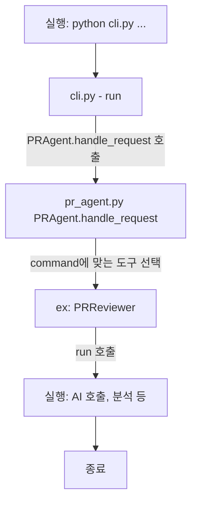
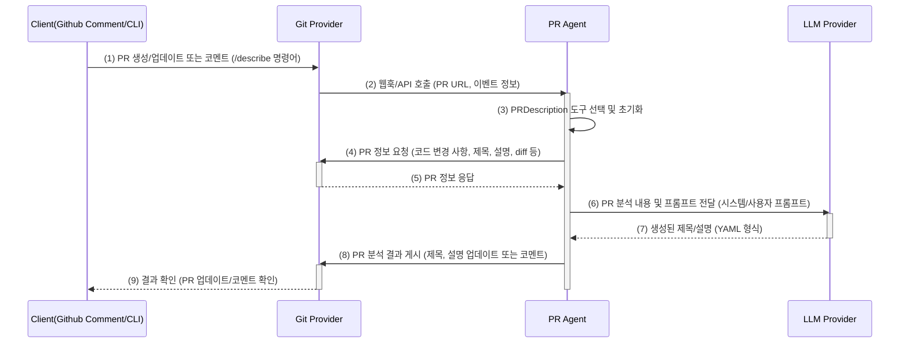

# PR Agent 아키텍처 및 핵심 기능 분석

## 학습 목표

- PR Agent의 아키텍처와 핵심 기능을 이해한다.
- PR Agent의 주요 도구의 동작 방식을 코드레벨에서 분석하고 이해한다.
  - 분석: code, prompt, configuration
  - 도구: /describe, /review, /improve

## 조별 과제

- PR Agent 로컬 개발 환경 설정
- PR Agent 기본 설정 및 코드 분석
- PR Agent 주요 Tool 코드, 프롬프트 및 설정(configuration) 분석

---

# PR Agent 로컬 개발 환경 설정

PR Agent를 로컬에서 실행하기 위해서는 다음과 같은 준비가 필요합니다:

## 필요한 API 키 및 토큰

1. **OpenAI 키 또는 다른 언어 모델 API 키**

   - OpenAI 키는 [OpenAI 웹사이트](https://openai.com)에서 발급 가능
   - GPT-4 및 o3-mini 접근 권한 필요 (또는 다른 언어 모델 사용 가능)

2. **Git 플랫폼 개인 접근 토큰**
   - GitHub, GitLab, BitBucket 또는 Azure DevOps 중 사용할 플랫폼의 토큰
   - GitHub 토큰은 repo 스코프 권한이 필요하며, GitHub 설정에서 발급 가능

## 설치 방법

1. **Docker 이미지 사용**

   - PR Agent는 Docker 이미지를 통해 쉽게 설치 가능
   - 관련 도구 목록은 tools 가이드에서 확인 가능

2. **GitHub Action으로 설정**

   - `.github/workflows/` 디렉토리에 워크플로우 파일 추가

3. **로컬 설치**
   - 저장소 클론 후 Python 환경에서 설치
   - 설정 파일(`.pr_agent.toml`)을 통해 커스터마이징 가능

## 설정 파일 구성

PR Agent는 `.pr_agent.toml` 파일을 통해 설정을 관리합니다. 이 파일은 프로젝트 루트 디렉토리에 위치해야 합니다.

```toml
[github_app]
pr_commands = ["/describe", "/review", "/improve"]

[pr_description]
publish_labels = true
# 기타 설정...
```

---

# PR Agent 기본 설정 및 코드 분석

## 기본 흐름

PR Agent의 기본 실행 흐름은 다음과 같습니다:



### 핵심 클래스 및 모듈

- **PRAgent 클래스**: 모든 요청을 처리하는 중앙 디스패처
- **command2class 딕셔너리**: 명령어와 해당 클래스를 매핑
  ```python
  command2class = {
      "review": PRReviewer,
      "describe": PRDescription,
      "improve": PRCodeSuggestions,
      # ...
  }
  ```

### 공통 구성 요소

1. **모델 설정**

   - `model`: 사용할 LLM 모델 지정
   - `max_model_tokens`: 모델 요청 시 최대 토큰 수

2. **Git 제공자 설정**

   - `git_provider`: GitHub, GitLab 등 연동할 플랫폼

3. **응답 설정**

   - `response_language`: 출력 언어 형식(로케일) 지정
   - `publish_output`: 디버깅 출력 결과 게시 여부

4. **토큰 관리**
   - `max_description_tokens`: PR 설명 생성에 사용할 최대 토큰 수
   - `max_commits_tokens`: 커밋 메시지 요약 시 최대 토큰 수
   - `model_token_count_estimate_factor`: 토큰 예측 여유 계수(기본 1.3)

## 공통 동작 흐름

1. **PR 정보 초기화**

   - Git Provider를 통해 PR URL, 브랜치, 파일, 커밋 등 메타데이터 로딩

2. **설정값 로딩**

   - configuration.toml에서 각 명령어에 해당하는 세부 옵션 로드

3. **AI 핸들러 및 토큰 핸들러 초기화**

   - 모델 호출을 위한 핸들러 생성
   - 입력/출력 토큰 수를 관리하기 위한 TokenHandler 활성화

4. **프롬프트 생성 및 AI 호출**

   - 기능별 프롬프트 구조에 따라 입력 구성
   - 설정에 따라 단일 호출 또는 청크 단위 다중 호출 방식 선택

5. **AI 응답 처리**

   - 출력 결과 파싱 (YAML 또는 Markdown)
   - 점수화(Self-reflection), 정렬, 필터링 등 후처리 단계 포함 가능

6. **결과 게시**
   - 설정에 따라 PR 본문, 주석 또는 인라인 형태로 게시

---

# `/describe` 기능 코드리뷰

PR Agent는 코드 리뷰 효율을 높이는 도구입니다. 특히, `/describe` 명령어는 PR 제목과 설명을 자동으로 생성하여 개발자의 시간을 절약해줍니다. 마치, 숙련된 동료 개발자가 PR 내용을 쓱 훑어보고 핵심을 짚어주는 것과 같습니다.

## I. 기능 개요

`/describe` 명령어는 PR의 코드 변경점을 스캔하여 자동으로 다음 요소를 생성합니다:

- PR 제목 (설정에 따라)
- PR 종류(Type): Bug fix, Enhancement 등
- 요약(Summary): 변경 사항의 핵심 내용
- 변경 파일 분석: 파일별 변경 내용 요약

## II. 실행 흐름 분석

`/describe` 명령어가 실행되는 전체 흐름을 시퀀스 다이어그램으로 표현하면 다음과 같습니다:



### 1단계. PR 생성/업데이트 또는 코멘트 (/describe 명령어)

개발자가 PR을 만들거나 업데이트하고, 또는 PR에 `/describe` 명령어를 댓글로 남기면 GitHub는 이를 감지합니다.

### 2단계. 웹훅/API 호출

GitHub는 이벤트(PR 생성, 업데이트, 댓글)를 감지하면 PR Agent 서버에 웹훅 또는 API 호출을 보냅니다. GitHub App의 경우, `handle_new_pr_opened` 함수에서 이 이벤트를 처리합니다.

```python
# pr_agent/servers/github_app.py
async def handle_new_pr_opened(body: Dict[str, Any], ...):
    # 1. 새로운 PR 이벤트를 처리하는 함수
    pull_request, api_url = _check_pull_request_event(action, body, log_context)

    # 2. PR 이벤트 유효성 검사
    if action in get_settings().github_app.handle_pr_actions:  # ['opened', 'reopened', 'ready_for_review']
        # 3. 설정에 따라 자동 명령 실행 여부 결정
        ...
```

### 3단계. PRDescription 도구 선택

PR Agent 서버는 웹훅/API 호출을 받으면, 해당 요청을 처리할 도구를 선택합니다. `/describe` 명령어이므로, `PRDescription` 도구를 선택합니다. 이 과정은 `PRAgent` 클래스의 `handle_request` 메서드에서 이루어집니다.

```python
# pr_agent/agent/pr_agent.py
command2class = {
    "review": PRReviewer,
    "describe": PRDescription,  #  bool:
        action, *args = request
        # action  None:
        ...
        output = get_pr_diff(self.git_provider, self.token_handler, ...)
```

실제 API 연동은 `GithubProvider.get_diff_files()`에서 이루어집니다. GitHub SDK를 통해 diff 파일 목록을 가져옵니다.

```python
# pr_agent/git_provider/github_provider.py
class GithubProvider(GitProvider):
    def _get_repo(self):
        # 실제 통신이 일어납니다. GitHub SDK를 연결해두었습니다.
        self.repo_obj = self.github_client.get_repo(self.repo)
        return self.repo_obj
```

### 5단계. PR 정보 응답

GitHub API는 diff 정보와 함께 PR 제목, 본문 등 metadata를 응답합니다. `get_pr_description` 메서드는 PR 본문 내용을 가져오는데 사용됩니다.

### 6단계. PR 분석 내용 및 프롬프트 전달

PR Agent는 GitHub로부터 받은 PR 정보와 함께, AI 모델에게 전달할 프롬프트를 생성합니다. 프롬프트는 `pr_description_prompts.toml` 파일에 정의되어 있으며, LLM에게 PR의 내용을 요약하고, 적절한 제목과 설명을 생성하도록 지시하는 역할을 합니다.

```python
# pr_agent/tools/pr_description.py
class PRDescription:
    async def _get_prediction(self, model: str, patches_diff: str, prompt="pr_description_prompt") -> str:
         # LLM 예측을 얻기 위한 메서드
         variables = copy.deepcopy(self.vars)
         variables["diff"] = patches_diff  # update diff

         environment = Environment(undefined=StrictUndefined)
         system_prompt = environment.from_string(get_settings().get(prompt, {}).get("system", "")).render(self.variables)
         user_prompt = environment.from_string(get_settings().get(prompt, {}).get("user", "")).render(self.variables)

         response, finish_reason = await self.ai_handler.chat_completion(...)
         return response
```

템플릿 엔진을 사용하여 시스템 프롬프트와 사용자 프롬프트를 조합하고, `ai_handler`를 통해 LLM에 전달합니다.

#### 프롬프트 구조 분석

<details>

<summary>pr_description_prompts.toml의 프롬프트 템플릿</summary>

- **System 프롬프트:** LLM에게 역할("PR 전문가")과 목표를 부여합니다.

  ```toml
  [pr_description_prompt]
  system="""You are PR-Reviewer, a language model designed to review a Git Pull Request (PR).
  Your task is to provide a full description for the PR content - type, description, title and files walkthrough.
  ...
  The output must be a YAML object equivalent to type $PRDescription, according to the following Pydantic definitions:
  ...
  """
  ```

  이 시스템 프롬프트는 LLM에게 PR 검토 전문가로서 PR 콘텐츠(유형, 설명, 제목, 파일 개요)를 완벽하게 설명하는 역할을 부여합니다.

- **User 프롬프트:** LLM에게 실제 PR 정보(제목, 설명, 변경 사항 등)를 전달합니다.

  ````toml
  [pr_description_prompt]
  user="""
  ...
  PR Info:

  Previous title: '{{title}}'
  ...
  The PR Git Diff:
  =====
  {{ diff|trim }}
  =====
  ...
  Response (should be a valid YAML, and nothing else):
  ```yaml
  """
  ````

  `{{ diff|trim }}`과 같은 Jinja2 템플릿 변수를 사용하여 PR 정보를 동적으로 프롬프트에 삽입합니다.

</details>

1. **시스템 프롬프트(System Prompt)**

   - AI에게 "PR-Reviewer" 역할 부여
   - PR 내용에 대한 완전한 설명 생성 지시
   - 새로 추가된 코드(`+`로 시작하는 줄)에 집중하도록 지시
   - 기존 제목/설명/커밋 메시지는 부정확할 수 있음을 인지
   - YAML 형식의 출력 구조 정의

2. **사용자 프롬프트(User Prompt)**
   - PR 기본 정보(제목, 설명, 브랜치, 커밋 메시지) 제공
   - 실제 코드 변경사항(diff) 제공
   - 응답 형식 지정(YAML)

### 7단계. 생성된 제목/설명

LLM은 PR 분석 결과와 프롬프트를 바탕으로 새로운 제목과 설명을 생성하고, 이를 YAML 형식으로 PR Agent에게 반환합니다.

### 8단계. 마크다운 형식으로 변환 및 PR 분석 결과 게시

PR Agent는 LLM으로부터 받은 YAML 형식의 제목과 설명을 마크다운 형식으로 변환하고, GitHub를 통해 PR에 게시합니다. `process_pr_files_prediction` 메서드는 파일 목록을 마크다운 테이블로 만들어줍니다.

```python
# pr_agent/tools/pr_description.py
class PRDescription:
    def process_pr_files_prediction(self, pr_body, value):
        pr_comments = []
        # PR에 관련된 파일 목록을 마크다운 테이블 형식으로 생성
        ...
        try:
            # 하드코딩된 테이블 텍스트들
            pr_body += ""
            header = f"Relevant files"
            delta = 75
            pr_body += f"""{header}"""
            pr_body += """"""

            for semantic_label in value.keys():
                # 파일 목록 처리
                ...
            pr_body += """"""

        except Exception as e:
            get_logger().error(f"Error processing pr files to markdown {self.pr_id}: {str(e)}")
            pass

        return pr_body, pr_comments
```

PR Agent는 설정에 따라 PR 설명을 코멘트로 게시할지, 아니면 PR 자체를 업데이트할지 결정하고, GitHub를 통해 게시합니다.

```python
# pr_agent/tools/pr_description.py
class PRDescription:
    def run(self):
        ...
        if get_settings().config.publish_output:
            if get_settings().pr_description.publish_description_as_comment:
                # Yes, 코멘트로 게시
                self.git_provider.publish_comment(full_markdown_description)
            else:
                # No, 업데이트로 게시
                self.git_provider.publish_description(pr_title, pr_body)
```

### 9단계. 결과 확인

마지막으로, 개발자는 GitHub(또는 GitLab 등)에서 PR이 업데이트되거나 새로운 코멘트가 추가된 것을 확인하여 PR 분석 결과를 확인합니다.

## III. 주요 설정 옵션

`/describe` 명령어는 `configuration.toml` 파일의 `pr_description` 섹션에서 설정할 수 있습니다. 주요 설정 옵션은 다음과 같습니다:

| **설정 항목**                               | **기본값** | **설명**                                                   |
| ------------------------------------------- | ---------- | ---------------------------------------------------------- |
| **🔧 기본 설정**                            |            |                                                            |
| `publish_labels`                            | false      | PR에 라벨을 자동으로 추가함                                |
| `add_original_user_description`             | true       | 원래 PR 설명을 AI 설명과 함께 병합                         |
| `generate_ai_title`                         | false      | AI가 PR 제목을 생성                                        |
| `use_bullet_points`                         | true       | PR 설명에 불릿 포인트 형식을 사용                          |
| `extra_instructions`                        | ""         | 특정 파일 무시 등 세부 지시사항 전달 가능                  |
| `enable_pr_type`                            | true       | PR 타입을 설명에 포함 (버그, 기능 등)                      |
| `final_update_message`                      | true       | `/describe` 호출 후 업데이트 메시지 추가                   |
| **💬 PR 설명 처리 방식**                    |            |                                                            |
| `publish_description_as_comment`            | false      | 설명을 댓글로 남길지 여부 (false면 PR 본문 덮어씀)         |
| `publish_description_as_comment_persistent` | true       | 댓글 설명이 지속적으로 유지되도록 설정                     |
| **🧾 Changes Walkthrough 관련**             |            |                                                            |
| `enable_semantic_files_types`               | true       | 변경된 파일 내용을 정리한 요약 섹션 생성                   |
| `collapsible_file_list`                     | 'adaptive' | 파일 리스트가 많을 경우(8개 이상) 자동으로 접을 수 있게 함 |
| `enable_large_pr_handling`                  | true       | 큰 PR을 여러 조각으로 나누어 처리                          |

## IV. 코드 구조 및 주요 메서드

### 초기화 (`__init__`)

- PR 정보 초기화
- Git Provider 객체 생성
- AI 핸들러 및 토큰 핸들러 초기화

### 실행 (`run`)

1. **PR Diff 가져오기**

   - PR의 변경 사항(diff)을 기반으로 프롬프트 생성
   - 큰 PR의 경우, diff를 여러 패치로 나누어 비동기적으로 처리

2. **AI 모델 호출**

   - `_get_prediction()` 메서드를 통해 AI 모델에 프롬프트 전달
   - AI 응답에 포함되지 않은 파일은 `extend_uncovered_files`로 추가 처리

3. **결과 처리**

   - AI 응답(YAML 형식)을 Python 딕셔너리로 파싱
   - title, type, description, pr_files 순서로 키 정렬
   - 사용자가 작성한 기존 PR 설명을 결과에 포함

4. **파일 라벨 처리**

   - 각 파일에 대해 변경 요약, 변경 제목, 라벨 생성
   - 라벨 정보를 딕셔너리 형태로 정리하여 PR 설명에 포함

5. **최종 PR 설명 생성 및 게시**
   - 생성된 PR 제목과 설명을 GitHub 또는 GitLab에 게시
   - 설정에 따라 주석 또는 PR 본문에 추가
   - Bug fix, Enhancement 등의 라벨을 PR에 자동 게시

## V. 기술적 특징

### 비동기 프로그래밍

PR Agent는 `async`/`await` 키워드를 사용한 비동기 프로그래밍 패턴을 적극 활용합니다. 이를 통해 I/O 바운드 작업(API 호출, 파일 읽기 등)을 효율적으로 처리합니다.

### YAML 활용

LLM과의 통신에서 구조화된 데이터 형식으로 YAML을 사용합니다. 이는 다음과 같은 이점이 있습니다:

- 사람이 읽기 쉬운 형태로 복잡한 데이터 표현
- 프로그램 간 데이터 교환에 용이
- 들여쓰기를 통한 계층 구조 표현

### 토큰 관리

PR Agent는 `TokenHandler` 클래스를 통해 LLM에 전송되는 토큰 수를 관리합니다. 이는 모델의 컨텍스트 창 크기 제한을 고려하여 최적의 입력을 구성하는 데 중요합니다.

### 템플릿 엔진

Jinja2 템플릿 엔진을 사용하여 프롬프트를 동적으로 생성합니다. 이를 통해 PR의 실제 내용, 설정 값, 사용자 지정 지침 등을 프롬프트에 유연하게 통합할 수 있습니다.

## VI. 결론

`/describe` 기능은 PR Agent의 핵심 기능 중 하나로, 개발자가 PR을 작성하는 데 소요되는 시간을 크게 줄여줍니다. 코드 변경 사항을 자동으로 분석하여 명확하고 구조화된 PR 설명을 생성함으로써, 팀 내 코드 리뷰 프로세스를 효율화하고 PR의 품질을 향상시킵니다.
