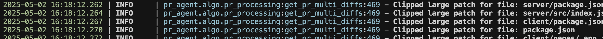
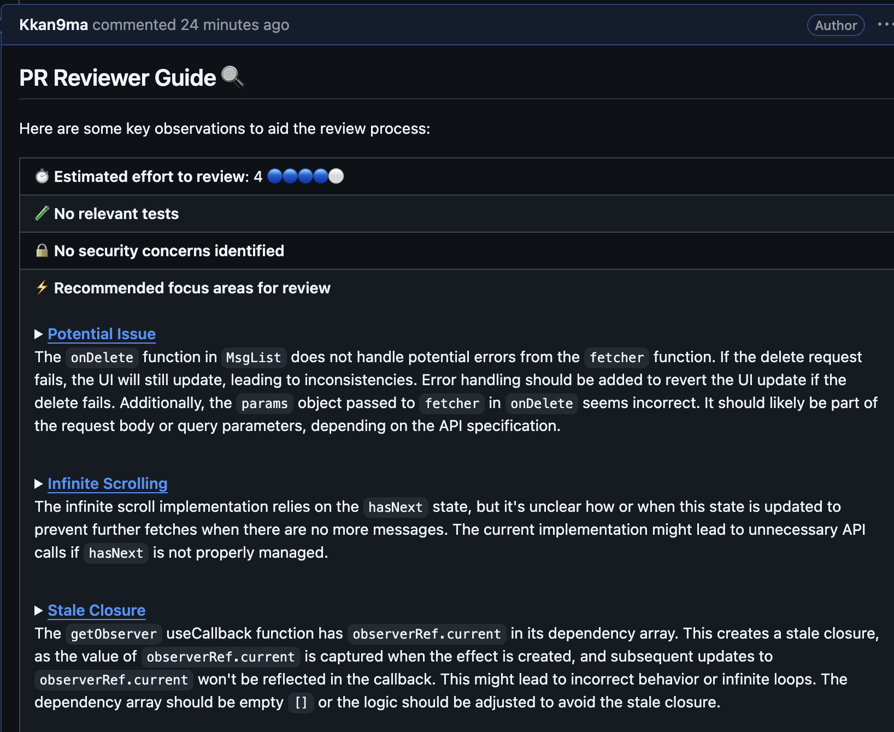
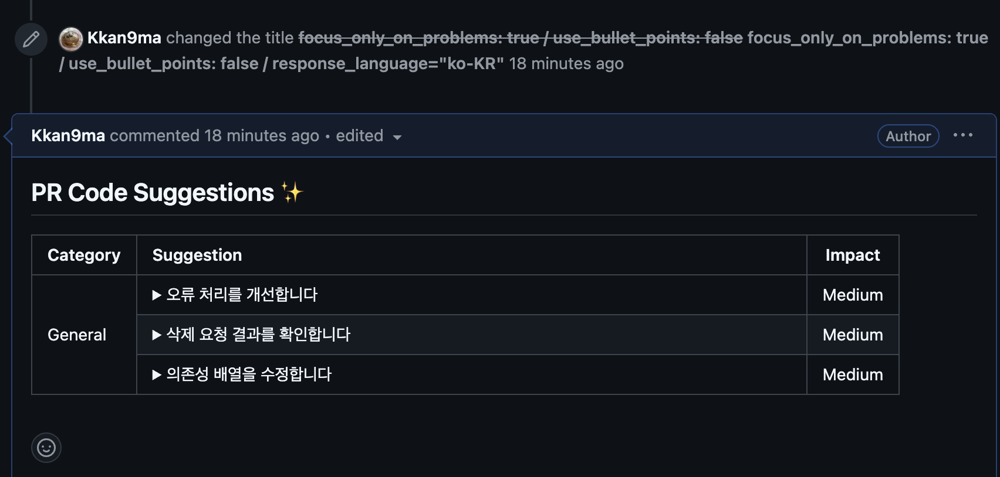
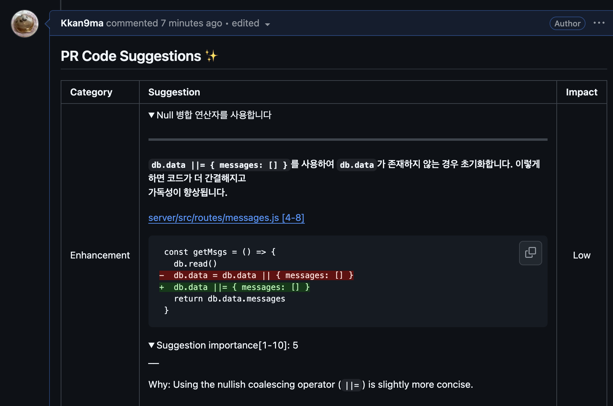
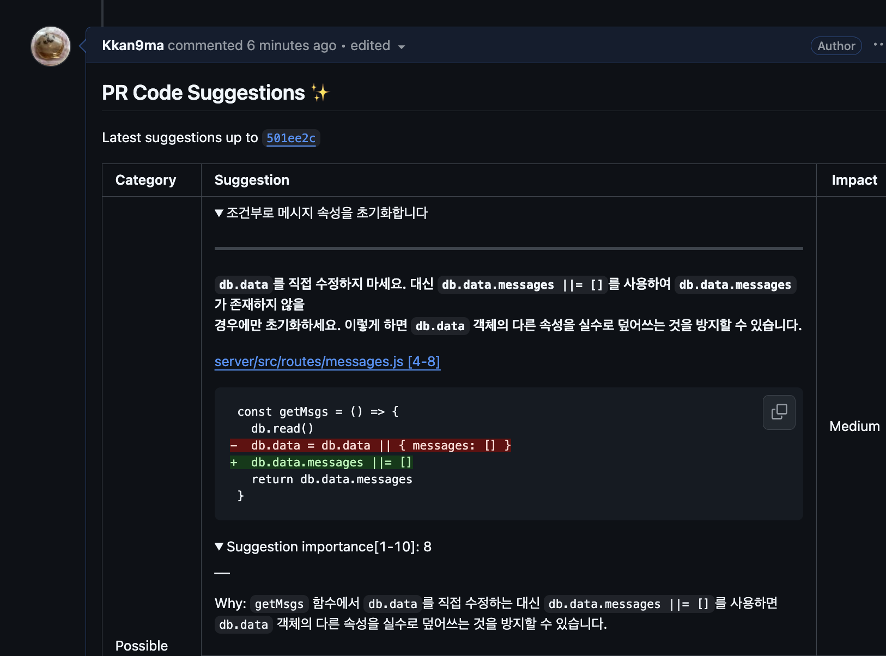
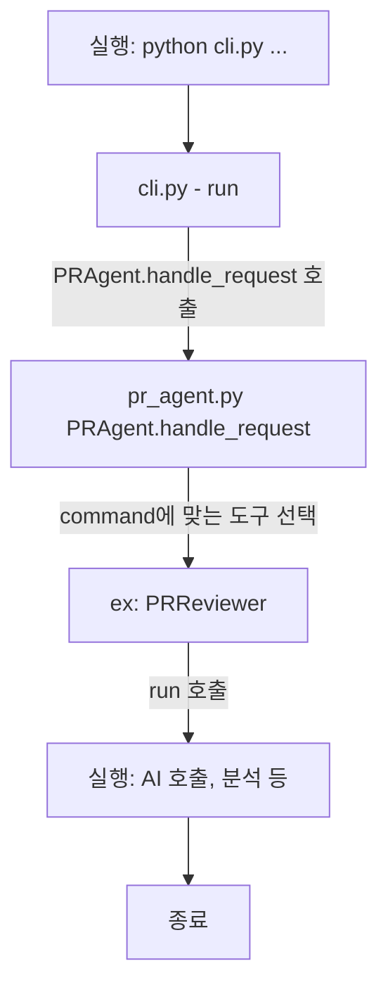

# 3주차 과제
## 설치 방법 및 기본 실행

* Using pip package
  - 참고: https://qodo-merge-docs.qodo.ai/installation/locally/

### 1. 설치

#### 환경 설정: 패키지 설치 및 가상 환경 설정, secret 파일 설정

- Navigate to the `/pr-agent` folder and install the requirements in your favorite virtual environment
    - `pip install -e .`
- Copy the secrets template file and fill in your OpenAI key and your GitHub user token:
    - `cp pr_agent/settings/.secrets_template.toml pr_agent/settings/.secrets.toml
    chmod 600 pr_agent/settings/.secrets.toml` (Edit .secrets.toml file)

* [github token: classic 방식](https://docs.github.com/authentication/keeping-your-account-and-data-secure/managing-your-personal-access-tokens)

### 2. 파일에 작업

- OpenAI → Gemini 모델 기반으로 전환
- `cli_pip.py` 실행 파일에서 Gemini 키를 추가로 받도록 수정
- 모델의 최대 토큰 수를 업데이트하여 Gemini 모델들을 지원 (`__init__.py`)
- `configuration.toml` 파일에서 모델을 변경

```diff
diff --git a/pr_agent/algo/__init__.py b/pr_agent/algo/__init__.py
index 8d805baf..bc6999c2 100644
--- a/pr_agent/algo/__init__.py
+++ b/pr_agent/algo/__init__.py
@@ -128,6 +128,12 @@ MAX_TOKENS = {
     "mistral/codestral-mamba-latest": 256000,
     "codestral/codestral-latest": 8191,
     "codestral/codestral-2405": 8191,
+    'google_ai_studio/gemini-1.5-pro': 1048576,
+    'google_ai_studio/gemini-1.5-flash': 1048576,
+    'google_ai_studio/gemini-2.5-pro-preview-03-25': 1048576,
+    'gemini/gemini-1.5-pro-latest': 1048576,
+    'gemini/gemini-1.5-flash-latest': 1048576,
+    'codechat-bison': 6144,
 }

```

```diff
diff --git a/pr_agent/settings/configuration.toml b/pr_agent/settings/configuration.toml
index e63b7ea8..32fa35c7 100644
--- a/pr_agent/settings/configuration.toml
+++ b/pr_agent/settings/configuration.toml
@@ -6,8 +6,11 @@
 
 [config]
 # models
-model="o4-mini"
-fallback_models=["gpt-4.1"]
+# model="o4-mini"
+model="gemini/gemini-1.5-pro-latest"
+# fallback_models=["gpt-4.1"]
+fallback_models=["gemini/gemini-1.5-flash-latest"]
+
 #model_reasoning="o4-mini" # dedictated reasoning model for self-reflection
 #model_weak="gpt-4o" # optional, a weaker model to use for some easier tasks
 # CLI

```

#### `pr_agent/cli_pip.py`

- 실행부 설정 변경: 직접 입력

```python
diff --git a/pr_agent/cli_pip.py b/pr_agent/cli_pip.py
index caa56f0c..fdc96350 100644
--- a/pr_agent/cli_pip.py
+++ b/pr_agent/cli_pip.py
@@ -5,14 +5,16 @@ from pr_agent.config_loader import get_settings
 def main():
     # Fill in the following values
     provider = "github"  # GitHub provider
-    user_token = "..."  # GitHub user token
-    openai_key = "..."  # OpenAI key
+    user_token = "github_user_token"  # GitHub user token
+    # openai_key = "..."  # OpenAI key
+    gemini_key = "gemini_key";
     pr_url = "..."  # PR URL, for example 'https://github.com/Codium-ai/pr-agent/pull/809'
     command = "/review"  # Command to run (e.g. '/review', '/describe', '/ask="What is the purpose of this PR?"')
 
     # Setting the configurations
     get_settings().set("CONFIG.git_provider", provider)
-    get_settings().set("openai.key", openai_key)
+    # get_settings().set("openai.key", openai_key)
+    get_settings().set("google_ai_studio.gemini_api_key", gemini_key)
     get_settings().set("github.user_token", user_token)
 
     # Run the command. Feedback will appear in GitHub PR comments

```

- 실행부 설정 변경: `.secrets.toml` 사용 시

```python
// /pr_agent/cli_pip.py

def main():
    # Fill in the following values
    provider = "github"  # GitHub provider
-   user_token = "..."  # GitHub user token
-   openai_key = "..."  # OpenAI key
    pr_url = "..."  # PR URL, for example 'https://github.com/Codium-ai/pr-agent/pull/809'
    command = "/review"  # Command to run (e.g. '/review', '/describe', '/ask="What is the purpose of this PR?"')

    # Setting the configurations
    get_settings().set("CONFIG.git_provider", provider)
-   get_settings().set("openai.key", openai_key)
-   get_settings().set("github.user_token", user_token)

    # Run the command. Feedback will appear in GitHub PR comments

// /pr-agent/settings/.secrets.toml
[github]
user_token = "github_user_token"

[google_ai_studio]
gemini_api_key = "gemini_api_key"
```

```toml
// .secrets.toml
[github]
user_token = "user_token"

[google_ai_studio]
gemini_api_key = "api_key"
```

- 참고: `.secrets.toml` 은 `config_loader.py` 로 적용된다.

### 3. CLI를 이용한 기본 실행 스크립트

Run the cli.py script:

* `python3 -m pr_agent.cli --pr_url <pr_url> review`
* `python3 -m pr_agent.cli --pr_url <pr_url> ask <your question>`
* `python3 -m pr_agent.cli --pr_url <pr_url> describe`
* `python3 -m pr_agent.cli --pr_url <pr_url> improve`
* `python3 -m pr_agent.cli --pr_url <pr_url> add_docs`
* `python3 -m pr_agent.cli --pr_url <pr_url> generate_labels`
* `python3 -m pr_agent.cli --issue_url <issue_url> similar_issue`

### 4. 에디터 디버그 세팅 예시

```json
// cursor 사용
// .vscode/launch.json

{
  "version": "0.2.0",
  "configurations": [
    {
      "name": "Python: PR Agent CLI - describe",
      "type": "debugpy",
      "request": "launch",
      "module": "pr_agent.cli",
      "console": "integratedTerminal",
      "args": [
        "--pr_url", "https://github.com/group-3-sPRinter/pr-agent/pull/8",
        "describe"
      ],
      "justMyCode": false
    }
  ]
}

```

### 5. 기본 설정 변경

- 모델 변경 방법

  ```toml
    # model="o4-mini"
    model="gemini/gemini-1.5-pro-latest"
    # fallback_models=["gpt-4.1"]
    fallback_models=["gemini/gemini-1.5-pro-latest"]
  ```

- 토큰 수 변경 방법 (예시)
  ```toml
    # token limits
    max_description_tokens =1 
    max_commits_tokens = 1
    max_model_tokens = 1 # Limits the maximum number of tokens that can be used by any model, regardless of the model's default capabilities.
  ```
  - 결과: 극단적으로 줄이니 → 분석 불가 (Clipped)
    - 


## 다양한 옵션 활용
### response_language

| **default**                           | **ko-KR**                      |
|  -------------------------------------- | ------------------------------------------- |
|| |

### focus_only_on_problems: false/true
| **false**                           | **true**                      |
|  -------------------------------------- | ------------------------------------------- |
|||
|가독성 측면에서만 문제를 파악|같은 변화에 대해서 리뷰한 것이나, 실제 발생하는 문제에 초점을 맞추어 설명|


## PR-Agent의 간략한 구조

