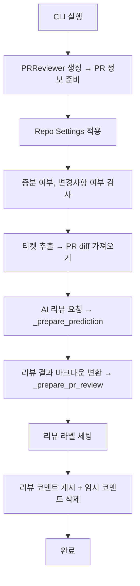

# 3주차 조별과제: PR Agent 개발 환경 설정 및 주요 태스크 코드 분석
## [4조] 주제 3: review(설정 및 코드) 조사, 분석, 사용, 정리
- 진행 방식: 조별 회의 진행 후 review 기능 관련 설정 옵션 분담, 팀원 개별 branch 생성해 PR /review 사용해보고 담당한 옵션 분석 및 정리
- 수행 결과: 전원 완료 (이서현, 정동환, 박영신, 박상민, 김범진)
---
## PR Agent 사용을 위한 세팅 및 /review 사용하기
- 세팅 순서
   1. pr-agnet 레포지토리로 이동
   2. 의존성 설치
   3. `pr_agent/settings/.secrets_template.toml` 복사해 `pr_agent/settings/.secrets.toml` 생성 (.gitignore를 위한 것)
   4. `pr_agent/settings/.secrets.toml` 편집
      - 50번째 줄 gemini_api_key=에 Google AI Studio에서 발급받은 나의 gemini api key 작성
      - 54번째 줄 user_token=에 GitHub에서 생성한 나의 Personal access token 작성
   5. `python3 -m pr_agent.cli --pr_url <pr링크> <명령어>` 입력해 사용 가능 -> 명령어로 review 입력
```
(base) leeseohyun@iseohyeon-ui-MacBookPro ~ % cd Documents/GitHub/pr-agent

(base) leeseohyun@iseohyeon-ui-MacBookPro pr-agent % pip install -e .

(base) leeseohyun@iseohyeon-ui-MacBookPro pr-agent % cp pr_agent/settings/.secrets_template.toml pr_agent/settings/.secrets.toml
(base) leeseohyun@iseohyeon-ui-MacBookPro pr-agent % chmod 600 pr_agent/settings/.secrets.toml

(base) leeseohyun@iseohyeon-ui-MacBookPro pr-agent % python3 -m pr_agent.cli --pr_url https://github.com/ossca-2025-pr-agent-mentoring-group4/pr-agent/pull/2 review
2025-05-04 11:26:00.159 | INFO     | pr_agent.git_providers.utils:apply_repo_settings:46 - Applying repo settings:
{'PR_REVIEWER': {'enable_review_labels_effort': True, 'enable_auto_approval': True}}
2025-05-04 11:26:02.392 | INFO     | pr_agent.tools.pr_reviewer:run:131 - Reviewing PR: https://github.com/ossca-2025-pr-agent-mentoring-group4/pr-agent/pull/2 ...
2025-05-04 11:26:02.393 | INFO     | pr_agent.git_providers.git_provider:get_user_description:161 - Existing description was not generated by the pr-agent
2025-05-04 11:26:04.422 | INFO     | pr_agent.algo.pr_processing:get_pr_diff:63 - PR main language: Python
2025-05-04 11:26:04.428 | INFO     | pr_agent.algo.pr_processing:get_pr_diff:74 - Tokens: 1494, total tokens under limit: 32000, returning full diff.
2025-05-04 11:26:05.737 | INFO     | pr_agent.tools.pr_reviewer:set_review_labels:398 - Setting review labels:
['Review effort 1/5']
```

## pr_reviewer.py
PR Agent 리뷰 기능을 위한 핵심 로직이 작성되어있는 파일. 클래스 `PRReviewer`는 AI 모델을 사용해 PR을 검토하고 피드백을 생성하는 역할을 한다. 여러 필드와 비동기 메소드, 동기 메소드들이 정의되어있다.

## review 동작 프로세스



**[START] 명령 실행** 

1. CLI가 실행되면 → PRReviewer 인스턴스 생성 (pr_agent.tools.pr_reviewer.PRReviewer)
2. PRReviewer.init 실행
   - git_provider 세팅 → PR 정보를 가져올 준비
   - PR description, files, languages, 커밋 메시지 등 메타데이터 준비
  
**[SETUP] 설정 적용**

3. pr_agent.git_providers.utils:apply_repo_settings
   - PR 저장소의 .pr-agent.toml (repo settings) 가져와 동적으로 설정 덮어쓰기

**[CHECK] PR 상태 확인**

4. PRReviewer.run() → 초기 상태 체크
   - PR 파일이 없으면 → 스킵
   - 증분 리뷰 조건 (_can_run_incremental_review()) 만족 못하면 → 스킵
   - 증분 리뷰이고 변경 파일도 없으면 → 스킵 + 코멘트 남기고 종료
5. Preparing review 코멘트 임시로 게시

**[PROCESS] 리뷰 준비 및 AI 호출**

6. 티켓 추출 (있을 경우 → extract_and_cache_pr_tickets)
   - PR 커밋 메시지나 diff에서 Jira 등 이슈 키워드 찾기
7. pr_agent.algo.pr_processing:get_pr_diff
   - 전체 diff or 증분 diff 계산
   - diff 내 AI 메타데이터 주입 (enable_ai_metadata 옵션 시)
   - 토큰 계산 및 체크
8. retry_with_fallback_models → _prepare_prediction
   - AI 모델에게 리뷰 요청 (diff 기반으로 system/user 프롬프트 전달)
   - 예외 발생하면 fallback 모델로 재시도

**[POST PROCESS] 리뷰 결과 처리**

9. _prepare_pr_review
   - AI 응답을 yaml → dict → markdown 리뷰로 변환
   - 보안/테스트/effort 검토 필드가 있을 경우 라벨로 세팅 (set_review_labels)
10. 리뷰 결과 게시
   - 증분 리뷰 → 일반 코멘트
   - 일반 리뷰 → Persistent 코멘트 (기존 리뷰 갱신 or 신규 등록)
11. 임시 코멘트 제거

**[DONE] 리뷰 완료 or 실패**

12. 예외 발생 or 리뷰 없을 경우 → 초기 임시 코멘트만 제거 후 종료

## Full Review vs. Incremental Review
- **Full Review(전체 리뷰)** :  PR 전체 diff를 기반으로 리뷰. 현재 PR 전체 변경사항에 대한 리뷰 코멘트가 담김. (기본 동작 모드)
   - 사용 시점: 처음 PR이 만들어졌을 때, 증분 리뷰 옵션을 설정하지 않았을 때, Incremental 리뷰 조건이 만족되지 않았을 때.
   - `python3 -m pr_agent.cli --pr_url <PR URL> review`
- **Incremental Review(증분 리뷰)** : 마지막 리뷰 이후 새로 생긴 커밋이나 변경사항만 리뷰.
   - 사용 방법: 옵션 -i를 붙임 `python3 -m pr_agent.cli --pr_url <PR URL> review -i`
     (pr_reviewer.py의 self.incremental = self.parse_incremental(args)에서 -i를 인식, is_incremental이 True로 설정됨) 
   - 이점: 이미 리뷰한 부분은 제외 → 새로 변경된 부분만 집중해서 리뷰. 이미 리뷰 받은 후 반영한 커밋만 재검토할 때 효율적.
   - 조건을 만족해야 함: 새 커밋이 최소 개수 이상 존재, 마지막 리뷰 이후 시간이 충분히 경과함 등 (옵션으로 임계값 설정)

---

## configuration.toml의 review 관련 옵션 분석
```toml
[pr_reviewer] # /review #
# enable/disable features -> <1>에서 소개
require_score_review=false
require_tests_review=true
require_estimate_effort_to_review=true
require_can_be_split_review=false
require_security_review=true
require_ticket_analysis_review=true
# general options -> <2>에서 소개
persistent_comment=true
extra_instructions = ""
final_update_message=true
# review labels -> <3>에서 소개
enable_review_labels_security=true
enable_review_labels_effort=true
# specific configurations for incremental review (/review -i) -> <4>에서 소개
require_all_thresholds_for_incremental_review=true
minimal_commits_for_incremental_review=100
minimal_minutes_for_incremental_review=50
enable_intro_text=true
enable_help_text=false # Determines whether to include help text in the PR review. Enabled by default.
```
---

## <1> enable/disable features (1/2)

> // 조사자: 박상민

기본 세팅:
```toml
require_score_review=false
require_tests_review=true
require_estimate_effort_to_review=true
```
### 기본 세팅인 경우 예시


### require_score_review: PR 평가 점수 표시 기능 활성화(true)/비활성화(false)


### require_tests_review: 테스트 리뷰 활성화(true)/비활성화(false) -> 테스트를 추가했을 때 "PR contains tests", 관련 테스트가 없으면 "No relevant tests"


### + 테스트 커버리지 관련 테스트


### require_estimate_effort_to_review: 리뷰 난이도(n/5) 라벨 표시 기능 활성화(true)/비활성화(false)

### + 리뷰 관련 model 요청 및 프롬프트 분석
외부 LLM 모델에게 전송하는 prompt는 두 부분 으로 구성됨: system prompt, user prompt
1. 시스템 프롬프트 (System Prompt)
   - 시스템 프롬프트는 LLM에게 기본적인 역할과 임무를 설명함
   - 프롬프트에 담긴 정보
    - PR-Reviewer라는 역할 부여
    - Git Pull Request(PR)를 리뷰하는 임무 설명
    - 특히 새로 추가된 코드(+로 시작하는 라인)에 집중해서 리뷰할 것을 지시
        - PR에서 어떻게 파일과 코드 변경이 표시되는지, 코드 인용 시 백틱(`) 사용한다는 등 LLM이  prompt를 잘 해석할 수 있게끔 가이드(Context) 제공
    - 사용자로부터의 추가 지시사항 (한국어(ko-kr)로 응답해야 한다는 걸 추가했지만, yaml 파일의 key 값이 영어)
    - 출력 형식에 대한 명확한 설명 (YAML 형식, `Example output`)
    - Pydantic 정의를 통한 응답 구조 설명
2. 사용자 프롬프트 (User Prompt)
   - 사용자 프롬프트는 실제 리뷰할 PR 정보가 포함됨
    - PR 정보 (날짜, 제목, 브랜치)
    - PR diff 코드
  
3. model 응답
```yaml
review:
  estimated_effort_to_review_[1-5]: | # PR 복잡도 평가: 1-5 척도로 리뷰 난이도 측정
    2
  score: 95 # 코드 품질 점수: 0-100 척도로 코드 품질 평가
  relevant_tests: | # 테스트 관련성: 관련 테스트가 추가/업데이트되었는지 여부
    yes
  key_issues_to_review: [] # 주요 검토 이슈: 중요한 버그나 성능 문제에 대한 목록(0-3개)
  security_concerns: | # 보안 문제: 잠재적인 보안 취약점 식별
    No
```

---

## <1> enable/disable features (2/2)

> // 조사자: 정동환

```toml
require_can_be_split_review=false
require_security_review=true
require_ticket_analysis_review=true
```
### require_can_be_split_review: 비활성화 시(false) PR이 여러 주제를 포함하고 있는지 확인하고 더 작은 PR로 분할할 수 있는지 확인하는 섹션 추가
- 기본값 false
- true일 시 동작하는 로직은 코드에서 찾지 못하였으나, 모델에 영향을 주는 인자로 추측


### require_security_review: 활성화 시(true) PR에 보안 또는 취약점 문제가 있는지 확인하는 섹션 추가
- 기본값 true. true면 `pr_agent/tools/pr_reviewer.py`에서 아래 코드 실행
  - `data['review']['security_concerns']`: AI 모델이 생성한 리뷰 데이터에서 `'security_concerns'` 항목의 값을 가져옴
  - 주석에서 이 값이 일반적으로 `"yes, because..."` 형식으로 작성됨을 알 수 있음
  - 추출한 텍스트를 소문자로 변환한 후 `'yes'`나 `'true'`라는 단어가 포함되어 있는지 확인
  - 이 단어들이 포함되어 있으면 보안 우려사항이 있다고 판단하고 PR에 `"Possible security concern"` 라벨을 추가
```
if get_settings().pr_reviewer.enable_review_labels_security and get_settings().pr_reviewer.require_security_review:
  security_concerns = data['review']['security_concerns']  # yes, because ...
  security_concerns_bool = 'yes' in security_concerns.lower() or 'true' in security_concerns.lower()
  if security_concerns_bool:
  review_labels.append('Possible security concern')
```
### require_ticket_analysis_review: 활성화 시(true) PR에 GitHub 또는 Jira 티켓 링크가 포함된 경우 PR이 실제로 티켓 요구사항을 충족했는지 확인하는 섹션 추가
- 기본값 true. `pr_reviewer.py`의 137번째 줄에서 `await extract_and_cache_pr_tickets(self.git_provider, self.vars)`
- `require_ticket_analysis_review`이 true일시 `pr_agent/tools/ticket_pr_compliance_check.py` 내부에서 아래 로직 실행
  1. 이미 캐시된 티켓이 있는지 확인
  2. 캐시된 티켓이 없으면 새로 추출
  3. 추출된 티켓 정보(메인 이슈와 하위 이슈 모두)를 설정에 저장하고 vars에 추가
- `check_tickets_relevancy()` 티켓과 관련성을 검사하는 함수로 보이는데, 현재는 모두 true를 반환하고 있음
  ```
  def check_tickets_relevancy():
    return True
  ```

### + github actions 동작에 관한 코드 분석 - Dockerfile부터 연관된 파일 추적
1. DockerFile.github_action
2. pr-agent/github_action/entrypoint.sh
3. app/pr_agent/servers/github_action_runner.py의 메인 함수(run_action)
   - GitHub Actions에서 제공하는 환경 변수들을 가져옴
   - OpenAI API 키와 조직 ID도 환경 변수에서 가져옴
   - 불러온 환경 변수를 get_settings()의 set 함수를 이용해 세팅
4. 이벤트 페이로드 로드
5. 레포지토리 설정 적용
6. 이벤트 핸들링
7. 이슈 코멘트

---

## <2> General Options
> // 조사자: 박영신
```toml
persistent_comment=true
extra_instructions = ""
final_update_message = true
```
### persistent_comment: true로 설정하면, 리뷰 댓글이 지속적으로 유지.
- 기본값 true. 즉, 새로운 리뷰 요청이 있을 때마다 기존 리뷰 댓글을 수정하여 반영합니다. (댓글이 새로 달리는 게 아니라 기존 것을 업데이트)
### final_update_message: true로 설정하면, 온라인 코멘트 모드에서 지속적인 리뷰 댓글이 업데이트될 때 PR에 "리뷰가 업데이트되었습니다"라는 짧은 메시지와 링크가 자동으로 추가.
- 기본값 true.
### extra_instructions: 리뷰 도구에게 주는 선택적인 추가 지시사항
- AI가 리뷰할 때 해당 조건을 반영합니다. (예시: "파일 X의 변경 사항에 집중하고, ...는 무시하라")
### 3개 설정의 리뷰 동작 차이 실험 진행
| 설정 항목 | 실험 목적 |
|------|------|
| `persistent_comment`	| 리뷰 댓글 덮어쓰기 vs 새로 달림 차이 확인 |
| `extra_instructions`	| AI가 지시사항에 따라 리뷰 스타일을 바꾸는지 확인 |
| `final_update_message`	| 댓글 수정 시 "업데이트 안내 코멘트"가 생기는지 확인 |

각 설정마다 커밋 메시지에 `[test-x]` 을 prefix로 달아서 (ex: `[test-persistent-true]`) 본 테스트의 커밋 목적을 한눈에 볼 수 있게 설정하였음

### **[1] 기존 설정 그대로**

| 설정값 | 값 |
| --- | --- |
| `persistent_comment` | true |
| `extra_instructions` | "” |
| `final_update_message` | true |


- `persistent_comment`=true **확인**
    - pr이 수정되었을 때(커밋 추가), 리뷰가 새로 생성되는 것이 아니라 기존의 것이 업데이트됨
- `extra_instructions` 설정해둔 게 없기에 변화 없음
- `final_update_message`=true **확인**
    

    - **위와 같이 업데이트 안내 댓글이 생성됨**
        - 리뷰가 기존 댓글을 덮어썼을 때, GitHub PR에 "리뷰가 이 커밋까지 업데이트되었다"는 짧은 안내 문구를 표시해주는 기능

### **[2] `extra_instructions` 추가**

| 설정값 | 값 |
| --- | --- |
| `persistent_comment` | true |
| `extra_instructions` | “Ignore the new_feature function. Only focus on test_behavior.” |
| `final_update_message` | true |

```bash
python3 -m pr_agent.cli --pr_url https://github.com/ossca-2025-pr-agent-mentoring-group4/pr-agent/pull/1 review \
  --pr_reviewer.extra_instructions="Ignore the new_feature function. Only focus on test_behavior."
```

- 위의 명령어로 new_feature 함수의 리뷰는 무시하도록 진행
  

- test_behavior에 대해서는 `test_behavior()` 함수가 **테스트용 함수**로 감지되었고, 그 안의 assert 문이 **논리적으로 잘못되었다**고 판단하며 언급하였지만
- extra_instructions="Ignore the new_feature function. Only focus on test_behavior." 이 문구로 인해 new_feature에 대해서는 언급조차 하지 않음(같은 문제가 있더라도)

### **[3]** `persistent_comment` =false로 수정

> (예상) 새로운 댓글에 리뷰를 생성할 것
> 

| 설정값 | 값 |
| --- | --- |
| `persistent_comment` | false |
| `extra_instructions` | "” |
| `final_update_message` | true |


- 기존 리뷰는 그대로 두고


- 최근 커밋 아래 새로운 리뷰가 생성됨
- 즉, 기존 리뷰에 이어서 수정되는 것이 아닌, 새로 생성됨을 확인할 수 있음

+`extra_instructions`을 설정하지 않아서, test_behavior과 new_feature 모두 확인하는 것을 볼 수 있음

### **[4]** `persistent_comment` =true로 수정 / false에서 바로 true로 바꾸면 ??

→ 맨 처음 생성된 리뷰에서 이어질까 아니면 최근에 생성된 리뷰에서 이어질까?

| 설정값 | 값 |
| --- | --- |
| `persistent_comment` | true |
| `extra_instructions` | "” |
| `final_update_message` | true |


- 가장 최근 것이 아닌, 처음으로 이어졌던 리뷰에서 내용이 이어짐!!
- 가장 처음 생성된 "persistent comment"를 찾아서 거기에 계속 덮어씀 (예전의 것으로 회귀하여 계속 이어짐)

### **[5]** `final_update_message`=false로 수정

> 예상했던 바: persistent comment가 갱신되더라도 "업데이트 알림 댓글"이 추가되지 않을 것!


| 설정값 | 값 |
| --- | --- |
| `persistent_comment` | true |
| `extra_instructions` | "” |
| `final_update_message` | false |


가장 최근 커밋 b588986 → comment가 추가되지 않았으나


기존 리뷰 댓글에는 반영이 됨!! review 부분에도 반영이 안 될 줄 알았는데, 그렇지 않아서 신기!

| 설정 값 | 효과 | PR 코멘트의 변화 |
| --- | --- | --- |
| `final_update_message = true` (기본값) | Persistent 코멘트가 업데이트될 때, 아래와 같이 "Persistent review updated to latest commit ..." 이라는 짧은 알림 코멘트가 추가로 작성됨 | 추가 메시지 표시됨 |
| `final_update_message = false` | Persistent 코멘트는 업데이트되지만, 아래에 별도 코멘트는 생성되지 않음 | 별도 알림 없음 |

한 번 더 했을 때도 동일한 결과

### **[6]** `extra_instructions` 잘못된 지시 넣어보기

| 설정값 | 값 |
| --- | --- |
| `persistent_comment` | true |
| `extra_instructions` | "Focus only on the function calculate_summary. Ignore all other code.” |
| `final_update_message` | true |

```python
def test_behavior():
    # 테스트용 코드
    assert 1 + 1 == 3  # 일부러 오류 넣기
    return "test A"

def new_feature():
    # 새로운 기능
    print("New feature")
```

위 파일에 없는 calculate_summary 함수에 대해서만 집중하라 지시했으나,


그 말을 그대로 듣진 않는 것으로 확인

## general options 최종 정리

| 옵션명 | 설명 | 기본값 |
| --- | --- | --- |
| `persistent_comment` | 리뷰를 덮어쓰기 모드로 유지할지 여부
`true`로 설정 시, 같은 PR에 대해 리뷰를 여러 번 요청하면 기존 리뷰를 업데이트함 | `true` |
| `extra_instructions` | AI에게 주는 추가 지시문
ex: `"Focus on X file only"` 처럼 특정 파일이나 함수에만 집중하도록 유도 | `""` (비어 있음) |
| `final_update_message` | 리뷰 업데이트 시 추가 코멘트를 달 것인지 여부
`true`면 마지막에 `"Persistent review updated to latest commit"` 같은 업데이트 메시지를 별도 댓글로 추가 | `true` |

---
## <3> review labels
> 조사자: 김범진

### [1] QoDo의 review labels 기능과 동작 원리
`set_review_labels` 메서드는 QoDo의 PR 리뷰 기능에서 PR에 자동으로 라벨을 추가하는 부분입니다. 
이 기능의 주요 가치는 리뷰어가 PR의 복잡성과 보안 위험을 시각적으로 빠르게 식별할 수 있게 해주는 것입니다. 특히 많은 PR이 있는 대규모 프로젝트에서 우선순위를 결정하는 데 도움이 됩니다.

### 1. 설정 확인 및 조건 검사
```python
if not get_settings().config.publish_output:
    return
```
- 먼저 `publish_output` 설정이 비활성화되어 있으면 라벨 게시가 불필요하므로 함수를 즉시 종료합니다.
    - `publish_output` 설정은 QoDo가 생성한 결과물(리뷰 내용, 라벨 등)을 실제로 PR(Pull Request)에 게시할지 여부를 결정하는 설정입니다. 이 설정이 비활성화되어 있다면, QoDo는 분석은 수행하지만 그 결과를 PR에 게시하지 않습니다.
    - PR에 리뷰 내용은 게시하지 않으면서 라벨만 게시하는 것은 일관성이 없습니다. 모든 출력물(리뷰 내용과 라벨)을 함께 처리하는 것이 논리적입니다.

```python
if not get_settings().pr_reviewer.require_estimate_effort_to_review:
    get_settings().pr_reviewer.enable_review_labels_effort = False
if not get_settings().pr_reviewer.require_security_review:
    get_settings().pr_reviewer.enable_review_labels_security = False
```
- 기능 자체가 비활성화되어 있으면 해당 라벨 기능도 비활성화합니다.
- 이 부분의 주석(`# we did not generate this output`)은 이러한 출력이 생성되지 않았기 때문에 관련 라벨을 추가할 수 없음을 설명합니다.

### 2. 라벨 생성
```python
if (get_settings().pr_reviewer.enable_review_labels_security or
        get_settings().pr_reviewer.enable_review_labels_effort):
    try:
        review_labels = []
```
- 두 라벨 기능 중 하나라도 활성화되어 있으면 라벨 생성 프로세스를 시작합니다.

#### estimated_effort 라벨 처리
```python
if get_settings().pr_reviewer.enable_review_labels_effort:
    estimated_effort = data['review']['estimated_effort_to_review_[1-5]']
    estimated_effort_number = 0
    if isinstance(estimated_effort, str):
        try:
            estimated_effort_number = int(estimated_effort.split(',')[0])
        except ValueError:
            get_logger().warning(f"Invalid estimated_effort value: {estimated_effort}")
    elif isinstance(estimated_effort, int):
        estimated_effort_number = estimated_effort
    else:
        get_logger().warning(f"Unexpected type for estimated_effort: {type(estimated_effort)}")
    if 1 <= estimated_effort_number <= 5:
        review_labels.append(f'Review effort {estimated_effort_number}/5')
```
- AI 모델의 응답에서 노력 추정 값을 추출합니다.
- 문자열이나 정수 형식을 처리할 수 있도록 유연하게 설계되어 있습니다.
- 유효한 값(1-5 사이)인 경우에만 'Review effort X/5' 형태의 라벨을 추가합니다.

#### security_concerns 라벨 처리
```python
if get_settings().pr_reviewer.enable_review_labels_security and get_settings().pr_reviewer.require_security_review:
    security_concerns = data['review']['security_concerns']
    security_concerns_bool = 'yes' in security_concerns.lower() or 'true' in security_concerns.lower()
    if security_concerns_bool:
        review_labels.append('Possible security concern')
```
- AI 모델의 응답에서 보안 우려 정보를 추출합니다.
- 'yes' 또는 'true' 문자열이 포함되어 있으면 보안 이슈가 있다고 판단합니다.
- 보안 이슈가 있는 경우 'Possible security concern' 라벨을 추가합니다.

### 3. 기존 라벨 처리 및 업데이트
```python
current_labels = self.git_provider.get_pr_labels(update=True)
if not current_labels:
    current_labels = []
```
- PR의 현재 라벨을 가져옵니다.

```python

if current_labels:
    current_labels_filtered = [label for label in current_labels if
                              not label.lower().startswith('review effort') and not label.lower().startswith(
                                  'possible security concern')]
else:
    current_labels_filtered = []
```

- 기존 QoDo 라벨(estimated_effort, security_concerns)을 필터링하여 제거합니다.
- 이는 중복 라벨을 방지하고 항상 최신 정보를 유지하기 위함입니다.

```python
new_labels = review_labels + current_labels_filtered
if (current_labels or review_labels) and sorted(new_labels) != sorted(current_labels):
    get_logger().info(f"Setting review labels:\n{review_labels + current_labels_filtered}")
    self.git_provider.publish_labels(new_labels)
else:
    get_logger().info(f"Review labels are already set:\n{review_labels + current_labels_filtered}")
```

- 새로운 QoDo 라벨과 필터링된 기존 라벨을 결합합니다.
- 라벨이 변경된 경우에만 업데이트를 수행합니다(성능 최적화).
- 적절한 로깅을 통해 라벨 변경 여부를 기록합니다.

### 4. 예외 처리
```python
except Exception as e:
    get_logger().error(f"Failed to set review labels, error: {e}")
```
- 라벨 설정 과정에서 발생할 수 있는 모든 예외를 처리합니다.
- 로깅을 통해 문제를 추적할 수 있도록 합니다.

## enable_review_labels_security: 활성화 시(true) PR 코드에서 보안 이슈가 감지되면 `possible security concern` 라벨을 추가
- 기본값 true.
- 이 설정이 활성화되면, 코드 검토 과정에서 잠재적인 보안 취약점이 발견될 경우 자동으로 PR에 보안 관련 라벨이 추가됩니다.
- 이를 통해 리뷰어는 PR 코드에서 잠재적인 보안 이슈를 미리 감지할 수 있습니다.


### 동작 원리

### 1. PR 코드 diff 수집

- `_prepare_prediction` 메서드에서 `get_pr_diff` 함수를 호출하여 PR의 코드 변경사항(diff)을 수집합니다.

```python
self.patches_diff = get_pr_diff(self.git_provider,
                               self.token_handler,
                               model,
                               add_line_numbers_to_hunks=True,
                               disable_extra_lines=False,)
```

### 2. 언어 모델에 전달

- `_get_prediction` 메서드에서 수집된 diff를 템플릿 변수에 추가하고, Jinja2 템플릿 엔진을 사용하여 프롬프트를 렌더링합니다.

```python
variables = copy.deepcopy(self.vars)
variables["diff"] = self.patches_diff  # update diff

environment = Environment(undefined=StrictUndefined)
system_prompt = environment.from_string(get_settings().pr_review_prompt.system).render(variables)
user_prompt = environment.from_string(get_settings().pr_review_prompt.user).render(variables)
```

### 3. AI 모델 호출

- 렌더링된 프롬프트를 사용하여 AI 모델에 채팅 완성 요청을 보냅니다.

```python
response, finish_reason = await self.ai_handler.chat_completion(
    model=model,
    temperature=get_settings().config.temperature,
    system=system_prompt,
    user=user_prompt
)
```

### 4. 보안 이슈 분석

- AI 모델은 PR 코드 diff를 분석하여 SQL 인젝션, XSS, 민감한 정보 노출 등과 같은 보안 취약점이 있는지 검사합니다.
- 이 분석은 `pr_review_prompt.system`에 정의된 프롬프트에 따라 수행됩니다.
  <details>
   <summary>pr_agent/settings/pr_reviewer_prompts.toml</summary>
   <div markdown="1">
        
        ```python
        [pr_review_prompt]
        system="""You are PR-Reviewer, a language model designed to review a Git Pull Request (PR).
        Your task is to provide constructive and concise feedback for the PR.
        The review should focus on new code added in the PR code diff (lines starting with '+')
        
        The format we will use to present the PR code diff:
        ======
        ## File: 'src/file1.py'
        
        ### AI-generated changes summary:
        * ...
        * ...
        
        
        @@ ... @@ def func1():
        __new hunk__
        11  unchanged code line0
        12  unchanged code line1
        13 +new code line2 added
        14  unchanged code line3
        __old hunk__
         unchanged code line0
         unchanged code line1
        -old code line2 removed
         unchanged code line3
        
        @@ ... @@ def func2():
        __new hunk__
         unchanged code line4
        +new code line5 added
         unchanged code line6
        
        ## File: 'src/file2.py'
        ...
        ======
        
        - In the format above, the diff is organized into separate '__new hunk__' and '__old hunk__' sections for each code chunk. '__new hunk__' contains the updated code, while '__old hunk__' shows the removed code. If no code was removed in a specific chunk, the __old hunk__ section will be omitted.
        - We also added line numbers for the '__new hunk__' code, to help you refer to the code lines in your suggestions. These line numbers are not part of the actual code, and should only used for reference.
        - Code lines are prefixed with symbols ('+', '-', ' '). The '+' symbol indicates new code added in the PR, the '-' symbol indicates code removed in the PR, and the ' ' symbol indicates unchanged code. \
         The review should address new code added in the PR code diff (lines starting with '+')
        
        - If available, an AI-generated summary will appear and provide a high-level overview of the file changes. Note that this summary may not be fully accurate or complete.
        
        - When quoting variables, names or file paths from the code, use backticks (`) instead of single quote (').
        - Note that you only see changed code segments (diff hunks in a PR), not the entire codebase. Avoid suggestions that might duplicate existing functionality or questioning code elements (like variables declarations or import statements) that may be defined elsewhere in the codebase.
        - Also note that if the code ends at an opening brace or statement that begins a new scope (like 'if', 'for', 'try'), don't treat it as incomplete. Instead, acknowledge the visible scope boundary and analyze only the code shown.
        
        
        
        Extra instructions from the user:
        ======
        {{ extra_instructions }}
        ======
        
        
        The output must be a YAML object equivalent to type $PRReview, according to the following Pydantic definitions:
        =====
        
        class SubPR(BaseModel):
            relevant_files: List[str] = Field(description="The relevant files of the sub-PR")
            title: str = Field(description="Short and concise title for an independent and meaningful sub-PR, composed only from the relevant files")
        
        
        class KeyIssuesComponentLink(BaseModel):
            relevant_file: str = Field(description="The full file path of the relevant file")
            issue_header: str = Field(description="One or two word title for the issue. For example: 'Possible Bug', etc.")
            issue_content: str = Field(description="A short and concise summary of what should be further inspected and validated during the PR review process for this issue. Do not mention line numbers in this field.")
            start_line: int = Field(description="The start line that corresponds to this issue in the relevant file")
            end_line: int = Field(description="The end line that corresponds to this issue in the relevant file")
        
        
        
        class TicketCompliance(BaseModel):
            ticket_url: str = Field(description="Ticket URL or ID")
            ticket_requirements: str = Field(description="Repeat, in your own words (in bullet points), all the requirements, sub-tasks, DoD, and acceptance criteria raised by the ticket")
            fully_compliant_requirements: str = Field(description="Bullet-point list of items from the  'ticket_requirements' section above that are fulfilled by the PR code. Don't explain how the requirements are met, just list them shortly. Can be empty")
            not_compliant_requirements: str = Field(description="Bullet-point list of items from the 'ticket_requirements' section above that are not fulfilled by the PR code. Don't explain how the requirements are not met, just list them shortly. Can be empty")
            requires_further_human_verification: str = Field(description="Bullet-point list of items from the 'ticket_requirements' section above that cannot be assessed through code review alone, are unclear, or need further human review (e.g., browser testing, UI checks). Leave empty if all 'ticket_requirements' were marked as fully compliant or not compliant")
        
        
        class Review(BaseModel):
        
            ticket_compliance_check: List[TicketCompliance] = Field(description="A list of compliance checks for the related tickets")
        
        
            estimated_effort_to_review_[1-5]: int = Field(description="Estimate, on a scale of 1-5 (inclusive), the time and effort required to review this PR by an experienced and knowledgeable developer. 1 means short and easy review , 5 means long and hard review. Take into account the size, complexity, quality, and the needed changes of the PR code diff.")
        
        
            score: str = Field(description="Rate this PR on a scale of 0-100 (inclusive), where 0 means the worst possible PR code, and 100 means PR code of the highest quality, without any bugs or performance issues, that is ready to be merged immediately and run in production at scale.")
        
        
            relevant_tests: str = Field(description="yes\\no question: does this PR have relevant tests added or updated ?")
        
        
            insights_from_user_answers: str = Field(description="shortly summarize the insights you gained from the user's answers to the questions")
        
            key_issues_to_review: List[KeyIssuesComponentLink] = Field("A short and diverse list (0-3 issues) of high-priority bugs, problems or performance concerns introduced in the PR code, which the PR reviewer should further focus on and validate during the review process.")
        
            security_concerns: str = Field(description="Does this PR code introduce possible vulnerabilities such as exposure of sensitive information (e.g., API keys, secrets, passwords), or security concerns like SQL injection, XSS, CSRF, and others ? Answer 'No' (without explaining why) if there are no possible issues. If there are security concerns or issues, start your answer with a short header, such as: 'Sensitive information exposure: ...', 'SQL injection: ...' etc. Explain your answer. Be specific and give examples if possible")
        
        
            can_be_split: List[SubPR] = Field(min_items=0, max_items=3, description="Can this PR, which contains {{ num_pr_files }} changed files in total, be divided into smaller sub-PRs with distinct tasks that can be reviewed and merged independently, regardless of the order ? Make sure that the sub-PRs are indeed independent, with no code dependencies between them, and that each sub-PR represent a meaningful independent task. Output an empty list if the PR code does not need to be split.")
        
        
        class PRReview(BaseModel):
            review: Review
        =====
        
        Example output:
        ```yaml
        review:
        
          ticket_compliance_check:
            - ticket_url: |
                ...
              ticket_requirements: |
                ...
              fully_compliant_requirements: |
                ...
              not_compliant_requirements: |
                ...
              overall_compliance_level: |
                ...
        
        
          estimated_effort_to_review_[1-5]: |
            3
        
        
          score: 89
        
          relevant_tests: |
            No
          key_issues_to_review:
            - relevant_file: |
                directory/xxx.py
              issue_header: |
                Possible Bug
              issue_content: |
                ...
              start_line: 12
              end_line: 14
            - ...
          security_concerns: |
            No
        
          can_be_split:
          - relevant_files:
            - ...
            - ...
            title: ...
          - ...
        
        ```
        
        Answer should be a valid YAML, and nothing else. Each YAML output MUST be after a newline, with proper indent, and block scalar indicator ('|')
        """
        
        user="""
        
        --PR Ticket Info--
        
        =====
        Ticket URL: '{{ ticket.ticket_url }}'
        
        Ticket Title: '{{ ticket.title }}'
        
        
        
        Ticket Labels: {{ ticket.labels }}
        
        
        
        
        Ticket Description:
        #####
        {{ ticket.body }}
        #####
        
        =====
        
        
        
        --PR Info--
        
        
        Today's Date: {{date}}
        
        
        Title: '{{title}}'
        
        Branch: '{{branch}}'
        
        
        
        PR Description:
        ======
        {{ description|trim }}
        ======
        
        
        
        
        =====
        Here are questions to better understand the PR. Use the answers to provide better feedback.
        
        {{ question_str|trim }}
        
        User answers:
        '
        {{ answer_str|trim }}
        '
        =====
        
        
        The PR code diff:
        ======
        {{ diff|trim }}
        ======
        
        
        
        Example output:
        ```yaml
        review:
        
          ticket_compliance_check:
            - ticket_url: |
                ...
              ticket_requirements: |
                ...
              fully_compliant_requirements: |
                ...
              not_compliant_requirements: |
                ...
              overall_compliance_level: |
                ...
        
        
          estimated_effort_to_review_[1-5]: |
            3
        
        
          score: 89
        
          relevant_tests: |
            No
          key_issues_to_review:
            - relevant_file: |
                ...
              issue_header: |
                ...
              issue_content: |
                ...
              start_line: ...
              end_line: ...
            - ...
          security_concerns: |
            No
        
          can_be_split:
          - relevant_files:
            - ...
            - ...
            title: ...
          - ...
        
        ```
        (replace '...' with the actual values)
        
        
        Response (should be a valid YAML, and nothing else):
        ```yaml
        """
        ```
  </div>
  </details>
    
    ```python
    security_concerns: str = Field(description="Does this PR code introduce possible vulnerabilities such as exposure of sensitive information (e.g., API keys, secrets, passwords), or security concerns like SQL injection, XSS, CSRF, and others ? Answer 'No' (without explaining why) if there are no possible issues. If there are security concerns or issues, start your answer with a short header, such as: 'Sensitive information exposure: ...', 'SQL injection: ...' etc. Explain your answer. Be specific and give examples if possible")
    ```
    - **민감한 정보 노출**:
        - API 키
        - 비밀 키(secrets)
        - 비밀번호
    - **일반적인 웹 보안 취약점**:
        - SQL 인젝션
        - XSS(크로스 사이트 스크립팅)
        - CSRF(크로스 사이트 요청 위조)
        - 기타 보안 취약점
    - **보안 이슈 응답 형식**: 보안 이슈가 발견되면, 해당 이슈의 특성을 간략한 헤더로 시작하여 응답합니다:
        - "Sensitive information exposure: ..."
        - "SQL injection: ..."
- 특히 `security_concerns` 필드에 **보안 이슈 여부**를 반환합니다. (있으면 yes, true 등)

### 5. 라벨 적용

- `set_review_labels` 메서드에서 AI 모델의 응답을 분석하여 **보안 이슈 여부**에 "yes" 또는 "true"가 포함된 경우 보안 이슈가 있다고 판단합니다.

```python
security_concerns = data['review']['security_concerns']
security_concerns_bool = 'yes' in security_concerns.lower() or 'true' in security_concerns.lower()
if security_concerns_bool:
    review_labels.append('Possible security concern')
```

## enable_review_labels_effort: 활성화 시(true) PR(Pull Request)에 리뷰 노력 수준을 나타내는 라벨을 자동으로 추가
- 기본값 true.
- 이 설정이 활성화되면, PR을 검토하는 데 필요한 노력을 1-5 척도로 평가하여 'Review effort [X]/5' 형태의 라벨을 PR에 추가합니다.
- 이를 통해 리뷰어는 어떤 PR이 더 많은 시간과 주의가 필요한지 빠르게 파악할 수 있습니다.


## 동작 원리
위 **enable_review_labels_security** 와 동일하므로 자세한 설명은 생략합니다.
- `_prepare_prediction` 메서드에서 PR 코드 diff를 수집합니다.
- `_get_prediction` 메서드에서 코드 diff를 AI 모델에 전달합니다.
- AI 모델은 코드를 분석하여 리뷰 노력 수준을 1-5 척도로 평가합니다.
    - **평가 기준**
        - PR 코드 변경사항의 크기 (변경된 파일 및 코드 라인 수)
        - 코드의 복잡성 (알고리즘, 로직의 복잡도)
        - 코드 품질 (가독성, 구조)
        - 필요한 변경 사항 (버그, 성능 이슈 등)
        <details>
         <summary>pr_agent/settings/pr_reviewer_prompts.toml 파일 내에 다음과 같이 설정되어 있습니다.</summary>
         <div markdown="1">
        ```python
        estimated_effort_to_review_[1-5]: int = Field(description="Estimate, on a scale of 1-5 (inclusive), the time and effort required to review this PR by an experienced and knowledgeable developer. 1 means short and easy review , 5 means long and hard review. Take into account the size, complexity, quality, and the needed changes of the PR code diff.")
        ```
        </div>
        </details>
- `set_review_labels` 메서드에서 이 값을 처리하여 적절한 라벨을 PR에 추가합니다.


---
## <4> specific configurations for incremental review
> 조사자: 이서현


