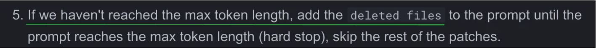

# improve(설정 및 코드) 조사, 분석, 사용, 정리

## Contents
- [Dynamic Context](#dynamic-context)
- [Compression strategy](#compression-strategy)
- [Self reflection](#self-reflection)
- [Dual publishing mode](#dual-publishing-mode)
- [Code validation](#code-validation)
- [💎 Best Practices](#best-practices)

# Dynamic Context

> by 김민지

## 공식 문서 분석

- 공식 문서 : https://qodo-merge-docs.qodo.ai/core-abilities/dynamic_context/

Qudo Merge는 PR 코드 변경을 AI가 더 정확하게 분석할 수 있도록 “비대칭적(asymmetric)”이고 “동적(dynamic)”한 컨텍스트 전략을 사용해 AI가 정확한 분석을 할 수 있을 만큼의 정보를 제공하면서 과도한 정보를 제공해 성능이 떨어지는 상황을 방지한다.

- Dynamic Context 설정 옵션들
    
    ```
    [config]
    patch_extension_skip_types = [".md", ".txt"]
    # 확장자 기준으로 context 확장을 생략할 파일 지정
    
    allow_dynamic_context = true
    # 동적 컨텍스트 확장 허용 여부 (기본값 true)
    
    max_extra_lines_before_dynamic_context = 8
    # 함수/클래스 탐색을 위한 최대 탐색 줄 수 (기본값 8)
    
    patch_extra_lines_before = 3
    # diff 기본 3줄 외에 앞부분에 추가할 줄 수 (기본값 3)
    
    patch_extra_lines_after = 1
    # diff 기본 3줄 외에 뒷부분에 추가할 줄 수 (기본값 3)
    ```
    

### 일반적인 방식 (대조군) : Unified Diff Format

> `allow_dynamic_context = false`를 설정할 경우 제공되는 형태
> 
- 대칭적 & 고정적 : 수정된 코드 앞뒤로 3줄 정도의 고정된 줄 수의 컨텍스트를 사용
    - 관련 옵션
        - `patch_extra_lines_before`
        - `patch_extra_lines_after`
- 컨텍스트를 (추가된 줄, 삭제된 줄 등으로 줄별로 구분해서) 제공
- 문제 : AI 모델이 학습한 일반적인 코드 구조와 달라 정확한 해석에 어려움이 있음

### Dynamic Context

> `allow_dynamic_context = true`를 설정할 경우 제공되는 형태
> 
- 비대칭적 : 변경 후보다 변경전에 더 많은 컨텍스트를 제공
    - 코드 변경 전의 문맥이 더 중요하다는 전제 하에 앞 부분을 더 많이 / 뒷 부분은 적게 포함하도록 컨텍스트 범위 분리
    - `patch_extra_lines_before` 와 `patch_extra_lines_after`을 사용해 앞 부분을 더 많이 설정 가능
- 동적 : 함수 또는 클래스 등의 코드 구조를 기반으로 컨텍스트를 동적으로 조정함
    - 고정된 줄 수가 아니라 코드 구조(함수, 클래스 등)을 기준으로 컨텍스트를 동적으로 조정
    (함수 하나가 코드 변경을 감싸고 있을 경우 전체 함수 코드를 컨텍스트로 포함)
    - 관련 옵션
        
        : `max_extra_lines_before_dynamic_context`
        
        - 무한 확장을 방지하기 위해 최대 줄 수의 제한 (최대 8줄) 있음
    
    ⇒ 복잡한 코드 변경 사항의 경우에도 AI 모델이 전체 맥락을 파악하는데 기존 방식보다 유리함
    

## 코드레벨 구현 파악

- 관련 코드 위치
    - 파일 : `pr_agent/algo/git_patch_processing.py`
    - 함수 : `process_patch_lines()`

```python
def process_patch_lines(patch_str, original_file_str, patch_extra_lines_before, patch_extra_lines_after, new_file_str=""):
	"""
    이 함수는 원본 코드의 축약 버전으로, 핵심 기능에 집중하여
    allow_dynamic_context와 관련된 로직만을 포함하고 있습니다.

    - 설정값을 가져와 동적 컨텍스트를 허용할지 여부를 판단합니다.
    - 동적 컨텍스트 사용 시, 설정된 줄 수에 따라 hunk의 앞부분의 확장 가능 범위를 계산합니다.
    - 원본 파일과 새 파일 사이의 차이점을 동적으로 처리합니다.
    """
    # 설정값 읽기
    allow_dynamic_context = get_settings().config.allow_dynamic_context
    patch_extra_lines_before_dynamic = get_settings().config.max_extra_lines_before_dynamic_context

    file_original_lines = original_file_str.splitlines()
    file_new_lines = new_file_str.splitlines() if new_file_str else []
    len_original_lines = len(file_original_lines)
    patch_lines = patch_str.splitlines()
    extended_patch_lines = []

    RE_HUNK_HEADER = re.compile(r"^@@ -(\d+)(?:,(\d+))? \+(\d+)(?:,(\d+))? @@[ ]?(.*)")

    try:
        for i, line in enumerate(patch_lines):
            if line.startswith('@@'):
                match = RE_HUNK_HEADER.match(line)
                if match:
                    section_header, size1, size2, start1, start2 = extract_hunk_headers(match)
                    # Allow for dynamic context if settings and file conditions are true
                    if allow_dynamic_context and file_new_lines:
                        # 동적 컨텍스트 사용 및 확장 계산
                        extended_start1, extended_size1, extended_start2, extended_size2 = _calc_context_limits(patch_extra_lines_before_dynamic)
                        lines_before_original = file_original_lines[extended_start1 - 1:start1 - 1]
                        lines_before_new = file_new_lines[extended_start2 - 1:start2 - 1]

                        for i, line in enumerate(lines_before_original):
                            if section_header in line:
                                # 컨텍스트 시작 지점 조정
                                extended_start1, extended_start2 = extended_start1 + i, extended_start2 + i
                                break

                        # 새로운 추가 코드 상이 가능하다면 원래 코드와 세부 비교
                        # 실제 변화가 있는 위치로 조정된 컨텍스트레이아웃 제공
                extended_patch_lines.append(line)
    except Exception as e:
        get_logger().warning(f"Failed to extend patch: {e}", artifact={"traceback": traceback.format_exc()})
        return patch_str

    # 최종 변형된 패치 반환
    extended_patch_str = '\n'.join(extended_patch_lines)
    return extended_patch_str

```

- 함수 동작
    1. `get_settings().config` 의 설정에서 `allow_dynamic_context`와 `patch_extra_lines_before_dynamic_context`값을 가져와서 판단
    2. allow_dynamic_context과 file_new_lines이 true일 때
        
        ⇒ dynamic_context를 사용하고 새로운 파일 내용이 있을 경우
        
        - 고정 줄 수를 기준으로 hunk의 앞부분을 최대 몇줄까지 확장할 수 있을지 계산
        - 원본 파일과 새 파일에서 각각 hunk 이전 포함된 확장 줄 추출
        - 섹션 헤더(함수, 클래스 등)가 포함된 줄이 원본 파일에 있을 경우 해당 헤더가 포함된 정의줄부터 시작해서 컨텍스트 시작 지점을 조정
        

---

# Compression strategy

> by 채윤희

## **어떻게 구현되어 있는가**

### Small PR과 Large PR의 기준

총 토큰 + 버퍼가 get_max_tokens의 함수 결과보다 작으면 small PR, 크면 large PR로 분류한다. 


### Small PR

1. github라는 라이브러리를 이용해서 PR의 Patch 정보를 가져옴
    
    ```python
    get_diff_files → list[FilePatchInfo]
    ```
    
2. binary file이나 non code file(ex. image, pdf)들을 제외
    
    ```python
    files_filtered = filter_bad_extensions(files)
    ```
    
3. **Github API를 이용해서 해당 Repository의 main language 정보를 가져온 후 내림차순으로 정렬**
    
    
    
4. **언어 별로 각 파일들을 정렬**    
    ```python
    sorted(lang['files'], key=lambda x: x.tokens, reverse=True)
    ```
    
    - 각 언어들의 파일에서 토큰 순으로 정렬한다
    - ex.  `[[file2.py, file.py],[file4.jsx, file3.js],[readme.md]]`
5. **파일들의 문맥을 확장**
    
    ```python
    # generate a standard diff string, with patch extension
    patches_extended, total_tokens, patches_extended_tokens = pr_generate_extended_diff(
      pr_languages, token_handler, add_line_numbers_to_hunks,
      patch_extra_lines_before=PATCH_EXTRA_LINES_BEFORE, patch_extra_lines_after=PATCH_EXTRA_LINES_AFTER)
    ```
    
    - ex. 더 자세한 문맥을 제공하기 위해서 diff에서 고정된 위 아래 3줄에서 patch에서 위로 5줄, 아래로 1줄 확장

### Large PR

- **(model의 최대 토큰 수 - buffer) 만큼의 내용이 프롬프트에 max_calls 수만큼 청킹되서 요청된다**
    
    ```python
    for file in sorted_files:
            if call_number > max_calls:
                if get_settings().config.verbosity_level >= 2:
                    get_logger().info(f"Reached max calls ({max_calls})")
                break
    ```
    
    ```python
    # parallelize calls to AI:
    prediction_list = await asyncio.gather(
          *[self._get_prediction(model, patches_diff, patches_diff_no_line_numbers) for
            patches_diff, patches_diff_no_line_numbers in
            zip(self.patches_diff_list, self.patches_diff_list_no_line_numbers)])
    ```
    
    
    
    
    
1. **삭제에 관한 변경 사항을 포함한 파일은 생략**
    
    ```python
    # Remove delete-only hunks
    patch = handle_patch_deletions(patch, original_file_content_str, new_file_content_str, file.filename, file.edit_type)
    ```
    
2. **File의 patch가 (model의 최대 토큰 수 - buffer) 만큼의 내용보다 크면?**
    - clip (default) : 특정 크기만큼 잘라내서 포함시킨다.
    - skip : 생략한다.
    
    ```python
    if get_settings().config.get('large_patch_policy', 'skip') == 'skip':
        get_logger().warning(f"Patch too large, skipping: {file.filename}")
        continue
    elif get_settings().config.get('large_patch_policy') == 'clip':
    		...
    ```
    
3. **max_call * (model의 최대 토큰 수 - buffer) 에 여유가 있다면**
    - main_language가 아닌 언어도 포함시킨다
    
    ```python
    files_sorted.append({"language": "Other", "files": list(rest_files.values())})
    ```

## 테스트

**시나리오**

- Large PR의 경우 문서와 같이 max token length에 도달하지 못하면 deleted-only 파일을 제외하는지
    
    
    
    
    

**테스트** 

- 조건 설정
    - Large PR의 경우에 해당하도록 model의 MAX_TOKEN 조절
        
        
        
    - 파일에 변경 사항이 삭제만 있는 것과, 삭제 수정이 모두 포함된 것을 커밋
        
        
        
- cli로 해당 PR에 improve 명령 실행

**결과**

- delete-only 파일이 patch에 포함되지 않았다


## **왜 이런 설정이 필요한가**


| **🎯 이 설정이 해결하는 목적**                                              |
|-----------------------------------------------------------------------------|
| **1. 토큰 예산 최적화**                                                     |
| 가장 중요한 코드(주 언어, 주요 추가된 변경)를 우선순위로 압축하고 정렬함으로써, 제한된 토큰 내에서 최대한의 유용한 정보를 전달함.                                                        |
| **2. 중요한 코드 변경에 집중**                                              |
| 삭제보다 추가를 우선시하고, 중요도가 낮은 파일을 후순위로 미루거나 생략함으로써 LLM이 더 의미 있는 분석을 수행하도록 유도.                                                                  |
| **3. 언어 기반 정렬을 통한 의미 보존**                                      |
| 프로젝트의 주요 언어 기준으로 PR 파일을 정렬하여, LLM이 해당 프로젝트 문맥에 적절한 피드백을 제공할 수 있도록 함.                                                                            |
| **4. 점진적 정보 삽입 전략**                                               |
| 패치를 한꺼번에 넣는 것이 아닌, 우선순위에 따라 점진적으로 삽입하고, 남은 파일은 이름만 나열하거나 생략함으로써 효율성을 극대화.                                                            |
    

---

# Self reflection

> by 주소미

- AI가 생성한 코드 제안을 스스로 재검토 및 재평가하는 기능
- 점수를 매기고, 더 중요한 코드 제안 순서로 정렬
- 부적절하거나 잘못된 코드 제안은 배제하여 더 가치있는 코드 제안 제공

---

### self-reflection 기능이 적용된/되지 않은 경우 비교

### 테스트 환경

- test.py
    
    ```python
    print("Hello from PR-Agent Test!")
    
    def divide(a, b):
        if b == 0:
            return 0
        return a / b
    
    def check_even(num):
        if num % 2 == 0:
            return True
        else:
            return False
    
    def unused_function():
        temp = 42
        # TODO
        pass
    
    def duplicate_logic(x):
        if x > 10:
            return "large"
        if x > 10:
            return "big"
        return "small"
    
    def print_score(score):
        if score > 90:
            print("Excellent")
    
    def print_size(x):
        if x > 10:
            print("Big")
        elif x > 5:
            print("Medium")
    
    ```
    

```python
python3 -m pr_agent.cli --pr_url https://github.com/PullPullers/pr-agent/pull/6 improve
```

### **✅ self-reflection 정상 작동할 때** 

→ **Code Suggestions 생성됨**


**코드 제안이 생성되고,**

**코드 제안의 중요도 점수가 각각(7점, 6점, 5점) 나오고, 그 이유도 구체적으로 나타남.**

| **항목** | **값** |
| --- | --- |
| score | 예: 5, 6, 7 |
| why | 코드 제안 이유 |
| relevant_lines_start/end | 코드 줄 번호 정보 포함


```yaml
# 예시

- suggestion_summary: |
    Remove duplicated code
  relevant_file: "test.py"
  relevant_lines_start: 23
  relevant_lines_end: 28
  suggestion_score: 5
  why: |
    The suggestion correctly identifies and removes the duplicated code in `duplicate_logic`.  The impact is moderate as it improves code clarity and efficiency.
```

---

### **❌** self-reflection 적용하지 않은 경우


> 원본 코드

self-reflection 기능이 **비활성화되었을 때의 동작을 확인하기 위해**,  
`response_reflect`를 아래처럼 빈 값으로 테스트 진행 

```python
response_reflect = ""
```

**→ 에러 발생,** improve 기능이 아예 실행 X 

→ 검토 전의 생성된 code suggestions data도 당연히 뜨지 않음.


`relevant_lines_start`, `relevant_lines_end` 키가 없어서 에러 발생

---

self-reflection이 실패했을 경우에도
기능이 중단되지 않도록 아래와 같이 값 **추가**하여 테스트

 → default score = 7점으로 임의값 넣고,
`relevant_lines_start`, `relevant_lines_end` 값을 넣어주고 테스트

```python
if response_reflect:
    await self.analyze_self_reflection_response(data, response_reflect)
else:
    for suggestion in data["code_suggestions"]:
        suggestion["score"] = 7
        suggestion["score_why"] = ""
        suggestion["relevant_lines_start"] = -1
        suggestion["relevant_lines_end"] = -1  
```

****


같은 내용의 코드 제안은 출력됨. 
하지만 당연히 **중요도 판단(Score)과 코드 위치 정보가 명확하지 않음!** 

- self-reflection이 없으면,
    - **코드 제안의 중요도(score)가 항상 고정값(7점) 
    ⇒** 모든 제안이 **동일한 중요도로 표시되어,** 중요도 높은 제안과 낮은 제안의 **우선순위 판단 불가!**
- `analyze_self_reflection_response` 함수가 실행되지 않게 되면, 추가 검증 누락
    - `existing_code`와 `improved_code`가 동일한지 확인하지 않음 → 불필요한 제안이 그대로 노출될 수 있음
        
        
        
        AI가 개선하겠다고 제안한 코드가 기존 코드랑 **완전히 동일한지 체크**
        
    - 이미 코드에 반영된 제안이 다시 중복으로 제안될 수 있음
        
        
        
        > [관련 코드] PR전: base_file, PR 후: head_file 
        >
        > PR 전(base_file)에 기존 코드(existing_code)가 있고,   
        > PR 후(head_file)에 기존 코드(existing_code)가 없어졌으며, 
        > PR 후(head_file)에 AI가 개선한 새 코드(new_code)가 그대로 들어와 있으면   
        >
        > → 이미 코드가 반영된 제안임 - score = 0으로 중복 제안 방지 
        
    

---

### `self_reflect_on_suggestions` 실행 흐름

`_prepare_prediction()` 함수는 PR diff를 가져오고, 
 AI에게 코드 제안을 요청하는 `_get_prediction()` 함수를 호출한다.


> _get_predicition 함수 내부


- diff를 템플릿에 채워넣어 system/user 프롬프트를 생성하고,


- `ai_handler.chat_completion()`을 호출해 코드 개선 제안을 얻고, 이 응답으로부터 code_suggestions 목록 생성한다.

이후 
 `self_reflect_on_suggestions()`를 호출하여 아까 받은 code suggestions을 평가한다.
→ AI가 받아온 코드 제안들을 다시 검토


→ 각 제안의 **중요도(score)** 및 사유(why)를 평가! 

---

### `self_reflect_on_suggestions` 코드 내부

**입력값 검사**

- suggestion_list가 비어있다면 그냥 빈 문자열 반환
- 굳이 reflect할 필요가 없기 때문에

**프롬프트 선택** 


- `dedicated_prompt`가 주어졌다면 →  커스텀 프롬프트를 가져온다.
- 아니라면 기본 설정에서  `pr_code_suggestions_reflect_prompt`를 가져와서 사용
    - `pr_code_suggestions_reflect_prompts.toml` 파일의 시스템과 user프롬프트

`ai_handler.chat_completion()` 을 통해 AI 모델에게 system/user 프롬프트로 질문 후 결과값 리턴 

### 참고)  **Self-Reflection** 시스템 프롬프트

```
Your task is to analyze a PR code diff and evaluate the correctness and importance set of **AI-generated code suggestions.**
```

→ 시스템 프롬프트에  이미 AI가 생성한 코드 제안을 **검토하는 것이라고 알려주고, 정확성**과 **중요도**를 평가하게 함
****

```yaml
- If the 'existing_code' snippet is equal to the 'improved_code' snippet, it should not receive a score above 7 (and may be lower).
```

→ 코드가 바뀌지 않았는데도 제안이 됐다면, 그건 **의미 없는 제안이므로 7점 이상 점수도 받지 못하게 프롬프트에도 적어 두었음**

```
- Assign a score of 0 to suggestions aiming at:
   - Adding docstring, type hints, or comments
   - Remove unused imports or variables
   - Add missing import statements
   - Using more specific exception types.
   - Questions the definition, declaration, import, or initialization of any entity in the PR code, that might be done in the outer codebase.
```

단순한 문서화, 타입 힌트 등 단순한 코드 제안은 0점 처리 

→  self-reflection의 목표는 **진짜 의미 있는 코드 변경만 추려내는 것**

---

### **Self-reflection이 필요한 이유?**

- **이미 반영된 코드가 다시 제안되는 경우 방지**
    - 기존 코드가 이미 PR에 반영되었음에도 AI가 *똑같은 제안하는 경우가 발생할 수 있음*
        
        ⇒ 불필요한 중복 제안, 비효율적
        
- **의미 없는 suggestion 필터링**
    - 단순한 코드 변경 or **실질적 코드 개선이 없는 제안**도 포함될 수 있음
    - self-reflection은 이러한 제안을 **걸러내고자 함**
- **중요도에 따른 우선순위 제공**
    - self-reflection을 통해 코드 제안의 중요도 점수와 이유를 알려줌.
- 더 중요한 suggestion을 먼저 검토할 수 있음

---

# **Dual publishing mode**

> by 이재민

## 1️⃣ 어떻게 구현되어 있는가

## 위치: `pr_agent/tools/pr_code_suggestions.py`

`dual_publishing()`은 중요한 제안은 별도의 PR 댓글로 표시되게 하는 기능이다.

## dual_publishing 시스템 관련 코드 확장 프로세스 플로우

---

## 전체 실행 흐름

### 1. `PRCodeSuggestions.run()` 실행


- PR에 변경된 파일이 없으면 아무 작업도 하지 않고 종료됨
- 이 조건을 통과하면 PR 정보를 기반으로 GPT에 넘길 준비를 함

---

### 2. GPT 모델에서 코드 제안 받기


- 내부적으로 `self.prepare_prediction_main()` 실행 → `_get_prediction()` 호출됨
- 여기서 PR의 diff, commit message, description 등을 조합해 프롬프트 생성 → LLM에게 요청

---

### 3. 코드 제안 유무 확인


- GPT가 코드 제안을 하지 않은 경우 종료
- 사용자는 "제안 없음" 메시지를 보게 됨

---

### 4. PR 코멘트용 텍스트 생성 및 게시


- 요약 테이블 형태로 정리된 코드 제안이 PR의 첫 코멘트로 게시됨
- (여기까지가 기본 동작임)

---

### 5. `dual_publishing` 조건 체크 및 호출


- 설정 파일이나 `/improve --xxx` 에서 threshold 값이 0 이상이면 실행됨

---

## `dual_publishing(data)` 살펴보기

### 전체코드


### 1. 초기화

```python
data_above_threshold = {'code_suggestions': []}
```

- 중요한 제안만 따로 수집할 리스트 초기화

### 2. 반복문 시작

```python
for suggestion in data['code_suggestions']:
```

- GPT가 생성한 모든 제안 하나하나 검사 시작

### 3. 조건 분기: 점수와 개선 코드 존재 여부

```python
if int(suggestion.get('score', 0)) >= threshold and suggestion.get('improved_code'):
```

- score가 threshold 이상이고 improved_code가 있을 경우만 다음 단계 진행

### 4. fallback 처리

```python
if not suggestion['existing_code']:
    suggestion['existing_code'] = suggestion['improved_code']
```

- GitHub API는 리뷰 줄 기준이 되는 기존 코드가 꼭 필요함 → 없으면 improved_code로 채움

### 5. 제안 저장

```python
data_above_threshold['code_suggestions'].append(suggestion)
```

- 필터링 조건을 통과한 suggestion만 저장

### 6. 최종 제출

```python
await self.push_inline_code_suggestions(data_above_threshold)

```

- `self.git_provider.publish_code_suggestions(...)`을 통해 GitHub에 각 제안을 해당 코드 라인에 코멘트로 등록

### +) 예외 처리

```python
except Exception as e:
    get_logger().error(...)

```

- GitHub API 오류, 포맷 오류 등 방지용

---

## **2️⃣ 왜 이런 설정이 필요한가**

(1) 문제 상황 (없었을 경우 발생할 수 있는 문제)

1. 모든 제안을 인라인으로 표시한 경우, PR에 너무 많은 코멘트가 쌓여 가독성이 저하된다.
2. 중요한 제안이 다른 사소한 제안에 **묻혀버려** 리뷰어가 핵심 이슈를 놓칠 수 있다.
3. 리뷰 코멘트가 코드 흐름을 방해하며 **리뷰 효율**이 떨어진다.

(2) 이 설정이 해결하는 목적

1. **점수 기반 필터링**으로 중요한 제안만 인라인으로 표시해, 리뷰 집중도와 가독성을 높인다.
2. 덜 중요한 제안은 **요약 테이블**으로 통합하여 PR 코멘트의 **시각적 노이즈 최소화한다.**
3. 리뷰어가 **핵심 이슈**에 빠르게 접근할 수 있어 코드 리뷰 **속도와 품질**이 향상된다.

- 다른 대안과의 비교 (있다면)

| 방식 | 특징 | 장점 | 단점 |
| --- | --- | --- | --- |
| 테이블만 출력 | 모든 제안을 하나의 테이블로 요약하여 PR 첫 코멘트에 게시 | - 전체 제안 목록 한눈에 파악- PR 코멘트가 깔끔하게 유지 | - 구체 위치 확인 위해 코드→테이블 이동 반복- 문맥 정보 손실 |
| 모든 인라인 표시 | GPT가 생성한 모든 제안을 해당 코드 줄마다 인라인 코멘트로 게시 | - 코드 컨텍스트에서 즉시 피드백 확인- 수정 포인터 명확 | - 과도한 댓글로 PR 산만- 사소한 제안까지 모두 노출로 피로도 증가 |
| Dual Publishing | 점수(threshold) 기준으로 중요한 제안은 인라인, 나머지는 테이블로 게시 | - 중요한 제안 강조 + 잔여 제안 요약- 리뷰 효율·가독성 모두 향상 | - threshold 값 선정 및 실험 필요 |

## **3️⃣ 테스트**

`dual_publishing_score_threshold` 값을 비교해가며 /improve가 어떻게 동작하는지 테스트 해보자!

## `dual_publishing_score_threshold`의 작동 원리

`dual_publishing_score_threshold`는 **AI가 생성한 코드 개선 제안 중 ‘중요한 것’만 PR 코드 라인에 인라인 코멘트로 표시**하기 위한 기준이다.

이 설정은 코드 리뷰의 가독성을 높이고, 핵심 제안에 리뷰어가 빠르게 집중할 수 있도록 돕는다.

## AI의 판단 방식: self-reflection scoring

- PR의 코드 변경 사항(diff)을 기반으로 GPT가 다수의 개선 제안을 생성한다.
- 각 제안은 내부적으로 **self-reflection scoring** 과정을 통해 **score (0~10)** 가 부여된다.
    - 예:
        - `print("debug")` 제거 → score: 5
        - `file open`에 `with` 사용 권장 → score: 7
        - 사소한 리팩토링 → score: 2
- 이 score는 AI가 스스로 **"내가 만든 제안이 얼마나 중요하고 유용한가?"** 를 판단한 결과이다.

### dual publishing 조건 분기

```jsx
[pr_code_suggestions]
dual_publishing_score_threshold = 3
```

- **score ≥ threshold**: 인라인 코멘트로 표시 (PR 줄 위에 직접 뜸)
- **score < threshold**: PR 코멘트에 테이블 형태로만 요약됨

1. **테스트 PR 작성**


---

## (1) `dual_publishing_score_threshold` = 3

(현재 설정에서는 중요도(score)가 3 이상으로 평가된 코드 제안만, GitHub PR 코드 줄 위에 직접 인라인 코멘트로 표시됨)


> (secrets.toml에 값 추가 및 수정)


Use with-statement and specific exception과 같은 표 내용들은 3점을 넘지 않아 표로 표시되고,

debug1, debug2 제거한 부분은 importance가 5점 (즉, score가 3점 이상)이므로 인라인 코멘트로 남겨짐을 볼 수 있다.

## (2) `dual_publishing_score_threshold` = 7


높은 중요도(importance ≥ 7)만 인라인 코멘트로 표시되는 모습을 알 수 있다.

(예: importance: 5인 debug 제거는 테이블에만 있고, importance: 8인 try-except 관련 제안만 인라인 표시됨)

## (3) `dual_publishing_score_threshold` = -1


-1은 비활성화 상태로 모든 제안이 테이블에만 나옴을 알 수 있다.

## 정리

| 실험 조건 | threshold | 결과 요약 |
| --- | --- | --- |
| 모든 제안 테이블만 표시 | -1 | 인라인 없음 |
| 일반적 dual 사용 | 3 | 일반 제안은 테이블, 일부 중요 제안은 인라인 |
| 보수적 인라인 제한 | 7 | 아주 중요한 제안만 인라인 표시됨 |

**결론 : threshold 값을 조정함으로써, 팀의 리뷰 정책에 따라 AI 제안의 가시성과 중요도를 균형 있게 조절할 수 있다!**

---

# Code validation

> by 최민주

## 코드 조사

- [Code validation](https://qodo-merge-docs.qodo.ai/core-abilities/code_validation/) 
    - PRCodeSuggestions.push_inline_code_suggestions
        - 코드 제안 (code suggestion) 생성 후 self.git_provider.publish_code_suggestions 호출하여 PR에 코멘트로 게시. (코드 위치 : pr_agent/git_providers/github_provider.py → GithubProvider.publish_code_suggestions)

## 조사 결과

### 코드의 역할

**AI가 생성한 코드 개선 제안**을 PR에 자동으로 코멘트로 남기는 기능

### 테스트

- 테스트 환경 및 절차 간단 정리
    
    (ex. 사용한 명령어, 실행한 시나리오)
    
    - 적용 전 (기본 improve 명령어)
        
        ```bash
        python3 -m pr_agent.cli --pr_url <pr_url> improve 
        ```
        
    - 적용 후 (code_suggestions 옵션 사용)
        
        ```bash
        python3 -m pr_agent.cli --pr_url <pr_url> improve --pr_code_suggestions.commitable_code_suggestions=true
        ```
        
- 설정이 적용된/적용되지 않은 경우를 비교한 캡처
    
    (ex.  코드가 하나도 없을 때는 어떻게 동작했는가?)
    
    - 적용 전
        
        
        
        
        
    
    - 적용 후
        
        
        

### **어떻게 구현되어 있는가**

PRCodeSuggestions.push_inline_code_suggestions  분석

- 코드 흐름 요약:
    1. **빈 제안 확인**
        - 함수 인자로 LLM의 답변을 전달받음 (= `data`)
            - data 예시
            
            
            
        - `data['code_suggestions']`가 비어 있다면, 즉 LLM의 답변상 제안할 코드가 없다면 로깅 후 "개선 제안 없음" 메시지를 PR 코멘트로 게시하고 종료함.
            
            ```python
            if not data['code_suggestions']:
                get_logger().info('No suggestions found to improve this PR.')
                if self.progress_response:
                    return self.git_provider.edit_comment(self.progress_response,
                                                          body='No suggestions found to improve this PR.')
                else:
                    return self.git_provider.publish_comment('No suggestions found to improve this PR.')
            ```
            
    2. 코드 제안사항의 구성 요소 파싱
        - `data['code_suggestions']`의 각 제안사항을 for 문으로 하나씩 체크
            - 코드 제안사항 정보 파싱 + rstrip 으로 맨 끝 개행 제거
                - 제안 설명 (`suggestion_content`)
                - 제안 코드 (`improved_code`)
                - 코드 위치 (`relevant_file`, `relevant_lines_start`, `relevant_lines_end`)
                - 중요도 (`score`)
                - 라벨 (`label`)
            
            ```python
            for d in data['code_suggestions']:
                try:
                    if get_settings().config.verbosity_level >= 2:
                        get_logger().info(f"suggestion: {d}")
                    relevant_file = d['relevant_file'].strip()
                    relevant_lines_start = int(d['relevant_lines_start'])  # absolute position
                    relevant_lines_end = int(d['relevant_lines_end'])
                    content = d['suggestion_content'].rstrip()
                    new_code_snippet = d['improved_code'].rstrip()
                    label = d['label'].strip()
            ```
            
    3. 코드 포맷 정리 (PRCodeSuggestions.`dedent_code`) 
        - 필요한 이유
            
            ```python
            # 기존 파일 코드
            def foo():
                print("기존 코드입니다.")
            ```
            
            ```python
            # 새로운 코드 스니펫 (들여쓰기가 맞지 않을 때)
            print("새 코드입니다.")
            ```
            
            ```python
            # 코드 포맷 정리 후
            def foo():
                print("기존 코드입니다.")
                print("새 코드입니다.")
            ```
            
        - `self.dedent_code()`를 이용해 AI가 제안한 코드의 들여쓰기를 PR 코드와 맞춰줌
            
            ```python
            if new_code_snippet:
                new_code_snippet = self.dedent_code(relevant_file, relevant_lines_start, new_code_snippet)
            ```
            
            - `dedent_code()` 함수의 역할
                - **diff 파일 목록 확보**
                    - `self.git_provider.diff_files`가 이미 있으면 사용하고, 없으면 `get_diff_files()` 호출.
                - **해당 파일 검색**
                    - PR 변경 파일 중 `relevant_file`과 이름이 일치하는 파일을 찾음.
                - **기준 줄 확보 시도**
                    - `relevant_lines_start`를 기준으로 PR 코드의 해당 줄(`original_initial_line`)을 가져옴.
                    - `head_file`이 없거나 인덱스 초과면 경고 로그를 남기고 원본 코드 반환.
                - **들여쓰기 차이 계산**
                    - 원래 코드 줄과 제안 코드의 첫 줄을 비교해서, 선행 공백 수(`delta_spaces`)를 계산.
                - **들여쓰기 보정 적용**
                    - 들여쓰기가 부족한 경우(`delta_spaces > 0`)에 `textwrap.indent()`로 공백 보정.
                - **예외 처리 및 반환**
                    - 중간에 예외가 발생해도 무너지지 않고 로그만 남기고 원본 제안 코드를 반환함.
                
                ```python
                def dedent_code(self, relevant_file, relevant_lines_start, new_code_snippet):
                    # 축약된 코드
                    try:
                        # diff 파일 목록 확보
                        # 이미 있는 diff_files 사용, 없으면 새로 가져옴
                        self.diff_files = self.git_provider.diff_files or self.git_provider.get_diff_files()
                        
                        # 해당 파일 검색 및 기준 줄 확보 시도
                        for file in self.diff_files:
                            if file.filename.strip() == relevant_file:
                                if file.head_file:
                                    file_lines = file.head_file.splitlines()
                                    if relevant_lines_start > len(file_lines):
                                        get_logger().warning("Out of range", artifact={})
                                        return new_code_snippet
                                    original_initial_line = file_lines[relevant_lines_start - 1]
                                else:
                                    get_logger().warning("Head file missing", artifact={})
                                    return new_code_snippet
                                break
                        
                        # 들여쓰기 차이 계산 및 보정 적용
                        if original_initial_line:
                            original_spaces = len(original_initial_line) - len(original_initial_line.lstrip())
                            suggested_spaces = len(new_code_snippet.splitlines()[0]) - len(new_code_snippet.splitlines()[0].lstrip())
                            delta_spaces = original_spaces - suggested_spaces
                            if delta_spaces > 0:
                                new_code_snippet = textwrap.indent(new_code_snippet, ' ' * delta_spaces).rstrip('\n')

                    except Exception as e:
                        get_logger().error(f"Dedent error: {e}")

                    return new_code_snippet
                ```
                
    4. **코멘트 본문 구성**
        - Markdown 형식으로 코드 제안에 대한 설명과 코드 스니펫을 포함한 PR 제안문 생성.
            
            ```python
            if d.get('score'):
                body = f"**Suggestion:** {content} [{label}, importance: {d.get('score')}]\n```suggestion\n" + new_code_snippet + "\n```"
            else:
                body = f"**Suggestion:** {content} [{label}]\n```suggestion\n" + new_code_snippet + "\n```"
            ```
            
    5. **PR에 코드 제안 댓글 일괄 업로드**
        - `git_provider.publish_code_suggestions()`를 통해 전체 코드 제안사항들을 PR에 코멘트로 게시.
            - 함수 설명
                1. 코드 제안 유효성 검사
                    - validate_comments_inside_hunks() 호출로 PR 변경사항(hunk) 안에 포함된 제안인지 확인해 필터링.
                2. 제안 정보 추출 및 조건 검사
                    - 각 제안에서 필요한 정보(body, relevant_file, relevant_lines_start, relevant_lines_end)를 추출.
                    - 위치 정보가 유효한지 확인. 예외 케이스(시작 줄 없음, 끝이 시작보다 앞선 경우)는 스킵.
                3. 댓글 요청 파라미터 구성
                    - 범위 댓글(start_line ~ line)과 단일 줄 댓글(line만)로 구분해 GitHub API 포맷에 맞게 dict 구성.
                4. 댓글 일괄 게시 시도
                    - 모든 파라미터를 리스트에 담은 후 publish_inline_comments()로 한 번에 보내기 시도.
                    - 실패 시 에러 로그 남기고 False 반환, 성공 시 True.
                
                ```python
                def publish_code_suggestions(self, code_suggestions: list) -> bool:
                    # 축약된 코드
                    post_parameters_list = []

                    # PR 변경사항(hunk) 안에 포함된 제안의 유효성 검사
                    code_suggestions_validated = self.validate_comments_inside_hunks(code_suggestions)

                    for suggestion in code_suggestions_validated:
                        body = suggestion['body']
                        relevant_file = suggestion['relevant_file']
                        start = suggestion['relevant_lines_start']
                        end = suggestion['relevant_lines_end']

                        # 위치 정보 검증 및 예외 처리
                        if not start or start == -1 or end < start:
                            get_logger().exception(
                                f"Failed to publish code suggestion, start: {start}, end: {end}")
                            continue

                        post_parameters = {
                            "body": body,
                            "path": relevant_file,
                            "line": end if end > start else start,
                            "start_line": start if end > start else None,
                            "side": "RIGHT",
                            "start_side": "RIGHT" if end > start else None
                        }
                        post_parameters_list.append({k: v for k, v in post_parameters.items() if v is not None})

                    try:
                        self.publish_inline_comments(post_parameters_list)
                        return True
                    except Exception as e:
                        get_logger().error(f"Failed to publish code suggestion, error: {e}")
                        return False
                ```
                
        - **실패 시 개별 업로드**
            - 일괄 등록 실패 시, 각 제안을 하나씩 따로 다시 시도함.
            
            ```python
            is_successful = self.git_provider.publish_code_suggestions(code_suggestions)
            if not is_successful:
                get_logger().info("Failed to publish code suggestions, trying to publish each suggestion separately")
                for code_suggestion in code_suggestions:
                    self.git_provider.publish_code_suggestions([code_suggestion])
            ```
            

### **왜 이런 설정이 필요한가 (= PR suggestion 일괄 제출 + 개별 제출 = 하이브리드 제출 설정을 사용하는 이유)**

- 문제 상황
    - **AI가 생성한 제안이 너무 많거나 복잡할 경우**, GitHub API가 실패하거나 일부만 반영될 수 있음.
    - **이 경우 코드 제안을 무조건 코멘트로 등록하려고 시도**하면 불필요한 API 호출과 혼란이 발생함.
- 이 설정이 해결하는 목적
    - **제안이 없을 경우 명확한 사용자 피드백 제공**
        
        → “수정할 게 없어요!”라고 명확히 알려줌.
        
        ```python
        get_logger().info('No suggestions found to improve this PR.')`
        ```
        
    - **제안 형식 통일 및 위치 정확성 보장**
        
        → Markdown + GitHub 제안 포맷(````suggestion`)을 통해 리뷰어가 한눈에 보기 쉽게 함.
        
    - **API 실패 시 대안 제공**
        
        → 일괄 실패해도 개별로라도 끝까지 제안이 전달되도록 함. 견고한 설계!
        
        ```python
        if not is_successful:
            get_logger().info("Failed to publish code suggestions, trying to publish each suggestion separately")
            for code_suggestion in code_suggestions:
                self.git_provider.publish_code_suggestions([code_suggestion])
        ```
        
- 다른 대안과의 비교
    
    
    | 방법 | 장점 | 단점 |
    | --- | --- | --- |
    | **일괄 제출 only** | 속도 빠름 | API 오류 시 전부 실패할 수 있음 |
    | **개별 제출 only** | 견고함 | 느리고 API 호출 많음 |
    | **현재 방식 (하이브리드)** | 빠르고 안정적 | 코드가 약간 복잡해짐 |

## 개선 아이디어 (ChatGPT……. 🤖)

### 🌟 **특이점: 코드 제안의 '유효성 검사(validate)'가 UI 하이라이트 범위(hunks)에만 집중됨**

### 현재 구현:

```python
code_suggestions_validated = self.validate_comments_inside_hunks(code_suggestions)
```

- 이 함수는 오직 **PR의 diff 영역(hunks) 내부**에 위치한 제안만 통과시킴.
- 그 외 유효성 (예: 코드 내용의 일관성, 중복, 구조적 충돌)은 체크하지 않음.

### 이게 왜 특이한가?

- 대부분의 코드 리뷰는 "diff에 코멘트 달 수 있냐"보다는 "이 제안이 진짜 괜찮은 개선이냐"에 관심이 있음.
- 그런데 이 로직은 "위치가 맞냐"에만 집중하고 있어서, **불필요하거나 의미 없는 제안도 통과**될 수 있음.

---

### 💡 개선 아이디어: **제안 자체의 품질 검증 로직 추가**

예시: `filter_low_quality_suggestions()` 같은 함수 추가

```python
def filter_low_quality_suggestions(self, code_suggestions):
    return [
        s for s in code_suggestions
        if len(s['improved_code'].strip()) > 2 and "TODO" not in s['improved_code']
    ]
```

📌 이 함수에서 걸러낼 수 있는 제안 예:

- 내용 없는 코드 (`pass`, `{}`, `;`)
- 단순 포맷 변경만 있는 경우
- 임시로 "TODO" 들어간 제안

---

### ✅ 효과

- GitHub API 자원 낭비 줄이기 (불필요한 댓글 방지)
- 리뷰어의 피로도 감소
- 결과적으로 "AI 리뷰어 신뢰도" 향상!

## 기타 개선 아이디어

code suggestion 기능 테스트 결과 다음 결과가 아쉬웠음.

- 코드에 의도적으로 doc string 을 작성하지 않았는데, 이 점은 PR Agent 가 체크를 안 해줬다.
    - 함수의 doc string 을 자동으로 생성하고 추가하는 제안도 있으면 좋겠다.
- 설정 언어에 따라서 code suggestion 내용에 차이가 있음.
    - config 파일에 한국어로 설정할 경우 의도적인 변수명 오타 (reslt, numbr) 등을 잘 잡아내지만 영어로 설정된 경우 이를 교정해 주지 못함.
    - 언어와 상관없이 PR Agent 가 공통된 결과를 제공하면 사용자의 신뢰도가 올라갈 것 같다.

---

# Best Practices

> by 김민지

## 공식 문서 분석

### Best Practices

AI에게 조직 고유의 코딩 표준이나 스타일 가이드 제공

- AI가 코드 리뷰 시 참고
- PR 코드가 가이드라인 위반 시 `Organization best practice` 라벨이 붙은 제안을 추가로 생성함
    
    (라벨은 설정 파일에서 `organization_name = "설정값"`변경 가능)
    
- 사용 방법 : 루트 디렉토리에 `best_practices.md` 파일에 내용 작성
- 작성 팁
    - 명확하고 간결하게 작성할 것
    - 필요 시 간단한 코드 예제를 포함할 것
    - 800줄 이내로 너무 길지 않게 작성할 것을 권장
- 전역 설정 파일에 best_practice를 적용하고 싶을 경우 아래 설정을 추가한다.
    
    ```markdown
    [best_practices]
    enable_global_best_practices = true
    ```
    
- 다중 언어를 사용하는 조직일 경우 언어별구역을 둔 `best_practices.md` 파일 생성 가능
    
    ```markdown
    # [Python]
    ...
    # [Java]
    ...
    # [JavaScript]
    ...
    ```
    

### Auto Best Practices

- 공식 문서 링크 : https://qodo-merge-docs.qodo.ai/core-abilities/auto_best_practices/


> Auto Best Practice가 생성되는 과정에 대한 도식화  
> (Code Suggestion (코드 변경 사항에 대한 제안 자동 생성) → 수락 제안 집계 → 반복 패턴 감지 → best practice 정리)

- `Improve` 툴을 PR 내 코드 변경 사항에서 잠재적인 문제, 오류, 버그를 식별
    
    (단순 코드 스타일, 포맷팅 같은 사소한 항목보다는 실제 의미 있는 문제 감지가 중점적)
    
- Qodo Merge는 AI가 생성한 코드 제안에 대해 PR 작성자가 실제로 구현했는지를 자동으로 추적
    
    수락된 모든 제안은 `.pr_agent_accepted_suggestions`라는 저장소 전용 위키 페이지에 집계
    
- Qudo Merge는 매달 수락된 제안들을 분석해 저장소에 특화된 `Best Practices`를 생성
    
    반복적으로 등장한 코드 개선 패턴을 반영해 `.pr_agentauto_practices`라는 위키 파일에 저장됨
    
- 위키 파일 반영 단계
    
    > 두 단계로 나눠져 있으며, 각 단계는 분리(decoupled)되어 새로운 문제를 탐색할 수 있는 유연성을 유지하면서, 과거 경험으로부터 학습할 수 있도록 함
    > 
    1. 일반 코드 이슈인지 유연하게(개방적으로) 탐색
    2. 과거 수락된 제안에서 얻은 지식을 활용해 생성한 기존 Best Practice를 기반으로 타겟팅된 분석
        
        (Best Practice를 하나의 분석 레이어로 추가해 패턴 부합 여부를 확인)
        
        - best practice에서 유래한 제안의 경우 전용 라벨이 붙음

### Auto Best Practices과 Custom Best Practices

Custom Best Practices가 존재하더라도, Auto Best Practice는 improve 툴에서 사용되진 않더라도 위키 파일을 생성함

- Auto Best Practice를 생성하는 이유
    - 팀이 받은 제안을 기반으로 Custom Best Practice를 보완할 수 있도록
    - AI 친화적인 Best Practice를 작성하는데 효과적인 패턴을 제시

⇒ Auto Best Practice 파일을 정기적으로 검토해 자체 규칙을 개선할 것을 권장

## 코드 레벨 구현 파악

### 설정 파일

- 위치 : `pr_agent_/settings/configuration.toml`
    
    ```toml
    [best_practices]
    content = "" # best_practices 내용 저장 필드
    organization_name = "" # 조직 이름수동 관리 
    max_lines_allowed = 800 # best_practices 내용 최대 라인 수 제한
    enable_global_best_practices = false # 전역 best practices 사용 여부 제어 플래그
    
    [auto_best_practices]
    enable_auto_best_practices = true # public - general flag to disable all auto best practices usage
    utilize_auto_best_practices = true # public - disable usage of auto best practices in the 'improve' tool
    extra_instructions = "" # public - extra instructions to the auto best practices generation prompt
    content = ""
    max_patterns = 5 # max number of patterns to be detected
    ```
    

### 코드 제안 관련

> best_practices는 수동으로 팀의 규칙을 AI에게 프롬프트로 전달하는 부분이기에 설정 외 코드 없음
> 
> - auto_best_practices는 설정과 기본 구조만 있을 뿐 실제 구현은 되어있지 않음
>     
>     (유료 기능이기 때문에 오픈소스 버전에서 제외된 것으로 추측)
>     
- 위치 : `pr_agent/tools/pr_code_suggestions.py`
    - 초기화 : `__init__` 함수 vars의 하위 key로 `relavant_best_practices` 사용
        
        ```python
        self.vars = {
            "title": self.git_provider.pr.title,
            "branch": self.git_provider.get_pr_branch(),
            "description": self.pr_description,
            "language": self.main_language,
            "diff": "",  # empty diff for initial calculation
            "diff_no_line_numbers": "",  # empty diff for initial calculation
            "num_code_suggestions": num_code_suggestions,
            "extra_instructions": get_settings().pr_code_suggestions.extra_instructions,
            "commit_messages_str": self.git_provider.get_commit_messages(),
            "relevant_best_practices": "",
            "is_ai_metadata": get_settings().get("config.enable_ai_metadata", False),
            "focus_only_on_problems": get_settings().get("pr_code_suggestions.focus_only_on_problems", False),
            "date": datetime.now().strftime('%Y-%m-%d'),
            'duplicate_prompt_examples': get_settings().config.get('duplicate_prompt_examples', False),
        }
        ```