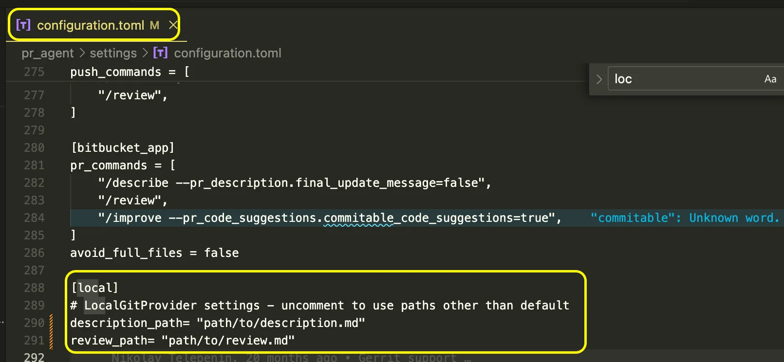

# [LocalProvider - 동작 검증 및 문서화]



## 현재 문제점

- configuration.toml의 local 옵션 기능 동작이 불분명.
- pr_url이 local로 설정되어도 LocalGitProvider 대신 GitHubProvider 코드가 실행됨.
- 관련 공식 문서 및 사용 가이드(설정 항목, 예시 커맨드) 부족.
- 사용 흐름 및 CLI 예시가 부족하여 실제로 동작 가능한지 불명확.

## 구현방법

### `1. 분기 로직 연결`
- CONFIG.git_provider == "local"인 경우 git_providers/local_provider.py의 로직이 호출되도록 수정.

### `2. TOML 설정항목 정의`

- configuration.toml 예시

```toml
[CONFIG]
git_provider = "local"

[local]
# required
description_path    = "./description.md"    # /describe 결과를 쓸 경로
review_path         = "./review.md"         # /review 결과를 쓸 경로

# optional
branch_base         = "main"
branch_head         = "feature-branch"
auto_generate_patch = true
```

### `3. 핵심 메서드 점검`
- 로컬 저장소에서 /describe, /review, /improve 동작 
- get_diff(), get_files(), publish_comment()의 로컬 동작 확인 및 테스트 추가.
- pr_agent review 실행 → Markdown 결과 확인

### `4.문서 및 예제 추가`
- README.md에 local 옵션 사용법 추가
- 환경 변수 연동법 문서화.


## 사용법
1. 로컬 저장소 루트에서 configuration.toml 설정
2. 터미널 명령

```bash
pr-agent --git-provider local /describe
```
3. 각각 description_path, review_path에 출력확인

## 기대효과
- GitHub/GitLab 등의 원격 저장소 없이 로컬 저장소로만 /describe, /review, /improve 기능 사용 가능.
- 내부망/보안 환경 등에서 (외부 Git 호스팅을 사용 못하는 개발환경) PR-Agent 기능 활용.
- 교육, 워크숍, 데모 등에서 외부 의존 없이 손쉽게 기능 체험 가능. 
- PR 없이 .md 파일 기반으로 설명과 리뷰 생성이 가능하여 초기 도입 부담 완화.
- 신규 사용자의 Onboarding 부담을 줄이고 초기 기능 체험이 쉬워져 PRAgnet 도입 장벽을 낮출 수 있다.

