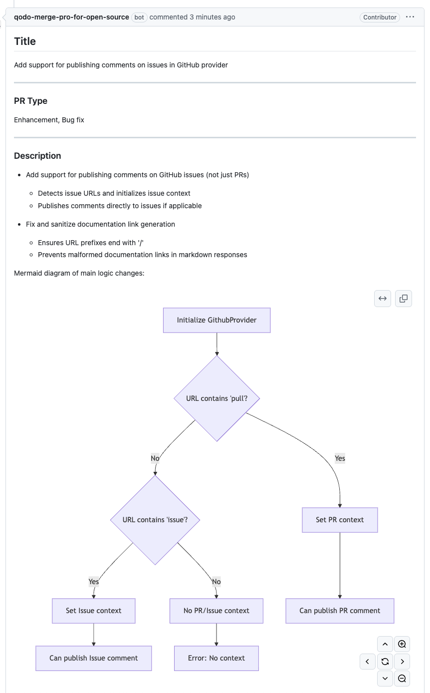
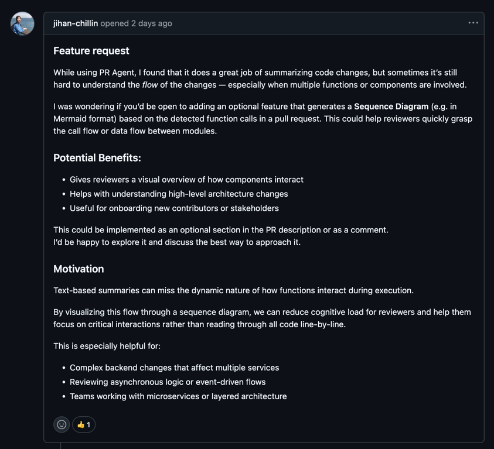
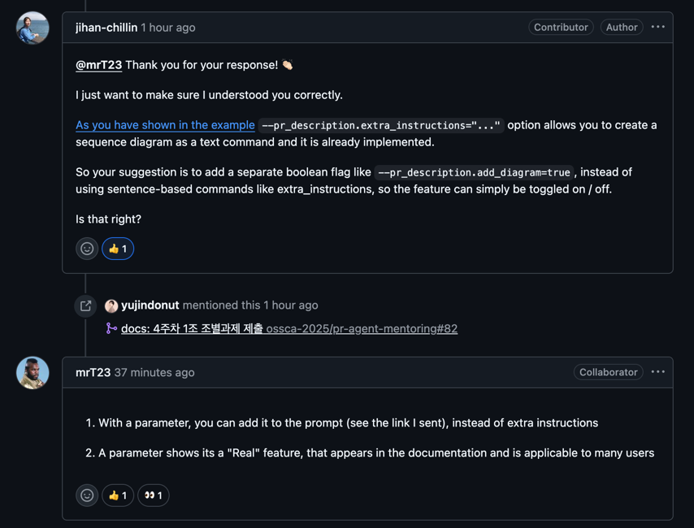
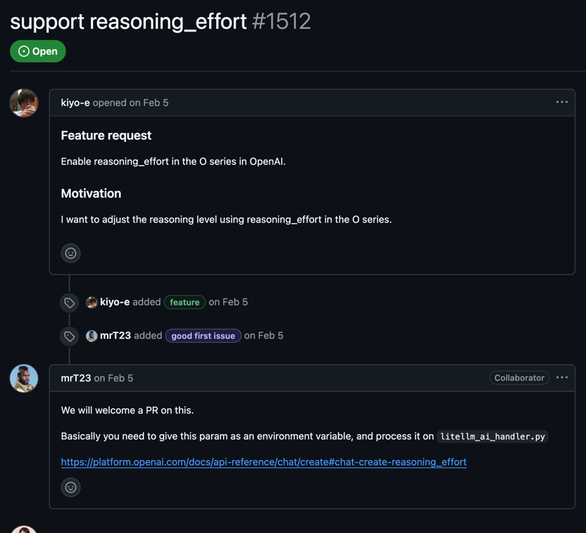

## 4주차 목표 및 과제

- PR Agent 에 기여할만한 아이디어 고민하기
- Top 3 아이디어 정리 내용

<br/>

## 아이디어 조사

- GitLab 푸시 이벤트 시 .pr_agent.toml 설정이 적용되지 않는 버그를 수정 [#1686](https://github.com/qodo-ai/pr-agent/issues/1686)
- PR-Agent에 reasoning_effort 설정을 추가하여 LLM 추론 수준을 제어할 수 있는 기능을 도입
- PR에서 함수 호출 흐름을 자동으로 감지해 Mermaid 기반의 Sequence Diagram을 생성
- LocalProvider 기능 도입
- 여러개의 PR중에서도 위험도, CI상태 작성 시간 등을 기반으로 리뷰 우선순위 자동정렬 기능
- 예외 처리 핸들러 별도로 생성
- 사용자 맞춤형 PR 요약 템플릿 기능

---------------------------------------------------------------

## TOP 3 아이디어 

---------------------------------------------------------------

# [Sequence Diagram ]

## 현재 문제점

`함수 호출 흐름 시각화 X`

- 기존 PR 요약은 텍스트 중심이라, 복잡한 함수 간 상호작용이나 이벤트 흐름을 한눈에 파악하기 어려움 

`코드 리뷰 생상선 저하` 

- 리뷰어가 코드 읽기와 동시에 호출 관계를 추적해야하므로 피로도가 높고, 놓치는 경로가 발생할 수 있음

`다계층, 이벤트 기반 아키텍처 대응 한계`

- 마이크로서비스나 이벤트 드리븐 구조처럼 호출 스택이 여러 레이어를 거칠 때 텍스트만으로는 전체 흐름 이해가 불가능

`Command로 직접 날릴 수 있는 것으로 파악되었으나, parameter 형식으로  `

```bash
/describe
--pr_description.extra_instructions="
The 'Description ' part should also include a mermaid diagram"
"
```



## 구현방법

### `1. 구성 옵션 반영`

- configuration.toml의 `diagram = true` 옵션을 읽어 시퀀스 다이어그램 생성 여부를 제어
- `--pr_description.add_diagram` 플래그로 제어

### `2. AST 기반 호출 관계 추출`
- Python 표준 ast 모듈을 써서 저장소 내 .py 파일을 순회하며 
  - FunctionDef 노드 내 Call 노드를 탐색
  - 변경된 함수만(GitPatchProcessor 결과) 또는 전체 함수(필터 비사용 시)에서 호출 관계(caller→callee)를 수집

### `3. 시퀀스 다이어그램 생성`
- algo/sequence_diagram_generator.py의 SequenceDiagramGenerator 클래스에서 추출된 호출 쌍을 mermaid-builder 라이브러리로 입력하여 
- .mmd 텍스트 파일과 .svg 이미지 파일을 동시에 출력

### `4. PR 설명 자동 삽입`
/describe 의 옵션으로 반영 → PRDescription class의 run()에서 다이어그램 반영


## 기대효과
#### **가시성 향상**
- 복잡한 호출 흐름을 그림으로 확인 → 리뷰 초점이 로직 검증으로 전환
    
#### **리뷰 속도·정확도 개선**
- 호출 경로 자동 맵핑으로 경로 누락 없이 전체 로직 이해
    
#### **온보딩·지식 공유**
- 신규 팀원이 PR을 볼 때 시스템 구조를 빠르게 파악 가능
    
#### **확장성 기반 마련** 
- Mermaid 외 PlantUML 등 다른 다이어그램 형식 추가도 쉽게 확장 가능

## 관련 문의


```
--pr_description.add_diagram=true
```





## 참조
####  Mermaid Sequence Diagram
Mermaid 시퀀스 다이어그램은 간단한 텍스트 문법으로 시스템 내 객체(또는 함수) 간의 호출 흐름과 상호작용을 시각화해 주는 다이어그램. <br>
GitHub, GitLab, Notion, Obsidian 같은 여러 도구에서 Markdown 안에 바로 렌더링할 수 있어, 코드 리뷰나 문서에 바로 삽입가능
```markdown
sequenceDiagram
    participant Alice
    participant Bob
    Alice->>John: Hello John, how are you?
    loop HealthCheck
        John->>John: Fight against hypochondria
    end
    Note right of John: Rational thoughts <br/>prevail!
    John-->>Alice: Great!
    John->>Bob: How about you?
    Bob-->>John: Jolly good!
```

#### PlantUML
텍스트 기반 DSL(Domain-Specific Language)을 사용해 UML 및 다양한 소프트웨어 다이어그램을 생성할 수 있는 오픈소스 도구입니다 
자바(Java)로 구현되어 있으며, 내부적으로 Graphviz를 활용해 다이어그램의 레이아웃을 자동으로 처리합니다 
간단한 문법으로 시퀀스, 클래스, 활동, 컴포넌트, 배포, 상태 다이어그램뿐 아니라 C4, BPMN, ERD, Gantt 차트, 마인드맵 등 다양한 형식도 지원
```markdown
+--------------------------------------+
|         TEDx Talks Recommendation    |
|                System                |
+--------------------------------------+
| +----------------------------------+ |
| |          Visitor                 | |
| +----------------------------------+ |
| | + View Recommended Talks         | |
| | + Search Talks                   | |
| +----------------------------------+ |
+--------------------------------------+
                   |
                   |
                   V
+--------------------------------------+
|         Authenticated User           |
+--------------------------------------+
| +----------------------------------+ |
| |          User                    | |
| +----------------------------------+ |
| | + View Recommended Talks         | |
| | + Search Talks                   | |
| | + Save Favorite Talks            | |
| +----------------------------------+ |
+--------------------------------------+
                   |
                   |
                   V
+--------------------------------------+
|         Admin                        |
+--------------------------------------+
| +----------------------------------+ |
| |          Admin                   | |
| +----------------------------------+ |
| | + CRUD Talks                     | |
| | + Manage Users                   | |
| +----------------------------------+ |
+--------------------------------------+
```
---------------------------------------------------------------


# [LLM reasoning_effort]

## 현재 문제점

- OpenAI API에서는 reasoning_effort 파라미터를 통해 응답의 추론 수준을 조절할 수 있음.

- PR-Agent에서는 오직 내부 설정값(get_settings().config.reasoning_effort)만 사용하여 외부에서 동적으로 조절 불가.

- 운영 환경(로컬, CI/CD, 클라우드)별로 추론 강도를 다르게 설정할 수 있는 유연성 부족

## 구현방법

### `환경변수 우선 적용`

- 기존 get_settings().config.reasoning_effort 대신, 먼저 os.environ.get("REASONING_EFFORT")로 값 읽기.
- 환경변수 값이 존재하면 이를 사용하고, 없으면 내부 설정값으로 대체.

### `유효성 검증 강화`
- 허용 값 목록: "low", "medium", "high".
- 환경변수 값이 이 목록에 없으면 기본값 "medium" 사용.

### 코드 예시
```python
def get_reasoning_effort():
    val = os.environ.get("REASONING_EFFORT")
    if val in ("low", "medium", "high"):
        return val
    return get_settings().config.reasoning_effort or "medium"

client = OpenAI(reasoning_effort=get_reasoning_effort())
```

## 기대효과

- 운영 환경에 따라 REASONING_EFFORT 환경변수로 추론 강도를 유연하게 조절 가능
  - 낮은 추론 강도를 선택 시 API 토큰 사용량 및 응답 시간 감소로 비용 절감.
  - 복잡한 PR 분석 시 높은 추론 강도로 심층 분석 유도 가능

## 관련문의


---------------------------------------------------------------
# [LocalProvider - 동작 검증 및 문서화]


## 현재 문제점

- configuration.toml의 local 옵션 기능 동작이 불분명.
- pr_url이 local로 설정되어도 LocalGitProvider 대신 GitHubProvider 코드가 실행됨.
- 관련 공식 문서 및 사용 가이드(설정 항목, 예시 커맨드) 부족.
- 사용 흐름 및 CLI 예시가 부족하여 실제로 동작 가능한지 불명확.

## 구현방법

### `1. 분기 로직 연결`
- CONFIG.git_provider == "local"인 경우 git_providers/local_provider.py의 로직이 호출되도록 수정.

### `2. TOML 설정항목 정의`

- configuration.toml 예시

```toml
[CONFIG]
git_provider = "local"

[local]
# required
description_path    = "./description.md"    # /describe 결과를 쓸 경로
review_path         = "./review.md"         # /review 결과를 쓸 경로

# optional
branch_base         = "main"
branch_head         = "feature-branch"
auto_generate_patch = true
```

### `3. 핵심 메서드 점검`
- 로컬 저장소에서 /describe, /review, /improve 동작 
- get_diff(), get_files(), publish_comment()의 로컬 동작 확인 및 테스트 추가.
- pr_agent review 실행 → Markdown 결과 확인

### `4.문서 및 예제 추가`
- README.md에 local 옵션 사용법 추가
- 환경 변수 연동법 문서화.


## 사용법
1. 로컬 저장소 루트에서 configuration.toml 설정
2. 터미널 명령

```bash
pr-agent --git-provider local /describe
```
3. 각각 description_path, review_path에 출력확인

## 기대효과
- GitHub/GitLab 등의 원격 저장소 없이 로컬 저장소로만 /describe, /review, /improve 기능 사용 가능.
- 내부망/보안 환경 등에서 (외부 Git 호스팅을 사용 못하는 개발환경) PR-Agent 기능 활용.
- 교육, 워크숍, 데모 등에서 외부 의존 없이 손쉽게 기능 체험 가능. 
- PR 없이 .md 파일 기반으로 설명과 리뷰 생성이 가능하여 초기 도입 부담 완화.
- 신규 사용자의 Onboarding 부담을 줄이고 초기 기능 체험이 쉬워져 PRAgnet 도입 장벽을 낮출 수 있다.

