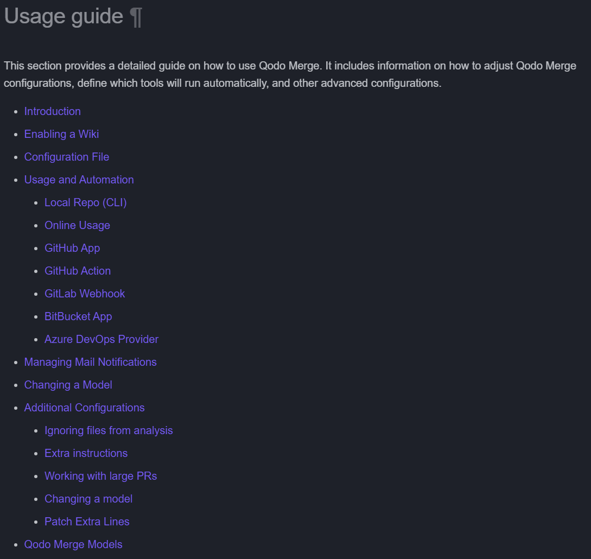

# 4주차 발표문

### 1. 코드 흐름 문서화

- **What?**
    - PR-Agent의 내부 구성 요소들이 어떻게 상호작용하여 최종 코드 리뷰 결과를 생성하는지를 명확하게 단계별로 문서화한다.
    - 각 객체의 역할, 메서드 호출 흐름, 데이터 전달 경로 등을 텍스트 및 시각적 다이어그램으로 설명한다.
- **Why?**
    - 현재 PR-Agent의 docs 문서는 생각보다 잘 정리가 되어있다. 설치 방법부터 사용 방법까지 메우 구체적으로 적혀있기에 설명대로만 따라해도 막히는 부분은 없다.

      

    - 실제 cmd 등에서 명령어를 입력하는 방법에 대해서도 매우 구체적으로 그림과 함께 설명되어있기에 다른 프로그램들의 문서보다 더 유저친화적이라고 생각한다.

      

    - 그렇기에 PR-Agent를 단순하게 사용만 한다면 크게 문제가 없을 것이다.
    - 그러나 우리 조의 공통된 의견이 그래서 이 프로그램이 어떻게 굴러가는가에 대한 의문이었다.
    - 이를 파악하기 위해서는 직접 코드를 분석해야 하는 번거로운 방법이 진행되야 하기에 이를 설명해주고 시각적으로 파악하기 쉽게 헤주는 것이 어떤가라는 의견이 나왔다.
    - PR-Agent의 전체 구조와 동작 방식을 빠르게 이해하고, 신규 기여자나 사용자가 시스템을 효율적으로 파악하고 확장할 수 있도록 지원한다.
- **How?**
    - 객체 간 호출 관계 및 데이터 흐름을 Markdown 문서로 작성
    - Mermaid 다이어그램을 사용해 복잡한 로직 시각화
    - 클래스 다이어그램 및 시퀀스 다이어그램 추가로 문서의 명확성 강화

        ```mermaid
        sequenceDiagram
            participant User
            participant PRAgent
            participant Tool
            participant GitProvider
            participant AIHandler
            participant AIModel
        
            User->>PRAgent: 요청 전송 (PR URL, 명령)
            PRAgent->>Tool: 적절한 도구 선택 및 초기화
            Tool->>GitProvider: PR 데이터 요청
            GitProvider->>Tool: PR 데이터 반환 (파일, 차이, 설명 등)
            Tool->>Tool: 데이터 처리 및 압축
            Tool->>AIHandler: 프롬프트 전송
            AIHandler->>AIModel: 요청 전송
            AIModel->>AIHandler: 응답 반환
            AIHandler->>Tool: 응답 전달
            Tool->>Tool: 응답 처리 및 포맷팅
            Tool->>GitProvider: 결과 게시
            GitProvider->>User: 결과 표시
        ```

- **구현 계획**
    - **5주차**
        - PR-Agent 전체 코드 베이스의 핵심 클래스 및 메서드 분석
        - 주요 코드 흐름을 단계별로 정리하고 Markdown 형식으로 문서 초안 작성
        - 클래스 및 메서드 호출 관계를 Mermaid 다이어그램 초안으로 작성
    - **6주차**
        - 작성한 Markdown 문서 및 Mermaid 다이어그램의 내용 리뷰 및 보완
        - 클래스 다이어그램, 시퀀스 다이어그램 추가 작성 및 검토
        - 최종 문서 PR 제출 및 Wiki 페이지 등 문서화 영역 반영

### 코드 리팩토링

- **What?**
    - 중첩 조건문, 긴 함수, 반복 로직 등의 코드 문제를 리팩토링하여 코드 가독성과 유지보수성을 향상시킨다.
- **Why?**
    - 현재의 코드 구조가 복잡하고 깊어 이해하기 어렵고, 단일 함수 내 로직이 과도하게 많아 유지보수 및 확장이 어렵다.
    - 너무 많은 if/else 중첩

        ```python
        # pr_code_suggestions.py
        	  async def run(self):
        	      try:
        	          if not self.git_provider.get_files():
        	              get_logger().info(f"PR has no files: {self.pr_url}, skipping code suggestions")
        	              return None
        	
        	          get_logger().info('Generating code suggestions for PR...')
        	          relevant_configs = {'pr_code_suggestions': dict(get_settings().pr_code_suggestions),
        	                              'config': dict(get_settings().config)}
        	          get_logger().debug("Relevant configs", artifacts=relevant_configs)
        	
        	          # publish "Preparing suggestions..." comments
        	          if (get_settings().config.publish_output and get_settings().config.publish_output_progress and
        	                  not get_settings().config.get('is_auto_command', False)):
        	              if self.git_provider.is_supported("gfm_markdown"):
        	                  self.progress_response = self.git_provider.publish_comment(self.progress)
        	              else:
        	                  self.git_provider.publish_comment("Preparing suggestions...", is_temporary=True)
        	
        	          # # call the model to get the suggestions, and self-reflect on them
        	          # if not self.is_extended:
        	          #     data = await retry_with_fallback_models(self._prepare_prediction, model_type=ModelType.REGULAR)
        	          # else:
        	          data = await retry_with_fallback_models(self.prepare_prediction_main, model_type=ModelType.REGULAR)
        	          if not data:
        	              data = {"code_suggestions": []}
        	          self.data = data
        	
        	          # Handle the case where the PR has no suggestions
        	          if (data is None or 'code_suggestions' not in data or not data['code_suggestions']):
        	              await self.publish_no_suggestions()
        	              return
        	
        	          # publish the suggestions
        	          if get_settings().config.publish_output:
        	              # If a temporary comment was published, remove it
        	              self.git_provider.remove_initial_comment()
        	
        	              # Publish table summarized suggestions
        	              if ((not get_settings().pr_code_suggestions.commitable_code_suggestions) and
        	                      self.git_provider.is_supported("gfm_markdown")):
        	
        	                  # generate summarized suggestions
        	                  pr_body = self.generate_summarized_suggestions(data)
        	                  get_logger().debug(f"PR output", artifact=pr_body)
        	
        	                  # require self-review
        	                  if get_settings().pr_code_suggestions.demand_code_suggestions_self_review:
        	                      pr_body = await self.add_self_review_text(pr_body)
        	
        	                  # add usage guide
        	                  if (get_settings().pr_code_suggestions.enable_chat_text and get_settings().config.is_auto_command
        	                          and isinstance(self.git_provider, GithubProvider)):
        	                      pr_body += "\n\n>💡 Need additional feedback ? start a [PR chat](https://chromewebstore.google.com/detail/ephlnjeghhogofkifjloamocljapahnl) \n\n"
        	                  if get_settings().pr_code_suggestions.enable_help_text:
        	                      pr_body += "<hr>\n\n<details> <summary><strong>💡 Tool usage guide:</strong></summary><hr> \n\n"
        	                      pr_body += HelpMessage.get_improve_usage_guide()
        	                      pr_body += "\n</details>\n"
        	
        	                  # Output the relevant configurations if enabled
        	                  if get_settings().get('config', {}).get('output_relevant_configurations', False):
        	                      pr_body += show_relevant_configurations(relevant_section='pr_code_suggestions')
        	
        	                  # publish the PR comment
        	                  if get_settings().pr_code_suggestions.persistent_comment: # true by default
        	                      self.publish_persistent_comment_with_history(self.git_provider,
        	                                                                   pr_body,
        	                                                                   initial_header="## PR Code Suggestions ✨",
        	                                                                   update_header=True,
        	                                                                   name="suggestions",
        	                                                                   final_update_message=False,
        	                                                                   max_previous_comments=get_settings().pr_code_suggestions.max_history_len,
        	                                                                   progress_response=self.progress_response)
        	                  else:
        	                      if self.progress_response:
        	                          self.git_provider.edit_comment(self.progress_response, body=pr_body)
        	                      else:
        	                          self.git_provider.publish_comment(pr_body)
        	
        	                  # dual publishing mode
        	                  if int(get_settings().pr_code_suggestions.dual_publishing_score_threshold) > 0:
        	                      await self.dual_publishing(data)
        	              else:
        	                  await self.push_inline_code_suggestions(data)
        	                  if self.progress_response:
        	                      self.git_provider.remove_comment(self.progress_response)
        	          else:
        	              get_logger().info('Code suggestions generated for PR, but not published since publish_output is False.')
        	              pr_body = self.generate_summarized_suggestions(data)
        	              get_settings().data = {"artifact": pr_body}
        	              return
        	      except Exception as e:
        	          get_logger().error(f"Failed to generate code suggestions for PR, error: {e}",
        	                             artifact={"traceback": traceback.format_exc()})
        	          if get_settings().config.publish_output:
        	              if self.progress_response:
        	                  self.progress_response.delete()
        	              else:
        	                  try:
        	                      self.git_provider.remove_initial_comment()
        	                      self.git_provider.publish_comment(f"Failed to generate code suggestions for PR")
        	                  except Exception as e:
        	                      get_logger().exception(f"Failed to update persistent review, error: {e}")
        ```

        - 해당 코드는 pr_code_suggestions.py의 코드 중 일부로 해당 코드만이 아닌 전체적인 코드가 모두 if/else 중첩이 많은 상태이다.
        - 충분히 함수와 클래스 등을 사용할 수 있음에도 불구하고 무슨 원인에서인지 그냥 계속된 if문을 중첩시켜 가독성과 코드 이해도를 떨어트린다.
    - 여러 책임이 있는 함수

        ```python
        @router.post("/webhook")
        async def gitlab_webhook(background_tasks: BackgroundTasks, request: Request):
            start_time = datetime.now()
            request_json = await request.json()
            context["settings"] = copy.deepcopy(global_settings)
        
            async def inner(data: dict):
                log_context = {"server_type": "gitlab_app"}
                get_logger().debug("Received a GitLab webhook")
                if request.headers.get("X-Gitlab-Token") and secret_provider:
                    request_token = request.headers.get("X-Gitlab-Token")
                    secret = secret_provider.get_secret(request_token)
                    if not secret:
                        get_logger().warning(f"Empty secret retrieved, request_token: {request_token}")
                        return JSONResponse(status_code=status.HTTP_401_UNAUTHORIZED,
                                            content=jsonable_encoder({"message": "unauthorized"}))
                    try:
                        secret_dict = json.loads(secret)
                        gitlab_token = secret_dict["gitlab_token"]
                        log_context["token_id"] = secret_dict.get("token_name", secret_dict.get("id", "unknown"))
                        context["settings"].gitlab.personal_access_token = gitlab_token
                    except Exception as e:
                        get_logger().error(f"Failed to validate secret {request_token}: {e}")
                        return JSONResponse(status_code=status.HTTP_401_UNAUTHORIZED, content=jsonable_encoder({"message": "unauthorized"}))
                elif get_settings().get("GITLAB.SHARED_SECRET"):
                    secret = get_settings().get("GITLAB.SHARED_SECRET")
                    if not request.headers.get("X-Gitlab-Token") == secret:
                        get_logger().error("Failed to validate secret")
                        return JSONResponse(status_code=status.HTTP_401_UNAUTHORIZED, content=jsonable_encoder({"message": "unauthorized"}))
                else:
                    get_logger().error("Failed to validate secret")
                    return JSONResponse(status_code=status.HTTP_401_UNAUTHORIZED, content=jsonable_encoder({"message": "unauthorized"}))
                gitlab_token = get_settings().get("GITLAB.PERSONAL_ACCESS_TOKEN", None)
                if not gitlab_token:
                    get_logger().error("No gitlab token found")
                    return JSONResponse(status_code=status.HTTP_401_UNAUTHORIZED, content=jsonable_encoder({"message": "unauthorized"}))
        
                get_logger().info("GitLab data", artifact=data)
                sender = data.get("user", {}).get("username", "unknown")
                sender_id = data.get("user", {}).get("id", "unknown")
        
                # ignore bot users
                if is_bot_user(data):
                    return JSONResponse(status_code=status.HTTP_200_OK, content=jsonable_encoder({"message": "success"}))
        
                log_context["sender"] = sender
                if data.get('object_kind') == 'merge_request':
                    # ignore MRs based on title, labels, source and target branches
                    if not should_process_pr_logic(data):
                        return JSONResponse(status_code=status.HTTP_200_OK, content=jsonable_encoder({"message": "success"}))
                    object_attributes = data.get('object_attributes', {})
                    if object_attributes.get('action') in ['open', 'reopen']:
                        url = object_attributes.get('url')
                        get_logger().info(f"New merge request: {url}")
                        if is_draft(data):
                            get_logger().info(f"Skipping draft MR: {url}")
                            return JSONResponse(status_code=status.HTTP_200_OK, content=jsonable_encoder({"message": "success"}))
        
                        await _perform_commands_gitlab("pr_commands", PRAgent(), url, log_context, data)
        
                    # for push event triggered merge requests
                    elif object_attributes.get('action') == 'update' and object_attributes.get('oldrev'):
                        url = object_attributes.get('url')
                        get_logger().info(f"New merge request: {url}")
                        if is_draft(data):
                            get_logger().info(f"Skipping draft MR: {url}")
                            return JSONResponse(status_code=status.HTTP_200_OK, content=jsonable_encoder({"message": "success"}))
        
                        commands_on_push = get_settings().get(f"gitlab.push_commands", {})
                        handle_push_trigger = get_settings().get(f"gitlab.handle_push_trigger", False)
                        if not commands_on_push or not handle_push_trigger:
                            get_logger().info("Push event, but no push commands found or push trigger is disabled")
                            return JSONResponse(status_code=status.HTTP_200_OK,
                                                content=jsonable_encoder({"message": "success"}))
        
                        get_logger().debug(f'A push event has been received: {url}')
                        await _perform_commands_gitlab("push_commands", PRAgent(), url, log_context, data)
        
                    # for draft to ready triggered merge requests
                    elif object_attributes.get('action') == 'update' and is_draft_ready(data):
                        url = object_attributes.get('url')
                        get_logger().info(f"Draft MR is ready: {url}")
        
                        # same as open MR
                        await _perform_commands_gitlab("pr_commands", PRAgent(), url, log_context, data)
        
                elif data.get('object_kind') == 'note' and data.get('event_type') == 'note': # comment on MR
                    if 'merge_request' in data:
                        mr = data['merge_request']
                        url = mr.get('url')
        
                        get_logger().info(f"A comment has been added to a merge request: {url}")
                        body = data.get('object_attributes', {}).get('note')
                        if data.get('object_attributes', {}).get('type') == 'DiffNote' and '/ask' in body: # /ask_line
                            body = handle_ask_line(body, data)
        
                        await handle_request(url, body, log_context, sender_id)
        
            background_tasks.add_task(inner, request_json)
            end_time = datetime.now()
            get_logger().info(f"Processing time: {end_time - start_time}", request=request_json)
            return JSONResponse(status_code=status.HTTP_200_OK, content=jsonable_encoder({"message": "success"}))
        ```

        - 해당 코드는 servers/gitlab_webhook.py의 코드 중 일부이다.
        - 해당 코드의 문제는 하나의 함수가 단일 책임 원칙을 위반 했다는 것이다.
            - GitLab Webhook 요청 수신 및 JSON 파싱
            - 보안 토큰 검증 (두 가지 방식으로)
            - GitLab 토큰 설정 처리
            - Webhook 이벤트 유형 분기 및 처리 (Merge Request, Push, Note 등)
            - 각 이벤트 별 명령 실행 (`_perform_commands_gitlab`)
            - 응답 처리 및 로깅
        - 이 또한 가독성과 유지보수성 모두 문제가 발생한다.
- **How?**
    - 해당 코드의 문제에 대해서 Issues에 올려 질문을 할 상태
    - https://github.com/qodo-ai/pr-agent/issues/1755
    - https://github.com/qodo-ai/pr-agent/issues/1756
    - 봇이 응답을 했는데 리팩토링 하면 좋다라는 응답을 얻음. 담당자들에게 명확한 답변을 얻고 싶었으나 담당자들의 답변이 오지 않아서 우선 진행해볼 것.

      

    - 코드 리팩토링 방법
        - 단일 책임 원칙(SRP)에 따라 긴 함수들을 작은 함수로 분할
        - 중복 로직을 유틸리티 함수로 추출
        - 중첩 조건문을 Early Return 패턴으로 개선
        - 리팩토링 이후 유닛 테스트로 기존 기능의 정상 동작 여부 검증
- **구현 계획**
    - **5주차**
        - 리팩토링이 필요한 코드 (중첩된 조건문, 긴 함수 등) 구체적으로 선정
            - 팀원 개별 역량에 따라 선택
        - 선정된 코드에 대한 세부적인 리팩토링 계획 및 문서화
            - 긴 함수 → 단일 책임에 따라 분리
            - 중복 로직 → 유틸리티 함수로 추출
            - 중첩 조건문 → Early Return으로 변경
        - 위 전략에 따라 초기 리팩토링 작업 진행
    - **6주차**
        - 남은 코드의 추가 리팩토링 진행
        - 전체 리팩토링 코드에 대해 유닛 테스트를 통해 기존 동작 유지 검증
        - 코드 리뷰를 위한 PR 제출 및 동료 리뷰 진행

### 다이어그램 자동 생성 기능 추가

- **What?**
    - PR-Agent의 Describe 기능에서 코드 리뷰 시 시퀀스 다이어그램, 클래스 다이어그램 등 다양한 다이어그램을 자동 생성하는 기능을 추가
- **Why?**
    - 현재 PR-Agent의 Describe는 텍스트와 표를 이용해서 설명을 제공한다.
    - 이를 통해서도 충분히 코드 이해가 가능할 수 있으나 다이어그램을 제공한다면 더 빠르고 쉬운 이해를 도울 것이라고 판단이 되었다.
    - 코드 리뷰어가 코드 흐름과 구조를 시각적으로 더욱 명확하게 이해할 수 있도록 돕는다.
- **How?**
    1. Describe 기능의 설정(Configuration)에 생성할 다이어그램의 종류를 사용자가 지정할 수 있도록 추가한다.
    2. Describe 프롬프트 내에서 Jinja 템플릿을 이용해 동적으로 Mermaid 다이어그램 생성 지시를 추가하여 PR-Agent가 분석한 코드를 기반으로 이를 다이어그램이 생성하도록 한다.
- **구현 계획**
    - **5주차**
        - PR-Agent 설정(Configuration)에 다이어그램 생성 옵션 추가 기능 구현
        - Jinja 템플릿을 활용한 Mermaid 다이어그램 생성용 프롬프트 동적 삽입 기능 구현
        - Issue 및 Wiki 정보를 추가로 가져올 수 있는 방법에 대한 초기 조사 및 PoC(Proof of Concept) 개발
    - **6주차**
        - 1주차에 개발한 기능을 PR-Agent의 기존 Describe 기능과 통합 및 연동
        - 통합된 기능에 대한 종합 테스트 및 성능 검증
        - 다이어그램 생성 정확성 및 품질 향상을 위한 프롬프트 엔지니어링 및 튜닝
        - 최종 기능을 PR 형태로 제출하고 동료 리뷰 후 수정 및 최적화 후 머지 준비