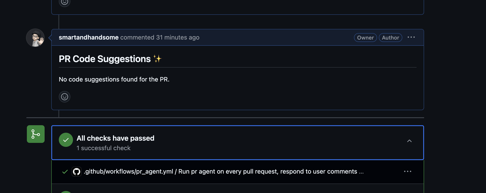
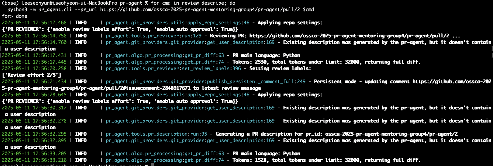

# 4주차 조별과제: 조별 기여 아이디어 Top 3 정리 및 발표
> 4조 아이디어:
> 1. GitHub Action에서 OpenAI 외에 다른 AI 모델 적용 방법 예제 추가
> 2. 한 코멘트에서 다중 명령어 실행
> 3. re.compile() 반복 컴파일 제거, get_settings() 호출 최소화·캐싱

> 아이디어 중 투표해 Top 3를 선정하고, 팀원들 같이 공부를 진행한 뒤 공부한 내용을 합쳤습니다.

## 1. GitHub Action에서 OpenAI 외에 다른 AI 모델 적용 방법 예제 추가
> 아이디어: 정동환

### 아이디어
- 현재 GitHub Action workflow 예시들은 OpenAI 모델을 사용하는 경우만 작성이 되어있다. Gemini 등 다른 모델을 지원하지 않는 것으로 보이는데, 다른 모델도 지원 가능하게 확장해보고자 한다.
- 관련 이슈 링크: https://github.com/qodo-ai/pr-agent/issues/1734
    - OpenAI workflow 설정 관련 yaml 파일 위치: `/.github/workflows/pr-agent-review.yaml`
    - 예제가 작성된 문서 위치: `/docs/docs/installation/github.md`
    - OpenAI 워크플로우 관련 파일: `pr-agent/servers/github_action_runner.py`
        ```py
        async def run_action():
        # Get environment variables
        GITHUB_EVENT_NAME = os.environ.get('GITHUB_EVENT_NAME')
        GITHUB_EVENT_PATH = os.environ.get('GITHUB_EVENT_PATH')
        OPENAI_KEY = os.environ.get('OPENAI_KEY') or os.environ.get('OPENAI.KEY')
        OPENAI_ORG = os.environ.get('OPENAI_ORG') or os.environ.get('OPENAI.ORG')
        GITHUB_TOKEN = os.environ.get('GITHUB_TOKEN')
        # get_settings().set("CONFIG.PUBLISH_OUTPUT_PROGRESS", False)

        # Check if required environment variables are set
        if not GITHUB_EVENT_NAME:
            print("GITHUB_EVENT_NAME not set")
            return
        if not GITHUB_EVENT_PATH:
            print("GITHUB_EVENT_PATH not set")
            return
        if not GITHUB_TOKEN:
            print("GITHUB_TOKEN not set")
            return

        # Set the environment variables in the settings
        if OPENAI_KEY:
            get_settings().set("OPENAI.KEY", OPENAI_KEY)
        else:
            # Might not be set if the user is using models not from OpenAI
            print("OPENAI_KEY not set")
        if OPENAI_ORG:
            get_settings().set("OPENAI.ORG", OPENAI_ORG)
        get_settings().set("GITHUB.USER_TOKEN", GITHUB_TOKEN)
        get_settings().set("GITHUB.DEPLOYMENT_TYPE", "user")
        enable_output = get_setting_or_env("GITHUB_ACTION_CONFIG.ENABLE_OUTPUT", True)
        get_settings().set("GITHUB_ACTION_CONFIG.ENABLE_OUTPUT", enable_output)
        ```

### 공부 진행
- 로컬 CLI상에서 PR Agent를 Gemini로 사용할 때 `configuation.toml`, `.secrets.toml` 두 파일만 수정하면 되었던 것을 바탕으로 추적을 진행하였다.
- 설정을 파일 편집해 OpenAI 모델을 변경하거나 다른 LLM 모델을 사용하는 방법이 나와있는 문서: `/docs/docs/usage-guide/changing_a_model.md`
    - 기본적으로 `configuation.toml`의 `model`과 `fallback_model` 수정이 필요.
    - OpenAI 외 회사의 모델의 경우 `configuation.toml` 수정과 더불어 요구되는 API 키 등을 (CLI에서 사용시) `.secrets.toml` 또는 (GitHub App나 GitHub Action에서 사용시) `GitHub Settings > Secrets and variables`에 작성해야 함.
    - 이 중 후자의 작업을 GitHub Actions workflow에서 ENV 설정을 통해 진행 가능.

### 코드 분석
- `pr_agent/algo/ai_handlers/litellm_ai_handler.py`를 보면, `get_settings()`로부터 API 키가 가져와진다.
    ```py
        # Google AI Studio
        # SEE https://docs.litellm.ai/docs/providers/gemini
        if get_settings().get("GOOGLE_AI_STUDIO.GEMINI_API_KEY", None):
          os.environ["GEMINI_API_KEY"] = get_settings().google_ai_studio.gemini_api_key
    ```
- `pr_agent/config_loader.py`을 보면, 환경설정을 위해 Dynaconf라는 라이브러리를 사용하고 있다. `global_settings`에 `settings_files` 에 나열된 TOML 파일들(`/settings`하위)을 순서대로 읽어서 내부적으로 하나의 설정 객체로 병합(merge_enabled=True)한다.
- 따라서 아래 나열된 설정 파일 중 어떤 파일이든 [GOOGLE_AI_STUDIO] 테이블 하위에 gemini_api_key = "값"이 정의되어 있다면 값을 읽어온다.후속 파일이 앞선 파일을 덮어쓰며 우선권을 가져, 같은 키를 여러 파일에 정의한 경우 로드 순서 후반부의 값이 최종 설정으로 반영된다. 그리고 마지막으로 .env, 환경변수 값이 덮어씌워진다.
    ```py
    from os.path import abspath, dirname, join
    from pathlib import Path
    from typing import Optional

    from dynaconf import Dynaconf
    from starlette_context import context

    PR_AGENT_TOML_KEY = 'pr-agent'

    current_dir = dirname(abspath(__file__))
    global_settings = Dynaconf(
        envvar_prefix=False,
        merge_enabled=True,
        settings_files=[join(current_dir, f) for f in [
            "settings/configuration.toml",
            "settings/ignore.toml",
            "settings/language_extensions.toml",
            "settings/pr_reviewer_prompts.toml",
            "settings/pr_questions_prompts.toml",
            "settings/pr_line_questions_prompts.toml",
            "settings/pr_description_prompts.toml",
            "settings/code_suggestions/pr_code_suggestions_prompts.toml",
            "settings/code_suggestions/pr_code_suggestions_prompts_not_decoupled.toml",
            "settings/code_suggestions/pr_code_suggestions_reflect_prompts.toml",
            "settings/pr_information_from_user_prompts.toml",
            "settings/pr_update_changelog_prompts.toml",
            "settings/pr_custom_labels.toml",
            "settings/pr_add_docs.toml",
            "settings/custom_labels.toml",
            "settings/pr_help_prompts.toml",
            "settings/pr_help_docs_prompts.toml",
            "settings/pr_help_docs_headings_prompts.toml",
            "settings/.secrets.toml",
            "settings_prod/.secrets.toml",
        ]]
    )


    def get_settings(use_context=False):
        """
        Retrieves the current settings.

        This function attempts to fetch the settings from the starlette_context's context object. If it fails,
        it defaults to the global settings defined outside of this function.

        Returns:
            Dynaconf: The current settings object, either from the context or the global default.
        """
        try:
            return context["settings"]
        except Exception:
            return global_settings
    # 생략
    ```
- Dynaconf는 OS 환경변수도 함께 로드한다. GitHub Action Secrets에 환경변수를 작성하려면, 환경변수 이름을 “중첩 구조” 규칙에 맞게 설정하면 된다. (아래 코드는 `envvar_prefix=False`일때의 예시; prefix를 사용하고 싶을 경우 `envvar_prefix="DYNACONF"`와 같이 지정할 수 있다.)
    ```yaml
    env:
        GOOGLE_AI_STUDIO__GEMINI_API_KEY: ${{ secrets.GEMINI_API_KEY }}
    ```
### 결과
이에 따라, 다음과 같이 설정하면 github actions workflow에서 Gemini 설정이 가능하다.
1. config__{value}로 configuation.toml을 변경
2. gemini API key는 기존에 공식 문서에서 제안하는 방법대로 GitHub Actions Secret 통해 env: 블록에 선언하여 환경변수로 등록한다 (환경변수가 읽혀지므로 따로 `.secrets.toml`에 설정할 필요 없음)
    ```yaml
        on:
        pull_request:
            types: [opened, reopened, ready_for_review]
        issue_comment:

        jobs:
        pr_agent_job:
            if: ${{ github.event.sender.type != 'Bot' }}
            runs-on: ubuntu-latest
            permissions:
            issues: write
            pull-requests: write
            contents: write
            name: Run pr agent on every pull request, respond to user comments
            steps:
            - name: PR Agent action step
                id: pragent
                uses: qodo-ai/pr-agent@main
                env:
                GITHUB_TOKEN: ${{ secrets.USER_TOKEN }}
                GOOGLE_AI_STUDIO__GEMINI_API_KEY: ${{ secrets.GEMINI_API_KEY }}
                config__model: "gemini/gemini-2.0-flash"
                config__fallback_models: "gemini/gemini-1.5-flash"
    ```
- 실제로 적용된 PR: https://github.com/smartandhandsome/qodo-merge-test/pull/6
 

### 정리
Python 코드를 수정할 필요는 없었다. 다른 모델을 사용하고 싶으나 Dynaconf 및 toml 설정 구조에 대한 사전 지식이 없는 사용자를 위해, workflow에서 변수를 제어하는 방법에 대해 예제를 추가하는 기여가 가능해 보인다.

---

<br>

## 2. 한 코멘트에서 다중 명령어 실행
> 아이디어: 박영신

### 아이디어 
**문제점**
- 지금은 PR 코멘트에 명령어를 하나씩만 쓸 수 있다.
- 여러 기능을(명령어를) 쓰려면 코멘트를 여러 번 써야 해서 PR이 지저분해지고, 알림도 너무 많아진다.
- 각각의 결과가 흩어져 있어서 전체 리뷰 상태를 한눈에 보기 어렵다.

**기여 방향**
- `/review && /improve && /describe` 또는 `/run review,improve` 같은 식으로 **한 코멘트에서 여러 명령어를 처리** 가능하게 한다.
- **명령어 순서를 보장**하고, 필요 시 결과를 통합해서 보여준다.
- 명령어별로 구분된 결과 섹션을 만들고, 중복 분석을 방지한다.
- 어떤 명령어가 성공/실패했는지도 표시한다.
- 하나의 툴이 실패하더라도, 나머지는 계속 진행한다.

**관련 이슈**
- 링크: https://github.com/qodo-ai/pr-agent/issues/1620
    - 이슈 내용: PR-Agent는 PR 코멘트에 /review, /describe, /improve 등 한 개의 명령어만 인식한다.
    - 사용자가 하나의 코멘트에 여러 명령어를 입력해도 첫 번째 명령어만 실행되고 나머지는 무시된다.
    - 해당 이슈에서 유저의 요청사항: *"한 코멘트에 여러 Qodo 명령어를 썼을 때, 각 명령어를 모두 따로 실행", "결과를 한 코멘트에 합치는 게 아니라, 명령어별로 각각 실행하고 댓글도 따로 생성되도록."*

### 구체화
#### What
- 하나의 PR 코멘트에 여러 명령어(`/review`, `/describe`, `/improve`)를 썼을 때, 이 모든 명령어를 차례로 실행하고 각각 별도의 결과 코멘트로 출력되도록 만드는 기능
- 예: 사용자가 다음과 같이 코멘트했을 때 `/review && /describe && /improve` 세 명령어가 모두 실행되고, 결과도 각각 별도 댓글로 출력됨

#### Why
- 현재는 **첫 번째 명령어만 실행되고**, 나머지는 완전히 무시됨
- 또한 현재 PR 코멘트를 **여러 번 작성해야 하는 번거로움**, **알림 과다**, **명령어 순서 관리 어려움** 등 존재
    - 사용자는 **명령어를 한 번에 입력하는 게 직관적**이라고 느낄 수 있음
- `Qodo Merge Pro` 유료의 사용자 요청으로, 기능 필요성 및 실사용자 수요가 존재 (이슈)

### 코드 분석
#### **`pr_agent/agent/pr_agent.py` 기존 코드 구현 분석**

- **command2class 정의**    
    ```python
    command2class = {
        "auto_review": PRReviewer,
        "answer": PRReviewer,
        "review": PRReviewer,
        "review_pr": PRReviewer,
        "describe": PRDescription,
        "describe_pr": PRDescription,
        "improve": PRCodeSuggestions,
        "improve_code": PRCodeSuggestions,
        "ask": PRQuestions,
        "ask_question": PRQuestions,
        "ask_line": PR_LineQuestions,
        "update_changelog": PRUpdateChangelog,
        "config": PRConfig,
        "settings": PRConfig,
        "help": PRHelpMessage,
        "similar_issue": PRSimilarIssue,
        "add_docs": PRAddDocs,
        "generate_labels": PRGenerateLabels,
        "help_docs": PRHelpDocs,
    }
    
    commands = list(command2class.keys())
    ```    
    - 슬래시 명령어(`/review`, `/improve` 등)를 문자열로 받아
    - 어떤 툴 클래스(`PRReviewer`, `PRCodeSuggestions`)를 실행할지 **매핑해주는 dict**
    - `action` → 실행 클래스 연결의 핵심

    <br>

- **사용자의 명령어를 받아서 실행하는 메인 로직**

    ```python
        async def handle_request(self, pr_url, request, notify=None) -> bool:
    ```
    
    (1) 설정 로딩
    ```python
    apply_repo_settings(pr_url)
    ```
    - 해당 PR의 GitHub URL 기반으로 설정(`configuration.toml`)을 적용

    (2) 명령어 파싱
    ```python
    if isinstance(request, str):
        lexer = shlex.shlex(request, posix=True)
        lexer.whitespace_split = True
        action, *args = list(lexer)
    else:
        action, *args = request
    ```
    - **문자열이면**:
        - 공백 기준으로 쪼개서 `action`에 첫 단어 할당 (`/review`)
        - 나머지는 `args`에 들어감
    - **리스트면**:
        - 이미 분리된 상태로 처리
    → 현재 구조에서는 **한 번에 하나의 명령어만 인식**

    (3) 파라미터 검증 및 설정 갱신
    ```python
    is_valid, arg = CliArgs.validate_user_args(args)
    args = update_settings_from_args(args)
    ```
    - 불허된 CLI 파라미터인지 검증
    - 설정 파일로부터 값 갱신

    (4) 언어 설정
    ```python
    response_language = get_settings().config.get('response_language', 'en-us')
    # ...
    setting.extra_instructions += "응답은 X언어로 작성해야 함"
    ```
    - 사용자 설정에서 `response_language`가 있으면, 모든 명령에 강제로 해당 언어로 응답하도록 **instruction 삽입**

    (5) 명령어 실행
    ```python
    action = action.lstrip("/").lower()
    if action not in command2class:
        return False
    await command2class[action](...).run()
    ```
    - 슬래시(`/`) 제거 후 소문자 변환
    - `command2class`에 해당 명령어가 있는지 확인 후 실행
    - 각 툴 클래스는 `run()` 메서드를 통해 실제 실행됨
    - `PRReviewer`, `PRDescription` 등은 내부적으로 GitHub API를 통해 PR에 코멘트 달기 등의 작업을 수행
    
    ---
    
- **전체 흐름 요약**
    
    ```bash
    pr_url + "/review --some-option"
    
    → apply_repo_settings
    → 문자열 파싱 (/review, --some-option)
    → 설정 갱신
    → action → 클래스 실행 (PRReviewer.run())
    → GitHub에 결과 코멘트 작성
    ```
---

- **line 58**: `handle_request` 함수
    ```python
            # Then, apply user specific settings if exists
            if isinstance(request, str):
                request = request.replace("'", "\\'")
                lexer = shlex.shlex(request, posix=True)
                lexer.whitespace_split = True
                action, *args = list(lexer)
            else:
                action, *args = request
    ```
- **<코드 설명>**
    1. **사용자 입력 문자열**을 공백 기준으로 나누고
    2. 맨 앞의 단어를 `action` 에 넣고
    3. 나머지를 `args`로 분리하는 파서

    여기서, `/review && /improve`처럼 명령어를 여러 개 입력하면
    - action = "/review"
    - args = ["&&", "/improve"]

    위와 같이 들어가게 돼서 /improve는 명령어로 인식되지 않고 **파라미터 취급됨** → 실행 안 됨

- **line 92**: 이후
    ```python
    action = action.lstrip("/").lower()
    if action not in command2class:
        get_logger().warning(f"Unknown command: {action}")
        return False
    ...
    await command2class[action](...).run()
    ```
    위 부분에서 action에 해당하는 명령어만 실행하게 함

---

#### **`pr_agent/servers/github_app.py` 기존 코드 구현 분석**

- **line 80**
    아래의 함수를 우선 보면,
    ```python
    async def handle_comments_on_pr(body: Dict[str, Any],
                                    event: str,
                                    sender: str,
                                    sender_id: str,
                                    action: str,
                                    log_context: Dict[str, Any],
                                    agent: PRAgent):
        if "comment" not in body:
            return {}
        comment_body = body.get("comment", {}).get("body")
    ```

    → **사용자가 작성한 코멘트를 가장 먼저 받는 위치는 `github_app.py`에 있음.**
    그 다음에 pr_agent.py 가 호출됨

- **line 119**: 
    ```python
                await agent.handle_request(api_url, comment_body,
                            notify=lambda: provider.add_eyes_reaction(comment_id, disable_eyes=disable_eyes))
    ```

    - 여기서 `comment_body`가 `/review && /describe`인 상태로 넘어감
    - `pr_agent.py`는 그걸 문자열로 받아서, **공백 기준으로 나눠 맨 앞의 `/review`만 인식**

#### 현 구조를 도식화한 결과:

```bash
[사용자 입력: "/review && /describe && /improve"]
           ↓
github_app.py
    → comment_body: "/review && /describe && /improve" ← 원본 전체
    → (수정할 부분: 여기서 split 필요)
           ↓
pr_agent.py
    → "/review"만 실행
```

---

### 고안해 본 해결책

1. github_app에서 댓글을 받을 때, 그대로 pr_agent의 handle_request에 넘겨주지 않고
2. 명령어가 여러 개 입력되어 있다면 split을 진행해서 commands 안에 다 넣고
3. commands 안의 명령어(command)를 하나씩 진행
    1. 하나씩 진행할 때마다 handle_request를 불러서 코멘트 생성되도록 함..

### 해결 방안1

**line 119**의 코드를 다음과 같이 수정.

```python
import re

raw_commands = re.split(r"&&|\n|,|;", comment_body)
commands = [cmd.strip() for cmd in raw_commands if cmd.strip().startswith("/")]

for command in commands:
    get_logger().info(f"Executing parsed command from comment: {command}")
    await agent.handle_request(api_url, command,
        notify=lambda: provider.add_eyes_reaction(comment_id, disable_eyes=disable_eyes)
    )
```

**코드 설명**

1. 사용자가 PR 코멘트에 입력한 전체 문자열인 `comment_body`를 `&&`, 줄바꿈, 쉼표, 세미콜론을 기준으로 분리해서 `raw_commands`라는 리스트에 저장
    1. ex) `/review && /describe` -> `["/review", "/describe"]`
2. 분리된 각 명령어 조각에서 앞뒤 공백을 제거한 뒤, 슬래시(`/`)로 시작하는 유효한 명령어만 필터링해서 `commands`라는 새로운 리스트로 만듦
    1. 이 과정은 불필요한 빈 문자열이나 잘못된 입력을 걸러내는 역할
3. 필터링된 명령어들을 하나씩 꺼내어 순차적으로 처리하기 위해 반복문 적용
    1. 현재 실행 중인 명령어를 로그로 남김. 디버깅이나 서버 로그 분석 시 어떤 명령어가 실제로 실행되었는지 확인할 수 있도록 도와줄 수 있도록 함.(필요에 따라 삭제해도 됨)
4. 명령어 하나를 `PRAgent`의 `handle_request()` 함수에 전달해 실행
    1. `api_url` : 현재 PR의 GitHub 주소
    2. `command` : 실행할 단일 명령어
    3. `notify` : 실행 후 GitHub 코멘트에 👀 이모지를 추가하기 위한 콜백
        1. 이 줄이 실행되면 실제로 PR에 코드 리뷰, 설명, 개선 등 결과가 코멘트로 달리게 됨

**전체 흐름 정리**

| **순서** | **설명** |
| --- | --- |
| 1 | 사용자가 PR에 `/review && /describe` 작성 |
| 2 | `github_app.py` → `handle_comments_on_pr()` 호출됨 |
| 3 | `comment_body`에 전체 명령어가 들어옴 |
| 4 | 추가한 코드에서 `&&` 등으로 나눔 |
| 5 | 각각 `pr_agent.py`의 `handle_request()`로 실행됨
→ 별도 PR 코멘트로 응답됨 |

---

### 이렇게 진행 시에 예상되는 문제점

우선 간단하게, ‘다중 명령어’ 에만 집중해서 생각해본 것이라 구현한다고 하면 여러가지 문제점이 예상되기도 함.

1. **명령어 파싱 관련 문제**
    | 문제 | 설명 |
    | --- | --- |
    | 엣지 케이스 입력 | 사용자가 `/review /describe`처럼 `&&` 없이 띄어쓰기만 한 경우 → 분리 안 됨 |
    | 중복 구분자 | 예: `/review && && /describe` → 빈 문자열이 들어올 수 있음 |
    | 주석, 설명 텍스트 섞임 | 예: `"/review # 설명"` 같이 쓰면 의도치 않은 명령이 들어올 수 있음 |
    → 여러 가지 입력 상황을 고려해서 대응해야 할 것으로 생각됨
    
2. **명령어 실행 순서 또는 실패 시 처리**
    1. 특정 명령어를 실패하는 일은 없는지도 테스트해봐야 함

3. **API 사용량 증가**
    1. 불필요하게 자주 호출하는 것으로 인해 GitHub/LLM API 호출 비용 과다 발생 가능성

#### 테스트 시나리오

- `/review && /describe` → 둘 다 실행되는지
- `/review && && /describe` → 오류 없이 처리되는지
- `/review\n/improve` → 줄바꿈으로도 분리되는지
- `/review # 설명` → 주석 잘 확인하는지
- `/review && /review && /review` → 같은 명령어를 여러 개 입력한 경우 여러 번 호출을 방지

---

### 현재 설계의 이유 분석
왜 현재는 한 코멘트당 단일 명령을 처리하게 설계되어있을까?
1. 파싱 로직 단순화
    - 첫 번째 매칭만 취하는 방식이 가장 간단하고 직관적
    - 다중 명령어 지원 시 키워드 실생 순서를 결정하기 위한 문맥 파싱과 트리 구축이 필요
2. 명령 간 우선순위·충돌 관리
    - 순차 실행 혹은 동시 실행 전략을 정의·테스트해야 하며, 에러 발생 시 롤백 정책도 설계해야 함
3. 유지보수 및 안정성
    - 다중 지원 시 파서(parser) 모듈, 실행 스케줄러, 에러 핸들러 등 전반적인 리팩토링이 요구됨
4. GitHub 웹훅 이벤트 특성
    - 하나의 코멘트 이벤트에서 다수의 결과(레이블링·코멘트·할당 등)를 처리하려면, GitHub API 호출을 배치(batch)하거나 트랜잭션으로 묶어야 함
    - 현재는 “한 개의 액션 → 한 개의 API 호출” 패턴으로 설계되어 있어 확장이 번거로움
5. AI 생성 메타데이터 충돌 가능성
    - /describe 명령을 처음 실행하면, PR Type, PR 요약, 파일별 변경점 정리 메타데이터가 생성됨
    - 이 메타데이터는 이후 /review·/improve 등 후속 명령에서 자동으로 프롬프트에 주입되어, chain-of-thought 분석을 지원
    -> 사용자가 기대하는 순서와 다르게 실행될 가능성. (ex. A사용자는 먼저 작성한 명령어부터 실행될 것으로 생각 / B사용자는 /describe부터 실행될 것으로 생각)


### 비동기 또는 병렬 처리 방식은?
- PR-Agent 내부에서 코멘트를 토큰화 하여 여러 명령어를 분할 후, 3개의 요청이 왔던 것처럼 비동기 또는 병렬 처리 후 결과 도출
- 커맨드를 꼭 한번에 여러 개 입력해 토큰화해야 하는가? 명령줄을 여러 번 입력해야 하는 것이 번거로운 거라면, shell이나 워크플로우에서 다중 입력하면 된다는 방법을 소개하는 것도 좋을 것으로 생각된다.


### 해결 방안2
- python 코드 수정할 필요 없이, CLI 레벨에서 및 workflow 레벨에서 명령어를 병렬적으로 실행할 수 있다는 예제를 추가
- shell의 경우
```shell
    for cmd in review describe; do
        python3 -m pr_agent.cli --pr_url https://github.com/ossca-2025-pr-agent-mentoring-group4/pr-agent/pull/2 $cmd
    done
  ```
  
- workflow의 경우 (테스트는 아직 x)
    ```yaml
    name: PR-Agent 멀티커맨드 실행 예시

    on:
    issue_comment:
        types: [created]

    jobs:
    run-multi-commands:
        runs-on: ubuntu-latest
        strategy:
        matrix:
            cmd: [describe, review, improve]  # 실행하고 싶은 명령어들
        steps:
        - uses: actions/checkout@v3
        - name: PR-Agent 실행: ${{ matrix.cmd }}
            uses: qodo-ai/pr-agent@v0.28
            with:
            command: ${{ matrix.cmd }}
    ```


---

<br>

## 3. re.compile() 반복 컴파일 제거, get_settings() 호출 최소화·캐싱
> 아이디어: 김범진

### re.compile() 반복 컴파일 제거
#### 아이디어
- process_patch_lines 등에서 매 hunk마다 RE_HUNK_HEADER = re.compile(...) 호출 -> 모듈 최상단에 한 번만 컴파일한 패턴을 재사용
- 기대 효과: 패턴 파싱 비용 절감 → 수백 개 hunk 처리 시 누적된 오버헤드 감소

#### 공부 내용
- `re.compile`() 은 hunk 가 아니라 file 단위로 1번씩 실행됨
- Python `re` 패키지의 캐시 메커니즘:
    `re.compile()`로 컴파일된 최근 패턴 100개를 내부 LRU 캐시에 저장. 
    - 파일 단위 추출 시, 이미 컴파일된 패턴은 캐시에서 재사용되므로 반복 컴파일이 자동으로 최소화됨.
    -> 성능 개선 미미할 것으로 예상
- `ticket_pr_compliance_check.py`관련해 패턴을 함수 외부 상수로 이동한 PR이 Accepted Suggestions에 등재되어 있음, hunk 처리 성능에 경미한 개선이 확인됨 ( https://github.com/qodo-ai/pr-agent/pull/1290#issuecomment-2410276033)

#### get_settings() 호출 최소화·캐싱
#### 아이디어
- should_skip_patch, process_patch_lines 내부 등 수시 호출 부분에서 모듈 로딩 시 CFG = get_settings().config로 설정을 한 번만 로드하거나 @lru_cache 적용
- 기대 효과: I/O·파싱 비용 절감 → 매 hunk 호출 누적 지연 제거, 설정 일관성 보장

#### 공부 내용
- Dynaconf 설정 로딩 방식:
    - Dynaconf는 설정 파일 로딩 시 지연 로딩을 사용해(LazySettings) 파일 경로만 저장하고, 실제 설정값 접근 시 파일을 한 번만 읽어옴. 한 번 읽은 값은 캐싱하여 재사용됨.
    - 따라서 get_settings() 를 자주 호출하더라도 파일 I/O는 최초 접근 시에만 발생하고, 이후에는 캐싱된 값이 반환됨
    - settings.get_fresh('KEY') 호출 시에만 강제 재로딩이 발생하며, get_settings() 호출로 인한 파일 I/O 반복은 발생하지 않는 구조
    -> 성능 개선 미미

#### 추가로 발견한 사항:
- 공부하며 전체 코드를 보니 get_settings().config를 사용하는 방식이 코드마다 차이가 있음.
    - 어떤건 직접 접근하고 어떤건 get 함수로 가져옴
    - get_settings().config.verbosity_level
    - get_settings().config.get('response_language', 'en-us')

**1. 속성 조회 방식(.키)**: 해당 키가 설정에 없으면 `AttributeError`를 발생시킴
- 필수 설정(항상 존재해야 하는 값) 누락 시 즉시 에러를 발생시키고 빠르게 문제를 인지
- 값이 없을 경우의 별도 예외 처리 로직이 필요

**2. 메서드 조회 방식(.get('키', 기본값))**: 키가 없어도 예외 없이 기본값 반환
- 선택적 설정(없을 수 있는 값)의 경우 안전하게 기본값을 지정, 코드 안정성 높임
