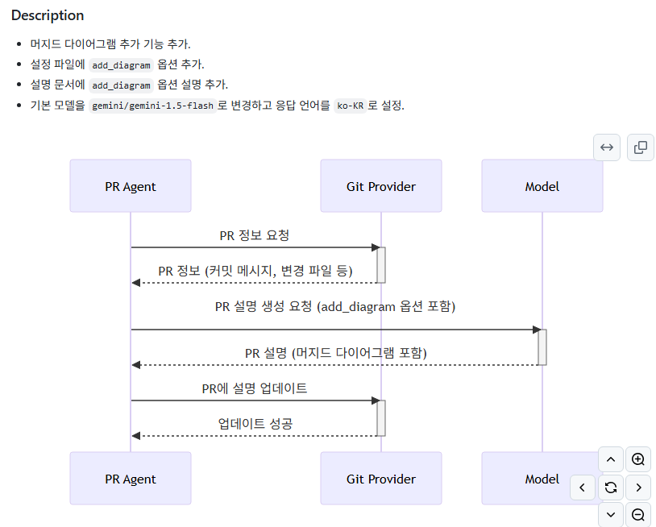

# 과제

## 🔹 프로젝트 개요

기존 PR 요약은 텍스트 중심으로 구성되어 있어, 복잡한 함수 간 상호작용이나 이벤트 흐름을 직관적으로 파악하기 어렵다는 문제점이 있었습니다.

리뷰어가 코드와 호출 관계를 동시에 추적해야 하므로 피로도가 높고, 중요한 흐름을 놓칠 가능성도 존재했습니다.

이에 따라, PR 내용에 시퀀스 다이어그램을 자동으로 생성 및 삽입하는 기능을 구현하게 되었습니다.

<br />

## 🔹 현재 진행 상황

### 기존 상황

- 기존에는 다음 같은 명령어로 다이어그램 삽입이 가능했음

```
/describe --pr_description.extra_instructions="The 'Description' part should also include a mermaid diagram"
```

### 개선 사항

- 설정 파일(`configuration.toml`)을 통한 다이어그램 생성 제어 기능 추가
  - `diagram = true` 옵션으로 시퀀스 다이어그램 생성 여부 설정
  - CLI 플래그 `--pr_description.add_diagram=true` 사용 가능

```
/describe --pr_description.add_diagram=true
```

### 현재 상태

- 팀원별 기능 구현 완료
- 정기 모임에서 코드 취합 및 통합 작업 완료



<br />

## 🔹 새로운 과제 목표 및 범위

현재 구현된 기능은 기본적인 다이어그램 생성은 가능하지만,
실제 서비스 적용을 위한 완성도 측면에서는 다음과 같은 보완이 필요합니다.

1. **검증 체계 부재**  
   생성된 다이어그램이 실제 코드의 호출 흐름을 제대로 반영하는지 판단할 수 있는 기준이나 자동 검증 로직이 없음

2. **언어 지원 제한**  
   현재는 Python 코드 기반의 PR에서만 테스트해 본 상태이며, Typescript나 Java 등 다른 언어에서의 작동 여부는 아직 검증되지 않음

3. **높은 프롬프트 의존성 및 낮은 범용성**
   - 프롬프트에 따라 응답 품질이 크게 달라지고, 일관성 부족
   - PR 유형(버그 수정, 리팩토링 등)에 따른 유연한 대응 미흡
   - 추후 클래스/컴포넌트 다이어그램 등으로 기능 확장에도 제약이 있는 구조

따라서 본 과제의 목표는 위 세 가지 핵심 문제를 보완하여 **기능의 정확성, 언어 호환성, 프롬프트의 유연성**을 강화하는 데 있습니다.

테스트 코드 보완이나, 다양한 유형의 다이어그램을 생성할 수 있도록 구조를 확장하는 아이디어도 논의되었으나, 이번 과제에서는 우선순위를 낮추고 차후 과제로 미루기로 하였습니다.

### 역할 분담

| 주제                          | 담당자         |
| ----------------------------- | -------------- |
| 생성된 다이어그램 정확성 검증 | 김지한, 김가희 |
| 언어 다양성 대응              | 김예지, 윤선웅 |
| LLM 프롬프트 튜닝             | 주동욱, 한유진 |

<br />

## 🔹 일정 계획 수립

### 1주차 (05.12 ~ 05.18)

- 문제점 정리 및 개선 방향 구체화
- 역할 분담 및 세부 실행 계획 수립

### 2주차 (05.19 ~ 05.25)

- 조별 모임 전까지 각자 구현 진행
- 팀 회의를 통해 코드 통합 및 테스트
- 금요일까지 멘토님께 리뷰 요청
- 주말까지 PR-Agent 저장소에 기능 PR 등록
